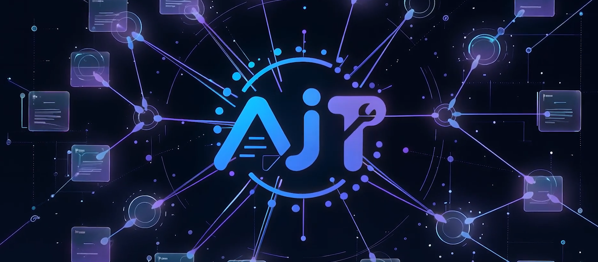
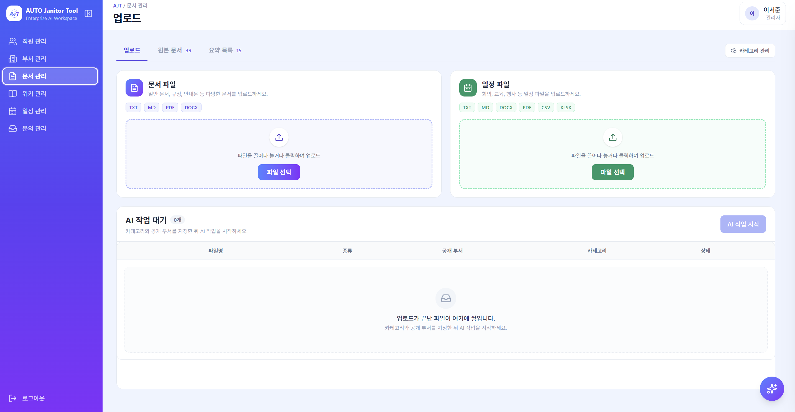
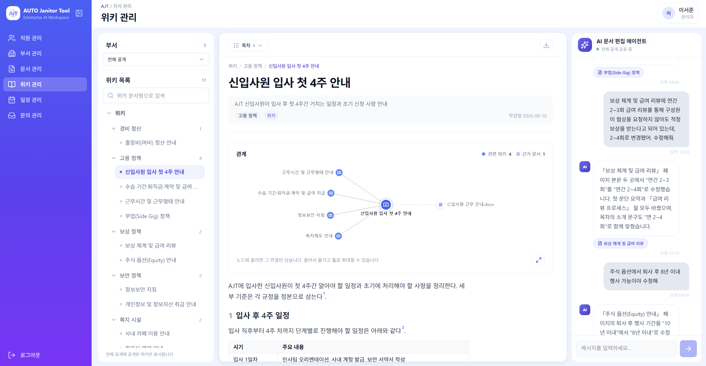
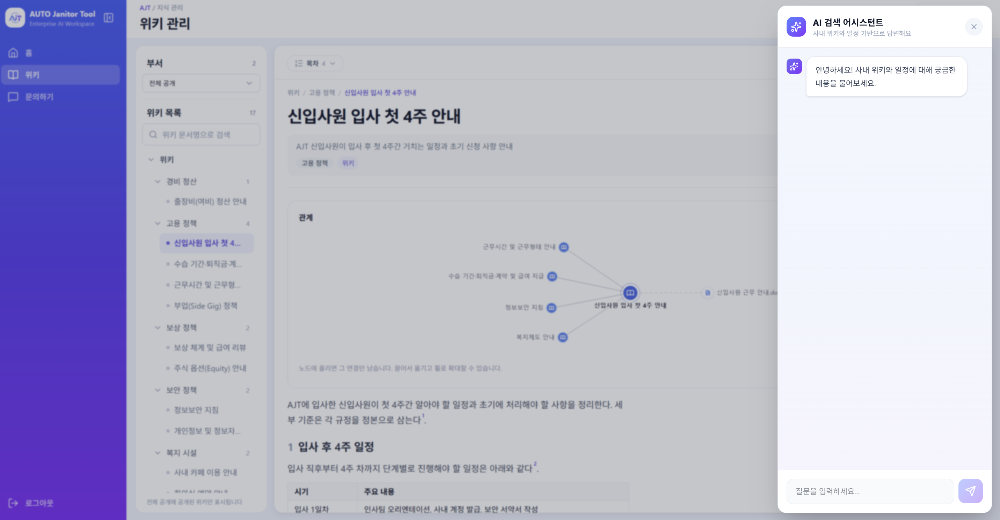
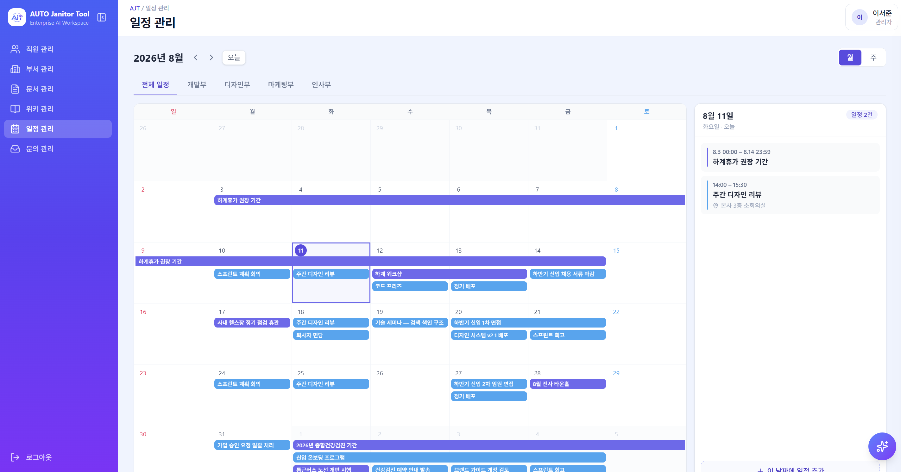
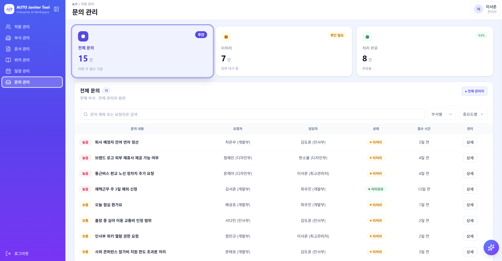
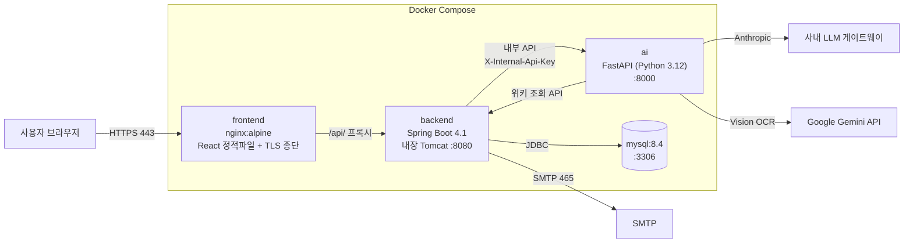
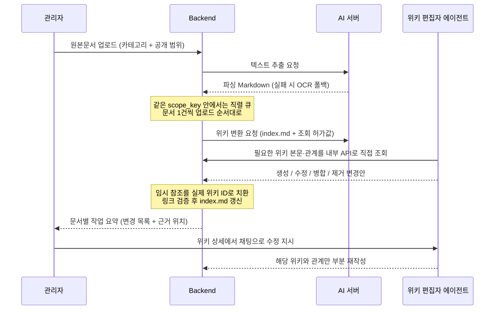

<div align="center">


# AJT

**사내 문서를 AI가 위키로 정리하고, 권한 범위 안에서만 답하는 사내 지식·일정 플랫폼**

삼성 청년 SW·AI 아카데미 15기 · 2학기 공통 프로젝트 · B106팀<br/>
**개발 기간**: 2026. 07. 06 ~ 2026. 08. 14 (6주)<br/>
**플랫폼**: Web (반응형 SPA)<br/>
**개발 인원**: 6명

관리자가 올린 공지·규정·인수인계 문서를 **위키 편집자 에이전트**가 읽고
**생성·수정·병합·제거**를 스스로 판단해 사내 위키로 재구성합니다.
사원은 **자신의 권한 범위 안에서만** 위키·일정을 열람하고, 챗봇에 물으면 **근거 문서와 함께** 답을 받습니다.

[시연 영상](https://www.youtube.com/watch?v=fk7IhHb2eV8) · [포팅 매뉴얼](exec/README.md) · [요구사항정의서](docs/requirements/요구사항정의서.md)

</div>

---

## 목차

- [📌 서비스 소개](#-서비스-소개)
- [💡 기획 배경](#-기획-배경)
- [✨ 주요 기능](#-주요-기능)
- [🎬 시연 영상](#-시연-영상)
- [🧩 기술 스택](#-기술-스택)
- [🧱 시스템 아키텍처](#-시스템-아키텍처)
- [🤖 AI 파이프라인](#-ai-파이프라인)
- [🧪 기술적 도전](#-기술적-도전)
- [📄 프로젝트 산출물](#-프로젝트-산출물)
- [📁 저장소 구조](#-저장소-구조)
- [🚀 실행 방법](#-실행-방법)
- [👥 팀원 및 역할](#-팀원-및-역할)

---

## 📌 서비스 소개

<div align="center">
  
</div>

사내에 흩어진 공지·규정·인수인계 문서와 교육 자료를 **LLM Wiki**로 재구성하고,
전사·부서·개인 일정을 한 달력에서 관리하며, 챗봇으로 **권한에 맞는 지식과 일정에만** 질의응답하는 서비스입니다.

| 사용자 | 할 수 있는 일 |
| --- | --- |
| **관리자** | 원본문서·일정 문서 업로드, 공개 범위 지정, AI 작업 요약 확인, 에이전트와 대화로 위키 수정, 전사·부서 일정 관리, 부서·사용자·가입 신청 관리, 문의 답변 |
| **사원** | 권한 내 문서·위키 조회·검색, 위키·일정 챗봇, 개인 일정 관리, 문의 등록 |

관리자는 `ADMIN` 하나의 역할이며, **부서장 지정 여부**로 최고관리자(어느 부서의 장도 아님)와
부서관리자(담당 부서 범위로만 권한)가 파생됩니다. 별도 역할 컬럼을 두지 않습니다.

---

## 💡 기획 배경

### 시작은 우리가 겪은 불편이었습니다

프로젝트를 시작하기 전, 팀원 모두가 공통으로 겪던 문제가 있었습니다.
**교육 일정과 학사 규정을 확인하려면 매번 어디에 적혀 있었는지부터 찾아야 했습니다.**
어떤 내용은 공지사항에, 어떤 내용은 첨부된 PDF에, 어떤 내용은 몇 주 전 안내 문서에 있었고,
정작 필요한 순간에는 "그 내용이 있었다"는 기억만 남아 있었습니다.

문서가 없어서 생기는 문제가 아니었습니다. 문서는 충분히 많았고, **흩어져 있다는 것이 문제**였습니다.
같은 주제가 여러 문서에 조금씩 다르게 적혀 있고, 갱신된 문서가 올라와도 이전 문서와 무엇이 달라졌는지는
아무도 정리해 주지 않았습니다. 이 문제는 규모가 있는 조직이라면 어디서나 반복됩니다.
신규 입사자는 규정을 찾다 시간을 쓰고, 담당자는 같은 질문에 반복해서 답합니다.

### 검색을 개선하는 대신, 문서 체계를 유지보수하기로 했습니다

흔한 해법은 **검색을 잘하게 만드는 것**입니다. 하지만 파편화된 문서를 잘 찾아주는 것으로는
"같은 주제가 세 문서에 다르게 적혀 있다"는 문제가 해결되지 않습니다. 사용자는 여전히
어느 쪽이 최신인지 스스로 판단해야 합니다.

그래서 방향을 바꿨습니다. **AI가 문서를 읽어 위키 문서 체계 자체를 유지보수하도록** 만들었습니다.
새 문서가 들어오면 에이전트가 기존 위키와 비교해 **새로 만들 것, 고칠 것, 합칠 것, 더 이상 필요 없는 것**을
직접 판단하고 반영합니다. 카테고리와 목차도 에이전트가 관리하기 때문에, 문서가 쌓일수록
위키가 어지러워지는 대신 정리됩니다. 관리자는 본문을 직접 편집하지 않고 **자연어로 수정을 지시**합니다.

### 다만, 권한을 먼저 설계했습니다

조직 문서를 다루는 순간 "아무나 보면 안 되는 문서"가 생깁니다.
AI가 문서를 자유롭게 읽고 요약하는 구조는 편리한 만큼 **권한 밖 정보가 새기 쉽습니다.**
그래서 기능보다 권한 모델을 먼저 확정했습니다.

- 공개 범위(전사 / 부서 조합)를 **정렬된 `scope_key`로 만들어 위키 공간 자체를 격리**합니다
- 에이전트도 요청 단위 **조회 허가 범위 밖은 읽을 수 없습니다**
- 챗봇은 권한 밖 자료의 제목과 **존재 여부까지 노출하지 않습니다**
- 답변은 실제로 읽은 자료만 출처로 표시하고, **근거가 없으면 추측하지 않고 정보 부족을 안내**합니다

여기에 문서 기반 지식 관리와 짝을 이루는 **일정 관리**를 함께 담았습니다.
공지 문서에 섞여 있던 일정을 AI가 초안으로 추출하고, 관리자가 승인한 것만 사원의 달력에 올라갑니다.
"규정은 어디 있고 일정은 어디 있나"를 각각 찾아다니던 일을 **하나의 질문으로 끝내는 것**이 이 서비스의 목표입니다.

---

## ✨ 주요 기능

### 1️⃣ 원본문서 업로드 & 텍스트 추출 (OCR 포함)



- 위키 원본문서(TXT·MD·PDF·DOCX)와 일정 문서(TXT·MD·DOCX·PDF·CSV·XLSX)를 **분리된 화면**에서 업로드
- 업로드 시 카테고리와 공개 범위(**전체** 또는 **하나 이상의 부서**)를 직접 지정
- 한 번에 최대 20건 / 총 100MB / 파일당 20MB 검증
- 텍스트가 없는 **스캔 PDF·DOCX는 OCR로 자동 대체 추출** — 실패 시 사유를 상태로 기록
- 처리 상태(업로드 완료 → 파싱 중 → 처리 중 → 완료 / 실패 / 취소) 추적, 실패·취소분은 **재처리**

### 2️⃣ 위키 편집자 에이전트 — 생성·수정·병합·제거


- 같은 공개 범위(`scope_key`)의 **현재 위키를 직접 읽고** 문서 1건씩 순서대로 분석
- 결과는 **생성 / 수정 / 병합 / 제거** 중 필요한 것을 에이전트가 선택해 즉시 반영
- 위키 **카테고리와 목차(`index.md`)도 에이전트가 관리** — 관리자는 조회만
- 원본문서에서 **근거를 찾을 수 있는 내용만** 반영 (근거 없는 서술 금지)
- 같은 범위 안에서는 **직렬 처리**로 충돌을 막고, 다른 범위끼리는 병렬 실행
- 문서 1건이 실패해도 같은 묶음의 나머지는 계속 처리
- 문서별 **작업 요약** 제공 — 무엇이 생성·수정·병합·제거됐고 근거가 어디인지

### 3️⃣ 위키 열람 & 관계 그래프



- 부서 조합별 **독립 위키 공간** — 같은 조합은 공간을 재사용하고 다른 조합과 섞지 않음
- 위키 상세에서 **연결된 원본문서**와 **연관 위키**를 무방향 관계로 확인
- 관리자는 위키 상세에서 **채팅으로 수정 지시** — 같은 부서 위키의 대화는 시간순으로 이어짐
- 사원과 챗봇에는 **반영이 완료된 위키만** 노출

### 4️⃣ 권한 기반 챗봇 — 근거 표시 + 멀티턴



- 질문이 **위키 / 일정 / 혼합** 중 무엇인지 에이전트가 스스로 판단 (프론트가 유형을 보내지 않음)
- 백엔드는 **권한 내 목차와 조회 허가값만** 넘기고, 에이전트가 필요한 본문·일정을 내부 API로 **직접 조회**
- 실제로 읽고 답변에 쓴 자료만 **복수 출처**로 표시, 위키 출처 아래에는 **원본문서를 하위 근거**로 접어서 표시
- 근거를 못 찾으면 **추측하지 않고 정보 부족을 안내**
- `conversationId` 기반 **멀티턴** — 이전 질문·답변을 후속 질문의 문맥으로 사용
- 질문 이력(질문·유형·답변·근거·성공 여부) 저장 및 대화별 조회

### 5️⃣ 일정 관리 — 문서에서 일정 초안 추출



- 일정 문서 1건에서 **여러 일정을 동기 추출**(최대 180초) — 일정명·내용·시작/종료 일시·대상
- 추출 결과는 **초안**으로 제공하고, 관리자가 검토·수정한 뒤 **1건 단위로 승인/거부**
- 승인한 일정만 사원에게 공개 (거부 초안은 삭제)
- 관리자 **수동 등록**(전사·부서) + 사원 **개인 일정**
- 사원은 전사·부서·개인 일정을 **통합 달력**에서 유형 구분해 조회
- 일정 원본문서·파싱 파일은 관리자와 에이전트에게만 노출
- 동시 수정은 **낙관적 동시성** — 오래된 조회 시점으로 덮어쓰면 409

### 6️⃣ 권한·조직 관리 & 문의사항



- JWT를 **HttpOnly·Secure 쿠키**로 발급 (응답 본문·JS에 토큰 미노출) + CSRF 토큰 검증
- 가입 신청 → **최고관리자 승인** 시 사번 자동 생성 및 활성화
- 부서 CRUD와 부서장 지정 — 자격을 잃으면 부서장 지정 **자동 해제**
- 이메일 6자리 인증번호 비밀번호 재설정 (5분 유효, 5회 초과 폐기, DB 미저장)
- 문의사항: 사원이 **담당자 1명을 지정**해 등록 → 그 담당자에게만 표시 → 답변 시 처리 완료
- 권한 밖 자료는 목록·검색·상세·다운로드·챗봇에서 **제목과 존재 여부까지** 제외

---

## 🎬 시연 영상

<div align="center">
  <a href="https://www.youtube.com/watch?v=fk7IhHb2eV8">
    
  </a>
  <br/>
  <sub>▶ 이미지를 클릭하면 YouTube로 이동합니다</sub>
</div>

---

## 🧩 기술 스택

### Frontend

| 기술 | 선택 이유 |
| --- | --- |
| **React 19 + Vite 8** | SPA. Vite로 개발 서버 기동과 빌드 시간 단축 |
| **Tailwind CSS 4** | 관리자·사원 화면 수가 많아 컴포넌트별 CSS 파일 없이 일관된 스타일 유지 |
| **TanStack Query** | AI 작업 상태·문서 처리 상태처럼 **폴링이 필요한 서버 상태**를 캐시·무효화 단위로 관리 |
| **React Hook Form + Zod** | 업로드 검증 규칙(형식·개수·용량)을 프론트에서 서버와 **같은 기준으로** 검증 |
| **react-markdown + remark-gfm** | 에이전트가 생성한 위키 본문(Markdown)을 그대로 렌더 |
| **mermaid** | 위키 본문에 포함된 다이어그램 렌더 |
| **react-force-graph-2d** | 위키–위키 / 위키–원본문서 관계를 그래프로 시각화 |
| **react-pdf, docx-preview, exceljs, papaparse** | 업로드한 원본문서·일정 문서를 **다운로드 없이 브라우저에서 미리보기** |
| **MSW + Vitest** | 백엔드 완성 전에도 API 계약 기준으로 프론트를 독립 개발·테스트 |
| **oxlint** | ESLint 대비 빠른 린트로 CI 시간 단축 |

### Backend

| 기술 | 선택 이유 |
| --- | --- |
| **Java 21 + Spring Boot 4.1** | 역할·범위 기반 접근 제어가 요구사항의 핵심이라 Spring Security의 필터·인증 모델을 활용 |
| **Spring Security (JWT + HttpOnly 쿠키)** | XSS로 토큰이 유출되지 않게 JS에서 읽을 수 없는 쿠키로 인증, 상태 변경 요청은 CSRF 토큰 검증 |
| **Spring Data JPA** | 문서·위키·일정·권한 등 관계형 도메인이 많고 `scope_key` 단위 조회가 반복됨 |
| **MySQL 8.4** | `docs/db/erd.sql`을 스키마 SSOT로 두고 **컨테이너 초기화 스크립트로 그대로 사용** |
| **Spring Mail (SMTP)** | 비밀번호 재설정 인증번호 발송 |
| **Actuator** | 컨테이너 헬스체크와 운영 상태 확인 |

### AI

| 기술 | 선택 이유 |
| --- | --- |
| **Python 3.12 + FastAPI** | 문서 파싱·OCR·LLM 생태계가 Python에 몰려 있어 **AI 서버를 별도 프로세스로 분리**. 위키 변환은 수 분이 걸려 백엔드 요청 스레드를 오래 잡지 않도록 내부 API로 분리 |
| **deepagents + LangChain** | 에이전트가 **스스로 툴을 선택해 위키를 읽고 쓰는** 구조가 필요. 모델 교체를 `init_chat_model` 한 곳에서 처리 |
| **MCP (Model Context Protocol)** | 위키 조회·수정 툴을 표준 프로토콜로 노출해 런타임(deepagents / claude-code)을 바꿔도 툴을 재사용 |
| **Claude Sonnet 4.6 / Haiku 4.5** | 위키 변환은 품질 모델, 일정 추출처럼 형식이 정해진 작업은 빠른 모델로 분리 (`AI_MODEL_QUALITY` / `AI_MODEL_FAST`) |
| **PyMuPDF, python-docx, openpyxl** | PDF·DOCX·XLSX에서 텍스트와 표를 Markdown으로 정규화 |
| **Google Gemini Vision (OCR)** | 스캔 문서 OCR. 사내 LLM 게이트웨이의 본문 크기 제한으로 스캔 페이지 전송이 실패해 비전 경로를 분리, **키가 없으면 로컬 Tesseract로 폴백** |

### Infra / DevOps

| 기술 | 선택 이유 |
| --- | --- |
| **Docker Compose** | frontend·backend·ai·mysql 4개 컨테이너를 한 호스트에서 기동하고, **외부 노출은 443 하나로 제한** |
| **nginx (alpine)** | React 정적 파일 서빙 + TLS 종단 + `/api/` 리버스 프록시 |
| **Jenkins** | Build/Test → Docker Build → **배포 승인** → Deploy 파이프라인. `master`(운영) / `develop`(검증) 스택을 볼륨까지 분리 |
| **Let's Encrypt** | HTTPS 인증서 |

---

## 🧱 시스템 아키텍처

Docker Compose 단일 호스트에 4개 컨테이너로 구성합니다.
외부에 열리는 포트는 **443(HTTPS) 하나**이며, 나머지는 Compose 내부 네트워크에서만 통신합니다.



| 서비스 | 포트 | 역할 |
| --- | --- | --- |
| `frontend` | **443 → 호스트 공개** | React 빌드 산출물 서빙, TLS 종단, `/api/` 리버스 프록시 |
| `backend` | 8080 (내부) | REST API, 인증·권한, 파일 저장, AI 오케스트레이션, 범위 단위 직렬 큐 |
| `ai` | 8000 (내부) | 문서 파싱·OCR, 위키 편집 에이전트, 일정 추출, 챗봇 응답 |
| `mysql` | 3306 (내부) | 데이터 저장 |

원본문서·파싱 Markdown·위키 본문·문의 첨부는 DB가 아닌 **파일 저장소(`/data/ajt`)** 에 두고,
경로와 메타데이터만 업무 테이블에 저장합니다. 상세는 [포팅 매뉴얼](exec/README.md)을 참고하세요.

---

## 🤖 AI 파이프라인

### 위키 변환



### 챗봇 응답

`answers` **호출 한 번**으로 답변을 만듭니다. 백엔드는 본문을 미리 실어 보내지 않고
**권한 내 목차(`index.md`)와 범위별 조회 허가값만** 넘기며, 에이전트가 질문을 보고
위키 본문과 일정을 필요한 만큼 직접 읽습니다. 사전 선택 방식이 아니므로 **위키 규모가 커져도
수정·병합 기회를 잃지 않고**, 조회 허가 범위 밖은 존재를 노출하지 않는 응답으로 거부됩니다.

---

## 🧪 기술적 도전

**1. 컨텍스트 사전 선택을 버리고 에이전트 자율 조회로 전환**
초기에는 백엔드가 위키 본문을 골라 프롬프트에 실어 보냈습니다. 이 방식은 위키가 늘어날수록
**보내지 못한 위키는 수정·병합 대상에서 아예 빠지는** 문제가 있었습니다.
목차와 조회 허가값만 전달하고 에이전트가 내부 API로 직접 읽는 구조로 바꿔 이 한계를 없앴습니다.

**2. 모델·런타임 비교 실험**
`ai/experiments/` 에 모델(Sonnet / Haiku / 그 외)과 툴 연결 방식(MCP · in-process · 게이트웨이)을 바꿔가며
같은 문서 세트로 위키 변환 품질을 비교한 기록이 남아 있습니다. 결과를 반영해
품질 모델과 빠른 모델을 작업 성격에 따라 나눠 쓰도록 설정을 분리했습니다.

**3. 스캔 문서 OCR 경로 분리**
사내 LLM 게이트웨이의 요청 본문 크기 제한 때문에 스캔 PDF 페이지는 Anthropic 경로로 거의 통과하지 못했습니다.
비전 OCR만 Gemini로 분리하고, 키가 없는 환경에서는 로컬 Tesseract로 폴백해 **배포가 죽지 않도록** 했습니다.

**4. 권한 격리를 백엔드에서 최종 판정**
부서 조합을 정렬해 만든 `scope_key` 단위로 위키 공간을 격리하고, 프론트의 메뉴 숨김은 UX 보조로만 두었습니다.
권한 판정은 항상 최신 DB 기준으로 백엔드가 수행하며, 권한 밖 자료는 404 또는 목록 제외로 **존재 자체를 감춥니다.**

---

## 📄 프로젝트 산출물

| 산출물 | 위치 |
| --- | --- |
| 화면 설계서 (Figma) | [Figma 링크](https://www.figma.com/design/jobL1pKEYkRA9tVpC7e1AR/%EA%B3%B5%ED%86%B5%ED%94%84%EB%A1%9C%EC%A0%9D%ED%8A%B8?node-id=545-2) |
| 요구사항정의서 | [docs/requirements/요구사항정의서.md](docs/requirements/요구사항정의서.md) |
| ERD (스키마 SSOT) | [docs/db/erd.sql](docs/db/erd.sql) |
| API 계약 (Postman Collection) | [docs/api/](docs/api/README.md) |
| REST API 컨벤션 | [docs/conventions/rest-api-convention.md](docs/conventions/rest-api-convention.md) |
| Git 컨벤션 | [docs/conventions/git-convention.md](docs/conventions/git-convention.md) |
| Backend 코드 컨벤션 | [docs/conventions/backend-spring-convention.md](docs/conventions/backend-spring-convention.md) |
| 배포 런북 | [docs/infra/deployment-runbook.md](docs/infra/deployment-runbook.md) |
| 포팅 매뉴얼 (빌드·배포·DB·시연) | [exec/](exec/README.md) |
| 시연 시나리오 | [exec/04_시연_시나리오.md](exec/04_시연_시나리오.md) |

---

## 📁 저장소 구조

```
S15P11B106/
├── backend/            # Spring Boot API 서버 (Gradle, Java 21)
├── frontend/           # React 19 + Vite + Tailwind 4 SPA
├── ai/                 # FastAPI AI 서버 (Python 3.12, uv)
│   ├── src/document_parser/    # PDF·DOCX·XLSX·CSV 파싱, OCR
│   ├── src/agent_runtime/      # 에이전트 런타임 (deepagents / claude-code)
│   ├── src/wiki_mcp/           # 위키 조회·수정 MCP 툴
│   ├── src/wiki_api/           # 위키 변환·챗봇 응답 API
│   ├── src/schedule_extractor/ # 일정 추출
│   └── experiments/            # 모델·런타임 비교 실험 기록
├── docs/               # 공통 문서 단일 관리 지점 (요구사항·컨벤션·ERD·API 계약)
├── exec/               # 포팅 매뉴얼 (빌드·배포·DB 덤프·시연)
├── scripts/            # 배포·부트스트랩 스크립트
├── docker-compose.yml  # 운영 배포 정의
└── Jenkinsfile         # CI/CD 파이프라인
```

---

## 🚀 실행 방법

전체 절차는 [exec/01_빌드_및_배포_가이드.md](exec/01_빌드_및_배포_가이드.md)를 참고하세요.

```bash
# 1. 환경변수 파일 작성 (.env.example 를 복사해 실제 값 채우기)
cp .env.example .env

# 2. 이미지 빌드 (커밋 SHA 태그)
export IMAGE_TAG=$(git rev-parse --short=12 HEAD)
docker build --tag "ajt-backend:${IMAGE_TAG}" backend
docker build --tag "ajt-frontend:${IMAGE_TAG}" frontend
docker build --target runtime --tag "ajt-ai:${IMAGE_TAG}" ai

# 3. 기동
docker compose --project-name ajt-prod --env-file .env up -d

# 4. 최초 1회 — 최고관리자 계정 생성
bash scripts/bootstrap-admin.sh

# 5. 헬스체크
curl -k https://127.0.0.1/api/v1/health
```

필수 비밀값: `AJT_ACCESS_TOKEN_SECRET`, `AJT_PASSWORD_RESET_SECRET`, `MYSQL_ROOT_PASSWORD`,
`MYSQL_PASSWORD`, `SPRING_DATASOURCE_PASSWORD`, `AI_INTERNAL_API_KEY`, `ANTHROPIC_API_KEY`, `GEMINI_API_KEY`

---

## 👥 팀원 및 역할

<table>
  <tr>
    <td align="center" width="16.6%"></td>
    <td align="center" width="16.6%"></td>
    <td align="center" width="16.6%"></td>
    <td align="center" width="16.6%"></td>
    <td align="center" width="16.6%"></td>
    <td align="center" width="16.6%"></td>
  </tr>
  <tr>
    <td align="center"><a href="https://github.com/jngbnss"><b>문종빈</b></a><br/><sub>Backend · Infra</sub></td>
    <td align="center"><a href="https://github.com/PJW32"><b>박재욱</b></a><br/><sub>PM · Frontend</sub></td>
    <td align="center"><a href="https://github.com/YonghoBae"><b>배용호</b></a><br/><sub>AI · Backend</sub></td>
    <td align="center"><a href="https://github.com/LeeSeonHyeong"><b>이선형</b></a><br/><sub>Infra · Frontend</sub></td>
    <td align="center"><a href="https://github.com/JangYunwoo"><b>장윤우</b></a><br/><sub>Frontend · 영상</sub></td>
    <td align="center"><a href="https://github.com/commoner-choi"><b>최민서</b></a><br/><sub>Backend · AI</sub></td>
  </tr>
</table>

| 이름 | 담당 | 주요 기능 | GitHub |
| --- | --- | --- | --- |
| **문종빈** | Backend · Infra | 인증·인가(HttpOnly 쿠키 JWT, 비밀번호 재설정·변경), 사용자·부서·카테고리 API와 최고관리자/부서관리자 권한 가드, 일정 조회·생성·승인·삭제 API와 낙관적 동시성, 문의·답변 API, 공통 오류 응답 핸들러 | [@jngbnss](https://github.com/jngbnss) |
| **박재욱** | PM · Frontend | 문서 관리 화면 전반(목록·업로드·상세·카테고리), AI 작업 시작·요약·폴링 화면, 위키 3분할 레이아웃과 목차·본문 내부 링크·mermaid 렌더, 위키 편집 에이전트 지시 탭, 직원·가입 승인 관리 화면, 사이드바 접기·유동 레이아웃 등 공통 UX | [@PJW32](https://github.com/PJW32) |
| **배용호** | AI · Backend | FastAPI AI 서버 전반 — 문서 파싱 모듈(PDF·DOCX·CSV·XLSX)과 스캔 PDF 비전 OCR, 위키 편집 에이전트 런타임과 편집 MCP 툴, 위키 변환·일정 추출·챗봇 응답 내부 API, 에이전트 턴·비용 안전장치, 위키 관계 그래프 조회 | [@YonghoBae](https://github.com/YonghoBae) |
| **이선형** | Infra · Frontend | Docker Compose 배포와 nginx TLS(443) 적용, Jenkins CI/CD 승인 분기, 시연용 H2 데모 compose, 프론트 공통 인프라·디자인 시스템·인증 화면, 통합 달력·개인 일정·관리자 일정 초안 검수 화면 | [@LeeSeonHyeong](https://github.com/LeeSeonHyeong) |
| **장윤우** | Frontend · 영상 | AI 챗봇 드로어와 질의응답, 사원 문의 등록·첨부 이미지·문의 관리 화면, 직원·부서 관리 화면, 내 정보 조회·비밀번호 변경 | [@JangYunwoo](https://github.com/JangYunwoo) |
| **최민서** | Backend · AI | 원본문서 라이프사이클(업로드·교체·삭제·공개 범위 변경 시 위키 재처리), AI 작업 오케스트레이션(범위 단위 직렬 큐·상태 전이·중단·문서별 결과 기록), 위키 변환 결과 반영과 본문 링크 검증·검색 색인, 챗봇 질문 오케스트레이션 | [@commoner-choi](https://github.com/commoner-choi) |

---

<div align="center">

**AJT** · 삼성 청년 SW·AI 아카데미 15기 2학기 공통 프로젝트 B106팀

</div>
