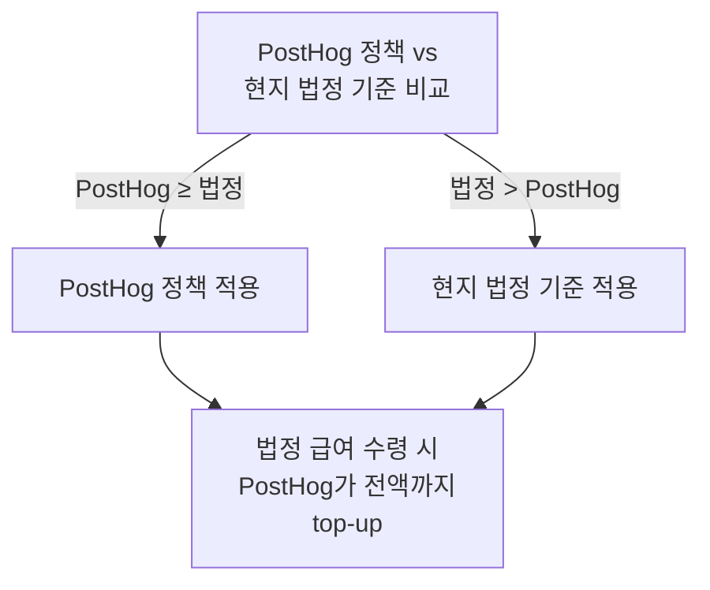

성별에 관계없이 출산 또는 입양으로 부모가 된 모든 구성원이 육아휴직을 사용할 수 있다[^1].

## 유급 육아휴직 기간

근속 기간에 따라 유급 기간이 달라진다.

| 근속 기간 | 출산 휴가(Maternity) | 배우자 휴가(Paternity) |
|-----------|---------------------|----------------------|
| 6개월 미만 | 3주 | 2–3주 |
| 6–12개월 | 12주 | 2–3주 |
| 12개월 초과 | 최대 24주 | 6주 |

[^2]

## 급여 보전 방식

PostHog의 육아휴직은 대부분 국가의 법정 기준보다 관대하게 설계되어 있다[^3]. 거주 국가의 법정 휴직이 더 관대한 경우 그 기준을 따른다[^3].

법정 출산·육아 급여를 받는 경우, PostHog가 전액 급여까지 차액을 보전(top-up)한다[^4]. 별도로 합산되는 것이 아니다[^4].

## 출산 휴가(Maternity Leave)

위 표의 유급 기간 이후에도 무급 휴직으로 연장할 수 있다[^5]. 팀과 합리적인 기간을 협의하고, 전체 예상 부재 기간을 Ops 플랫폼에 등록한다[^5].

> **영업직(quota-carrying Sales) 참고:** 12주 이상 출산 휴가 시 OTE는 직전 2분기 판매 실적 달성률 평균으로 산정하며, 100% OTE를 상한으로 한다[^6].

## 배우자 휴가(Paternity Leave)

배우자 휴가에는 무급 연장이 제공되지 않는다[^7].

## 사용 규칙

- 유급 육아휴직은 **연속 사용**이 원칙이다[^8]
- 무제한 PTO와 별도로 장기 휴가를 추가하는 것은 일반적으로 허용되지 않는다[^9]. 출산 후 더 긴 휴식이나 단계적 복귀가 필요하면 Ops 플랫폼에 등록하거나 매니저와 상의한다[^10]
- 시작 예정일 **최소 4개월 전**에 Ops 플랫폼에 등록한다[^11]. People & Ops팀이 급여·법정 서류 등 후속 절차를 안내한다[^11]

> **참고:** 임신·자녀 상실에 대한 사별 휴가는 [휴가 정책](pages/eddb3cec8f14.md)의 사별 휴가 절을 참고한다.

> **참고:** 전체 복지 혜택은 [복지 혜택 개요](pages/64f41068e524.md) 참고.

[^1]: 07-time-off.md, Parental leave — "Anyone at PostHog, regardless of gender, is able to take parental leave, and regardless of whether you've become a parent through childbirth or adoption."
[^2]: 07-time-off.md, Parental leave — "This table explains the amount of paid time off, depending on how long you've been at PostHog"
[^3]: 07-time-off.md, Parental leave — "Parental leave at PostHog is designed to be more generous than your local jurisdiction's legal requirements. This means that in most cases you will receive the PostHog policy, if you live in a country with more generous parental leave, then you will receive that."
[^4]: 07-time-off.md, Parental leave — "This means that if you receive any statutory leave, PostHog will top this up to your full pay."
[^5]: 07-time-off.md, Maternity leave — "Maternity leave can be extended using unpaid time off, please work with your team to find a reasonable solution for both your family and your team, and log the total amount of time you expect to take off in the Ops platform as soon as possible."
[^6]: 07-time-off.md, Maternity leave — "For quota-carrying Sales roles taking 12 weeks or longer, your OTE will be calculated by averaging your sales quota attainment for the prior two full quarters (capped at 100% OTE)."
[^7]: 07-time-off.md, Paternity leave — "We do not offer unpaid leave for Paternity leave."
[^8]: 07-time-off.md, Parental leave — "We only pay the enhanced parental leave in one continuous block."
[^9]: 07-time-off.md, Parental leave — "we usually won't allow you do a combination of parental leave plus a long holiday in addition to that to extend your time off."
[^10]: 07-time-off.md, Parental leave — "If you need a longer break after childbirth or a staggered return, log it in the Ops platform or speak to your manager."
[^11]: 07-time-off.md, Parental leave — "Please log parental leave in the Ops platform as soon as you feel comfortable doing so, and in any case at least 4 months before it will begin."
