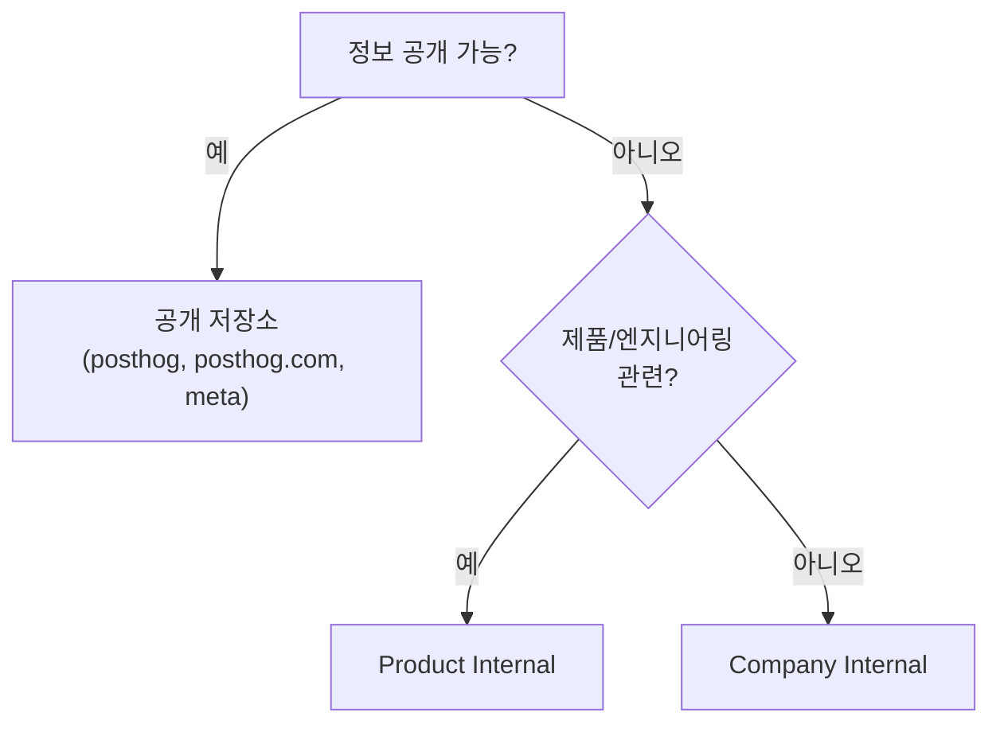
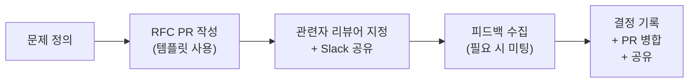

전 세계에 분산된 팀이므로 **비동기 소통을 기본**으로 한다[^1]. GitHub의 공개 이슈·풀 리퀘스트와 내부 Slack을 통해 가능한 한 공개적이고 투명하게 소통한다[^1].

## 소통 원칙

| 원칙 | 설명 |
|------|------|
| 긍정적 의도를 전제한다 | 상대의 선의를 가정하고 대화한다[^2] |
| 의견을 형성한다 | 다양한 위치·관점에서 오는 생각과 감정을 공유한다[^3] |
| 피드백은 필수다 | 직접적이되 건설적인 방식으로 서로의 성장을 돕는다[^4] |

## 골든 룰

1. **비동기 소통을 우선한다** — 풀 리퀘스트(권장) 또는 이슈를 사용한다. 공지는 적절한 Slack 채널에서 한다[^5]
2. **GitHub 토론을 우선한다** — 이슈나 PR에서의 논의가 다른 모든 것보다 우선이다. 급하면 Slack으로 링크와 함께 응답을 요청하되, 바로 보지 못할 수도 있다[^6]
3. **항시 가용할 필요 없다** — 근무 시간 외 메시지에 응답할 의무가 없다[^7]
4. **질문을 아끼지 않는다** — 공개 채널에서 질문한다. 핸드북 링크를 받는 것은 "스스로 찾았어야 했다"는 뜻이 아니다[^8]
5. **마감일 또는 완료를 답한다** — "할 예정", "알겠습니다"는 도움이 안 된다. 작은 일이면 즉시 처리를 고려한다[^9]
6. **비공개 그룹을 피한다** — 내부 논의에 비공개 그룹을 만들지 않는 것이 기본이다[^10]

## 투명성 — Public by Default

투명성이 핵심 문화이므로 **기본적으로 공개**한다[^11].

| 구분 | 범위 | 예시 |
|------|------|------|
| 공개 | 대부분 | 제품, 로드맵, 핸드북, 전략[^12] |
| 내부 공유 | 거의 나머지 전부 | 재무 성과, 보안, 펀드레이징, 채용[^12] |
| 내부 비공개 | 개인정보 | 보상, 징계[^12] |

### 내부 저장소

비공개 정보는 두 개의 내부 저장소에 집중한다[^13]. Slack이 아닌 저장소(또는 핸드북)가 내부 정보의 원천(source of truth)이다[^14].

| 저장소 | 범위 | 예시 |
|--------|------|------|
| Company Internal | 전사 비공개 (People, Ops, Legal, Finance, Strategy)[^15] | 채용 계획, 복리후생 논의, 민감 전략, 온·오프보딩 체크리스트[^16] |
| Product Internal | 제품 비공개 (엔지니어링, 제품, 성장, 디자인)[^17] | 보안 취약점, PII 포함 버그, 장애 포스트모텀, 실험 결과, 가격 논의[^18] |
| meta (공개) | 공개 가능한 전사 이슈[^19] | 공개 전략 토론, 도구 논의 등 |

## GitHub 활용

### 풀 리퀘스트(PR) 우선

가능하면 이슈보다 **PR로 논의를 시작**한다[^20]. PR은 구체적인 변경 제안이므로 집중된 토론과 빠른 결정이 가능하다[^20]. 기본적으로 PR은 비기밀이며, 기밀 사항은 비공개 이슈에서 제안한다[^21].

- 문제를 먼저 정의하고, 최소 실행 가능 변경(MVC)의 근거를 설명한다[^22]
- 합의를 목표로 하지 않는다 — 약간의 개선이 아무것도 안 하는 것보다 낫다[^22]

### 이슈

코드나 문서 변경이 필요 없을 때 사용한다[^23]. 하나의 구체적 주제와 원하는 결과를 정의하여 이슈가 방치되지 않도록 한다[^24].

### 리뷰와 알림 관리

| 방법 | 설명 |
|------|------|
| GitHub Slack 알림 (강력 추천) | PR이나 이슈에서 멘션되면 Slack 알림 수신[^25] |
| `#github-rfcs` 채널 (강력 추천) | 모든 RFC가 게시되는 채널[^26] |
| GitHub 이메일 알림 | 팀 활동에 필터 적용[^27] |
| GitHub Notifier 확장 프로그램 | 브라우저에서 알림 확인[^28] |

> **검색 팁:** PostHog 조직 전체를 검색하려면 github.com/posthog에서 검색한다. Chrome에서 `ph` + Tab으로 바로 검색하도록 커스텀 검색 엔진을 설정할 수 있다[^29].

## Slack

비공식적이거나 이슈·PR이 적합하지 않은 소통에 사용한다[^30]. PostHog는 오픈소스 프로젝트이므로 비공개 공간에 맥락이 너무 많이 쌓이면 외부 기여자가 의사결정 배경을 이해하기 어려워진다[^31].

### 에티켓

1. `#general`은 전사 공지용으로 유지한다[^32]
2. `@channel`·`@here`는 긴급·시간 민감한 게시물에만 사용한다[^33]
3. 답변은 **스레드**로 달아 채널 노이즈를 줄인다[^34]
4. 여러 생각은 하나의 메시지로 정리해 보낸다[^35]
5. 자리 비움을 굳이 알릴 필요 없다 — 실시간 응답 기대가 없다[^36]
6. 프로필을 최신으로 유지한다 — 동명이인이 있으면 성/이니셜을 포함한다[^37]

### 채널 네이밍 규칙

| 접두사 | 용도 |
|--------|------|
| `#team-[팀명]` | 소규모 팀 채널[^38] |
| `#project-[프로젝트명]` | 여러 팀에 걸친 일회성 프로젝트[^38] |
| `#posthog-[고객명]` | 고객과의 공유 채널[^38] |
| `#alerts-[팀명]` | 팀 알림 전용[^38] |
| `#support-[제품명]` | 서포트 요청[^38] |
| `#offsite-[팀]-[월]-[연]-[장소]` | 오프사이트 기획[^38] |
| `#onboarding-[이름]-[팀]-[월]-[연]-[장소]` | 신규 입사자 온보딩[^38] |
| `#hiring-[팀명]` | 채용 논의[^38] |
| `#superday-[이름]-[역할]` | 인터뷰 데이 조율[^38] |

비공개 채널이 필요한 경우(주로 채용 관련) `#private-xxxxx` 접두사를 쓴다[^39].

### 배포 소식 채널

| 채널 | 설명 |
|------|------|
| `#changelog` | 방금 배포된 것 — PR 병합 시 자동 업데이트[^40] |
| `#coming-soon` | 곧 배포될 것 — 매일 요약[^41] |

두 채널 모두 에이전트 워크플로우가 병합 PR과 피처 플래그 변경을 스캔하여 자동 요약한다[^42].

### 유용한 AI 기능

- **Slack Recap** — `#ask-max`, `#today-i-learned` 등 채널을 추가하여 다른 팀 논의를 파악할 수 있다[^43]
- **Slackbot** — PostHog 워크스페이스 전체를 검색하는 AI 에이전트[^44]

> Slack 캔버스는 스케줄·북마크·메모 등에 유용하나, 분기 목표·런북·스프린트 계획·FAQ는 핸드북·문서·GitHub RFC/이슈에 둔다 — 검색성이 현저히 떨어진다[^45].

## 이메일·Google Docs

### 이메일

내부 이메일은 거의 사용하지 않는다[^46]. 용도는 법적 승인, 공식 문서(오퍼, 급여 서류), 외부 파트너 소통에 한정된다[^47].

### Google Docs·슬라이드

비기밀이고 웹사이트나 핸드북에 올라갈 내용이라면 Google Doc 대신 PR로 작업한다[^48]. Google Docs는 회의록이나 내부 지표 공유에 주로 사용한다[^49]. 내부 프레젠테이션 대신 이슈에서의 토론이 낫다[^50]. 발표가 필요하면 Pitch를 사용한다[^51].

## 작문 스타일

| 규칙 | 설명 |
|------|------|
| American English | 공식 커뮤니케이션의 표준[^52] |
| 약어 지양 | 맥락 모르는 사람을 배제할 수 있다[^53] |
| 약칭은 마침표 없이 | USA (O), U.S.A. (X)[^54] |
| Oxford comma 사용 | 직렬 쉼표를 쓴다[^55] |
| 의미 있는 링크 텍스트 | "여기 클릭" 대신 내용을 설명하는 앵커 텍스트[^56] |
| Sentence case | 제목에 문장형 대소문자[^57] |
| 숫자 약칭 | 10M, 100B (대문자, 공백 없음)[^58] |

## RFC (Request for Comments)

투명하게 의사결정하고 피드백을 수집하는 공식 절차다[^59].

### RFC 절차

1. 문제와 결정 사항을 정의한다[^59]
2. RFC 템플릿으로 PR을 생성한다[^59]
3. 영향받는 사람을 리뷰어로 지정하고 Slack에 공유한다 — 승인이 아니라 코멘트를 받는 것이 목적이다[^59]
4. 팀 간 큰 이견이 있으면 미팅으로 전환한다[^59]
5. 결정을 PR에 기록하고 병합, 관련 채널과 `#github-rfcs`에 다시 공유한다[^59]

### RFC가 효과적인 경우

- 본인 정리 또는 단일 팀 영향 범위[^60]
- 비교적 논쟁이 적은 변경[^60]
- 대규모 작업(2~3주 이상)[^60]
- 새로운 기술 도입[^60]
- 주요 기능·제품·회사 차원 변경[^60]
- 고객 영향이 큰 변경[^60]

### RFC보다 미팅이 나은 경우

다른 팀에 큰 영향을 주는 변경은 RFC보다 미팅이 빠르다[^61]. RFC 코멘트가 10~25개 이상 쌓이면 대립적으로 느껴질 수 있다[^61]. 미팅 후 반드시 노트를 남기고, 투명성을 위해 RFC로 기록한다[^62].

### RFC에서의 AI 사용

RFC는 집중적이고 독창적인 사고의 결과물이어야 한다 — AI에게 작성을 맡기지 않는다[^63]. 연구·최종 다듬기에는 AI를 활용하되, 문제 정의·해결책·Q&A는 직접 작성한다[^64]. AI 분석은 부록으로 포함할 수 있다[^65].

### RFC 팁

| 팁 | 설명 |
|----|------|
| 짧아도 된다 | Slack 스레드보다 나은 경우가 많다[^66] |
| 결정은 빨라도 된다 | 핵심 인물의 피드백을 받았다면 2일이면 충분[^67] |
| 완전한 합의 불필요 | 되돌릴 수 있는 결정이라면 확신이 서면 진행한다[^68] |
| 소음 점검 | 본인 의견이 유용한지, 당사자들이 먼저 논의해야 하는지 판단한다[^69] |
| 인프라 팀 태그 | 새 기술 도입 시 필수[^70] |
| 바쁜 독자 배려 | 요약을 앞에 두고, 상세 내용은 아래나 부록에 둔다[^71] |

## 회의

Google Meet을 사용한다[^72]. 대규모 회의에서는 `CMD + -`로 화면을 축소하여 참가자를 모두 본다[^72].

| 규칙 | 설명 |
|------|------|
| 문서화 | 모든 예정된 회의에 Google Doc 또는 GitHub 이슈 링크[^73] |
| 캘린더 수정 허용 | "Guests can modify event" 체크[^74] |
| 영상 켜기 | 참여도를 높인다 — 가족·반려동물 등장 환영[^75] |
| 헤드셋 사용 | 마이크 포함 헤드셋 강력 권장[^76] |
| 음소거 | 불필요한 배경 소음 시 음소거[^77] |
| 노트 작성 | 결론과 후속 조치를 실시간으로 기록[^78] |
| 정시 시작 | 지각자를 기다리지 않는다[^79] |
| 정시 종료 | 예정 시간에 끝낸다[^80] |
| 끼어들기 OK | 지연으로 겹치는 건 자연스러운 일 — 질문과 맥락 제공이 더 중요[^81] |
| 흡연·전자담배 금지 | 오픈 오피스와 같은 기준[^82] |

### 가용성 표시

- 휴가·출장 등 부재를 본인 캘린더에 등록한다[^83]
- Google Calendar에서 Working Hours를 설정한다 — 시간대가 다른 동료에게 유용[^84]

### 외부 미팅

Calendly로 외부 미팅(데모, 피드백 콜)을 예약한다. 계정이 필요하면 `#sales`에서 Simon에게 요청한다[^85].

## 소통 보안

모든 내부 소통은 Slack에서 이루어진다고 기대한다[^86]. 전화·SMS·WhatsApp은 요청·승인·민감 정보 전달에 **절대** 사용하지 않는다[^87]. Slack 외부에서 연락이 오면 **검증 전까지 신뢰하지 않고**, Slack으로 본인 확인 후 Slack에서만 대화를 이어간다[^88].

- 경영진(James, Tim 등)이 이메일·SMS·WhatsApp·전화로 송금·상품권·MFA 코드·접근 권한 변경을 요청하는 일은 없다 — 이런 요청은 피싱으로 간주하고 `#phishing-attempts`에 신고한다[^89]
- 이메일은 `@posthog.com` 발신자만 신뢰하고, 유사 도메인(posthog.co 등)·예상치 못한 첨부파일·"긴급" 요청에 주의한다[^90]

> **참고:** Slack 채널 목록과 업무 도구 전반은 [소프트웨어 및 도구 가이드](pages/f7c1e9d5478f.md) 참고.

> **참고:** MFA·MDM·피싱 신고 등 전사 보안 가이드라인은 [보안 및 기기 관리](pages/8438d6fb1076.md) 참고.

[^1]: 12-communication.md, Introduction — "we use **asynchronous communication as a starting point** and stay as open and transparent as we can by communicating on GitHub through public issues and pull requests, as well as in our PostHog User and internal Slack."
[^2]: 12-communication.md, Our communication values — "Always coming from a position of positivity and grace."
[^3]: 12-communication.md, Our communication values — "We want to know your thoughts, opinions, and feelings on things."
[^4]: 12-communication.md, Our communication values — "Help everyone up their game in a direct but constructive way."
[^5]: 12-communication.md, Golden rules — "Use **asynchronous communication** when possible: pull requests (preferred) or issues."
[^6]: 12-communication.md, Golden rules — "Discussion in GitHub issues or pull requests is preferred over everything else."
[^7]: 12-communication.md, Golden rules — "There is **no** expectation to respond to messages outside of your planned working hours."
[^8]: 12-communication.md, Golden rules — "It is 100% OK to ask as many questions as you have - please ask in public channels!"
[^9]: 12-communication.md, Golden rules — "When someone asks for something, reply back with a deadline or by noting that you already did it."
[^10]: 12-communication.md, Golden rules — "By default, avoid creating private groups for internal discussions."
[^11]: 12-communication.md, Public by default — "is core to our culture."
[^12]: 12-communication.md, Public by default — "_Public_ - most things, including our product, roadmap, handbook and strategy."
[^13]: 12-communication.md, Public by default — "We have two repos to centralize and document private internal communication."
[^14]: 12-communication.md, Public by default — "These are the source of truth for any internal information, and anything that should be written down (as established in these guidelines) should live in these repos or (better) in this Handbook, not on Slack."
[^15]: 12-communication.md, Company Internal — "Documents any company-wide information that can't be shared publicly within People, Ops, Legal, Finance or Strategy."
[^16]: 12-communication.md, Company Internal — "Hiring plans and discussions _before_ we post a job ad"
[^17]: 12-communication.md, Product Internal — "Contains internal information related to the PostHog product."
[^18]: 12-communication.md, Product Internal — "Vulnerabilities (security bugs) reports"
[^19]: 12-communication.md, Company Internal — "For company-related issues that _can_ be discussed publicly, these should go in the `meta` repo"
[^20]: 12-communication.md, Everything starts with a pull request — "It's best practice to start a discussion where possible with a Pull Request (PR) instead of an issue."
[^21]: 12-communication.md, Everything starts with a pull request — "By default, pull requests are **non-confidential**."
[^22]: 12-communication.md, Everything starts with a pull request — "Keep discussions focused by _defining the problem first_ and _explaining your rationale_ behind the Minimal Viable Change (MVC) proposed in the PR."
[^23]: 12-communication.md, Issues — "GitHub Issues are useful when there isn't a specific code or document change that is being proposed or needed."
[^24]: 12-communication.md, Issues — "it is still important to maintain focus when opening issues by defining a single specific topic of discussion as well as defining the desired outcome"
[^25]: 12-communication.md, Keeping on top of reviews, issues and notifications — "Turn on Github slack notifications"
[^26]: 12-communication.md, Keeping on top of reviews, issues and notifications — "Join the `#github-rfcs` channel on Slack."
[^27]: 12-communication.md, Keeping on top of reviews, issues and notifications — "Turning on GitHub email notifications"
[^28]: 12-communication.md, Keeping on top of reviews, issues and notifications — "Using the GitHub notifier extension."
[^29]: 12-communication.md, Tip for easy searching through everything — "To search all code, PRs and issues ever written at PostHog you can search everything in the PostHog organization on Github."
[^30]: 12-communication.md, Slack — "Slack is used for more informal communication, or where it doesn't make sense to create an issue or pull request."
[^31]: 12-communication.md, Slack — "PostHog has contributors who don't have access to Slack. Having too much context in a private location can be detrimental to those who are trying to understand the rationale for a certain decision."
[^32]: 12-communication.md, Slack etiquette — "Keep `#general` open for company-wide announcements."
[^33]: 12-communication.md, Slack etiquette — "`@channel` or `@here` mentions should be reserved for urgent or time-sensitive posts that require immediate attention"
[^34]: 12-communication.md, Slack etiquette — "Make use of threads when responding to a post."
[^35]: 12-communication.md, Slack etiquette — "summarize multiple thoughts into a single message instead of sending multiple messages sequentially."
[^36]: 12-communication.md, Slack etiquette — "You don't need to tell people if you're away from your computer"
[^37]: 12-communication.md, Slack etiquette — "Keep your Slack profile up to date with the right information, including the appropriate name"
[^38]: 12-communication.md, Slack etiquette — "`#team-[team-name]` - small team channels"
[^39]: 12-communication.md, Slack etiquette — "sticking `#private-xxxxx` in front so people don't accidentally add external parties who shouldn't be in there."
[^40]: 12-communication.md, Keeping up with what we ship — "Updates constantly as PRs merge."
[^41]: 12-communication.md, Keeping up with what we ship — "Posts a daily digest."
[^42]: 12-communication.md, Keeping up with what we ship — "Both channels are powered by agentic workflows that scan merged PRs and feature flag changes and summarize them into the relevant channel."
[^43]: 12-communication.md, Slack — "is a great way to learn from others by adding channels like `#ask-max` and `#today-i-learned` to the recap."
[^44]: 12-communication.md, Slack — "is a handy AI agent that can search across the PostHog workspace in Slack to help answer your questions."
[^45]: 12-communication.md, Slack — "Slack canvasses are terrible for searchability!"
[^46]: 12-communication.md, Email — "Internal email should be avoided in nearly all cases."
[^47]: 12-communication.md, Email — "Obtaining approvals for legal things"
[^48]: 12-communication.md, Google Docs and Slides — "Never use a Google Doc / Slides for something non-confidential that has to end up on the website or this handbook."
[^49]: 12-communication.md, Google Docs and Slides — "We mainly use Google Docs to capture internal information like meeting notes or to share company updates and metrics."
[^50]: 12-communication.md, Google Docs and Slides — "Please avoid using presentations for internal use."
[^51]: 12-communication.md, Google Docs and Slides — "use [Pitch](https://pitch.com) to build your slides."
[^52]: 12-communication.md, Writing style — "We use American English as the standard written language in our public-facing comms"
[^53]: 12-communication.md, Writing style — "Do not use acronyms when you can avoid them."
[^54]: 12-communication.md, Writing style — "Common terms can be abbreviated without periods unless absolutely necessary"
[^55]: 12-communication.md, Writing style — "We use the [Oxford comma](https://www.grammarly.com/blog/what-is-the-oxford-comma-and-why-do-people-care-so-much-about-it/)."
[^56]: 12-communication.md, Writing style — "All links should have relevant anchor text that describes what they link to."
[^57]: 12-communication.md, Writing style — "We use sentence case for titles."
[^58]: 12-communication.md, Writing style — "it's acceptable to abbreviate them (like 10M or 100B - capital letter, no space)."
[^59]: 12-communication.md, Requests for comment (RFCs) — "We use RFCs to communicate and gather feedback on a decision."
[^60]: 12-communication.md, When does it work best to write an RFC? — "You want to clarify something for yourself or it affects just one team"
[^61]: 12-communication.md, When does a meeting / another approach work better than an RFC? — "RFCs can lead to 10 to 25+ comments, which feels antagonistic"
[^62]: 12-communication.md, When does a meeting / another approach work better than an RFC? — "please write notes on such a call - to ensure everyone _is_ on the same page."
[^63]: 12-communication.md, How should I use AI when writing RFCs? — "RFCs are the place where we do concentrated, original thinking. This thinking should not be outsourced to AI."
[^64]: 12-communication.md, How should I use AI when writing RFCs? — "Feel free to use AI for research and final draft polish"
[^65]: 12-communication.md, How should I use AI when writing RFCs? — "Analysis and research done by AI can be included in the RFC at the bottom as appendixes."
[^66]: 12-communication.md, Top tips for RFCs — "RFCs can be very short and are often better than making decisions by Slack threads."
[^67]: 12-communication.md, Top tips for RFCs — "You don't need to have a long decision-making time - 2 days is fine for smaller changes"
[^68]: 12-communication.md, Top tips for RFCs — "You don't need to reach full agreement to decide, particularly if the decision is reversible."
[^69]: 12-communication.md, Top tips for RFCs — "Double-check whether your input will be useful or add noise."
[^70]: 12-communication.md, Top tips for RFCs — "If you're introducing new technologies, you'll likely want to tag someone from Team Infrastructure."
[^71]: 12-communication.md, Top tips for RFCs — "Write your RFC with the busy reader in mind."
[^72]: 12-communication.md, Internal meetings — "PostHog uses [Google Meet](https://meet.google.com/) for video communications."
[^73]: 12-communication.md, Internal meetings — "Most scheduled meetings should have a Google Doc linked or a relevant GitHub issue."
[^74]: 12-communication.md, Internal meetings — "Please click 'Guests can modify event'"
[^75]: 12-communication.md, Internal meetings — "Try to have your video on at all times because it's much more engaging for participants."
[^76]: 12-communication.md, Internal meetings — "Use of a headset with a microphone, is strongly recommended"
[^77]: 12-communication.md, Internal meetings — "Always advise participants to mute their mics if there is unnecessary background noise"
[^78]: 12-communication.md, Internal meetings — "You should take notes of the points and to-dos during the meeting."
[^79]: 12-communication.md, Internal meetings — "We start on time and do not wait for people."
[^80]: 12-communication.md, Internal meetings — "We end on the scheduled time."
[^81]: 12-communication.md, Internal meetings — "You should not be discouraged by this, as the questions and context provided by interruptions are valuable."
[^82]: 12-communication.md, Internal meetings — "please don't do this out of respect for others on the call"
[^83]: 12-communication.md, Indicating availability — "Put your planned away time including holidays, vacation, travel time, and other leave in your own calendar."
[^84]: 12-communication.md, Indicating availability — "Set your working hours in your Google Calendar"
[^85]: 12-communication.md, Calendly — "We use Calendly for scheduling external meetings, such as demos or product feedback calls."
[^86]: 12-communication.md, Communication Methods — "Expect all communication to occur over Slack."
[^87]: 12-communication.md, Communication Methods — "Phone calls, SMS, and WhatsApp are **never** used for initiating requests, approvals, or asking for sensitive info."
[^88]: 12-communication.md, Communication Methods — "If someone contacts you outside of Slack, treat it as **untrusted until verified**. Message them on Slack to confirm, and only continue the conversation over Slack."
[^89]: 12-communication.md, Best practices — "James, Tim, and other execs will never ask for wire transfers, gift cards, MFA codes, or access changes over email/SMS/WhatsApp/phone. Treat such requests as phishing and report them to `#phishing-attempts`."
[^90]: 12-communication.md, Best practices — "Only trust `@posthog.com` senders. Verify via the company directory. Be cautious of look-alike domains"
