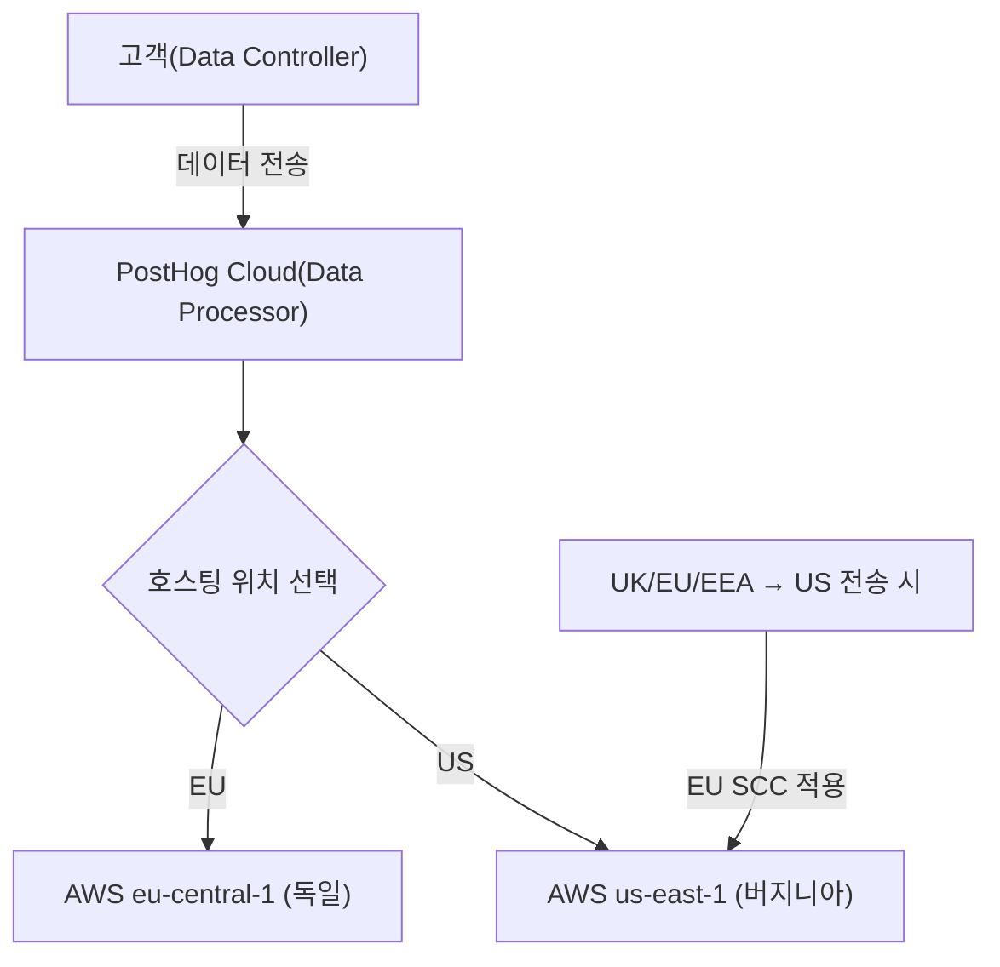

PostHog Cloud 고객의 데이터를 보호하기 위한 컴플라이언스 체계(SOC 2, GDPR, CCPA)와 고객 데이터 접근 정책을 정리한다. PostHog Cloud 고객이 처리를 위해 보내는 데이터는 고객 소유이며, PostHog는 고객의 사용 현황 데이터를 수집·분석하지만 고객이 보낸 사용자 데이터는 포함하지 않는다[^1].

## SOC 2

PostHog는 SOC 2를 준수하며, 관련 보안 정책을 유지한다. 이 정책들은 아래 GDPR에도 적용된다[^2].

## GDPR

고객의 PostHog 사용 방식에 따라 GDPR 역할이 달라진다:

| 사용 방식 | PostHog 역할 | 고객 역할 | PostHog GDPR 의무 |
|-----------|-------------|-----------|-------------------|
| PostHog Cloud | 데이터 처리자(Processor) | 데이터 통제자(Controller) | 고객 최종 사용자에 대한 의무 있음 |
| 셀프호스팅 | 없음 | 처리자 겸 통제자 | 고객 사용자 데이터 접근 불가, 특별한 의무 없음 |

### 데이터 처리자로서의 의무

아키텍처, 데이터 흐름, 계약을 검토하여 GDPR 준수를 보장한다[^3]. PostHog Cloud는 고객의 최종 사용자와 직접 상호작용하지 않으며, 개인 데이터를 자동으로 수집하지 않는다[^4]. 제품 분석에 개인 식별 정보(PII)가 필요하지 않으며, 고객이 최종 사용자의 개인 데이터 수집을 최소화할 수 있는 광범위한 제어 기능을 제공한다[^5].

### 기술적·조직적 조치(TOMs)

| 조치 | 내용 |
|------|------|
| 보안 정책 | 광범위한 보안 정책 유지 |
| DPA | 요청 시 데이터 처리 계약(DPA) 체결. 체결 현황 등록부 관리 |
| 데이터 호스팅 | EU(독일) 또는 US(버지니아) 선택 가능 |
| 데이터 이전 | UK/EU/EEA → US 이전 시 EU 표준계약조항(SCC) 적용 |
| ICO 등록 | UK Information Commissioner's Office에 Hiberly Ltd.로 등록 |
| 하위 처리자 | DPA에 목록 유지, 최소한으로 제한 |
| 처리 등록부 | 데이터 처리 등록부를 요청 시 공개 |

**데이터 보호 책임자(DPO):** Charles Cook (VP Operations). 문의: privacy@posthog.com[^6].

## CCPA

캘리포니아 소비자 프라이버시법(CCPA) 하에서 PostHog는 PostHog Cloud 고객에 대한 서비스 제공자(Service Provider)로만 활동한다 — GDPR의 처리자(Processor)와 유사하다[^7]. CCPA 부칙은 개인정보 처리방침에 포함되어 있다[^8].

고객에게 최종 사용자의 CCPA 권리 행사(데이터 삭제 포함)를 위한 도구를 제공한다[^9]. 고객이 수집한 최종 사용자 데이터는 고객 지시 없이 접근하지 않으며, 제3자에게 판매하지 않는다[^10].

## 고객 데이터 접근(임퍼소네이션)

고객 지원을 위해 직원이 고객 데이터에 접근하거나 사용자로 로그인(임퍼소네이션)해야 할 수 있다[^11]. 다음 가이드라인을 따른다:

| 원칙 | 설명 |
|------|------|
| 고객 이익 우선 | 인시던트 조사, 지원 이슈 해결, 설정 검토 등 고객에게 명확한 이익이 있을 때만 수행 |
| 변경 금지 | 명시적 동의 없이 고객 설정을 변경하지 않음. 단, 서비스에 악영향을 주는 인시던트·잘못된 설정 대응은 예외 |
| 사전 허락 | 가능하면 접근 전에 고객에게 알림. 지원 티켓 제출 시 해당 티켓 범위 내 임퍼소네이션에 동의한 것으로 간주 |
| 판단력 행사 | 확신이 없으면 동의를 구하거나 내부 PostHog 인스턴스로 대체 |

### MCP 서버를 통한 임퍼소네이션

PostHog MCP 서버에 고객으로 로그인한 상태에서 연결할 때도 동일한 규칙이 적용된다[^12]. OAuth 연결과 모든 MCP 도구 호출을 임퍼소네이션 행위로 취급한다. 읽기 전용 모드를 사용하고, 필요한 조직·프로젝트만 인가하며, 완료 후 로그아웃한다[^13].

> **참고:** 전사 보안 실천 사항(MFA, MDM, 피싱 신고 등)은 [보안 및 기기 관리](pages/8438d6fb1076.md) 참고.

[^1]: 06-security.md, Overview — "PostHog Cloud customers own the data they send to us for processing. We collect and analyze data about the use of PostHog Cloud by our customers, but that data does not include the user data that customers send to us to process on their behalf."
[^2]: 06-security.md, SOC 2 — "These policies are also relevant for GDPR (see below)."
[^3]: 06-security.md, PostHog's obligations as a Data Processor — "We have reviewed our architecture, data flows and agreements to ensure that our platform is GDPR compliant."
[^4]: 06-security.md, PostHog's obligations as a Data Processor — "However, our customers might collect and send personal data to PostHog for processing."
[^5]: 06-security.md, PostHog's obligations as a Data Processor — "PostHog does not require personally identifiable information or personal data to perform product analytics, and we provide extensive controls for customers wishing to minimize personal data collection from their end users."
[^6]: 06-security.md, PostHog's obligations as a Data Processor — "Charles Cook (VP Operations) is our assigned Data Protection Officer and is responsible for overseeing compliance. Customers can email privacy@posthog.com for any questions relating to GDPR or privacy more generally."
[^7]: 06-security.md, CCPA — "Under the California Consumer Privacy Act (CCPA), PostHog as a Service Provider to PostHog Cloud customers only. This is similar to the Processor definition under GDPR."
[^8]: 06-security.md, CCPA
[^9]: 06-security.md, CCPA — "We give all PostHog customers the tools to easily comply with their end users' requests under CCPA, including deletion of their data."
[^10]: 06-security.md, CCPA — "We don't access customer end-user data unless instructed by a customer, and customer data is never sold to third parties."
[^11]: 06-security.md, Impersonating users — "PostHog employees may occasionally need to access customer data or log in as a user (i.e. *impersonate* them)."
[^12]: 06-security.md, Impersonating users via MCP — "The same rules apply when you connect the PostHog MCP server while logged in as a customer."
[^13]: 06-security.md, Impersonating users via MCP — "Use read-only mode unless the customer has explicitly agreed to changes, only authorize the organization and project you need, and log out when you're finished."
