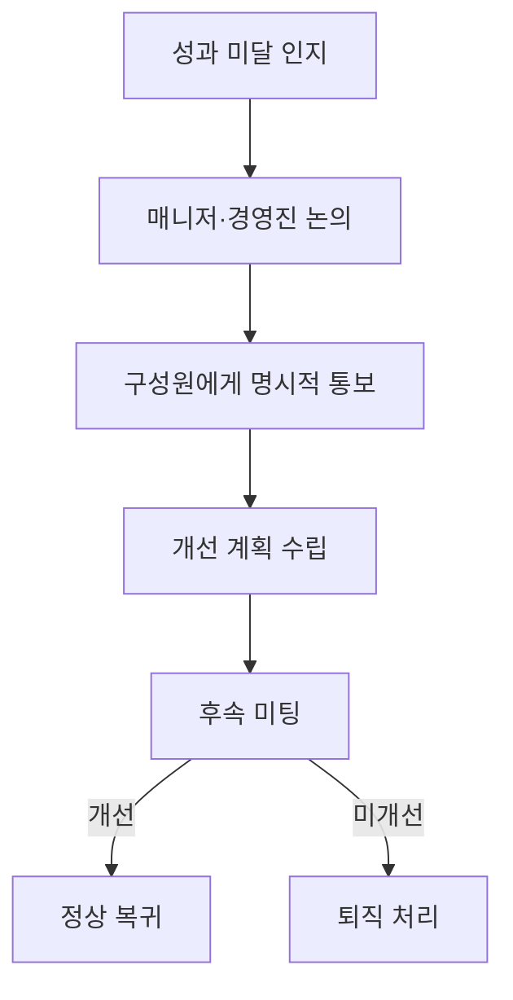

PostHog의 퇴직 절차를 다룬다. 이 정책은 단기 계약직에는 적용되지 않는다[^1].

## 자발적 퇴직 (본인 선택)

기본 30일 전 통보이며, 현지 법률에 따라 달라질 수 있다[^2]. 통보 기간 동안 근무를 계속하는 것이 원칙이다[^2].

퇴직을 고려하고 있다면 먼저 매니저나 People 팀과 상의하는 것을 권장한다[^3]. PostHog 내에서 문제를 해결할 수 있을 수도 있다[^3]. 최종 결정이라면 people@posthog.com으로 퇴직 의사를 전달한다[^4].

## 비자발적 퇴직 (회사 결정)

성과 미달 또는 사업 구조 변경이 주된 사유다[^5]. 최종 결정 권한은 Tim과 James에게 있다[^6].

### 성과 관리 절차

| 단계 | 내용 |
|------|------|
| 1. 문제 인지 | 매니저 또는 경영진이 성과 미달을 확인하고 개선 계획을 논의[^7] |
| 2. 명시적 통보 | 매니저가 구성원에게 성과가 기대에 미치지 못하며, 계속되면 퇴직 가능성이 있음을 알림[^8] |
| 3. 개선 계획 | 구체적인 목표(예: 특정 기능 배포)와 기한을 함께 설정[^9]. 신규 구성원은 보통 수 주, 장기 근속자는 더 긴 기간 부여[^9] |
| 4. 후속 미팅 | 기한 종료 후 개선 여부를 확인하고, 정상 복귀 또는 퇴직 결정[^10] |

매니저급 구성원은 피드백 수집 후 진행한다[^11]. 피드백을 수용하지 않거나 현실적인 개선 가능성이 없으면 조기에 퇴직 처리할 수 있다[^12].

역할 자체가 더 이상 필요하지 않은 경우에는 경영진 결정 후 즉시 통보하며, 사전 예고가 어렵다[^13].

어느 경우든 통보 후 즉시 업무를 중단하는 것이 일반적이다[^14].

> **주의:** 퇴직금을 받으려고 의도적으로 해고를 유도하는 행위는 중대한 계약 위반(gross misconduct)에 해당하며, 법정 최소 금액만 지급된다[^15].

## 최종 급여 및 퇴직금

| 퇴직 유형 | 급여 | 조건 |
|-----------|------|------|
| 자발적 퇴직 | 마지막 근무일까지 급여 + 미사용 휴가 정산(연 25일 기준)[^16] | — |
| 비자발적 (성과/구조 변경) | **4개월분** 급여 (법정 통보 기간 포함)[^17] | 3개월 이상 근속 (영업직은 6개월)[^17] |
| 비자발적 (3개월 미만 근속) | 1개월분 급여[^18] | — |
| 비자발적 (독일, 6개월 이상) | 현지법 및 시장 관행에 따름[^19] | — |
| 중대 위반 (gross misconduct) | 법정 최소 금액만 지급, 통보 기간 없음[^20] | 회사 재량[^20] |

마지막 근무일 이후 급여를 받으려면 퇴직 후 확인서(post-termination certificate), 합의서(separation agreement) 또는 면책 동의서(release)에 서명해야 한다[^21]. 서명하지 않으면 법적·계약적 최소 금액만 지급된다[^21].

현지 법률이 위 기준보다 유리한 경우 현지 법률이 우선한다[^22].

> **참고:** 미국 구성원은 퇴직 후에도 해당 월 말까지 회사가 의료보험료를 부담한다[^23]. 상세 사항은 [국가별 복리후생](pages/95d744e18b48.md) 참고.

## 스톡옵션

스톡옵션이 배정된 구성원에게는 기득권(vested) 수량과 행사 절차를 안내한다[^24]. 퇴직 후 행사 기간은 **10년**으로, 업계 표준보다 길다[^25]. 중대 위반으로 해고된 경우를 제외하면 대부분 'good leaver'로 분류된다[^25].

## 퇴직 커뮤니케이션

| 유형 | 방식 |
|------|------|
| 자발적 | 본인이 다음 계획 공유 여부를 결정[^26]. 퇴직 발표 전 Blitzscale 팀과 시점 조율 필수[^27] |
| 비자발적 | 개인 프라이버시를 존중하면서 가능한 한 투명하게 사유를 공유[^28] |

퇴직 사유에 대해 항상 상세한 맥락을 제공할 수 있는 것은 아니다[^29].

## 레퍼런스 및 재직 증명

PostHog는 전·현직 구성원에 대해 개인적·직업적 레퍼런스를 제공하지 않는다[^30]. 외부에서 문의하면 **재직 기간만** 확인해 준다[^30].

| 해야 할 것 | 하지 말아야 할 것 |
|------------|-------------------|
| People & Ops 팀에 전달[^31] | 직접 답변[^31] |
| — | 성과나 퇴직 사유 공유[^32] |
| — | PostHog를 대표하여 발언[^33] |

## 팀 리더 퇴직 시 추가 절차

자발적 퇴직: Blitzscale 팀이 후임 리더를 미리 정해, 퇴직 발표 직전 또는 발표와 함께 팀에 알린다[^34].

비자발적 퇴직: 통화를 예약하고, 통화 중 운영팀이 Zluri를 통해 계정을 비활성화한다[^35]. 수동 처리가 필요한 단계는 Zluri가 Slack 메시지로 담당자에게 알린다[^35].

퇴직자에게 다음 항목을 이메일로 안내한다[^36]:

1. 최종 급여
2. 기득 스톡옵션
3. 회사 자산 반납
4. 경비 정산
5. 개인 이메일 전달 (선택)

## 오프보딩 체크리스트

People 팀이 GitHub 이슈 템플릿으로 관리하며, 퇴직자마다 새 이슈를 생성한다[^37].

## 수습 기간

| 대상 | 수습 기간 | 구성원 측 퇴직 통보 | 회사 측 종료 시 |
|------|-----------|---------------------|-----------------|
| 일반 | 3개월[^38] | 1주 전 통보[^38] | 4주분 기본급 지급, 즉시 종료가 일반적[^38] |
| 영업직(AE 등) | 6개월[^39] | 1주 전 통보 | 동일 |
| 독일 구성원 | 6개월[^40] | 1개월 전 통보[^40] | 1개월 전 통보[^40] |

영업직의 수습 기간이 긴 이유는 영업 사이클 특성상 3개월 내 계약 체결 능력을 판단하기 어렵기 때문이다[^39]. 독일은 시장 관행과 고용법상 퇴직 절차가 복잡하여 상호 적합성을 충분히 확인하기 위해서다[^40].

매니저가 수습 기간 동안 30/60/90일 체크인으로 성과를 모니터링하고 구체적으로 리뷰한다[^41]. 성과 우려가 있으면 즉시 논의한다[^41].

수습 종료 시 별도 통과 확인을 하지 않는다 — 체크인을 통해 이미 성과와 방향을 파악하고 있기 때문이다[^42].

> **참고:** 30/60/90일 체크인의 상세 절차(각 시점별 피드백 내용, 자동 피드백 폼, 동료 피드백 수집)는 [온보딩 절차](pages/54cd32b21f22.md) 참고.

> **참고:** 성과 피드백과 성장 지원 방식은 [커리어 성장](pages/b5f176c9b3e6.md) 참고. 퇴직 후 창업 시 투자 지원은 [복지 혜택 개요](pages/64f41068e524.md) 참고. 급여 구조와 레벨·스텝은 [보상 체계](pages/fc8ca051ed32.md), 스톡옵션은 [스톡옵션](pages/bfd285bfd962.md) 참고.

[^38]: 08-compensation.md, Probation period — "the first 3 months of your employment with PostHog is a probation period. During this time, you can choose to end your contract with 1 week's notice. If we choose to end your contract, PostHog will pay you 4 weeks' base salary pay, but usually ask you to finish on the same day."
[^39]: 08-compensation.md, Probation period — "People in sales roles, such as Account Executives, have a 6 month probation period - this is to account for the fact that it can be difficult to establish whether or not someone is able to close contracts within their first 3 months, given sales cycles."
[^40]: 08-compensation.md, Probation period — "German employees also have a 6 month probation period - this is to align with market standard best practices and expectations for hiring in Germany, as it can be operationally difficult to part ways with German employees so we ask for as much information as possible"
[^41]: 08-compensation.md, Probation period — "Your manager is responsible for monitoring and specifically reviewing your performance"
[^42]: 08-compensation.md, Probation period — "the default is no communication. By that point, you should already have a clear understanding of your performance and progress through your 30/60/90-day check-ins with your manager."
[^1]: 05-offboarding.md, Offboarding — "This offboarding policy _does not_ apply to regular contractors who are doing short term work for us."
[^2]: 05-offboarding.md, Voluntary departure — "We ask for 30 days of notice by default (unless locally a different maximum or minimum limit applies), and for team members to work during that notice period."
[^3]: 05-offboarding.md, Voluntary departure — "we encourage you to speak with your manager"
[^4]: 05-offboarding.md, Voluntary departure — "please send an email communicating your intention to resign to people@posthog.com."
[^5]: 05-offboarding.md, Involuntary departure — "This is generally for performance reasons or because the company's needs have changed and the role can no longer be justified."
[^6]: 05-offboarding.md, Involuntary departure — "Tim and James are responsible for making any final decision to let someone go."
[^7]: 05-offboarding.md, Involuntary departure — "a manager or member of the exec team will raise that a team member isn't meeting our performance expectations. They discuss what the issues are and a plan to improve."
[^8]: 05-offboarding.md, Involuntary departure — "The person's manager has a meeting with the team member to let them know explicitly that their performance is not meeting expectations, and that if it continues then they will not be able to continue at PostHog."
[^9]: 05-offboarding.md, Involuntary departure — "We outline to the team member exactly what good performance looks like. We collaborate with them to come up with a plan (e.g. specific things to ship), and a timeline for improvement. Usually this is a few weeks for someone new to PostHog, but may be longer if the person has been at PostHog for a while."
[^10]: 05-offboarding.md, Involuntary departure — "At the follow up meeting, we either confirm that performance has improved and they are on the right track, or that we have decided to let them go right away."
[^11]: 05-offboarding.md, Involuntary departure — "If the person is a manager, we usually collect feedback from their team beforehand."
[^12]: 05-offboarding.md, Involuntary departure — "If the person doesn't accept the feedback at the time and/or we don't feel like there is a realistic path to them improving, we may follow up to let them go sooner than this."
[^13]: 05-offboarding.md, Involuntary departure — "we usually make a decision as an exec team and then let the team member know straight away - unfortunately it is not feasible to let someone know that we are thinking of getting rid of their role."
[^14]: 05-offboarding.md, Involuntary departure — "we will usually ask the team member to stop working immediately."
[^15]: 05-offboarding.md, Involuntary departure — "we may treat this as a material breach of your employment contract"
[^16]: 05-offboarding.md, Final pay — "If the offboarding is voluntary, they will be paid up until their last day. We will look at the amount of holiday taken in the last 12 months and will pay any "unused" vacation pay assuming they would have taken 25 days (since we offer unlimited vacation periods)."
[^17]: 05-offboarding.md, Final pay — "they will receive 4 months of pay"
[^18]: 05-offboarding.md, Final pay — "If they have been with PostHog for less time, they will receive 1 month of pay."
[^19]: 05-offboarding.md, Final pay — "For our teammates in Germany"
[^20]: 05-offboarding.md, Final pay — "If the offboarding is involuntary and for gross misconduct, including breach of contract, they may be paid the statutory minimum required only, and receive no notice. This is at our discretion depending on the circumstances."
[^21]: 05-offboarding.md, Final pay — "We ask departing team members to sign a post-termination certificate, separation agreement or release in order to receive payments beyond their final day of work."
[^22]: 05-offboarding.md, Final pay — "if there are local laws which are applicable, we will pay the greater of the above or the legally required minimum."
[^23]: 05-offboarding.md, Final pay — "If you are a US team member, PostHog will continue covering healthcare costs through the end of the next calendar month after your termination, regardless of your tenure or severance length."
[^24]: 05-offboarding.md, Share options vested — "we will confirm how many have vested and the process by which they may wish to exercise them."
[^25]: 05-offboarding.md, Share options vested — "We have a team-friendly post-departure exercise window of 10 years, and most team members who leave will be deemed a 'good leaver' unless they have been terminated due to gross misconduct."
[^26]: 05-offboarding.md, Communicating departures — "we will ask the team member if they wish to share what they're up to next with the team."
[^27]: 05-offboarding.md, Communicating departures — "Please don't announce your resignation until the relevant member of the Blitzscale team has given the go ahead"
[^28]: 05-offboarding.md, Communicating departures — "we will aim to be as transparent as possible about the reasons behind the departure, while respecting the individual's privacy."
[^29]: 05-offboarding.md, Communicating departures — "PostHog cannot always provide context around why people are leaving when they do."
[^30]: 05-offboarding.md, References and employment verification — "the only information we share is their dates of employment"
[^31]: 05-offboarding.md, References and employment verification — "forward it to the People & Ops team"
[^32]: 05-offboarding.md, References and employment verification — "share opinions or details about"
[^33]: 05-offboarding.md, References and employment verification — "speak (or appear to speak) on behalf of PostHog"
[^34]: 05-offboarding.md, For team leads — "the Blitzscale team should figure out who will take on the team lead responsibilities and have that prepared to let the team know just before the resignation is announced"
[^35]: 05-offboarding.md, For team leads — "we will schedule a call. During the call, someone on the ops team will be on hand to deprovisioning accounts. This is run through our access management tool Zluri."
[^36]: 05-offboarding.md, The offboarding process — "We will then send over an email covering the following points"
[^37]: 05-offboarding.md, Offboarding checklist — "The People team will create a new offboarding Issue for each leaver."
