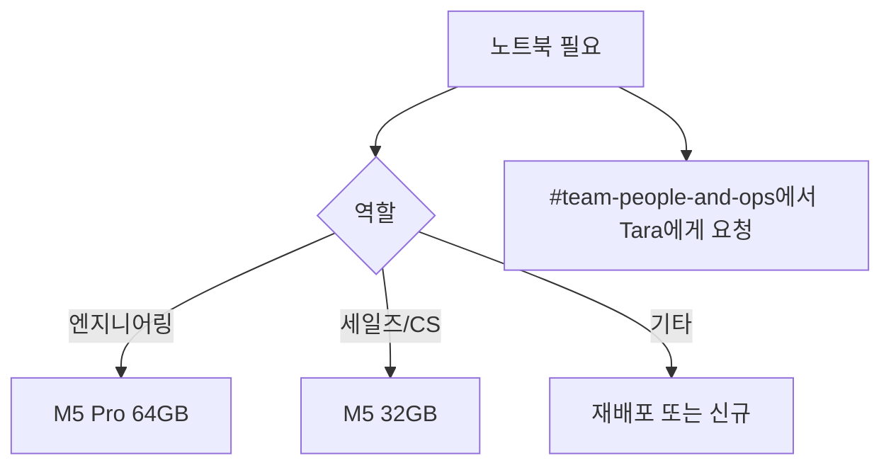

PostHog는 완전 원격 근무 체제로, 생산성 극대화를 위한 홈 오피스 장비를 지원한다. 노트북과 Apple Studio Display는 중앙 구매로 처리하고, 그 외 장비는 개인 한도($5,000/월)에서 자율 구매한다[^1].

## 노트북

노트북 구매는 Tara가 담당하며, #team-people-and-ops에서 요청한다[^2]. 고정자산 추적과 감사를 위해 중앙 구매를 원칙으로 한다[^3].

| 역할 | 권장 사양 |
|------|-----------|
| 엔지니어링 (제품·플랫폼·지원) | MacBook Pro 14인치 M5 Pro, 18코어 CPU, 20코어 GPU, 64GB RAM[^4] |
| 세일즈·CS | MacBook Pro 14인치 M5, 10코어 GPU, 16코어 CPU, 32GB RAM[^5] |
| 기타 | MacBook Pro (엔지니어 중고 재배포 우선)[^6] |

### 노트북 관련 규칙

- 키보드는 반드시 영어 배열(US/International/British)로 구매 — 퇴사 시 재배포를 위해서다[^7]
- 큰 화면(15인치+)은 비용 대비 효율이 낮다. 재택 위주라면 작은 노트북 + 외부 모니터가 합리적이다[^8]
- AppleCare는 구매하지 않는다 — 가성비가 떨어진다[^9]
- 노트북 교체 요청 조건: 4년 이상 사용, 엔지니어링 기기 48GB RAM 미만, 또는 생산성에 심각한 영향[^10]

### 직접 구매해야 하는 경우

- Amazon 세일 확인 후 Apple 직접 구매[^11]
- US: Brex 사용 (캐시백), UK: Revolut 사용 (VAT 환급)[^11]

## 모니터

| 대상 | 모니터 |
|------|--------|
| 제품 엔지니어 (고밀도 화면 필요) | Apple Studio Display[^12] |
| 세일즈/CS/온보딩 (고품질 웹캠·마이크) | Apple Studio Display[^12] |
| 기타 팀 | Clarity Pro 27" 또는 LG UltraFine 27" (개인 한도로 구매)[^13] |

수습 기간 중 Studio Display를 주문했으나 퇴사 시, 디스플레이 비용을 정산하며 반납 불필요하다[^14].

퇴사 시 MacBook과 Apple Studio Display는 반납해야 한다[^15].

## 기타 장비

| 품목 | 합리적 상한 |
|------|-------------|
| 데스크 | $500[^16] |
| 의자 | $500[^16] |
| 키보드 | $250[^16] |

상한을 초과하는 제품을 원하면 개인 결제 후 위 금액까지 Brex에서 환급 신청한다[^17].

- 키보드/마우스/노트북 스탠드: Amazon, Apple 할인 확인. 리퍼 제품도 좋다[^18]
- UK 소재: Office Resale에서 리퍼 디자이너 가구를 합리적 가격에 구매 가능[^19]

### 노트북 지연 시 보안 지침

드물지만 회사 노트북이 입사일 이후에 도착할 수 있다. 개인 노트북으로 비민감 온보딩(핸드북 읽기, 소개 콜 등)을 시작하되, 개인 노트북은 덜 신뢰되는 기기로 취급한다[^21].

| 해야 할 것 | 하지 말아야 할 것 |
|------------|-------------------|
| 핸드북 읽기, 소개 콜 등 비민감 작업[^21] | 프로덕션 클라우드(AWS, GCP 등) 접근[^22] |
| 회사 노트북 도착 시 즉시 민감 작업 이전[^21] | 개인 노트북에 시크릿 저장·처리[^23] |

> **참고:** 온보딩 전체 절차는 [온보딩 절차](pages/54cd32b21f22.md) 참고.

> **참고:** #team-client-libraries 소속으로 테스트용 휴대폰이 필요하면 Tara에게 요청한다[^20].

> **참고:** 장비 구매를 포함한 경비 지출 원칙과 Brex 사용법은 [경비 지출 정책](pages/541dfd02bd51.md) 참고.

> **참고:** 전체 복지 혜택은 [복지 혜택 개요](pages/64f41068e524.md) 참고.

[^21]: 10-onboarding.md, Your first week — "you can begin non-sensitive onboarding tasks (reading the handbook, intro calls, etc.) on your personal laptop in the meantime"
[^22]: 10-onboarding.md, Your first week — "access production cloud environments (AWS, GCP, etc.) from it."
[^23]: 10-onboarding.md, Your first week — "store or handle any secrets on it, including secrets used for local development."
[^1]: 09-spending-money.md, How it works — "You'll be assigned a single `User Limit` of $5,000 per month in Brex from which you can spend money on individual subscriptions, coworking/collaboration, equipment (except laptops and Mac Studio Monitors - ping `#team-people-and-ops` for these), training, etc."
[^2]: 09-spending-money.md, Laptop & monitor — "Talk to [Tara](https://posthog.com/community/profiles/34526) who handles most Macbook and Apple Studio Display purchases - ping her on [#team-people-and-ops](https://posthog.slack.com/archives/C017WDX3BFZ)."
[^3]: 09-spending-money.md, Laptop & monitor — "Having equipment purchases centralized helps ensure accurate accounting and tracking of fixed assets for the audit."
[^4]: 09-spending-money.md, Laptop guidelines — "For engineering roles (product, platform, & support), we recommend a Macbook Pro 14-inch M5 Pro, with the 18-core CPU, 20-core GPU upgrade and 64GB of RAM."
[^5]: 09-spending-money.md, Laptop guidelines — "For sales & CS roles, we buy the Macbook Pro 14-inch M5, with 10-core GPU, 16-core and the 32GB RAM upgrade."
[^6]: 09-spending-money.md, Laptop guidelines — "All other roles, we issue Macbook Pros. Wherever possible we will redistribute engineering models (Macbook Pros) no longer in use to allow you to have a more powerful machine for running PostHog Code."
[^7]: 09-spending-money.md, Laptop guidelines — "We only purchase laptops with an English keyboard configuration (US, International or British is fine) - this enables us to easily pass your laptop on to someone else if you upgrade or leave."
[^8]: 09-spending-money.md, Laptop guidelines — "The larger screen sizes (15 inches +), are disproportionately more expensive. If you are realistically going to do most of your work at home, it is more rational to pick a smaller laptop size, and to get a large monitor."
[^9]: 09-spending-money.md, Laptop guidelines — "Do not get AppleCare since it doesn't have great value for money"
[^10]: 09-spending-money.md, Laptop guidelines — "You can request a new laptop in `#team-people-and-ops` if it is over 4 years old, (for engineering machines) has less than 48GB of RAM, or is significantly impacting your productivity."
[^11]: 09-spending-money.md, Laptop guidelines — "Check if Amazon has sales before purchasing through Apple"
[^12]: 09-spending-money.md, Laptop & monitor — "Apple Studio Displays are only for Product Engineers (high density screen) and Sales/CS/Onboarding teams (built-in high quality webcam and microphone)."
[^13]: 09-spending-money.md, Laptop & monitor — "there are some really great competitors to the Studio Display at a fraction of the price"
[^14]: 09-spending-money.md, Laptop & monitor — "If you order a Studio Display during your probation period but end up leaving PostHog, we can recover the cost of the display and you won't need to return it."
[^15]: 09-spending-money.md, Laptop & monitor — "We expect you to ship the Macbook and Apple Studio Display back when you leave PostHog."
[^16]: 09-spending-money.md, Other equipment — "Desk - up to $500"
[^17]: 09-spending-money.md, Other equipment — "If you want something more expensive, you can pay personally and submit a reimbursement request on Brex for up to the amount above."
[^18]: 09-spending-money.md, Other equipment — "Keyboard/mouse/laptop stand: Check Amazon and Apple for discounts. Refurbished items usually work just fine."
[^19]: 09-spending-money.md, Other equipment — "If you live in the UK, [Office Resale](https://www.officeresale.co.uk/) offer a range of like-new refurbished designer furniture."
[^20]: 09-spending-money.md, Laptop & monitor — "Part of `#team-client-libraries` and need to purchase a phone for testing? Talk to [Tara](https://posthog.com/community/profiles/34526) in `#team-people-and-ops`."
