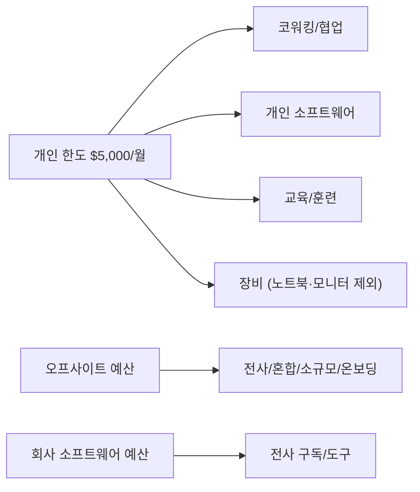

PostHog는 'No Rules Rules'에서 영감받은 맥락 기반 경비 정책을 운영한다[^1]. 구성원에게 좋은 판단을 내릴 권한을 부여하되, 투명성과 책임을 유지하는 것이 핵심이다[^1].

## 지출 판단 기준

경비를 쓰기 전 스스로에게 물어본다[^2]:

- 이 지출이 PostHog에 최선의 이익이라고 명확히 설명할 수 있는가?
- 이 지출을 전체 팀에 공개적으로 설명해도 편안한가?

둘 다 **예**라면 적절한 지출이다[^2]. 확신이 안 서면 팀 리드에게 맥락을 물어본다 — 허가가 아니라 맥락이다[^3].

## 개인 한도와 예산 구조

| 항목 | 내용 |
|------|------|
| 개인 한도(User Limit) | 월 $5,000 (Brex)[^4] |
| 적용 범위 | 개인 구독, 코워킹, 장비(노트북·모니터 제외), 교육 등[^4] |
| 한도 증액 | Brex에서 직접 요청[^4] |

오프사이트 참가 시 반드시 오프사이트 예산만 사용한다 — 개인 한도를 쓰지 않는다[^5]. Kendal에게 #team-people-and-ops에서 알린다[^5].

반복 구독은 User Limit 가상 카드를 사용하면 예산 분류가 자동으로 된다[^6].

## UK 직원 — Revolut 사용

| 조건 | 카드 |
|------|------|
| £75 이상 **그리고** UK VAT 포함 | Revolut[^7] |
| 그 외 | Brex[^7] |

Revolut 사용 시 인보이스를 Hiberly Ltd 및 등록 주소로 발행받아야 한다[^8]. VAT 환급으로 회사에 자금이 돌아온다[^7].

## 영수증 및 메모

$75 또는 £75 이상 모든 지출은 14일 이내에 항목별 영수증을 첨부하고 메모를 작성해야 한다[^9].

| 카드 | 영수증 제출 방법 |
|------|------------------|
| Brex | Brex 앱, 문자, 이메일, Slack[^10] |
| Revolut | ukinvoices@posthog.com 이메일 + 본문에 메모[^11] |

항목별 영수증이 필요하다 — 총액만 보이는 이미지나 카드 단말 확인증은 인정되지 않는다[^12]. 항공/호텔은 전체 예약 확인 이메일, 식당은 상세 계산서가 필요하다[^12].

> 메모 템플릿[^13]
> - What: 구매한 물품/서비스
> - Why: 업무상 이유
> - Context: 참석자, 프로젝트 등

반복 미제출 시 극단적인 경우 급여에서 공제될 수 있다[^14].

## 경비 검토

| 대상 | 검토 주체 |
|------|-----------|
| Brex $1,000 이상 전건 | Finance[^15] |
| Brex $1,000 미만 무작위 표본 | Finance[^15] |
| Revolut 전건 | Finance[^15] |
| 직속 보고 월간 보고서 | 팀 리드[^16] |

팀 리드는 Finance에 없는 맥락을 갖고 있어 감사에서 지출 결정을 정당화하는 데 중요한 역할을 한다[^16].

## 부적절한 지출

감사에서 개인 경비로 간주될 수 있는 지출은 과세 대상 복리후생으로 분류된다[^17].

부적절한 지출 예시[^18]
- 출장 중 개인 경비 (헬스장, 식료품)
- 개인용 엔터테인먼트 구독 (Spotify, Netflix, Amazon Prime 등)
- 개인에게만 이익이 되는 지출
- 공개적으로 설명하기 불편한 지출

오해로 인한 부적절한 지출은 설명과 맥락이 제공된다[^19]. 고의적·의도적 위반은 중대 비위로 처리될 수 있다[^20].

## 자주 묻는 질문

| 질문 | 답변 |
|------|------|
| 개인 카드로 업무 경비 결제 가능? | 불가. 반드시 Brex 또는 Revolut 사용[^21] |
| 실수로 개인 카드 사용 시? | 90일 이내 Brex에서 영수증과 함께 환급 신청[^22] |
| Brex로 개인 경비 결제? | 불가[^23] |
| 실수로 회사 카드로 개인 결제 시? | Brex 로그인 → 해당 건 → Repay 클릭. US/Canada는 자동, 해외는 수동 이체[^24] |
| 업무용 운전 시? | Brex에서 마일리지 환급 신청. 연료비 별도 청구 불가[^25] |
| Finance에 청구서 전달? | Brex Bill Pay로 제출, 수요일에 일괄 처리[^26] |
| 항공권 업그레이드? | 이코노미로 Brex 결제 후 개인 포인트/카드로 업그레이드[^27] |

> **참고:** 장비 구매 기준은 [장비 지급 기준](pages/469b409d9597.md), 소프트웨어 도구 안내는 [소프트웨어 및 도구 가이드](pages/f7c1e9d5478f.md), 출장 경비는 [출장 정책](pages/cf888bc1a238.md) 참고.

> **참고:** 전체 복지 혜택은 [복지 혜택 개요](pages/64f41068e524.md) 참고.

[^1]: 09-spending-money.md, Guiding principles — "We have a context-based expense policy [inspired by the book 'No Rules Rules'](https://posthog.com/handbook/story#things-that-influenced-us). We're empowering team members to make good decisions while maintaining transparency and accountability."
[^2]: 09-spending-money.md, Guiding principles — "Can you clearly explain why this expense is in PostHog's best interest?"
[^3]: 09-spending-money.md, Guiding principles — "when in doubt, ask your team lead for context, not permission."
[^4]: 09-spending-money.md, How it works — "You'll be assigned a single `User Limit` of $5,000 per month in Brex from which you can spend money on individual subscriptions, coworking/collaboration, equipment (except laptops and Mac Studio Monitors - ping `#team-people-and-ops` for these), training, etc."
[^5]: 09-spending-money.md, Budget structure on Brex — "Joining an offsite? _Only use the offsite budget_, not your User Limit"
[^6]: 09-spending-money.md, Budget structure on Brex — "For subscriptions and other recurring monthly expenses, we recommend using the virtual card under your User Limit to ensure it gets categorized to the correct budget by default"
[^7]: 09-spending-money.md, UK employees — "Use your Revolut if the expense is over £75 _and_ has UK VAT on it. If not, use your Brex."
[^8]: 09-spending-money.md, UK employees — "Please make sure that the invoice is addressed to Hiberly Ltd and our registered address"
[^9]: 09-spending-money.md, Receipts — "All expenses over $75 or £75 must have itemized receipts attached and memo updated within 14 days of the charge"
[^10]: 09-spending-money.md, Receipts — "Brex: upload the itemized receipt using the [Brex app, text, email or Slack](https://www.brex.com/support/receipts-for-expenses#attaching-receipts-to-a-specific-expense), and update the memo using the [Brex app, text, email or Slack](https://www.brex.com/support/memos-for-expenses#add-a-memo-to-a-single-expense)."
[^11]: 09-spending-money.md, Receipts — "Revolut: email your itemized receipts to [ukinvoices@posthog.com](mailto:ukinvoices@posthog.com) along with a memo in the body of the email"
[^12]: 09-spending-money.md, Receipts — "We need an _itemized receipt or invoices_ because Brex auto-verifies these using the information on the file."
[^13]: 09-spending-money.md, Receipts — "Template for a thorough memo"
[^14]: 09-spending-money.md, Receipts — "In extreme cases, expenses with no receipts above $75 or £75 may be deducted from your pay"
[^15]: 09-spending-money.md, Reviewing expenses — "All expenses over $1000 (Brex)"
[^16]: 09-spending-money.md, Team Leads — "You'll get monthly expense reports for your direct reports. You have context Finance doesn't, which will help justify spending decisions to the auditors."
[^17]: 09-spending-money.md, How we handle inappropriate spending — "Expenses that could be construed as personal will be flagged as non-business expenses by auditors, as they will be considered a taxable benefit that PostHog has provided to you."
[^18]: 09-spending-money.md, How we handle inappropriate spending — "Personal expenses during business travel (for example: gym sessions/fitness classes, groceries)"
[^19]: 09-spending-money.md, How we handle inappropriate spending — "the inappropriate spend was due to a misunderstanding"
[^20]: 09-spending-money.md, How we handle inappropriate spending — "knowingly and deliberately spent money in ways that are not in PostHog"
[^21]: 09-spending-money.md, Frequently asked questions — "No, you **must use** your Brex or Revolut for all work-related expenses."
[^22]: 09-spending-money.md, Frequently asked questions — "Claim a reimbursement with an itemized receipt on Brex within 90 days of incurring the expense"
[^23]: 09-spending-money.md, Frequently asked questions — "Obviously not."
[^24]: 09-spending-money.md, Frequently asked questions — "Login to Brex > find the charge > click on 'Repay'."
[^25]: 09-spending-money.md, Frequently asked questions — "You can claim a mileage reimbursement through Brex. **Do not** separately expense fuel."
[^26]: 09-spending-money.md, Frequently asked questions — "Submit the bill using the ['Bill Pay' feature on Brex](https://www.brex.com/support/bill-pay-overview#pay-a-bill)"
[^27]: 09-spending-money.md, Frequently asked questions — "Book an economy ticket using your Brex, then upgrade afterwards using your personal points/card."
