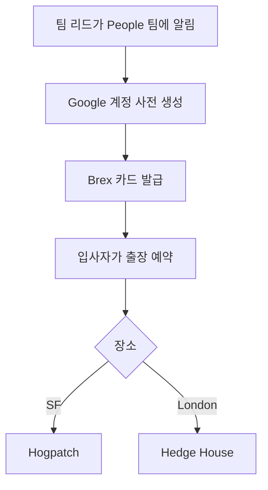

PostHog는 신규 입사자가 올바른 선택을 했다고 느끼고, 회사의 방향에 흥분과 헌신을 갖도록 온보딩에 큰 비중을 둔다[^1]. 팀이 전 세계에 분산되어 있으므로 첫 주에 같은 팀원과 대면으로 만나는 것을 목표로 한다[^2].

> 신규 입사자를 People 팀에 소개하려면 people@posthog.com으로 연결하면 된다[^3].

## 온보딩 체크리스트와 이메일

People 팀이 입사자마다 GitHub 이슈 템플릿으로 온보딩 이슈를 생성한다[^4]. 입사 전에 환영 이메일을 보내 필수 조치를 안내한다[^5]. 아직 company-internal 저장소에 접근할 수 없으므로 이메일로 보낸다[^5].

| 항목 | 내용 |
|------|------|
| 이메일 목적 | 환영 + 필수 링크 안내[^5] |
| 도구 | 간단한 이메일 — Customer.io나 Mailchimp 같은 과도한 도구는 쓰지 않음[^6] |
| 개인화 | 템플릿 기반이나 개인에 맞게 수정 권장[^7] |

> **주의:** 입사 후에는 이메일을 내부 소통에 쓰지 않는다. James나 Tim이 이메일로만 중요한 요청을 보내는 일은 없다 — 반드시 Slack으로 확인한다. 직접 이메일에 극도로 주의할 것[^8].

## 온보딩 버디

모든 신규 입사자에게 온보딩 버디가 배정된다[^9]. 가능하면 첫 주에 대면으로 만난다[^9]. 버디는 보통 합류하는 팀의 팀원(이상적으로는 팀 리드)이며, 첫 2주간 질문 응대와 사교 활동을 돕는다[^10].

### 버디 가이드라인

| 시점 | 버디가 할 일 |
|------|-------------|
| 배정 전 | 신규 입사자 합류 전 1주 ~ 합류 후 2주에 휴가가 없어야 함[^11] |
| 배정 후 | 이메일 소개 후 대면 온보딩 장소·일정 협의[^12] |
| 대면 기간 | 최소 3일 함께 — 첫 주 온보딩 리스트 + 역할별 과제 수행[^13] |
| 이후 1개월 | 최소 주 1회 체크인 지속[^14] |

- 대면 온보딩 일정을 In-person Onboarding Calendar에 등록하여 다른 팀원도 합류 가능하게 한다[^15]
- 업무 시간과 사교 시간 모두 계획한다 — 분 단위가 아닌 대략적 구조면 충분하다[^16]
- 핸드북을 일찍 안내하고 왜 중요한지 설명한다 — PostHog의 맥락 공유 기본 수단이다[^17]
- 처음 버디를 맡는다면 People & Ops 팀이나 팀 리드에게 경험자 페어링을 요청한다[^18]

## 대면 온보딩

특별한 사정이 없는 한 팀원과 대면으로 온보딩을 진행한다[^19]. 장소는 SF의 Hogpatch 또는 London의 Hedge House가 기본이며, 비자 문제나 과도한 이동 시간이 아니면 이 두 곳을 사용한다[^20].

### 온보딩 예산

고정 예산은 없으나 소규모 팀 오프사이트(1인당 $2,000)보다 저렴해야 한다[^21].

| 항목 | 가이드라인 |
|------|-----------|
| 대륙 간 이동 | 피하거나 최소 인원으로 제한[^22] |
| 활동 | 저녁 식사, 음료 등 캐주얼한 사교 활동 위주[^23] |
| 참석 인원 | 팀 리드 + 1명을 온보딩 예산으로, 추가 인원은 개인 working together 예산 사용[^24] |
| 입사자 본인 | 별도 온보딩 예산 보유 — 팀 예산에 포함하지 않음[^25] |
| Slack 채널 | `#onboarding-[이름]-[팀]-[월]-[연도]-[장소]` 생성, 참석자 추가[^24] |
| 예산 요청 | Brex에서 USD로 요청, 사유와 대상자 명시[^26] |

> 대면 온보딩과 소규모 팀 오프사이트를 합치지 않는 것이 기본이다 — 목적이 다르다. 오프사이트에는 해커톤·360 피드백 등 신규 입사자에게 맞지 않는 활동이 포함된다. 다만 상황에 따라 합칠 수도 있다[^27]. 오프사이트 전반(유형·예산·기획 체크리스트)은 [오프사이트 정책](pages/6466ec527a71.md) 참고.

### 대면 시간 활용

온보딩 주간에 옆에 앉아 평소 업무만 하면 안 된다[^28]. 매일 계획된 활동이 있어야 한다[^28].

| 활동 예시 | 설명 |
|-----------|------|
| 가치·전략 소개 | PostHog의 핵심 가치와 전략 설명[^29] |
| 팀 역사·목표·제품 데모 | 팀의 연혁, 분기 목표, 담당 기능 데모 (제품팀)[^30] |
| 인터뷰 피드백 세션 | 팀 리드와 입사자 간 면접 피드백 공유[^31] |
| 코드 딥다이브 | 특정 기능의 코드를 함께 살펴보기 (제품팀)[^32] |
| 모의 데모 | 세일즈 팀 전용[^33] |
| "바보 같은 질문 없다" 세션 | 입사자가 궁금한 점을 자유롭게 질문[^34] |

## 첫 주

| 할 일 | 상세 |
|--------|------|
| 팀 리드와 30/60/90일 목표 논의[^35] | 대면 또는 화상으로 |
| 장비 세팅·계정 접근[^36] | 모든 필요 계정 확보 |
| 신규 입사 키트 수령[^37] | 도서 *No Rules Rules* 포함 — 회사 운영 방식 이해에 도움 |
| 다양한 사람들과 자기소개 콜[^38] | 여러 팀에 걸쳐 셋업 |
| 실제 사용자와 대화[^39] | 매니저·PM이 연결. 첫 주 작업 아이디어의 좋은 원천 |
| 바로 뛰어들기[^40] | 핸드북 오타 수정, 작은 버그 픽스 — 무엇이든 시작 |

> **노트북 지연 시:** 드물지만 회사 노트북이 입사일 이후에 도착할 수 있다. 개인 노트북으로 비민감 온보딩(핸드북 읽기, 소개 콜 등)을 시작하되, 프로덕션 클라우드(AWS, GCP 등) 접근이나 시크릿 저장은 하지 않는다. 회사 노트북 도착 즉시 민감 작업을 이전한다[^41]. 상세 장비 정책은 [장비 지급 기준](pages/469b409d9597.md) 참고.

## 엔지니어링 온보딩

엔지니어 채용이 빈번해 대면 온보딩 노하우가 축적되어 있다[^42]. 5가지 규칙을 따른다.

| 규칙 | 내용 |
|------|------|
| 1. 첫날 함께 배포 | 아무리 작아도 좋다. 개발 환경을 준비하고 바로 시작하는 느낌이 중요[^43] |
| 2. 매일 1:1 학습 세션 | 성공에 필요한 맥락 전달. 온보딩 종료 시 참석 팀원 전원이 최소 1회 세션 진행[^44] |
| 3. 팀 중요 주제 브레인스토밍 | 실행 가능한 결론을 기록. 입사자를 의사결정에 참여시킴[^45] |
| 4. 가능하면 페어 프로그래밍 | 대면 협업의 장점을 최대한 활용[^46] |
| 5. 즐기기 | 관광, 저녁 식사, 재미있는 활동 — 일만 하지 않기[^47] |

학습 세션 아이디어: 이벤트 라이프사이클, 프론트엔드 빌드 파이프라인, PostHog Cloud 아키텍처, 트렁크 기반 개발과 피처 플래그, 쿼리 노드, 데드 레터 큐, 실험 결과 계산, 엔지니어링 플래닝[^48]. 각 세션은 15분~1시간 유동적이다[^49].

## 서포트 히어로 교육

모든 구성원은 서포트 히어로로 호출될 수 있다[^50]. 입사 3주 이내에 가장 가까운 시간대의 서포트 엔지니어와 30분 세션을 잡는다[^51].

| 교육 항목 | 내용 |
|-----------|------|
| 서포트 히어로 역할 | 티켓/에스컬레이션 수신 방식[^52] |
| 티켓 출처 | 유료/무료 사용자 구분[^53] |
| Slack → 티켓 생성 | 팀 간 이관 방법[^54] |
| 고객 커뮤니케이션·우선순위 | SLA, 티켓 심각도[^55] |
| 티켓 상태 관리 | On hold, Pending 처리[^56] |
| 버그 리포트·기능 요청 | 처리 방법[^57] |
| 티켓 중복 방지 | 작업 시작 시 티켓 할당[^58] |

실제 티켓 해결을 시연(섀도잉)하면 특히 효과적이다[^59].

## 30/60/90일 수습 체크인

팀 리드가 신규 구성원의 3개월 수습 기간을 관리한다[^60]. 핵심은 1) 피드백 제공, 2) 성과 우려가 있으면 Blitzscale 팀에 즉시 알려 조치 시간을 확보하는 것이다[^61].

| 시점 | 내용 |
|------|------|
| 30일 | 건설적 피드백 제공. 수습 통과에 필요한 개선점 전달. 잘하고 있으면 긍정 강화[^62] |
| 60일 | 순조로우면 그 신호를 줘서 입사자의 불안 해소. 필요 시 Blitzscale 팀이 추가 피드백 층 제공[^63] |
| 80일 | 수습 종료 전 최종 피드백. 이 시점에서는 순항 중이어야 함. 미해결 우려는 Blitzscale 팀에 공유[^64] |
| 90일 | 수습 종료. 별도 "통과" 알림은 없음 — 이전 체크인으로 이미 파악하고 있어야 함[^65] |

팀 리드는 자동 피드백 폼을 30일·60일·80일에 받는다[^66]. 동료 피드백도 수집하거나 직접 받도록 유도한다 — 팀 리드에게도 사각지대가 있을 수 있다[^67]. 체크인을 기다리지 않고 우려가 생기면 즉시 Blitzscale 팀에 알린다[^68].

> **참고:** 수습 기간 길이(일반 3개월, 영업 6개월, 독일 6개월)와 퇴직 시 처리는 [퇴직(오프보딩) 절차](pages/2d0c4dd38694.md) 참고.

> **참고:** 커리어 성장 철학과 피드백 방식은 [커리어 성장](pages/b5f176c9b3e6.md) 참고.

## 업무 방식과 도구

입사 후 익혀야 할 핵심 페이지:

1. **[커뮤니케이션](pages/1f096e55776a.md)** — PostHog만의 독특한 스타일. 첫 원격 근무라면 특히 중요[^69]
2. **팀 구조** — 소규모 팀(Small Teams) 기반 조직[^70]
3. **매니지먼트** — 일반적이지 않은 관리 방식[^71]

업무 도구(GitHub 저장소, Slack 채널 등) 상세는 [소프트웨어 및 도구 가이드](pages/f7c1e9d5478f.md) 참고.

## 답변 찾기

PostHog는 자기 주도적으로 답을 찾는 문화가 강하다[^72]. #ask-max(AI 봇)가 핸드북과 문서를 모두 읽었으므로 24시간 이용 가능하다[^73]. 문서에 없는 맥락이 필요하면 관련 채널에 질문한다[^74].

## 법적 서명 권한자

Charles, James, Tim만 회사를 대표하여 법적 서류에 서명할 수 있다[^75].

[^1]: 10-onboarding.md, Welcome to PostHog! — "Giving a new joiner a great onboarding experience is super important to us."
[^2]: 10-onboarding.md, Welcome to PostHog! — "In order to ensure the best possible onboarding experience, we aim for the new joiner to meet up with someone from their team in their first week."
[^3]: 10-onboarding.md, Welcome to PostHog! — "Just introduce them to people@posthog.com and a member of the team will jump in and take it from there!"
[^4]: 10-onboarding.md, Onboarding checklist — "The People team will create a new onboarding issue for each new joiner."
[^5]: 10-onboarding.md, Onboarding email — "We send an introductory email to all new hires to welcome them to the team and ease them in the some of the essential actions we need them to take. This needs communicating openly, as users may not be able to access the `company-internal` repo yet."
[^6]: 10-onboarding.md, Onboarding email — "We want to strike a balance between sending attractive, personalized emails and avoiding creating process or using overpowered tools, such as Customer.io or Mailchimp."
[^7]: 10-onboarding.md, Onboarding email — "with important actions specified, though we recommend personalizing it to the individual."
[^8]: 10-onboarding.md, Onboarding email — "For example, James or Tim will never ask you to do something critical over email only – they'll always confirm it over Slack, and so will everyone else. Be extremely cautious of direct emails from James, Tim, or other people of PostHog."
[^9]: 10-onboarding.md, Onboarding buddy — "Every new joiner at PostHog has an onboarding buddy. If possible, a new joiner will meet their onboarding buddy in person during their first week."
[^10]: 10-onboarding.md, Onboarding buddy — "The onboarding buddy is usually a member of the team a new joiner is joining - ideally the team lead - and they can help with any questions that pop up and with socializing during the first couple of weeks at PostHog."
[^11]: 10-onboarding.md, Guidance for onboarding buddies — "Please make sure that you don't have any leave booked in the week before and the two weeks after the new starter joins"
[^12]: 10-onboarding.md, Guidance for onboarding buddies — "We will intro the new joiner and the onboarding buddy via email - please say hi and decide together where and when the in person onboarding will happen."
[^13]: 10-onboarding.md, Guidance for onboarding buddies — "and spending time working on any role-specific tasks that are outlined in the new joiner's personal onboarding issue."
[^14]: 10-onboarding.md, Guidance for onboarding buddies — "You will remain the new joiner's main point of contact for the first few weeks, so please continue to check in with them at least once a week for the first month or so."
[^15]: 10-onboarding.md, Guidance for onboarding buddies — "so that other PostHog team members can join, if possible."
[^16]: 10-onboarding.md, Guidance for onboarding buddies — "The plan doesn't need to be minute-by-minute, but do have a rough shape for the days you're together so the new joiner isn't left wondering what's next"
[^17]: 10-onboarding.md, Guidance for onboarding buddies — "early and talk through why it matters – it's how we default to sharing context at PostHog"
[^18]: 10-onboarding.md, Guidance for onboarding buddies — "ask the People & Ops team or your team lead to pair you with someone who's done it before to support"
[^19]: 10-onboarding.md, In-person onboarding — "Except under special circumstances, new joiners meet with members of their team in-person to go through the onboarding process."
[^20]: 10-onboarding.md, In-person onboarding — "in London. Both are set up for it, remove most of the planning friction"
[^21]: 10-onboarding.md, In-person onboarding — "While there is no fixed budget for onboardings they should be relatively less expensive than a small team offsite, which is $2,000 per person."
[^22]: 10-onboarding.md, In-person onboarding — "Avoid intercontinental travel or choose a location that limits it to the minimum number of people possible"
[^23]: 10-onboarding.md, In-person onboarding — "Consider doing more casual social activities that are less expensive: dinners, drinks etc"
[^24]: 10-onboarding.md, In-person onboarding — "You can request budget for the team lead +1 more team member as an onboarding budget, any other team members joining can use their working together budget"
[^25]: 10-onboarding.md, In-person onboarding — "The new team member already has their own onboarding budget to book their flights and accommodation, so do not include them in the budget."
[^26]: 10-onboarding.md, In-person onboarding — "Request a budget in Brex in USD for any onboardings you are doing. There will of course be some exceptions to this, please just include the reasoning in your brex budget request, and ensure to list who the budget request is for."
[^27]: 10-onboarding.md, In-person onboarding — "However, it may occasionally make sense to combine the two - just use your judgement."
[^28]: 10-onboarding.md, In-person onboarding — "You should not spend the whole week sitting next to them doing your usual work. Having something planned each day is sufficient"
[^29]: 10-onboarding.md, In-person onboarding — "An intro to PostHogs values & strategy"
[^30]: 10-onboarding.md, In-person onboarding — "A history of your team, your current quarterly goals and a product demo of the features you own (product teams only)"
[^31]: 10-onboarding.md, In-person onboarding — "Interview feedback session between the team lead and new joiner"
[^32]: 10-onboarding.md, In-person onboarding — "Deep dive into a specific feature where you walk through the code (product teams only)"
[^33]: 10-onboarding.md, In-person onboarding — "Mock demo (sales team only)"
[^34]: 10-onboarding.md, In-person onboarding — "where the new joiner is expected to come with questions they had since starting"
[^35]: 10-onboarding.md, Your first week — "You will meet (either in person or virtually) your team lead to discuss goals and aims over the next 30/60/90 days and beyond"
[^36]: 10-onboarding.md, Your first week — "You will get all your equipment set up and get access to all the accounts you need"
[^37]: 10-onboarding.md, Your first week — "which we encourage everyone to read as it gives you a great insight into how we work as a company"
[^38]: 10-onboarding.md, Your first week — "You should try and set up a few calls with a range of people to introduce yourself"
[^39]: 10-onboarding.md, Your first week — "You should try and speak to some actual users of your product. Your manager or PM will help you set these up"
[^40]: 10-onboarding.md, Your first week — "You should dive straight in, fix a typo in the handbook, ship a tiny bug fix, anything to get you going!"
[^41]: 10-onboarding.md, Your first week — "you can begin non-sensitive onboarding tasks (reading the handbook, intro calls, etc.) on your personal laptop in the meantime."
[^42]: 10-onboarding.md, Engineering — "We hire engineers on a regular basis, running in-person onboarding practically every time."
[^43]: 10-onboarding.md, Engineering — "Ship something together on day one – even if tiny! It feels great to hit the ground running, with a development environment all ready to go."
[^44]: 10-onboarding.md, Engineering — "Run 1:1 learning sessions with the new teammate every day. Give them all the context they need to succeed. By the end of the onboarding, each team member present should've run at least one such session."
[^45]: 10-onboarding.md, Engineering — "Do at least one brainstorming session on a topic important for the team, writing down actionable conclusions."
[^46]: 10-onboarding.md, Engineering — "Pair whenever possible. You're all sitting next to each other, so pick work that can benefit from in-person collaboration."
[^47]: 10-onboarding.md, Engineering — "Have fun, because life isn't all work! Do some sightseeing, go out for dinner, or find a fun activity"
[^48]: 10-onboarding.md, Engineering — ", from a client library all the way to query results"
[^49]: 10-onboarding.md, Engineering — "Any of these chats can take as little as 15 minutes or as long as 1 hour, depending on the level of detail."
[^50]: 10-onboarding.md, Support hero training — "or need to deal with support tickets that are escalated to them."
[^51]: 10-onboarding.md, Support hero training — "All new hires should schedule a 30 minute session with the"
[^52]: 10-onboarding.md, Support hero training — "and how they can expect to receive tickets/escalations"
[^53]: 10-onboarding.md, Support hero training — "and how to differentiate between paying/free users"
[^54]: 10-onboarding.md, Support hero training — "and how to"
[^55]: 10-onboarding.md, Support hero training — "and"
[^56]: 10-onboarding.md, Support hero training — "How and when to mark tickets as 'On hold' or 'Pending'"
[^57]: 10-onboarding.md, Support hero training — "How to deal with"
[^58]: 10-onboarding.md, Support hero training — "How to avoid duplication of effort by"
[^59]: 10-onboarding.md, Support hero training — "It can be especially helpful for new hires if support engineers demonstrate how to solve a few simple tickets from start to finish, through shadowing."
[^60]: 10-onboarding.md, 30/60/90 day check-ins — "Team leads are responsible for helping their new members navigate the"
[^61]: 10-onboarding.md, 30/60/90 day check-ins — "There is a strong importance on 1) providing feedback to the new team member, and 2) communicating with Blitzscale about unresolved performance issues, so that there is enough time for action."
[^62]: 10-onboarding.md, 30/60/90 day check-ins — "Team lead provides 30-day feedback to the team member - especially if there is constructive feedback that needs to be given to ensure the person passes probation."
[^63]: 10-onboarding.md, 30/60/90 day check-ins — "if things are going well, this is a good time to give an indication, which can ease any concerns the team member may have."
[^64]: 10-onboarding.md, 30/60/90 day check-ins — "Final feedback checkin before probation ends - provide any extra feedback, though things"
[^65]: 10-onboarding.md, 30/60/90 day check-ins — "By default, there isn't a formal company side 'you passed' communication - by this point, the team member should already have a clear understanding through the prior checkins."
[^66]: 10-onboarding.md, 30/60/90 day check-ins — "Team leads will receive an automated feedback form at the 30, 60, and 80 day marks."
[^67]: 10-onboarding.md, 30/60/90 day check-ins — "As a team lead you can also have blind spots on performance, so checking in with their peers can be helpful"
[^68]: 10-onboarding.md, 30/60/90 day check-ins — "It is important for a team lead to ensure that they do not wait for one of these check-ins to communicate with a Blitzscale team member that there could be issues"
[^69]: 10-onboarding.md, How we work — "- we have a distinctive style. If PostHog is your first all-remote company, this page is especially helpful."
[^70]: 10-onboarding.md, How we work — "- we are structured in Small Teams."
[^71]: 10-onboarding.md, How we work — "- we have a relatively unusual approach to management"
[^72]: 10-onboarding.md, Finding answers at PostHog — "We have a strong culture of self-sourcing answers"
[^73]: 10-onboarding.md, Finding answers at PostHog — "Start with #ask-max, our AI that's read every handbook and documentation page."
[^74]: 10-onboarding.md, Finding answers at PostHog — "if you're stuck or need context beyond what's documented, just ask in the relevant channel"
[^75]: 10-onboarding.md, Signatories — "Charles, James and Tim at this time are the only people able to sign legal paperwork on behalf of the company."
