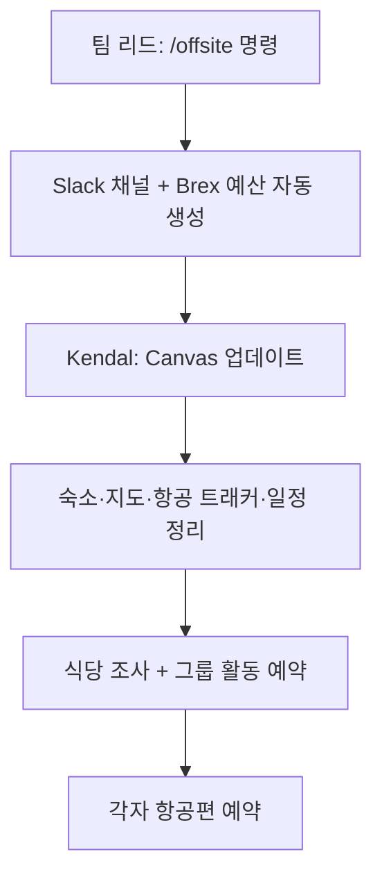

PostHog는 비동기 원격 근무가 기본이지만, 같은 공간에서의 대면 협업이 최고의 아이디어를 만든다는 점을 인정한다[^1]. 개인·가족 사정을 고려해 균형 잡힌 접근을 취한다[^2].

| 유형 | 빈도 | 1인당 예산 |
|------|------|-----------|
| 전사 오프사이트 | 연 1회[^3] | $3,000[^4] |
| 소규모 팀 오프사이트 | 연 1회[^3] | $2,000[^5] |
| 대면 온보딩 | 수시[^3] | 별도 |
| 자발적 동료 만남 | 자유[^3] | 개인 한도 |

## 전사 오프사이트

연 1회 전 세계 어딘가에서 일주일간 진행한다[^6]. 보통 일요일에 출발해 금요일에 돌아간다[^6]. 과거 개최지는 이탈리아, 포르투갈, 아이슬란드 등이다[^7]. 가능한 한 1인 1실을 보장한다[^8]. Ops & People 팀이 조직하며 예산은 1인당 최대 $3,000이다[^4].

### 일반적 아젠다

- 구조화된 사교 활동 2~3건[^9]
- 팀 디너[^9]
- 24시간 해커톤[^9]
- 전사 전략 세션 및 워크숍[^9]
- 전사 문화 활동[^9]
- 자유 탐험 시간[^9]

## 소규모 팀 오프사이트

소규모 팀은 연 1회 대면 모임을 권장한다[^10]. 전사 오프사이트와 적절히 분산하여 일정을 잡는다[^10]. 사교 행사로 기획하되, 가능한 한 많은 동료를 만나도록 최적화한다[^10].

### 장소 선택

SF의 Hogpatch 또는 London의 Hedge House를 기본 장소로 사용한다[^11]. 이유:

| 허브 장소 | 이점 |
|-----------|------|
| SF (Hogpatch) | 다른 팀 교류, YC 창업자 네트워킹, 테크 중심지 경험[^12] |
| London (Hedge House) | 다른 팀 교류, 교차 수분(cross-pollination) 극대화[^11] |

허브가 아닌 장소를 선택할 경우 Kendal에게 이유를 알린다[^13]. 신규 입사자에게는 허브 방문이 특히 유익하다[^14].

### 기획 절차

팀 리드가 Slack에서 `/offsite` 명령으로 오프사이트를 요청한다[^15]. 입력 항목: 팀 이름, 장소, 일정, 참석자, 참석 인원[^15].

자동으로 Slack 채널과 Brex 예산이 생성된다[^16]. SF/London 오프사이트는 해당 채널에 공지가 올라간다[^16].

Kendal이 팀 Canvas에 숙소 정보, 지도, 항공 트래커, 대략적 일정을 정리한다[^17]. 그룹 디너 장소를 조사하고 단체 활동을 예약한다[^18]. 필수 활동(360도 피드백, README 세션 등)은 Kendal이 일정에 포함하고, 나머지는 팀 리드가 채운다[^17]. 각 팀원은 자신의 항공편을 직접 예약한다[^19].

### 가이드라인

| 항목 | 내용 |
|------|------|
| 숙소 | 호텔보다 AirBnB 선호 — 팀 교류 시간 증가[^20] |
| 일정 | 분기 계획과 연동 추천[^21] |
| 참석 범위 | 필수 인원만 초대 — 'nice to have'는 제외[^22] |
| 합동 오프사이트 | 가능하나 인원이 많을수록 기획 부담 증가. 목적 명확히 할 것[^23] |
| 10명 초과 시 | Kendal 동행을 적극 고려 — 운영 전담자가 있으면 나머지가 업무에 집중 가능[^24] |
| 시간 명시 | 시작·종료 시각을 시 단위로 명확히[^25] |
| 사전 준비 | 아젠다와 목표를 출발 전에 수립. Figjam 등으로 기대 정렬[^26] |
| 세션 참여 | 각 세션 참석자를 명확히 지정. 해커톤은 전원 참여 원칙[^27] |
| 360도 피드백 | 필수. 대면이 가장 효과적[^28] |
| 예산 | 1인당 최대 $2,000. 절약 노력 필요 — 휴가가 아닌 업무 행사[^5] |
| 일정 팁 | 월요일 입국·금요일 출국으로 잡으면 예산 관리가 쉬움[^29] |
| 담당자 | 팀 내 1명 지정 (리드가 아니어도 됨), Ops & People 팀 지원[^30] |

> 360도 피드백은 조용한 환경(숙소에서 요리 또는 테이크아웃)이 시끄러운 식당보다 효과적일 수 있다 — 특히 포맷이나 피드백에 불안을 느끼는 사람에게[^31].

### 아젠다 아이디어

- 360도 피드백 세션 (필수!)[^32]
- README 세션 — "나는 누구인가 / 어떻게 일하면 좋은가"[^32]
- 계획 세션 — 다음 월/분기/연간 목표[^32]
- 팀 페이지 업데이트[^32]
- 독포딩(Dogfooding) — PostHog를 처음부터 설치해보며 불편한 점 찾기[^32]
- 해커톤 — 최소 2일 확보, 세션이 해킹을 방해하지 않도록[^32]
- 진행 중인 도전적 프로젝트 함께 작업 — 지식 교환 최적[^32]

> 온보딩 오프사이트에서는 해커톤을 진행하지 않는다. 해커톤 참여는 강하게 권장하되 의무는 아니다. 미참여자를 위한 작업 공간을 확보하고, 참여자는 전념해야 한다. 1인 팀은 금지한다[^33].

### 채용 면접 관련

채용 피크 시 오프사이트 기간에도 하루 최소 1시간을 후보자 면접에 할당하는 것을 권장한다. 상세는 #team-talent에 문의한다[^34].

## Hedge House

PostHog는 UK에 두 개의 Hedge House를 운영한다 — Cambridge(소규모)와 London(대규모)[^35]. 실제 주거 공간(침실 포함)으로, 소규모 팀 오프사이트, 대면 온보딩, 해커톤 등 내부 행사에 사용한다[^35]. SF의 Hogpatch와 함께 팀 오프사이트 및 [대면 온보딩](pages/54cd32b21f22.md)의 기본 장소다[^35].

| 거점 | 특징 | 예약 방법 |
|------|------|-----------|
| Cambridge | 소규모 | Kendal에게 메시지[^36] |
| London | Farringdon-Barbican 사이, 24시간 개방, 숙박 가능 | Hedge House London Slack 도구로 주소·방·데스크 예약 및 방문자 확인[^37] |

## London 호텔 추천

오프사이트·온보딩 시 London 숙박 추천 목록(#London Slack 채널 기반)[^38].

| 호텔 |
|------|
| Marrable's Farringdon |
| The Zetter Clerkenwell |
| Hotel Indigo Clerkenwell |
| Yotel London City |
| Z Hotel City |
| citizenM Tower of London |
| Clayton Hotel City of London |
| Hampton by Hilton Old Street |
| hub by Premier Inn Clerkenwell |
| Bob W Tower Hill Studios |
| Ruby Stella |

1박 £200 초과 시 대안을 찾는다 — 주중 London에서 ~£170/박이 달성 가능하다[^39]. 숙박비가 비싸면 날짜를 ±1일 조정해 항공+숙박 총비용을 최적화한다[^39].

## 출입국 안내

미국 등 비자(ESTA 등)가 필요한 국가 입국 시 유의사항[^40].

| 권장 표현 | 피할 표현 |
|-----------|-----------|
| "동료와 만남" / "비즈니스 미팅"[^41] | "온보딩"[^42] |
| "미국 IT 기업에 원격 근무, 며칠간 대면 미팅 후 귀국"[^43] | "트레이닝"[^44] |

핵심: 최소한으로 답하되 정직하게[^45]. 회사에 대해 추가 질문이 오면 사실대로 답한다[^45]. 전사 오프사이트는 "회사 모임(company gathering)"으로 설명한다[^44].

## 여행 보험

회사가 Embroker를 통해 여행 보험 및 일반·자동차 배상 보험을 운영한다[^46].

| 상황 | 조치 |
|------|------|
| 사고·응급 | 회사 카드로 비용 처리, 영수증 보관, Kendal에게 즉시 연락[^47] |
| 항공 지연·환승 불발 | 항공사에 숙박(식사 포함) 부담 요청 — 정중하게 요구하면 대부분 수용[^48] |

보험 청구는 policy binders 기반으로 진행한다[^49].

## 가족 동반 정책

오프사이트·온보딩 기간에는 가족·파트너 동반이 불가하다 — PostHog 업무에 집중해야 한다[^50]. 일정 전후로 휴가를 붙여 가족과 합류하는 것은 가능하다[^51]. 오프사이트 기간에는 혼자 숙박하며 팀원과의 시간에 집중한다[^52].

## 오프사이트 기획 체크리스트 (8주)

### 8주 전

- 일정 확정: 공휴일·학교 방학·다른 오프사이트와의 간격 고려[^53]
- 장소 선택: 접근성, 비자 난이도, 항공비 조사[^54]
- 팀 공지[^55]
- 오프사이트 Slack 채널 생성[^56]

### 7주 전

- 숙소 확보: 10명 이하 AirBnB 권장, 대규모는 호텔(회의실·식당·헬스장 포함)[^57]
- 항공편 예약 시작: 각자 회사 카드로 예약. 환불 가능 티켓 고려 — 20% 추가비는 합리적, 2배는 아님[^58]
- 초안 일정 작성: Google Calendar로 공유[^59]
- 정보 수집 폼 발송: 항공편, 의류 사이즈, 식이 제한, 방 공유 선호[^60]
- 기념품 브레인스토밍 (전사 오프사이트용): 티셔츠, 모자, 스카프, 노트, 스티커, 펜, 물병 등[^61]
- 미입사 참석자: Ops 팀에 연락하여 Google 계정 사전 생성, Brex 카드 발급, Slack 채널 게스트 추가[^62]

### 6주 전

예산 벤치마크[^63].

| 항목 | 기준 |
|------|------|
| 숙소 | $200/박/인 |
| 대륙 간 항공 | $1,000/인 |
| 대륙 내 항공 | $500/인 |
| 현지 교통 | $50/일/인 |
| 식비 | $50/일/인 |
| 예비비 | 총 예산의 10% |

- 교통 수단 예약[^64]
- 팀 외출 활동 확정 및 예약[^65]
- 항공편·정보 수집 폼 마감[^66]

### 5주 전

- 방 배정: 정보 수집 폼의 선호 기반[^67]
- 비자 확보[^68]
- 기념품 시안 확정[^69]
- 일정·예산 확정[^70]
- 세션 리더 및 기록자 지정 — 사후 후속 조치가 빠지기 쉬우므로 기록 담당 사전 결정이 중요[^71]

### 4주 전

- 식당 예약[^72]
- 남은 활동 예약[^73]
- 기념품 주문 — 생산·배송 지연 대비 여유 확보. 세관이 까다로운 목적지는 팀원 수하물로 운반 고려[^74]

### 3주 전

- 세션 계획/발표 자료 초안 제출[^75]
- 오프사이트 가이드 패키지 초안[^76]
- 시상식/어워드 디자인 및 인쇄[^77]

### 2주 전

- 세션 계획 검토 및 확정 — 기획자가 세션 리더와 직접 리뷰[^78]
- 캘린더 차단 + 팀 리마인더. 오프사이트 캘린더 일정을 "busy"로 설정하여 면접 등이 잡히지 않도록[^79]
- 필수 물품 담당자 지정: 포스트잇(저가 제품은 벽에서 떨어짐 주의), 마커, HDMI 케이블, Chromecast[^80]

### 1주 전

- 최종 점검: 전체 일정을 시각적으로 따라가며 누락 확인[^81]
- 팀에 최종 가이드 공개[^82]

### 전날

- Google Calendar에 보조 시간대 추가. 기본 시간대는 변경하지 않는다 — 면접 일정에 영향[^83]
- 기획자는 하루 먼저 도착 권장[^84]
- 현지 물품·식료품 구매[^85]
- 일정 인쇄물 준비[^86]
- "Careless Whispers" 봉투 만들기 — 팀원 간 짧은 메모를 교환하는 활동. 참석 못 하는 팀원 봉투도 만들 것[^87]

### 1주 후

- 사후 피드백 수집 (GitHub 이슈 또는 Google Form)[^88]

### 2주 후

- 피드백 정리 및 팀 공유[^89]
- 사후 회의 (선택)[^89]

> **참고:** 출장 항공·숙박·경비 기준은 [출장 정책](pages/cf888bc1a238.md), 경비 처리 방법은 [경비 지출 정책](pages/541dfd02bd51.md) 참고.

> **참고:** 대면 온보딩 절차와 Hedge House 온보딩 활용은 [온보딩 절차](pages/54cd32b21f22.md) 참고.

[^1]: 11-offsites.md, Offsites — "a very real upside to being in the same room"
[^2]: 11-offsites.md, Offsites — "We understand organizing travel can be a challenge when you have personal/family commitments to manage, so we try to take a balanced approach to meetups"
[^3]: 11-offsites.md, Offsites — "Once a year: all-company offsite"
[^4]: 11-offsites.md, All-company offsites — "we budget up to $3,000 per person in total for these."
[^5]: 11-offsites.md, Small team offsites — "The budget for these trips is up to $2,000 per person in total. We ask team members to use their best judgement for these and try to be thrifty where possible - these should be enjoyable, but not feel like a holiday."
[^6]: 11-offsites.md, All-company offsites — "Once a year, the entire company will get together somewhere in the world for a week. Usually we'll all fly on Sunday, have an opening dinner, spend the week doing a mix of hard work, strategy, culture and fun activities and we then all fly back home on Friday."
[^7]: 11-offsites.md, All-company offsites — "Our past offsites have been in Italy, Portugal and Iceland."
[^8]: 11-offsites.md, All-company offsites — "We try to ensure that everyone has their own bedroom."
[^9]: 11-offsites.md, All-company offsites, Typical agenda — "A couple of structured social events"
[^10]: 11-offsites.md, Small team offsites — "We want to try to encourage small teams to get together once each year. Ideally they are spaced appropriately through the year in relation to the all-company offsite."
[^11]: 11-offsites.md, Small team offsites — "in London should be the default choice, because:"
[^12]: 11-offsites.md, Small team offsites — "SF has the benefit of being the epicenter of everything happening in tech, and we have lots of YC founders working out of Hogpatch who you can meet and learn from."
[^13]: 11-offsites.md, Small team offsites — "If you do decide to do a small team offsite somewhere outside of these two hubs, let Kendal know why."
[^14]: 11-offsites.md, Small team offsites — "going to the hubs, especially for newer joiners, can be beneficial to you as an employee and to the company as a whole."
[^15]: 11-offsites.md, Small team offsites — "The team lead should request an offsite through slack using the '/offsite' command."
[^16]: 11-offsites.md, Small team offsites — "This will automatically create a Slack channel and Brex budget for all attendees. If the offsite is happening in London or San Francisco, it will also post an announcement in those channels"
[^17]: 11-offsites.md, Small team offsites — "Accommodation details and a handy map"
[^18]: 11-offsites.md, Small team offsites — "Look up dining options for a couple of group dinners"
[^19]: 11-offsites.md, Small team offsites — "Each team member is still responsible for booking their own flights."
[^20]: 11-offsites.md, Small team offsites — "We prefer AirBnBs over hotels, to give your team even more time to hang out, but this is not mandatory."
[^21]: 11-offsites.md, Small team offsites — "Quarterly planning is a great focal point for team offsites – it's worth scheduling your meetup for the week of planning."
[^22]: 11-offsites.md, Small team offsites — "Outside of your small team, you should only invite people who actually need to attend to make the offsite a success - if it would be 'nice to have' them attend, they shouldn't be going."
[^23]: 11-offsites.md, Small team offsites — "It can be useful to combine offsites but beware if you add too many people everything gets harder to arrange. There's no hard and fast rule here but the more people that are attending the more concrete you need to be on who is organising and why people are attending."
[^24]: 11-offsites.md, Small team offsites — "If the number of attendees is >10 actively consider if Kendal should be attending so there is a person attending whose only focus is making sure it goes well and everyone else can focus on the work of the offsite."
[^25]: 11-offsites.md, Small team offsites — "Specify offsite start and end times down to the hour, for clarity and efficient use of everyone's time."
[^26]: 11-offsites.md, Small team offsites — "make sure you make the most out of it by having an agenda and an idea of what you want to achieve _before_ the start of the trip. Also, it's a good idea to have an expectation-setting session (can be async in a Figjam)"
[^27]: 11-offsites.md, Small team offsites — "Make it very clear who is participating in each session. Sessions / activities require full participation from attendees, especially for the likes of a hackathon given it runs over multiple days."
[^28]: 11-offsites.md, Small team offsites — "It can feel uncomfortable doing these, but almost everyone who's done one at PostHog has come out feeling better and with a whole host of things they can improve. These are best in person."
[^29]: 11-offsites.md, Small team offsites — "Generally it's easier to hit budget if you have people travel in on a Monday and out on a Friday - they don't need to be as long as a whole team offsite."
[^30]: 11-offsites.md, Small team offsites — "You should assign someone on the small team to be responsible for planning the offsite (doesn't have to be the lead), and they will be supported by the Ops & People team to ensure a successful experience."
[^31]: 11-offsites.md, Small team offsites — "This can work better over a shared cooked meal or takeaway in the accommodation rather than a noisy restaurant, particularly for people who might be anxious about the format or the feedback."
[^32]: 11-offsites.md, Small team offsites, Ideas for the agenda — "360 degree feedback session (mandatory!)"
[^33]: 11-offsites.md, Small team offsites — "there should be no teams of one."
[^34]: 11-offsites.md, Small team offsites — "we do recommend any team member involved in the interview process to dedicate at least one hour block per day during the offsites to accommodate candidate interviews so that this does not delay the hiring process on your team while you're away."
[^35]: 11-offsites.md, Hedge House — "PostHog runs two Hedge Houses in the UK - a small one in Cambridge and a larger one in London. They are actual houses (yes, with a few bedrooms attached!) designed for small teams to run their offsites, host in-person onboardings, or come together for larger internal events like hackathons. Anyone at PostHog is welcome to use them as much as they like"
[^36]: 11-offsites.md, Cambridge — "to check availability or make a booking at the Cambridge Hedge House."
[^37]: 11-offsites.md, London — "slack tool to see the full address, book a room and/or desk, plus see who else will be there during the week you visit."
[^38]: 11-offsites.md, London hotel recommendations — "by folks who have stayed at these hotels."
[^39]: 11-offsites.md, London hotel recommendations — "If hotel prices are above £200 per night, it is worth quickly looking for alternatives as ~£170 per night should be achievable midweek in London. If prices are high, you should optimise travel for total cost (flights & accom) so if you can get cheaper flights or hotel by moving dates +/- 1 day, then look into these options."
[^40]: 11-offsites.md, Border Control — "you will be required to travel to places where some kind of visa is required"
[^41]: 11-offsites.md, Border Control — "start off with a high-level purpose of your trip"
[^42]: 11-offsites.md, Border Control — "avoid using PostHog terms like"
[^43]: 11-offsites.md, Border Control — "I work for a US tech company and I am based in [Insert your country] where I work remotely. I am here to do some in-person meetings with my colleagues for the next few days and I fly back on [insert date]"
[^44]: 11-offsites.md, Border Control — "it's best to describe this as a company gathering where you will be hanging out with colleagues for the week."
[^45]: 11-offsites.md, Border Control — "it is also usually advisable to only respond with a minimal amount, saying only what is necessary. If the agent asks for more details it's usually good to go into a bit more detail"
[^46]: 11-offsites.md, Travel insurance — "we carry travel insurance through as well as general & auto liability policies through our partner"
[^47]: 11-offsites.md, Travel insurance — "please cover any related expenses (ideally on your company card) and keep receipts, and then reach out to Kendal as soon as possible."
[^48]: 11-offsites.md, Flight delays — "push the airline to cover the cost of your accommodations (including meals). It's not uncommon for them to initially tell you they no longer offer free hotel rooms for delays that were caused by the airline, but with a little bit of polite coaxing, they will likely give in."
[^49]: 11-offsites.md, Travel insurance — "We will assist with making a claim based on our"
[^50]: 11-offsites.md, Partners / family joining offsites — "This is why we don't allow partners or family to join you for the dates that the offsite / onboarding takes place."
[^51]: 11-offsites.md, Partners / family joining offsites — "If timing allows it, you are able to tack holiday onto either side and for your partner/family to join you for those dates."
[^52]: 11-offsites.md, Partners / family joining offsites — "for the dates of the offsite, you should be staying alone and focusing on your time with your teammates."
[^53]: 11-offsites.md, How to plan an offsite in 8 weeks, 8 weeks out — "Try to avoid public holidays and be mindful of proximity to other offsites to minimize travel fatigue"
[^54]: 11-offsites.md, How to plan an offsite in 8 weeks, 8 weeks out — "Consider choosing a location that is relatively easy for most people to attend without having to travel outrageous distances or deal with difficult visa processes."
[^55]: 11-offsites.md, How to plan an offsite in 8 weeks, 8 weeks out — "Announce to team"
[^56]: 11-offsites.md, How to plan an offsite in 8 weeks, 8 weeks out — "Create an offsite Slack channel and invite team"
[^57]: 11-offsites.md, How to plan an offsite in 8 weeks, 7 weeks out — "We recommend booking a large Airbnb for teams under 10 people as this provides for a more casual atmosphere and can help control costs"
[^58]: 11-offsites.md, How to plan an offsite in 8 weeks, 7 weeks out — "Encourage folks to buy flights early and with the option to refund if they are unable to attend to save on costs. Use your judgement here - 20% or so is reasonable for the flexibility, but double the price is not really worth it."
[^59]: 11-offsites.md, How to plan an offsite in 8 weeks, 7 weeks out — "will allow you to flexibly move sessions around as you finalize the itinerary"
[^60]: 11-offsites.md, How to plan an offsite in 8 weeks, 7 weeks out — "Use this form to collect important information like flight details, clothing sizes for merch, dietary restriction, and preferences for things like sharing rooms"
[^61]: 11-offsites.md, How to plan an offsite in 8 weeks, 7 weeks out — "In the past, we've done shirts, hats, scarves, notebooks, stickers, pens, and water bottles"
[^62]: 11-offsites.md, How to plan an offsite in 8 weeks, 7 weeks out — "In the event that a new team member will be attending an offsite, but has not started yet, please contact the Ops team to help coordinate."
[^63]: 11-offsites.md, How to plan an offsite in 8 weeks, 6 weeks out — "Accommodations = $200/night/person"
[^64]: 11-offsites.md, How to plan an offsite in 8 weeks, 6 weeks out — "Book any group transportation like coaches or a rental car ahead of time"
[^65]: 11-offsites.md, How to plan an offsite in 8 weeks, 6 weeks out — "Finalize team outings and book as needed"
[^66]: 11-offsites.md, How to plan an offsite in 8 weeks, 6 weeks out — "Flights booking deadline"
[^67]: 11-offsites.md, How to plan an offsite in 8 weeks, 5 weeks out — "Using preferences from the info gathering form regarding sharing rooms, assign accordingly"
[^68]: 11-offsites.md, How to plan an offsite in 8 weeks, 5 weeks out — "Secure visas where necessary"
[^69]: 11-offsites.md, How to plan an offsite in 8 weeks, 5 weeks out — "Review and finalize merch proofs"
[^70]: 11-offsites.md, How to plan an offsite in 8 weeks, 5 weeks out — "Finalize itinerary"
[^71]: 11-offsites.md, How to plan an offsite in 8 weeks, 5 weeks out — "Decide in advance who is going to record the notes from each session"
[^72]: 11-offsites.md, How to plan an offsite in 8 weeks, 4 weeks out — "Reserve restaurants for communal meals"
[^73]: 11-offsites.md, How to plan an offsite in 8 weeks, 4 weeks out — "Book any remaining activities"
[^74]: 11-offsites.md, How to plan an offsite in 8 weeks, 4 weeks out — "Important to give yourself lots of lead time here, in case of production or shipping delays"
[^75]: 11-offsites.md, How to plan an offsite in 8 weeks, 3 weeks out — "Draft session plans/presentations due"
[^76]: 11-offsites.md, How to plan an offsite in 8 weeks, 3 weeks out — "offsite guide package"
[^77]: 11-offsites.md, How to plan an offsite in 8 weeks, 3 weeks out — "One activity we've found quite popular is giving out superlative awards to the team during the closing ceremonies"
[^78]: 11-offsites.md, How to plan an offsite in 8 weeks, 1 Week Out — "The offsite lead should do a final, thorough review of the full plan and finalize any outstanding details - visually walk through the entire schedule and see if anything is missing"
[^79]: 11-offsites.md, How to plan an offsite in 8 weeks, 1 Week Out — "Unveil the final offsite guide to the team"
[^80]: 11-offsites.md, How to plan an offsite in 8 weeks, 2 Weeks Out — "Block your calendar and send a reminder in Slack for other team members do the same, to avoid interviews and other meetings being booked during key sessions"
[^81]: 11-offsites.md, How to plan an offsite in 8 weeks, 2 Weeks Out — "At a minimum have post-it notes (don't skimp on cheap ones that fall off the wall), sharpies, a HDMI cable and / or a Chrome Cast."
[^82]: 11-offsites.md, How to plan an offsite in 8 weeks, 2 Weeks Out — "Review and finalize session plans/presentations"
[^83]: 11-offsites.md, How to plan an offsite in 8 weeks, 1 day before — "Add your new timezone as a secondary timezone in Google Calendar"
[^84]: 11-offsites.md, How to plan an offsite in 8 weeks, 1 day before — "We recommend that the offsite organizer consider arriving a day early to prep for the team's arrival"
[^85]: 11-offsites.md, How to plan an offsite in 8 weeks, 1 day before — "Shop for any miscellaneous supplies and groceries"
[^86]: 11-offsites.md, How to plan an offsite in 8 weeks, 1 day before — "Print and organize a few paper copies of the itinerary"
[^87]: 11-offsites.md, How to plan an offsite in 8 weeks, 1 day before — "This passive activity involves creating an envelope for every member of the team, posting them in a central location, and encouraging folks to write small notes to each other. These can be anything from retreat memories to compliments"
[^88]: 11-offsites.md, How to plan an offsite in 8 weeks, 1 week after — "you can also create a Google form to facilitate this"
[^89]: 11-offsites.md, How to plan an offsite in 8 weeks, 2 weeks after — "Compile post-mortem feedback and share with team"
