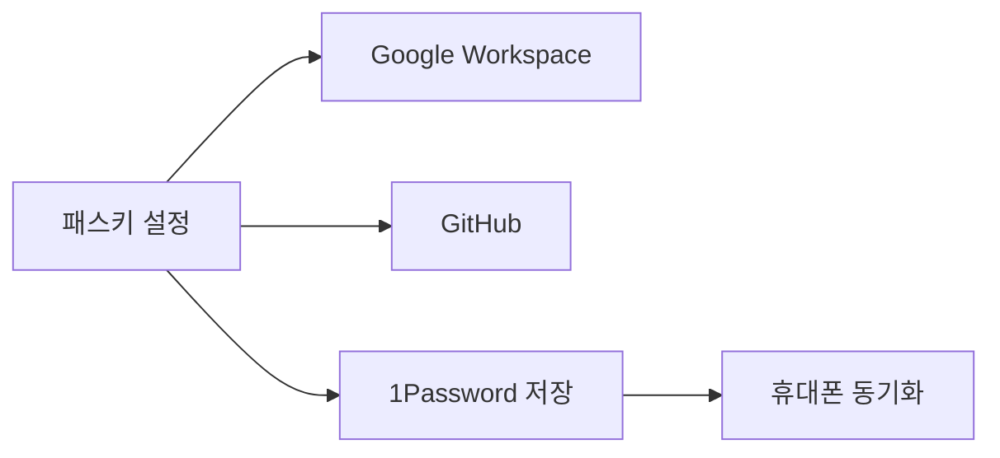

전사 보안 가이드라인을 정리한다. 모든 구성원이 반드시 따라야 하며, 미준수 시 회사 전체와 사용자에게 위험을 초래할 수 있다[^1].

## 다중 인증(MFA)

모든 구성원은 계정에 다중 인증(MFA)을 활성화해야 한다[^2]. **패스키(Passkey)가 권장 방식**이다 — 피싱에 강하고, 사용이 쉬우며, Google Workspace·GitHub·1Password·macOS 등 주요 서비스가 지원한다[^3].

| 항목 | 내용 |
|------|------|
| 필수 설정 대상 | Google Workspace, GitHub (최소) |
| 신규 입사자 기한 | 입사 첫 주 이내 |
| 패스키 저장 권장 위치 | 1Password (휴대폰에서도 사용 가능) |

### Yubikey 폐지

이전에는 Yubikey 2개를 구매·설정하도록 요구했으나, 패스키로 대체되어 더 이상 필요하지도 권장되지도 않는다[^4].

## 모바일 기기 관리(MDM)

[Fleet](https://fleetdm.com/)을 사용하여 전사 노트북을 관리한다[^5]. Fleet이 적용하는 정책은 다음과 같다:

| 정책 항목 | 설명 |
|-----------|------|
| 최소 비밀번호 길이 | 기기 비밀번호 기준 적용 |
| 화면 잠금 | 자동 화면 잠금 활성화 |
| 소프트웨어 업데이트 | 자동 설치 |
| 1Password 자동 프로비저닝 | 소프트웨어 자동 배포 |
| 정적 SSH 키 부재 확인 | 파일시스템에 정적 SSH 키 없음 |

Fleet은 공급망 공격 조사에도 활용된다 — 예를 들어, 악성 패키지나 브라우저 확장프로그램에 노출된 노트북을 확인할 수 있다[^6].

Fleet을 선택한 이유는 오픈소스이고 투명한 회사이기 때문이다[^7]. 프로비저닝하는 모든 정책은 git에 저장되어 있으며, 직원 누구나 macOS 메뉴바의 Fleet 아이콘에서 "My device"를 클릭하면 보안팀과 같은 데이터를 볼 수 있다[^8].

**Fleet이 보지 않는 것:**

- 화면
- 메시지 또는 사진
- 입력 내용(키 입력)
- 방문하는 URL[^9]

## 침투 테스트

매년 실시하며, 가장 최근 테스트는 2025년 5월에 수행되었다. 보고서는 Trust Center에서 확인할 수 있다[^10].

## 취약점 공개 및 신고

보안 취약점은 Bugcrowd 취약점 공개 프로그램(VDP)을 통해 또는 security-reports@posthog.com으로 신고할 수 있다. 유효한 취약점에 대해 PostHog 굿즈를 제공한다[^11].

## 피싱 신고

피싱 이메일·문자·WhatsApp을 수신한 경우, 스크린샷을 찍어 `#phishing-attempts` 채널에 게시한다. 추가 조사를 위해 security-internal@posthog.com으로 전달을 요청받을 수 있다[^12].

## 소셜 엔지니어링 방지

소셜 엔지니어링 공격에 대응하기 위한 모범 사례를 따른다[^13]. 모든 내부 소통은 Slack에서 이루어진다고 기대하며, 전화·SMS·WhatsApp은 요청·승인·민감 정보 전달에 **절대** 사용하지 않는다[^14]. Slack 외부에서 연락이 오면 검증 전까지 신뢰하지 않고, Slack으로 본인 확인 후 Slack에서만 대화를 이어간다[^15].

| 채널 | 신뢰 수준 |
|------|-----------|
| Slack | 기본 소통 채널 — 신뢰[^14] |
| 이메일 | `@posthog.com` 발신자만 신뢰, 유사 도메인·첨부파일·"긴급" 요청 주의[^16] |
| 전화·SMS·WhatsApp | 요청·승인·민감 정보에 절대 사용 안 함[^14] |

경영진(James, Tim 등)이 이메일·SMS·WhatsApp·전화로 송금·상품권·MFA 코드·접근 권한 변경을 요청하는 일은 없다 — 이런 요청은 피싱으로 간주하고 `#phishing-attempts`에 신고한다[^17].

> **참고:** 비동기 소통 원칙, Slack 에티켓, 채널 네이밍 등 전반적인 소통 가이드라인은 [커뮤니케이션 가이드](pages/1f096e55776a.md) 참고.

> **참고:** 데이터 보호 규정(GDPR, CCPA)과 고객 데이터 접근 정책은 [데이터 보호 컴플라이언스](pages/2c1213716122.md) 참고.

[^1]: 06-security.md, Overview — "It is critical that everyone in the PostHog team follows these guidelines. We take people not following these rules very seriously - it can put the entire company and all of our users at risk if you do not."
[^2]: 06-security.md, Multi-factor authentication — "All team members are required to enable multi-factor authentication (MFA) on their accounts."
[^3]: 06-security.md, Multi-factor authentication — "**Passkeys are the preferred method** for securing all accounts — they are phishing-resistant, easy to use, and supported by most major services including Google Workspace, GitHub, 1Password, and macOS."
[^4]: 06-security.md, Yubikeys — "These have been replaced with passkeys, and Yubikeys are no longer required nor recommended."
[^5]: 06-security.md, Mobile device management (MDM) — "We use [Fleet](https://fleetdm.com/) to manage all of our laptops."
[^6]: 06-security.md, Mobile device management (MDM) — "We also use Fleet to investigate supply chain attacks, for example to see whether any laptops have been exposed to a malicious package or browser extension."
[^7]: 06-security.md, Mobile device management (MDM) — "We chose Fleet because they are open source and a [transparent](https://fleetdm.com/better) company."
[^8]: 06-security.md, Mobile device management (MDM) — "Any employee can see the same data our security team sees by clicking the Fleet icon in the macOS menu bar and choosing "My device"."
[^9]: 06-security.md, Mobile device management (MDM) — "Fleet does not see:"
[^10]: 06-security.md, Pen tests — "We conduct these annually, most recently in May 2025"
[^11]: 06-security.md, Responsible disclosure — "Security vulnerabilities and other security related findings can be reported via our [vulnerability disclosure program](https://bugcrowd.com/engagements/posthog-vdp-pro) or by emailing security-reports@posthog.com. Valid findings will be rewarded with PostHog swag."
[^12]: 06-security.md, Reporting phishing — "If you receive a phishing email/text/whatsapp, it's useful to report it to the security team so that they can make other employees aware. Take a screenshot and post it in `#phishing-attempts`."
[^13]: 06-security.md, Secure communication — "We follow several best practices to combat social engineering attacks."
[^14]: 12-communication.md, Communication Methods — "Expect all communication to occur over Slack. Phone calls, SMS, and WhatsApp are **never** used for initiating requests, approvals, or asking for sensitive info."
[^15]: 12-communication.md, Communication Methods — "If someone contacts you outside of Slack, treat it as **untrusted until verified**. Message them on Slack to confirm, and only continue the conversation over Slack."
[^16]: 12-communication.md, Best practices — "Only trust `@posthog.com` senders. Verify via the company directory."
[^17]: 12-communication.md, Best practices — "James, Tim, and other execs will never ask for wire transfers, gift cards, MFA codes, or access changes over email/SMS/WhatsApp/phone. Treat such requests as phishing and report them to `#phishing-attempts`."
