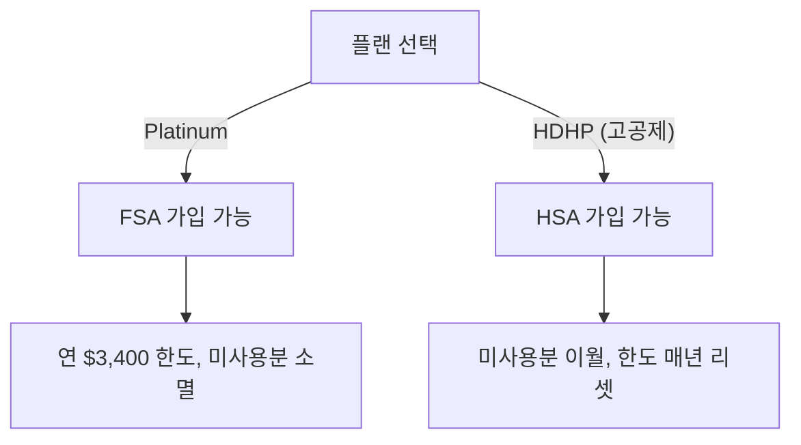

전 세계 분산 근무 체제에서 모든 구성원에게 동일한 혜택을 제공하려 하지만, 국가별 서비스 가용성과 규정에 따라 일부 차이가 있다[^1].

## 미국

### 401k

| 항목 | 내용 |
|------|------|
| 운용사 | Vestwell[^2] |
| 회사 매칭 | 최대 4%[^2] |

### 의료보험

BambooHR에서 가입하고 UnitedHealthcare(의료)와 Guardian(치과·시력)으로 관리한다[^3].

| 플랜 | 회사 부담 비율 |
|------|----------------|
| Platinum (구성원 본인) | 100%[^4] |
| Platinum (부양가족) | 75%[^4] |

#### FSA (유연 지출 계좌)

세전 소득에서 연 최대 $3,400를 적립해 본인 부담 의료비에 사용한다[^5]. 연말까지 미사용분은 회사로 반환된다[^5].

#### HSA (건강 저축 계좌)

고공제 플랜(HDHP) 선택 시 가입 가능하며, FSA보다 세제 혜택이 크다[^6]. 미사용 잔액은 다음 해로 이월되고 한도는 매년 리셋된다[^6].

#### 퇴직 후 의료보험

미국 구성원은 퇴직 시 근속 기간이나 퇴직금 기간과 무관하게, 퇴직일이 속한 달의 다음 달 말까지 회사가 의료보험료를 부담한다[^20]. 퇴직 절차 전반은 [퇴직(오프보딩) 절차](pages/2d0c4dd38694.md) 참고.

## 영국

### 연금

| 항목 | 내용 |
|------|------|
| 운용사 | Royal London[^7] |
| 구성원 기여 | 5%[^7] |
| 회사 기여 | 4%[^7] |
| 탈퇴 | 가능[^7] |
| 이전 | 수시 가능 (개인 연금 관리 희망 시)[^8] |

기여율 증액을 원하면 Parallel Employee 앱에서 요청한다[^9].

### 민간 의료보험

| 보험 | 제공사 | 비고 |
|------|--------|------|
| 의료 | Aviva (연 £100 공제)[^10] | 자녀 무료 포함[^11] |
| 치과·시력 | Medicash[^10] | 자녀 무료 포함[^11] |

두 보험 모두 과세 대상이며 개인소득공제(Personal Allowance)에 영향을 준다[^12]. 1개월 전 통보로 탈퇴할 수 있다[^12].

### 보육 지원 (Workplace Nursery Scheme)

세전 급여로 보육비를 납부해 최대 45%를 절약할 수 있다[^13]. 이용하려면 먼저 보육 시설이 제도에 참여하는지 확인한 뒤 Kendal에게 연락한다[^14].

### 자전거 지원 (Cyclescheme)

Cyclescheme을 통해 자전거 장비를 할인 구매할 수 있다[^15]. Workplace Extras 등록 양식에서 계정을 활성화한다[^15].

## 기타 국가

### 연금

Deel EOR 서비스로 고용된 국가에서는 법적 요건에 맞춰 연금을 기여한다[^16]. 계약직(contractor)에게는 현재 법적으로 연금을 제공할 수 없다[^17].

### 민간 의료보험

시장 관행상 민간 의료보험이 통상적인 국가에 제공한다[^18]. 아일랜드·스페인·네덜란드·포르투갈·캐나다는 Deel 플랫폼을 통해 가입하며, 보험사는 시장 상황에 따라 변경될 수 있다[^19].

## 고용 계약 및 급여일

### 고용 계약

PostHog는 미국·영국·독일에 사업체를 두고 있으며, 해당 국가 거주 시 직접 고용한다[^21a]. 그 외 국가에서는 Deel을 국제 고용주(EOR)로 활용한다[^21b]. 경우에 따라 독립 계약자(contractor)로 계약하며, Deel을 통해 월별 인보이스를 발행한다[^21c].

| 거주 국가 | 고용 형태 |
|-----------|-----------|
| 미국·영국·독일 | PostHog 또는 자회사 직접 고용[^21a] |
| 기타 | Deel EOR(기술적으로 Deel 소속이나 권리·혜택 동일)[^21b] |
| 일부 | 독립 계약자 — 세금 자기 부담[^21c] |

### 급여일

| 지역 | 급여 주기 |
|------|-----------|
| 영국·국제 계약자 | 매월 마지막 영업일 또는 그 전[^21d] |
| 미국 | 매월 15일 + 말일 (월 2회)[^21e] |
| Deel EOR | 매월 마지막 영업일[^21f] |

> **참고:** 급여·장비·휴가 등 공통 복지는 [복지 혜택 개요](pages/64f41068e524.md) 참고. 급여 구조와 리뷰 절차는 [보상 체계](pages/fc8ca051ed32.md) 참고.

[^21a]: 08-compensation.md, Contracts — "if you live in one of those countries, you will be directly employed by PostHog or the applicable subsidiary as an employee in one of our entities."
[^21b]: 08-compensation.md, Contracts — "we use [Deel](https://app.letsdeel.com/) as our international employer of record. This means you are technically employed by Deel on our behalf. This doesn't affect your rights or benefits."
[^21c]: 08-compensation.md, Contracts — "you may be an independent contractor, in which case you will invoice us monthly via Deel. Deel offers pretty much all countries and currencies. As a contractor, you will be responsible for your own taxes."
[^21d]: 08-compensation.md, Payroll — "In the UK and for international contractors, we run payroll monthly, on or before the last working day of the month."
[^21e]: 08-compensation.md, Payroll — "In the US, we run payroll twice a month, on the 15th and on the last day of the month."
[^21f]: 08-compensation.md, Payroll — "Deel runs payroll on the last working day of the month."
[^1]: 04-benefits.md, Country specific benefits — "With everyone being distributed across the world, we do our best to provide the same benefits to everyone, but they vary slightly by country depending on the services that are available and local regulations."
[^2]: 04-benefits.md, 401k contribution — "and we match up to 4%."
[^3]: 04-benefits.md, Health care — "for medical and"
[^4]: 04-benefits.md, Health care — "PostHog pays 100% of the premium of the Platinum plan for team members, and 75% for dependents."
[^5]: 04-benefits.md, Health care — "which is a tax-advantaged account that allows you to contribute pre-tax dollars up to $3,400 per year to be used on out-of-pocket medical expenses."
[^6]: 04-benefits.md, Health care — "that has further tax benefits beyond what the FSA provides. At the end of the year, any unused money rolls over and the contribution limit resets."
[^7]: 04-benefits.md, Pension — "Team members contribute 5% and PostHog contributes 4%, but you can opt out if you like."
[^8]: 04-benefits.md, Pension — "You can also transfer out of the plan as frequently as you want, in case you would rather manage your own private pension."
[^9]: 04-benefits.md, Pension — "If you wish to increase your own pension contributions, you can download the Parallel Employee benefits app and submit the request."
[^10]: 04-benefits.md, Private health insurance — "for private healthcare (£100 excess per policy year) and"
[^11]: 04-benefits.md, Private health insurance — "Children are included for free."
[^12]: 04-benefits.md, Private health insurance — "Both of these are taxable benefits which will affect your Personal Allowance each tax year, and you can opt out at any time with 1 month notice."
[^13]: 04-benefits.md, Nursery — "This enables you to pay for your children's nursery using your pre-tax salary, saving you up to 45% in nursery fees."
[^14]: 04-benefits.md, Nursery — "first check with your nursery that they are part of the scheme, then message Kendal to get this set up."
[^15]: 04-benefits.md, Cyclescheme — "to save money on new cycling gear."
[^16]: 04-benefits.md, Pensions — "In countries where you are employed under Deel's EOR service, we make pension contributions in line with legal requirements."
[^17]: 04-benefits.md, Pensions — "Unfortunately, we are currently legally unable to provide pensions to contractors."
[^18]: 04-benefits.md, Private health insurance — "We offer private health insurance in countries where it is considered market to do so."
[^19]: 04-benefits.md, Private health insurance — "For Ireland, Spain, Netherlands, Portugal & Canada the health insurer varies depending on market and offering via the Deel platform and can be subject to change."
[^20]: 05-offboarding.md, Final pay — "If you are a US team member, PostHog will continue covering healthcare costs through the end of the next calendar month after your termination, regardless of your tenure or severance length."
