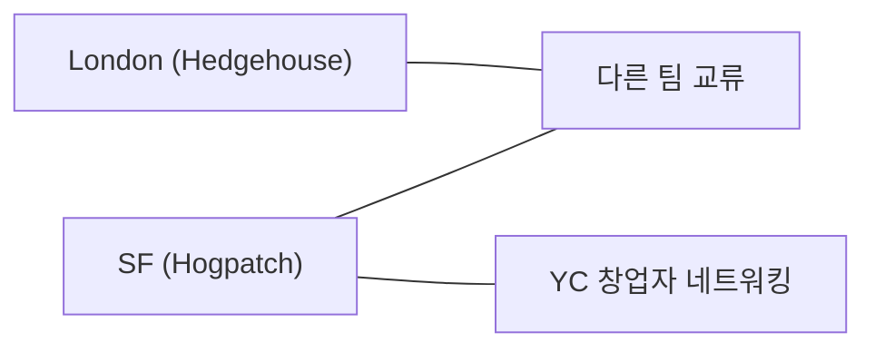

PostHog는 완전 원격 체제이지만 대면 협업을 적극 권장한다. 출장 경비는 이코노미 기준이며, 합리적인 판단에 따라 자율적으로 결정한다.

## 항공 및 이동

| 항목 | 기준 |
|------|------|
| 좌석 등급 | 이코노미 기본[^1] |
| 프리미엄 이코노미 | 출장이 잦고 비용이 합리적이면 가능, 특히 다음 날 근무 시[^2] |
| 비즈니스 클래스 | 원칙적으로 불가. 긴급·장거리 출장 시 #team-people-and-ops에 문의[^3] |
| 일정 유연성 | 출발·귀국일을 필요 일자 외로 잡아도 됨 — 유사 가격 또는 더 저렴할 경우[^4] |
| 취소 가능성 | 변경 가능 Flex 티켓 고려[^5] |

업그레이드 방법: Brex로 이코노미를 결제한 뒤 개인 포인트/카드로 업그레이드한다[^6].

## 국제 출장 필수 사항

| 항목 | 내용 |
|------|------|
| eSIM | Brex로 합리적인 eSIM 구매. 로밍비는 지원 안 함[^7] |
| 환전 | Brex 해외 결제 시 현지 통화 사용 (환율 유리)[^8] |
| 여행자 보험 | 구매 불필요 — 회사 국제 보험 적용[^9] |
| Global Entry 등 | 자주 출장 다니면 Brex로 가입 권장[^10] |

## 허브 방문 (SF · London)

SF(Hogpatch)와 London(Hedgehouse) 허브 방문을 강력 권장한다[^11]. 특히 SF는 테크 중심지로 YC 창업자들과 교류 기회가 있다[^12].

별도 출장 예산은 없으며 개인 한도($5,000/월)에서 사용한다[^13]. 방문 시에는 가치 있게 보내야 한다 — 컨퍼런스 참석, 이벤트 발표, 동료와 함께 특정 프로젝트 작업 등[^14].

## 동료와 만남

같은 장소에 있는 동료와 저녁 식사나 재미있는 활동 비용은 회사가 지원한다 — 같은 팀이 아니어도 된다[^15]. 팀원끼리 대면이 효과적인 업무가 있으면 오프사이트 외에도 자발적으로 만나는 것을 권장한다[^16]. SF/London에서 만나면 다른 PostHog 사람도 마주칠 수 있다[^17].

## 고객 미팅

고객(또는 잠재 고객) 방문 시 식사 자리를 마련한다[^18]. 사치스럽지 않되 고객 규모와 기대에 적절해야 한다[^18].

- 소규모 방문: 개인 예산 사용, 필요 시 Brex에서 증액 요청[^19]
- 대규모(전체 팀, 여러 날): #team-people-and-ops에서 Kendal에게 별도 예산 요청[^19]

## WeWork

회사 All Access 계정이 있다. Kendal에게 #team-people-and-ops에서 추가 요청한다[^20].

## 오프사이트 참가 시 유의사항

오프사이트에 참가하면 반드시 오프사이트 예산만 사용한다[^21]. 필요 일자 외의 추가 비용은 지원되지 않는다[^22].

> **참고:** 오프사이트 종류·예산·기획 절차·Hedge House 안내는 [오프사이트 정책](pages/6466ec527a71.md) 참고.

> **참고:** 경비 지출 원칙, 영수증 처리, 예산 구조는 [경비 지출 정책](pages/541dfd02bd51.md) 참고.

> **참고:** 오프사이트·코워킹 등 전체 복지 혜택은 [복지 혜택 개요](pages/64f41068e524.md) 참고.

[^1]: 09-spending-money.md, Travel — "We travel in economy by default and do not pay for business class"
[^2]: 09-spending-money.md, Travel — "It may be worth occasionally upgrading to Premium Economy if you're travelling a lot for work and the cost is not unreasonably high, particularly if you're working the next day"
[^3]: 09-spending-money.md, Travel — "we may pay for a nicer seat here, especially if you are traveling at very short notice or long haul. Ask on [#team-people-and-ops](https://posthog.slack.com/archives/C017WDX3BFZ) if you think this may apply to you."
[^4]: 09-spending-money.md, Travel — "It's fine to book your outbound / return flights for a different day to when you are required to be there as long as the flight is a similar price or less."
[^5]: 09-spending-money.md, Travel — "If you're unsure of your travel plans and believe you may have to cancel, it may be worth spending a bit extra to book flex tickets that allow a full refund to your Brex"
[^6]: 09-spending-money.md, Frequently asked questions — "Book an economy ticket using your Brex, then upgrade afterwards using your personal points/card."
[^7]: 09-spending-money.md, Travel — "use your Brex to expense a reasonable eSIM. PostHog does not cover roaming charges for your phone."
[^8]: 09-spending-money.md, Travel — "When using your Brex internationally, use the local currency since Brex generally offers a better exchange rate."
[^9]: 09-spending-money.md, Travel — "PostHog has international insurance for our work trips, so do not buy travel insurance when traveling on behalf of PostHog."
[^10]: 09-spending-money.md, Travel — "Consider signing up for programs like Global Entry if you are regularly traveling to countries that offer it, using your Brex"
[^11]: 09-spending-money.md, Hub travel budget — "We encourage people to visit our hubs in SF (Hogpatch) and London (Hedgehouse)."
[^12]: 09-spending-money.md, Hub travel budget — "SF also has the benefit of being the epicenter of everything happening in tech, and we have lots of YC founders working out of Hogpatch who you can meet and learn from."
[^13]: 09-spending-money.md, Hub travel budget — "There is no specific travel budget, this can come out of your general employee budget."
[^14]: 09-spending-money.md, Hub travel budget — "we ask that you make the trip worthwhile - attend a conference, speak at an event, gather a few colleagues to come with you at the same time and work on something specific together."
[^15]: 09-spending-money.md, Travel — "If you're in the same place as other team members, even if you aren't directly working together, PostHog will cover the cost of a dinner or a fun activity"
[^16]: 09-spending-money.md, Travel — "We strongly encourage team members to try and work together in person when practical."
[^17]: 09-spending-money.md, Travel — "You should default to doing this in SF/London, so you'll run into other PostHog people too."
[^18]: 09-spending-money.md, Travel — "When visiting customers (or potential customers), we should look for opportunities to connect with them over a meal."
[^19]: 09-spending-money.md, Travel — "For a normal customer visit (yourself or a couple of people), just use your personal budget and request an increase through Brex if you need more. If the visit grows into something offsite-like (the whole team, multiple days, etc.), post in [#team-people-and-ops](https://posthog.slack.com/archives/C017WDX3BFZ) and tag Kendal so she can create a separate budget for it."
[^20]: 09-spending-money.md, Frequently asked questions — "We have a company All Access account - ask [Kendal](https://posthog.com/community/profiles/28628) in [#team-people-and-ops](https://posthog.slack.com/archives/C017WDX3BFZ)."
[^21]: 09-spending-money.md, Budget structure on Brex — "Joining an offsite? _Only use the offsite budget_, not your User Limit"
[^22]: 09-spending-money.md, Travel — "Any other costs outside of the days you are required to be at an event are of course _not_ covered."
