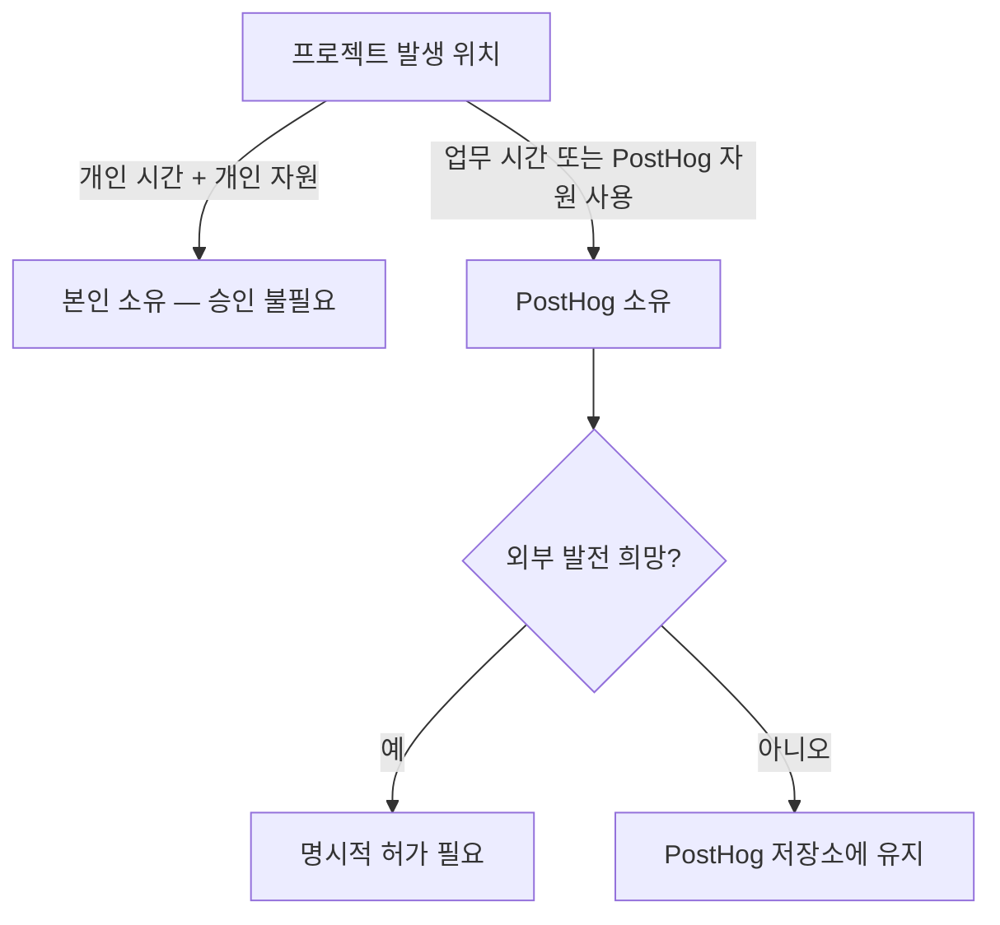

PostHog는 구성원의 개인 프로젝트와 부업을 허용하되, PostHog가 주된 업무여야 한다는 원칙을 둔다[^1]. 유급 부업도 가능하지만 PostHog를 단순 급여원으로 여기는 수준은 허용하지 않으며, 이 때문에 파트타임 근무도 제공하지 않는다[^2].

## 시간 관리 기준

부업의 적정성은 PostHog 업무에 미치는 영향과 투입 시간으로 판단한다[^3].

| 기준 | 내용 |
|------|------|
| 허용 시간 | 월 수 시간 수준의 유급 부업[^4] |
| 근무 시간 | 부업은 개인 시간에 수행하는 것이 원칙[^5] |
| 업무 영향 | PostHog 업무에 지장을 주지 않아야 함[^5] |

PostHog에서 기대 이상의 성과를 내고 자기 관리도 가능하다면, 유·무급 부업 모두 문제없다[^6]. 다만 일정 수준 이상의 시간·에너지 투입은 양립이 어렵다고 본다[^7].

## 부업의 전업 전환

부업을 장기적으로 전업으로 전환할 계획이 있다면, 사전에 회사에 알려야 한다[^8]. 회사는 구성원의 장기 목표 달성을 돕고 PostHog의 필요와 조율하는 방식을 선호한다[^9].

## 지적재산권(IP)

### 개인 시간에 만든 프로젝트

개인 시간에 개인 자원으로 만든 사이드 프로젝트의 IP는 본인에게 귀속되며, 별도 허가·검토·승인이 필요 없다[^10]. 다른 오픈소스 프로젝트에 기여하는 것도 마찬가지다[^11].

### PostHog에서 시작된 프로젝트

업무 시간, PostHog 코드·데이터·도구·인프라를 이용해 만들어진 프로젝트는 PostHog에 귀속되며 PostHog 저장소에 유지해야 한다[^12]. 이런 프로젝트를 외부에서 추가 개발하려면 명시적 허가가 필요하다[^13].

### 주의사항

PostHog의 비오픈소스 IP를 외부 프로젝트에 도입하면 심각한 법적 문제가 발생할 수 있다[^14]. MIT 라이선스가 명시된 자산만 사용할 수 있고 그 외는 사용 불가다[^15]. 경쟁 제품과 관련된 경우 Fraser에게 상담할 수 있다[^16].

## 승인 절차

부업을 시작하기 전에 소속 팀 담당 경영진(James, Tim, Charles 중 해당자)에게 확인을 받는다[^17]. 입사 전부터 존재하던 부업은 온보딩 과정에서 다룬다[^18].

> **참고:** 업무 시간 중 자기개발에는 별도 교육 예산이 있다. [교육 훈련 예산](pages/75759a021a75.md) 참고.

> **참고:** 오픈소스 포트폴리오·자율성 등 PostHog의 커리어 성장 지원 방식은 [커리어 성장](pages/b5f176c9b3e6.md) 참고.

[^1]: 02-side-gigs.md, Side gigs — "PostHog looks for passion in the people it hires."
[^2]: 02-side-gigs.md, Side gigs — "We are not ok with this being your main focus and PostHog being just a paycheck. Quite simply, we are too small for PostHog not to be your main motivation. For this reason, we also currently don't offer part time work as an option at PostHog."
[^3]: 02-side-gigs.md, Managing time — "The key distinction to something being a side gig, and thus it being appropriate, is its impact on your work and the amount of time involved."
[^4]: 02-side-gigs.md, Managing time — "A few hours a month on a paid side gig is acceptable."
[^5]: 02-side-gigs.md, Managing time — "side gigs should by default be something you work on in your personal time, and they should not impact the work you do at PostHog."
[^6]: 02-side-gigs.md, Managing time — "if you are going above and beyond for PostHog and you're still able to look after yourself properly, side gigs (whether paid or unpaid) are totally fine."
[^7]: 02-side-gigs.md, Managing time — "We don't think that's possible beyond a certain level of time/energy commitment to them, but we are very happy for you to spend a little time on them each week."
[^8]: 02-side-gigs.md, Managing time — "you may want your side gig to become your full time work one day. That is ok - please just let us know, so we can create a plan."
[^9]: 02-side-gigs.md, Managing time — "We know the key to motivated people is to help you achieve your long term goals, and to align this with what PostHog needs, whether or not you eventually achieve them with us."
[^10]: 02-side-gigs.md, Intellectual property — "Side projects built on your own time using your own resources do not require permission, review or approval from PostHog."
[^11]: 02-side-gigs.md, Intellectual property — "PostHog won't try to claim ownership of any intellectual property (IP) you create in your personal time, e.g. if you are contributing to another open source project as a hobby."
[^12]: 02-side-gigs.md, Projects that start at PostHog — "If a project is born from work you have done inside PostHog – that is, using work time, PostHog code, PostHog data, or other PostHog tools and infrastructure – these projects belong to PostHog and should live in PostHog repos."
[^13]: 02-side-gigs.md, Projects that start at PostHog — "If you want to develop these projects further on the side, you will need explicit permission."
[^14]: 02-side-gigs.md, Intellectual property — "you need to be _really_ careful that you do not introduce any of PostHog's non-open source IP into any project that you work on - this can cause serious legal headaches."
[^15]: 02-side-gigs.md, Intellectual property — "As a rule, anything from PostHog that is explicitly MIT-licensed is fine to use, anything else is not."
[^16]: 02-side-gigs.md, Projects that start at PostHog — "please talk to Fraser and he can help you figure out the best solution here, especially if what you are working on directly competes with something PostHog has built or is on our roadmap."
[^17]: 02-side-gigs.md, Getting signoff — "We ask you to please just check in with the relevant Exec team member for your team (ie. James, Tim, or Charles) to get their confirmation before going ahead with any side gigs."
[^18]: 02-side-gigs.md, Getting signoff — "If your side gig existed before you joined PostHog, this will usually be covered as part of the onboarding process."
