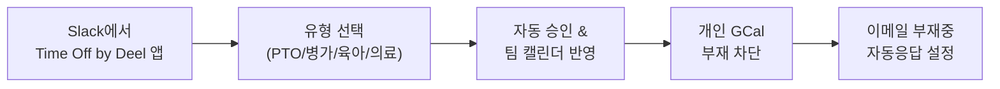

PostHog는 무제한 휴가를 제공하되, 연간 **최소 25일**(공휴일 포함)을 사용할 것을 기대한다[^1]. 25일은 최소선이지 가이드라인이 아니다[^2]. People & Ops팀이 사용 현황을 정기적으로 확인하고, 최소 일수를 채우지 못한 구성원에게 사용을 권장한다[^2].

## 무승인 휴가

결과가 중요하지 근무 시간이 중요한 것이 아니다[^3]. 매니저 승인 없이 휴가를 사용할 수 있다[^4]. 대신 팀과 조율해 부재 중에도 업무가 진행될 수 있도록 한다[^4].

피해야 할 상황:

| 상황 | 이유 |
|------|------|
| 소규모 팀(Small Team) 전원 부재 | 고객 지원 불가[^5] |
| 핵심 업무 담당자 전원 부재 | 긴급 대응 불가 — 불가피하면 1명은 체크인 가능해야 함[^6] |

## Time Off by Deel로 예약하기

### 사전 설정

- Slack에서 Time Off by Deel 앱에 Google Calendar 연동을 승인한다[^7]
- [팀 휴가 캘린더](https://calendar.google.com/calendar/u/0/r?cid=c_52c05ff56171856873941d8a4e612c7d5dc317504b7533b0d22207480bc85763@group.calendar.google.com)를 구독한다[^7]

### 휴가 유형

| 유형 | 설명 |
|------|------|
| PTO | 휴가·기타 개인 사유 — 가장 일반적[^8] |
| Out Sick | 예기치 않은 질병으로 인한 부재[^8] |
| Parental Leave | 육아휴직[^8] |
| Medical Leave | 본인의 의료 사유에 의한 계획된 부재. 가족 돌봄은 PTO[^8] |

> **주의:** deel.com에서 직접 예약하면 Slack과 동기화되지 않아 팀이 부재를 알 수 없다[^9]. 반드시 Slack 앱에서 예약한다.

### 추가 조치

- 개인 Google Calendar에 부재 일정을 별도로 차단한다. Time Off by Deel은 종일 일정만 생성하므로, 차단하지 않으면 인터뷰·데모 등이 자동 예약될 수 있다[^10]
- 이메일에 부재중 자동응답을 설정하고, 팀 동료나 hey@posthog.com으로 안내한다. Slack 상태와 자동응답은 앱이 자동 처리한다[^11]

> **공휴일도 직접 예약한다.** 전 세계에 팀이 분산되어 있어 자동 등록이 불가하다. Time Off by Deel의 Bulk Add by Region 기능을 활용하면 빠르게 등록할 수 있다[^12].

### 휴가 취소

휴가를 취소하려면 `#team-people-and-ops` 채널에 메시지를 남긴다. 관리자만 삭제할 수 있다[^13].

## 유연근무

근무 시간을 세거나 출퇴근을 관리하지 않는다[^14]. 병원 방문, 등하교, 조기 퇴근 등은 자유롭게 조절하되 캘린더에 표시한다[^15]. 고객 대면 역할(support hero 등)이라면 대체 인력을 확보한다[^15].

## 병가

### 단기 병가

질병 시 유급 병가가 제공된다. 상한은 계약서에 국가별로 명시되어 있다[^16]. 하루 이틀 정도라면 바로 쉬면 된다[^16].

가능한 빨리 매니저에게 알리고 Time Off by Deel에 등록한다[^17]. 미리 여러 날을 예약하지 않는다 — 실제 아픈 날만 등록하고 필요하면 추가한다[^18].

### 장기 병가(5영업일 이상)

5영업일 이상 또는 국가/주 법정 한도를 초과하면 Fraser에게 연락해 계획을 세운다[^19]. 대부분 국가에서 의사 소견서가 필요하다[^19].

정기적으로 업무에 지장을 줄 수 있는 지병이 있으면 Fraser에게 미리 알려 매니저와 편의를 조율한다[^20].

## 사별 휴가

"가까운 관계"를 정의하거나 관계에 대해 질문하지 않는다[^21]. 필요한 기간을 미리 알려주면 된다[^21].

임신·자녀 상실(양쪽 부모 모두)에도 동일하게 적용되며 최소 2주 유급 휴가가 제공된다[^22]. 신체적·정신적 건강 사유로 연장이 필요하면 장기 병가로 전환할 수 있다[^23].

## 배심원 의무·투표·돌봄 등 생활 사유

생활이 우선이다[^24]. 팀과 소통하고 상황에 맞춰 업무를 조절한다[^24].

배심원 소환장을 받으면 Fraser에게 즉시 알린다 — 충분한 사전 통보가 있으면 면제를 받을 수 있는 경우가 많다[^25].

> **참고:** 육아휴직 정책은 [육아휴직](pages/177011e0ae2c.md) 참고.

> **참고:** 무제한 휴가·장비·오프사이트 등 전체 복지는 [복지 혜택 개요](pages/64f41068e524.md) 참고.

[^1]: 07-time-off.md, Time off — "We offer our team unlimited time off, but with an expectation that you take _at least 25 days off a year_, including national holidays."
[^2]: 07-time-off.md, Time off — "The People & Ops team will look into holiday usage occasionally to encourage people who haven't taken the minimum time off to do so. The 25 days is a minimum, not a guide."
[^3]: 07-time-off.md, Permissionless time off — "We care about your results, not how long you work."
[^4]: 07-time-off.md, Permissionless time off — "You do not need to get approval for time off from your manager. Instead, we expect everyone to coordinate with their team to make sure that we're still able to move forwards in your absence."
[^5]: 07-time-off.md, Permissionless time off — "Having an entire Small Team off - this means we can't provide support to customers"
[^6]: 07-time-off.md, Permissionless time off — "Having the only X people who can do some totally critical task at PostHog off - if this is unavoidable, try to make sure one of you can at least check in if something goes horribly wrong"
[^7]: 07-time-off.md, How to book time off in Time Off by Deel — "You have authorized the Time Off by Deel app in Slack to connect to your Google Calendar"
[^8]: 07-time-off.md, How to book time off in Time Off by Deel — "There are four types of time off you can select"
[^9]: 07-time-off.md, How to book time off in Time Off by Deel — "Do not book directly on deel.com as it does not sync with Slack, and the team will not know you are out."
[^10]: 07-time-off.md, How to book time off in Time Off by Deel — "Block out your own personal GCal to show that you are out. This is because Time Off by Deel _only_ books in an all day event in your calendar to show that you are out."
[^11]: 07-time-off.md, How to book time off in Time Off by Deel — "Set an out of office message on your email and have it point to someone else on the team, or hey@posthog.com."
[^12]: 07-time-off.md, How to book time off in Time Off by Deel — "Please manually book in public holidays you plan to take off as well. We have team members working in countries all over the world, so it is not practical for us to book these all in on your behalf."
[^13]: 07-time-off.md, How to cancel time off — "drop a message in #team-people-and-ops and a member of the team will cancel the holiday for you, as only admins can delete holidays."
[^14]: 07-time-off.md, Flexible working — "We operate on a trust basis and we don't count hours or days worked."
[^15]: 07-time-off.md, Flexible working — "Whether you have an appointment with your doctor, school run with your kids, or you want to finish an hour early to meet friends or family - we don't mind and you don't need to tell us. Please just add it to your calendar"
[^16]: 07-time-off.md, You are sick — "If you are sick, you don't need to work and you will be paid - the upper limit for paid sick leave for your country will be specified in your contract."
[^17]: 07-time-off.md, You are sick — "Please let your manager know if you need to take off due to illness as soon as you are able to and add it to Time Off by Deel."
[^18]: 07-time-off.md, You are sick — "You shouldn't pre-emptively book a bunch of days off sick, as you can't know how long you will actually be sick for and you may trigger the need for a doctor's note"
[^19]: 07-time-off.md, You are sick — "please speak to Fraser so we can work out a plan. In most countries, we will need a doctor's note from you."
[^20]: 07-time-off.md, You are sick — "If you have a medical condition you know will take you away from work regularly, please let Fraser know so we can work out accommodations with you and your manager."
[^21]: 07-time-off.md, Bereavements / Child loss — "Please just let us know up front how much time you would like to take."
[^22]: 07-time-off.md, Bereavements / Child loss — "Our bereavement policy also covers pregnancy and child loss for both parents, with no questions asked. Please take at least 2 weeks of paid leave."
[^23]: 07-time-off.md, Bereavements / Child loss — "If you need extended time for physical or mental health reasons, we will treat it as extended sick leave - just chat to Fraser."
[^24]: 07-time-off.md, Jury duty / voting / childcare disasters, aka 'life stuff' — "There are lots of situations where life needs to come first. Please let it - just be communicative with your team and fit your work around it as you need."
[^25]: 07-time-off.md, Jury duty / voting / childcare disasters, aka 'life stuff' — "If you are summonsed for jury duty, please let Fraser know right away - we can often get an exception granted if we have enough notice."
