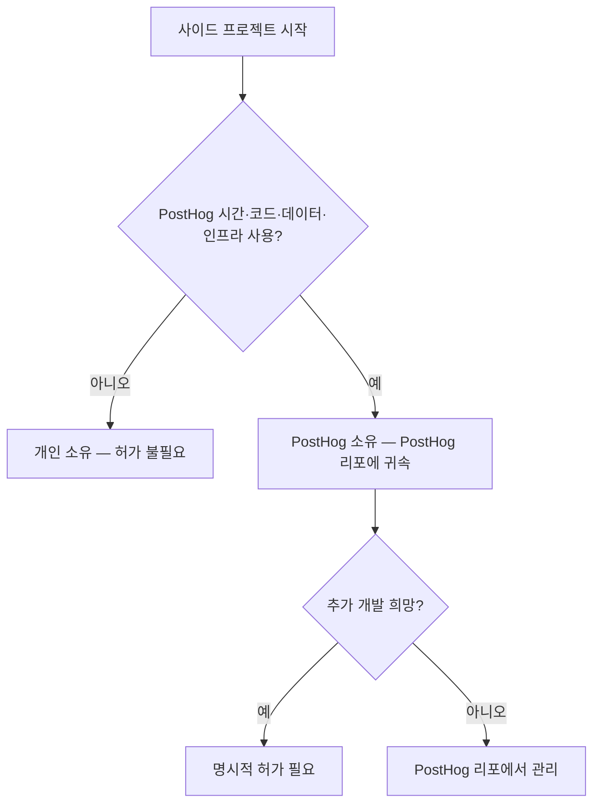

PostHog는 열정 있는 사람을 채용하며, 사이드 프로젝트를 긍정적으로 본다[^1]. 유급 부업도 허용하지만 PostHog가 주된 동기여야 하며, 부업이 본업이 되어서는 안 된다[^2]. 이런 이유로 파트타임 근무는 제공하지 않는다[^3].

## 시간 관리

부업에 쓰는 시간과 업무 영향이 핵심 기준이다[^4].

| 항목 | 기준 |
|------|------|
| 허용 시간 | 월 수 시간 수준의 유급 부업[^5] |
| 근무 시간 | 개인 시간에 수행이 기본[^6] |
| 업무 영향 | PostHog 업무에 영향을 주면 안 됨[^7] |
| 전업 전환 | 가능 — 사전에 알려서 계획을 함께 세운다[^8] |

PostHog에서 기대 이상의 성과를 내고 자기 관리도 잘 하고 있다면, 유·무급 부업 모두 괜찮다[^9]. 다만 일정 수준 이상의 시간·에너지 투입과 양립하기는 어렵다고 본다[^10].

## 지적재산권(IP)

개인 시간에 개인 자원으로 만든 결과물은 본인 소유다. 별도 허가·검토·승인이 필요 없다[^11]. 단, PostHog의 비공개 IP를 외부 프로젝트에 반입하면 심각한 법적 문제가 생긴다[^12]. MIT 라이선스로 명시된 PostHog 코드만 사용할 수 있다[^13].

### PostHog에서 시작된 프로젝트

업무 시간, PostHog 코드·데이터·인프라를 사용해 만든 프로젝트는 PostHog 소유이며 PostHog 리포에 있어야 한다[^14]. 이를 부업으로 발전시키려면 명시적 허가가 필요하다[^15]. 판단이 어려우면 Fraser에게 상담할 수 있으며, 특히 PostHog 제품이나 로드맵과 경쟁하는 경우 반드시 상의한다[^16].

## 사전 승인 절차

부업을 시작하기 전에 소속 팀 담당 경영진(James, Tim, Charles 중 해당자)에게 확인을 받는다[^17]. 입사 전부터 있던 부업은 온보딩 과정에서 처리된다[^18].

> **참고:** 업무 시간 중 교육·컨퍼런스 참가는 [교육 및 자기계발 지원](pages/f3947718bb92.md) 참고.

[^1]: 02-side-gigs.md, Side gigs — "PostHog looks for passion in the people it hires. This often correlates with people who have side projects as a hobby."
[^2]: 02-side-gigs.md, Side gigs — "We are not ok with this being your main focus and PostHog being just a paycheck."
[^3]: 02-side-gigs.md, Side gigs — "we also currently don't offer part time work as an option at PostHog."
[^4]: 02-side-gigs.md, Managing time — "The key distinction to something being a side gig, and thus it being appropriate, is its impact on your work and the amount of time involved."
[^5]: 02-side-gigs.md, Managing time — "A few hours a month on a paid side gig is acceptable."
[^6]: 02-side-gigs.md, Managing time — "side gigs should by default be something you work on in your personal time"
[^7]: 02-side-gigs.md, Managing time — "they should not impact the work you do at PostHog."
[^8]: 02-side-gigs.md, Managing time — "you may want your side gig to become your full time work one day. That is ok - please just let us know, so we can create a plan."
[^9]: 02-side-gigs.md, Managing time — "if you are going above and beyond for PostHog and you're still able to look after yourself properly, side gigs (whether paid or unpaid) are totally fine."
[^10]: 02-side-gigs.md, Managing time — "We don't think that's possible beyond a certain level of time/energy commitment to them"
[^11]: 02-side-gigs.md, Intellectual property — "Side projects built on your own time using your own resources do not require permission, review or approval from PostHog."
[^12]: 02-side-gigs.md, Intellectual property — "you need to be _really_ careful that you do not introduce any of PostHog's non-open source IP into any project that you work on - this can cause serious legal headaches."
[^13]: 02-side-gigs.md, Intellectual property — "anything from PostHog that is explicitly MIT-licensed is fine to use, anything else is not."
[^14]: 02-side-gigs.md, Projects that start at PostHog — "If a project is born from work you have done inside PostHog – that is, using work time, PostHog code, PostHog data, or other PostHog tools and infrastructure – these projects belong to PostHog and should live in PostHog repos."
[^15]: 02-side-gigs.md, Projects that start at PostHog — "If you want to develop these projects further on the side, you will need explicit permission."
[^16]: 02-side-gigs.md, Projects that start at PostHog — "please talk to Fraser and he can help you figure out the best solution here, especially if what you are working on directly competes with something PostHog has built or is on our roadmap."
[^17]: 02-side-gigs.md, Getting signoff — "We ask you to please just check in with the relevant Exec team member for your team (ie. James, Tim, or Charles) to get their confirmation before going ahead with any side gigs."
[^18]: 02-side-gigs.md, Getting signoff — "If your side gig existed before you joined PostHog, this will usually be covered as part of the onboarding process."