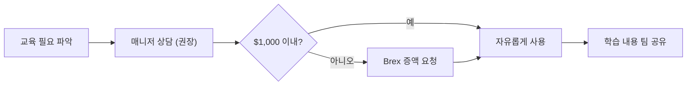

PostHog는 팀원의 성장이 회사의 성장이라는 원칙 아래, 도서 구매·교육 과정·컨퍼런스 참가를 지원한다[^1].

## 도서 지원

모든 팀원은 업무 관련 도서를 구매할 수 있다[^2]. 월 $50까지는 별도 승인 없이 사용 가능하다[^3].

| 항목 | 내용 |
|------|------|
| 대상 | 전 팀원 |
| 월 한도 | $50 (승인 불필요) |
| 월 권수 | 약 2권 |
| 형태 | 종이책, 오디오북, 팟캐스트 포함[^4] |
| 분야 제한 | 업무와 느슨하게 관련되면 됨[^5] |

도서는 직무와 직접 관련될 필요가 없다. 예를 들어 리더 전기는 매니저에게, 디자인 서적은 엔지니어에게 가치가 있다[^6]. 사내 북클럽(BookHog)용 도서에도 예산을 사용할 수 있다[^7].

## 교육 예산

모든 팀원에게 직급과 무관하게 연간 교육 예산이 주어진다[^8].

| 항목 | 내용 |
|------|------|
| 연간 기본 한도 | $1,000 (역년 기준) |
| 초과 사용 | Brex에서 증액 요청 시 대체로 승인됨[^9] |
| 승인 절차 | 불필요 (매니저 사전 상담 권장)[^10] |
| 사용처 | 강좌, 교육, 자격증, 컨퍼런스[^11] |

비기술 팀원에게는 기초 프로그래밍 과정 수강을 강력 권장한다[^12]. Codecademy에서 Python, React 등을 배울 수 있다[^13].

## 컨퍼런스

교육 예산으로 컨퍼런스 참가뿐 아니라 발표·코칭 활동도 지원한다[^14]. 월 최대 반나절까지 이런 활동에 시간을 쓸 수 있으며, 이 역시 엄격한 상한은 아니다[^15]. 초과가 필요하면 매니저와 상의한다[^16].

[^1]: 01-training.md, Training — "The better you are at your job, the better PostHog is overall!"
[^2]: 01-training.md, Books — "*Everyone* at PostHog is eligible to buy books to help you in your job."
[^3]: 01-training.md, Books — "spending up to $50/month on books is fine and requires no extra permission"
[^4]: 01-training.md, Books — "You can use your books budget towards audiobooks and podcasts as well, if you prefer."
[^5]: 01-training.md, Books — "Books do not have to be tied directly to your area, and they only need be loosely relevant to your work."
[^6]: 01-training.md, Books — "biographies of leaders can help a manager to learn, and can in fact be more valuable than a tactical book on management. Likewise, if you're an engineer, a book on design can also be particularly valuable for you to read."
[^7]: 01-training.md, Books — "we host a monthly book club called BookHog, and the budget can be used for those books as well."
[^8]: 01-training.md, Training budget — "We have an annual training budget for every team member, regardless of seniority."
[^9]: 01-training.md, Training budget — "if you want to spend in excess of this, request an increase to your budget in Brex and it should usually be granted."
[^10]: 01-training.md, Training budget — "You do not need approval to spend your budget, but you might want to speak to your manager first, in case they have some useful feedback or pointers to a better idea."
[^11]: 01-training.md, Training budget — "The budget can be used for relevant courses, training, formal qualifications, or attending conferences."
[^12]: 01-training.md, Training budget — "We strongly encourage all non-technical team members to take some kind of entry level programming course"
[^13]: 01-training.md, Training budget — "[Codecademy](https://www.codecademy.com/) is a good place to start and they cover many of the technologies we use, such as Python and React."
[^14]: 01-training.md, Conferences — "You can use your training budget for time spent talking at conferences and user groups, including coaching others."
[^15]: 01-training.md, Conferences — "It is expected that you would spend up to half a day a month on these activities. Like the training budget, this isn't a hard limit."
[^16]: 01-training.md, Conferences — "If you think you need more than that talk to your manager in the first instance."

> **참고:** 개인 시간에 하는 유급 부업·사이드 프로젝트는 [부업(Side Gig) 정책](pages/634d3196e245.md) 참고.
