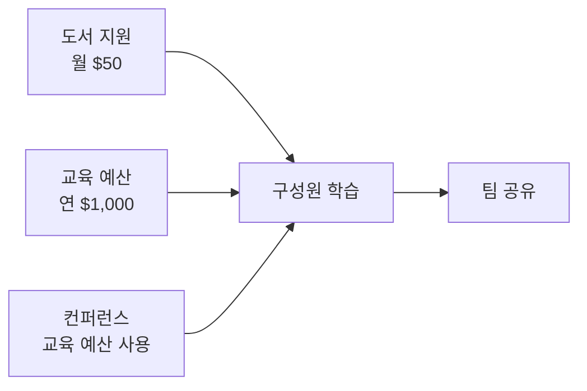

PostHog는 구성원의 역량 성장을 적극 지원한다. 도서 구매, 교육 과정 수강, 컨퍼런스 참가에 사용할 수 있는 예산이 별도로 마련되어 있으며, 사전 승인 없이 자율적으로 사용할 수 있다[^1][^2].

## 도서 지원

모든 구성원은 업무에 도움이 되는 도서를 구매할 수 있다[^3]. 오디오북과 팟캐스트도 도서 예산으로 구매 가능하다[^4].

| 항목 | 내용 |
|------|------|
| 월 예산 | $50 이내 별도 승인 불필요[^5] |
| 구매 빈도 | 월 2권 이내 자유 구매[^6] |
| 대상 범위 | 업무와 느슨하게 관련되면 됨 — 직무 외 분야도 가능[^7] |
| 사용처 | 종이책, 오디오북, 팟캐스트[^4] |

도서는 담당 업무와 직결되지 않아도 된다. 예컨대 매니저가 리더십 전기를 읽거나, 엔지니어가 디자인 서적을 읽는 것도 권장된다[^7]. 월간 북클럽 **BookHog**에서 다루는 도서도 이 예산으로 구매할 수 있다[^8].

## 교육 예산

모든 구성원에게 연간 교육 예산이 주어진다[^2]. 직급과 무관하다[^2].

| 항목 | 내용 |
|------|------|
| 연간 기본 한도 | $1,000 (역년 기준)[^9] |
| 초과 사용 | Brex에서 증액 요청 — 통상 승인됨[^10] |
| 사용 범위 | 강좌, 교육, 자격증, 컨퍼런스[^2] |
| 사전 승인 | 불필요 (매니저 상의 권장)[^1] |

비기술직 구성원에게는 기초 프로그래밍 과정 수강을 강력히 권장한다[^11]. Codecademy가 추천 플랫폼이며 Python, React 등 사내 기술 스택을 다룬다[^12]. 학습 후에는 팀과 결과를 공유하는 것이 좋다[^13].

## 컨퍼런스

교육 예산은 컨퍼런스 발표, 사용자 모임, 코칭 활동에도 사용할 수 있다[^14]. 이런 활동에 월 반나절까지 쓰는 것이 기대 수준이며, 역시 엄격한 상한은 아니다[^15]. 더 많은 시간이 필요하면 매니저와 먼저 상의한다[^16].

[^1]: 01-training.md, Training budget — "You do not need approval to spend your budget, but you might want to speak to your manager first"
[^2]: 01-training.md, Training budget — "We have an annual training budget for every team member, regardless of seniority"
[^3]: 01-training.md, Books — "*Everyone* at PostHog is eligible to buy books to help you in your job"
[^4]: 01-training.md, Books — "You can use your books budget towards audiobooks and podcasts as well"
[^5]: 01-training.md, Books — "spending up to $50/month on books is fine and requires no extra permission"
[^6]: 01-training.md, Books — "You may buy a couple of books a month without asking for permission"
[^7]: 01-training.md, Books — "biographies of leaders can help a manager to learn, and can in fact be more valuable than a tactical book on management. Likewise, if you're an engineer, a book on design can also be particularly valuable"
[^8]: 01-training.md, Books — "we host a monthly book club called BookHog, and the budget can be used for those books as well"
[^9]: 01-training.md, Training budget — "The training budget is $1000 per calendar year"
[^10]: 01-training.md, Training budget — "if you want to spend in excess of this, request an increase to your budget in Brex and it should usually be granted"
[^11]: 01-training.md, Training budget — "We strongly encourage all non-technical team members to take some kind of entry level programming course"
[^12]: 01-training.md, Training budget — "[Codecademy](https://www.codecademy.com/) is a good place to start and they cover many of the technologies we use, such as Python and React"
[^13]: 01-training.md, Training budget — "If possible, please share your learnings with the team afterwards!"
[^14]: 01-training.md, Conferences — "You can use your training budget for time spent talking at conferences and user groups, including coaching others"
[^15]: 01-training.md, Conferences — "It is expected that you would spend up to half a day a month on these activities. Like the training budget, this isn't a hard limit"
[^16]: 01-training.md, Conferences — "If you think you need more than that talk to your manager in the first instance"
