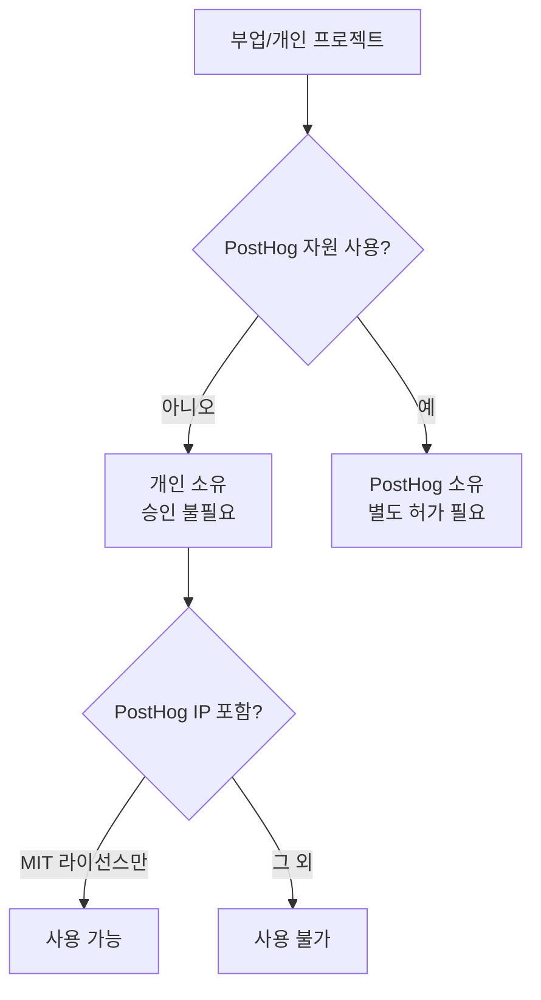

PostHog는 구성원이 개인 프로젝트나 부업(side gig)을 갖는 것을 허용한다[^1]. 다만 PostHog가 주된 업무이자 동기여야 하며, 부업이 본업에 영향을 주어서는 안 된다[^2]. 이런 이유로 파트타임 근무는 현재 제공하지 않는다[^3].

## 시간 관리

부업에 쓰는 시간이 핵심 기준이다. 월 몇 시간 수준의 유급 부업은 허용된다[^4]. 부업은 기본적으로 개인 시간에 하며, PostHog 업무에 영향을 주지 않아야 한다[^5].

| 기준 | 내용 |
|------|------|
| 허용 수준 | 월 몇 시간의 유급 부업[^4] |
| 수행 시간 | 개인 시간 (업무 시간 외)[^5] |
| 본업 영향 | 불가 — PostHog 업무에 영향 없어야 함[^5] |
| 파트타임 전환 | 현재 미제공[^3] |

부업을 장기적으로 본업으로 전환하고 싶다면 미리 알려 달라[^6]. PostHog는 구성원의 장기 목표 달성을 돕고 회사 니즈와 조율하는 계획을 함께 세운다[^7].

## 지적재산권(IP)

개인 시간에 개인 자원으로 만든 프로젝트의 IP는 구성원 소유다[^8]. 별도 허가·검토·승인이 필요 없다[^9]. 다른 오픈소스 프로젝트에 기여하는 것도 자유다[^8].

단, PostHog의 비오픈소스 IP를 외부 프로젝트에 절대 가져가서는 안 된다[^10]. MIT 라이선스로 명시된 것만 사용 가능하고 그 외는 불가하다[^11].

### PostHog에서 시작된 프로젝트

업무 시간, PostHog 코드·데이터·도구·인프라를 사용해 만든 프로젝트는 PostHog 소유이며 PostHog 저장소에 있어야 한다[^12]. 이런 프로젝트를 개인적으로 더 발전시키려면 명시적 허가가 필요하다[^13].

PostHog가 만들었거나 로드맵에 있는 것과 직접 경쟁하는 프로젝트라면 Fraser에게 상의해 해결 방안을 찾는다[^14].

## 승인 절차

부업을 시작하기 전에 소속 팀의 Exec 팀원(James, Tim, 또는 Charles)에게 확인을 받는다[^15]. 입사 전부터 있던 부업은 온보딩 과정에서 처리된다[^16].

> **참고:** 업무 시간 중 학습 활동은 [교육 및 학습 지원](pages/87da6b3bf47b.md) 참고.

[^1]: 02-side-gigs.md, Side gigs — "we are ok with you earning money on the side"
[^2]: 02-side-gigs.md, Side gigs — "We are not ok with this being your main focus and PostHog being just a paycheck"
[^3]: 02-side-gigs.md, Side gigs — "we also currently don't offer part time work as an option at PostHog"
[^4]: 02-side-gigs.md, Managing time — "A few hours a month on a paid side gig is acceptable"
[^5]: 02-side-gigs.md, Managing time — "side gigs should by default be something you work on in your personal time, and they should not impact the work you do at PostHog"
[^6]: 02-side-gigs.md, Managing time — "you may want your side gig to become your full time work one day. That is ok - please just let us know, so we can create a plan"
[^7]: 02-side-gigs.md, Managing time — "We know the key to motivated people is to help you achieve your long term goals, and to align this with what PostHog needs"
[^8]: 02-side-gigs.md, Intellectual property — "PostHog won't try to claim ownership of any intellectual property (IP) you create in your personal time, e.g. if you are contributing to another open source project as a hobby"
[^9]: 02-side-gigs.md, Intellectual property — "Side projects built on your own time using your own resources do not require permission, review or approval from PostHog"
[^10]: 02-side-gigs.md, Intellectual property — "you need to be _really_ careful that you do not introduce any of PostHog's non-open source IP into any project that you work on"
[^11]: 02-side-gigs.md, Intellectual property — "anything from PostHog that is explicitly MIT-licensed is fine to use, anything else is not"
[^12]: 02-side-gigs.md, Projects that start at PostHog — "If a project is born from work you have done inside PostHog – that is, using work time, PostHog code, PostHog data, or other PostHog tools and infrastructure – these projects belong to PostHog and should live in PostHog repos"
[^13]: 02-side-gigs.md, Projects that start at PostHog — "If you want to develop these projects further on the side, you will need explicit permission"
[^14]: 02-side-gigs.md, Projects that start at PostHog — "please talk to Fraser and he can help you figure out the best solution here, especially if what you are working on directly competes with something PostHog has built or is on our roadmap"
[^15]: 02-side-gigs.md, Getting signoff — "please just check in with the relevant Exec team member for your team (ie. James, Tim, or Charles) to get their confirmation before going ahead with any side gigs"
[^16]: 02-side-gigs.md, Getting signoff — "If your side gig existed before you joined PostHog, this will usually be covered as part of the onboarding process"
