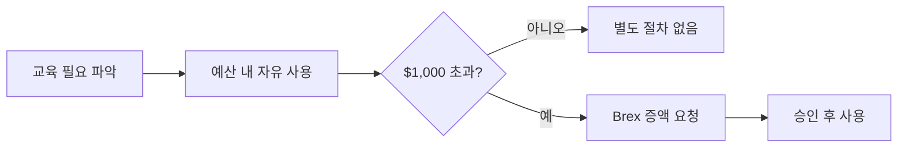

PostHog는 구성원의 성장을 적극 지원한다. 도서 구매, 교육 과정 수강, 컨퍼런스 참여에 각각 예산이 배정되어 있으며, 사전 승인 없이 사용할 수 있다[^1].

## 도서 지원

모든 구성원은 업무에 도움이 되는 도서를 구매할 수 있다[^2]. 오디오북과 팟캐스트도 도서 예산으로 구매 가능하다[^3].

| 항목 | 내용 |
|------|------|
| 대상 | 전 구성원 |
| 월 한도 | 약 $50 (별도 승인 불필요)[^4] |
| 구매 수량 | 월 2권까지 자유 구매[^5] |
| 사용 범위 | 종이책, 오디오북, 팟캐스트[^3] |

도서는 담당 업무와 직접 관련될 필요가 없다. 업무에 느슨하게 관련되면 충분하다[^6]. 예를 들어 리더 전기는 매니저에게, 디자인 서적은 엔지니어에게도 유용하다[^7]. 월간 북클럽 BookHog에서 다루는 도서도 이 예산으로 구매할 수 있다[^8].

## 교육 예산

직급에 관계없이 모든 구성원에게 연간 교육 예산이 주어진다[^9].

| 항목 | 내용 |
|------|------|
| 연간 기본 예산 | $1,000 (역년 기준)[^10] |
| 초과 사용 | Brex에서 증액 요청 시 대부분 승인[^11] |
| 사전 승인 | 불필요 (매니저 상담 권장)[^12] |
| 사용 범위 | 강좌, 교육, 자격증, 컨퍼런스[^9] |

비기술직 구성원은 기초 프로그래밍 과정 수강이 권장된다[^13]. Codecademy 등에서 Python, React 등 사내 기술 스택을 학습할 수 있다[^14].

## 컨퍼런스

교육 예산으로 컨퍼런스 참석뿐 아니라 발표와 코칭 활동 시간도 충당할 수 있다[^15]. 월 반나절까지 컨퍼런스·유저 그룹 활동에 사용하는 것이 기대되며, 이 역시 엄격한 상한은 아니다[^16]. 초과가 필요하면 매니저와 상의한다[^17].

학습 내용은 가능하면 팀에 공유한다[^18].

> **참고:** 개인 프로젝트·부업 관련 정책은 [겸업(Side Gig) 정책](pages/c276105c74b8.md) 참고.

[^1]: 01-training.md, Training 절 — "The better you are at your job, the better PostHog is overall!"
[^2]: 01-training.md, Books 절 — "*Everyone* at PostHog is eligible to buy books to help you in your job."
[^3]: 01-training.md, Books 절 — "You can use your books budget towards audiobooks and podcasts as well, if you prefer."
[^4]: 01-training.md, Books 절 — "spending up to $50/month on books is fine and requires no extra permission"
[^5]: 01-training.md, Books 절 — "You may buy a couple of books a month without asking for permission."
[^6]: 01-training.md, Books 절 — "Books do not have to be tied directly to your area, and they only need be loosely relevant to your work."
[^7]: 01-training.md, Books 절 — "biographies of leaders can help a manager to learn, and can in fact be more valuable than a tactical book on management. Likewise, if you're an engineer, a book on design can also be particularly valuable"
[^8]: 01-training.md, Books 절 — "we host a monthly book club called BookHog, and the budget can be used for those books as well"
[^9]: 01-training.md, Training budget 절 — "We have an annual training budget for every team member, regardless of seniority. The budget can be used for relevant courses, training, formal qualifications, or attending conferences."
[^10]: 01-training.md, Training budget 절 — "The training budget is $1000 per calendar year"
[^11]: 01-training.md, Training budget 절 — "if you want to spend in excess of this, request an increase to your budget in Brex and it should usually be granted"
[^12]: 01-training.md, Training budget 절 — "You do not need approval to spend your budget, but you might want to speak to your manager first"
[^13]: 01-training.md, Training budget 절 — "We strongly encourage all non-technical team members to take some kind of entry level programming course"
[^14]: 01-training.md, Training budget 절 — "[Codecademy](https://www.codecademy.com/) is a good place to start and they cover many of the technologies we use, such as Python and React"
[^15]: 01-training.md, Conferences 절 — "You can use your training budget for time spent talking at conferences and user groups, including coaching others."
[^16]: 01-training.md, Conferences 절 — "It is expected that you would spend up to half a day a month on these activities. Like the training budget, this isn't a hard limit."
[^17]: 01-training.md, Conferences 절 — "If you think you need more than that talk to your manager in the first instance."
[^18]: 01-training.md, Training budget 절 — "If possible, please share your learnings with the team afterwards!"
