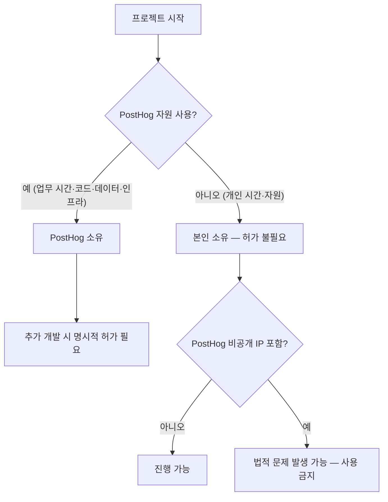

PostHog는 구성원이 열정을 가진 사이드 프로젝트를 운영하는 것을 긍정적으로 본다[^1]. 수익이 발생하는 부업도 허용되지만, PostHog가 주된 동기부여원이어야 한다[^2]. 파트타임 근무는 현재 제공하지 않는다[^3].

## 시간 관리

겸업의 적정성은 업무에 미치는 영향과 투입 시간으로 판단한다[^4].

| 항목 | 기준 |
|------|------|
| 허용 시간 | 월 수 시간 수준의 유급 부업[^5] |
| 작업 시간대 | 개인 시간에 수행이 원칙[^6] |
| 핵심 조건 | PostHog 업무에 영향을 주지 않을 것[^6] |

부업을 본업으로 전환할 계획이 있다면 미리 알려야 한다[^7]. 회사는 구성원의 장기 목표 달성을 돕고 PostHog의 필요와 맞추는 계획을 함께 수립한다[^8].

PostHog에서 기대 이상의 성과를 내고, 자기 관리도 잘 되고 있다면 유·무급 부업 모두 문제 없다[^9].

## 지적재산권(IP)

개인 시간에 개인 자원으로 만든 결과물의 지적재산권은 구성원 본인에게 있다[^10]. 별도 허가·검토·승인이 필요 없다[^11].

| 구분 | IP 귀속 | 비고 |
|------|---------|------|
| 개인 시간 + 개인 자원 | 본인[^10] | 허가 불필요[^11] |
| PostHog 업무 시간·코드·데이터·인프라 사용 | PostHog[^12] | PostHog 리포에 보관 |
| PostHog 비공개 IP 외부 사용 | 금지[^13] | 법적 문제 유발 가능 |
| MIT 라이선스 명시 코드 | 사용 가능[^14] | 오픈소스로 공개된 것만 해당 |

PostHog에서 시작된 프로젝트를 개인적으로 발전시키려면 명시적 허가가 필요하다[^15]. 특히 PostHog가 만들었거나 로드맵에 있는 것과 경쟁하는 경우, Fraser에게 상담하여 적절한 방안을 찾는다[^16].

## 사전 승인 절차

겸업을 시작하기 전에 소속 팀의 Exec 팀원(James, Tim, 또는 Charles)에게 확인을 받는다[^17]. 입사 전부터 있던 부업은 보통 온보딩 과정에서 다루어진다[^18].

> **참고:** 업무 시간 중 교육·컨퍼런스 활동은 [교육 및 도서 지원](pages/30a1b4d3ff91.md) 참고.

[^1]: 02-side-gigs.md, Side gigs 절 — "PostHog looks for passion in the people it hires. This often correlates with people who have side projects as a hobby."
[^2]: 02-side-gigs.md, Side gigs 절 — "We are not ok with this being your main focus and PostHog being just a paycheck."
[^3]: 02-side-gigs.md, Side gigs 절 — "we also currently don't offer part time work as an option at PostHog"
[^4]: 02-side-gigs.md, Managing time 절 — "The key distinction to something being a side gig, and thus it being appropriate, is its impact on your work and the amount of time involved."
[^5]: 02-side-gigs.md, Managing time 절 — "A few hours a month on a paid side gig is acceptable."
[^6]: 02-side-gigs.md, Managing time 절 — "side gigs should by default be something you work on in your personal time, and they should not impact the work you do at PostHog."
[^7]: 02-side-gigs.md, Managing time 절 — "you may want your side gig to become your full time work one day. That is ok - please just let us know, so we can create a plan."
[^8]: 02-side-gigs.md, Managing time 절 — "We know the key to motivated people is to help you achieve your long term goals, and to align this with what PostHog needs"
[^9]: 02-side-gigs.md, Managing time 절 — "if you are going above and beyond for PostHog and you're still able to look after yourself properly, side gigs (whether paid or unpaid) are totally fine."
[^10]: 02-side-gigs.md, Intellectual property 절 — "PostHog won't try to claim ownership of any intellectual property (IP) you create in your personal time"
[^11]: 02-side-gigs.md, Intellectual property 절 — "Side projects built on your own time using your own resources do not require permission, review or approval from PostHog."
[^12]: 02-side-gigs.md, Projects that start at PostHog 절 — "If a project is born from work you have done inside PostHog – that is, using work time, PostHog code, PostHog data, or other PostHog tools and infrastructure – these projects belong to PostHog and should live in PostHog repos."
[^13]: 02-side-gigs.md, Intellectual property 절 — "you need to be _really_ careful that you do not introduce any of PostHog's non-open source IP into any project that you work on - this can cause serious legal headaches."
[^14]: 02-side-gigs.md, Intellectual property 절 — "anything from PostHog that is explicitly MIT-licensed is fine to use, anything else is not."
[^15]: 02-side-gigs.md, Projects that start at PostHog 절 — "If you want to develop these projects further on the side, you will need explicit permission."
[^16]: 02-side-gigs.md, Projects that start at PostHog 절 — "please talk to Fraser and he can help you figure out the best solution here, especially if what you are working on directly competes with something PostHog has built or is on our roadmap."
[^17]: 02-side-gigs.md, Getting signoff 절 — "We ask you to please just check in with the relevant Exec team member for your team (ie. James, Tim, or Charles) to get their confirmation before going ahead with any side gigs."
[^18]: 02-side-gigs.md, Getting signoff 절 — "If your side gig existed before you joined PostHog, this will usually be covered as part of the onboarding process."
