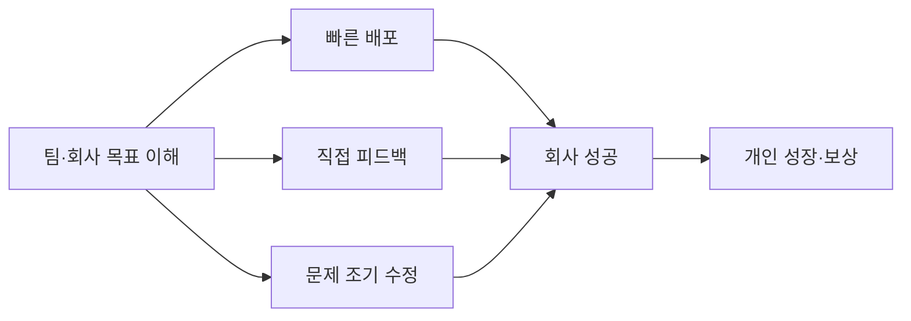

PostHog에서 커리어를 성장시키는 핵심 원칙과, 회사가 지원하는 것·지원하지 않는 것을 정리한다.

## 기본 원칙: 회사 성공이 개인 성공

PostHog에서 커리어를 성장시키는 가장 좋은 방법은 팀과 회사의 목표를 이해하고 그 방향으로 움직이는 것이다[^1].

- **빠르게 배포한다** — 목표를 향해 속도를 낸다[^2]
- **직접적인 피드백을 주고받는다** — 자신과 팀원 모두의 성장을 위해[^3]
- **문제를 발견하면 바로 고친다** — 초기 목표는 자주 틀린다[^4]

**자신의 일, 팀, 사용자를 신경 써야 한다.** 자신에게만 집중하면 가치가 없고 성장도 없다. 팀에만 집중하면 사용자에게 맞는 것을 만들 수 없다. 세 가지 모두에 꾸준히 관심을 가지면 장기적으로 성장이 따라온다[^5].

회사가 어려울 때 승진은 매우 힘들다. 반대로 회사가 성공하면 높은 성과를 낸 사람의 연봉 인상을 정당화하고 실현하기도 쉬워진다[^6].

## PostHog가 성장을 지원하는 방식

| 지원 방식 | 내용 |
|-----------|------|
| 뛰어난 팀 구성 | 높은 기준을 유지하며 채용. 모든 것이 투명하게 공유되어 누구에게서든 배울 수 있다[^7] |
| 큰 자율성 부여 | 제한을 두지 않으며, 스스로 가능하다고 생각하는 것 이상을 밀어붙인다[^8] |
| 다양하고 흥미로운 문제 | 데이터, 신제품, 디자인, 고투마켓 등 폭넓은 도전 과제를 맡을 수 있다[^9] |
| 가벼운 관리 | 마이크로매니지먼트 없이 지원에 집중하는 매니저. 정기 커리어 체크인 포함[^10] |
| 오픈소스 포트폴리오 | 화려한 직함보다 실제로 만든 것과 해결한 문제를 외부에 보여줄 수 있다[^11] |
| 동료 직접 피드백 | 매니저보다 팀원이 일상 업무를 더 잘 본다. 뛰어난 동료 + 직접 피드백 = 성장[^12] |

소규모 팀 구조 덕분에 구성원이 마음이 바뀌거나 다른 분야에 관심이 생기면 팀을 옮겨 다양한 경험을 쌓을 수 있다[^13].

> **참고:** 교육 예산, 도서 구매, 컨퍼런스 지원은 [교육 및 도서 지원](pages/6d4dab0aadd7.md) 참고.

## PostHog가 지원하지 않는 것

| 항목 | 이유 |
|------|------|
| 공식 커리어 프레임워크(체크리스트) | 자기 이익 중심으로 설계되어 잘못된 동기를 만든다. 수백 명 이상 조직이 되어야 이점이 단점을 넘는다[^14] |
| 화려한 직함 | 직함 범위를 좁게 유지한다. 마이크로매니지먼트보다 자율성을 위해서다[^15] |
| 매니저 주도 승진 | 매니저에게 과도한 권한이 집중된다. 성장 동기는 내재적이어야 지속 가능하다[^16] |

## 커리어 성장 경로

[^1]: 03-career-progression.md, Helping the company win helps you win 절 — "The best way to progress your career at PostHog is to understand your team"
[^2]: 03-career-progression.md, Helping the company win helps you win 절 — "Ship fast towards these"
[^3]: 03-career-progression.md, Helping the company win helps you win 절 — "Give and receive direct feedback to help yourself and others do the same"
[^4]: 03-career-progression.md, Helping the company win helps you win 절 — "Fix problems when you see them - early objectives are often wrong"
[^5]: 03-career-progression.md, Helping the company win helps you win 절 — "If you focus only on yourself, no value is provided and you won't progress. If you only focus on your team, you won't build the right thing for our users. Having a consistently caring attitude will in the long term lead to progression"
[^6]: 03-career-progression.md, Helping the company win helps you win 절 — "Getting promoted in a company that is struggling, is very hard. However, if the company is succeeding, it'll be easy to justify, _and_ to afford, pay rises where people are performing very well."
[^7]: 03-career-progression.md, Ways we help you progress 절 — "We are disciplined with maintaining a high bar. And since everyone works so transparently, you can learn from watching what everyone is doing"
[^8]: 03-career-progression.md, Ways we help you progress 절 — "We don't limit you, and will push for much more than you may think is possible."
[^9]: 03-career-progression.md, Ways we help you progress 절 — "PostHog has a wide variety of challenges - from data, to entire new products and features, to design and UX tradeoffs."
[^10]: 03-career-progression.md, Ways we help you progress 절 — "but without being micromanaged. Their priority is to support you, and we give them resources to make them a better manager."
[^11]: 03-career-progression.md, Ways we help you progress 절 — "Better than a fancy title - you can show future employers or investors what you built and the problems you solved."
[^12]: 03-career-progression.md, Ways we help you progress 절 — "Your team around you see your everyday work more than a manager - get direct feedback from them"
[^13]: 03-career-progression.md, Ways we help you progress 절 — "we can move people around as we grow to provide variety and to let people switch up their focus if things get stale."
[^14]: 03-career-progression.md, Ways we do not help you progress 절 — "This is self-interested by its nature, so creates the wrong incentives. The benefits of frameworks only start to outweigh their drawbacks when you need to start coordinating 100s of people."
[^15]: 03-career-progression.md, Ways we do not help you progress 절 — "We don't have a wide range of titles - we want people to be as equal as possible in order to enable autonomy versus micromanagement."
[^16]: 03-career-progression.md, Ways we do not help you progress 절 — "This gives too much power to managers. No one else can really do this for you - your motivation to progress has to be intrinsic to be sustainable."
