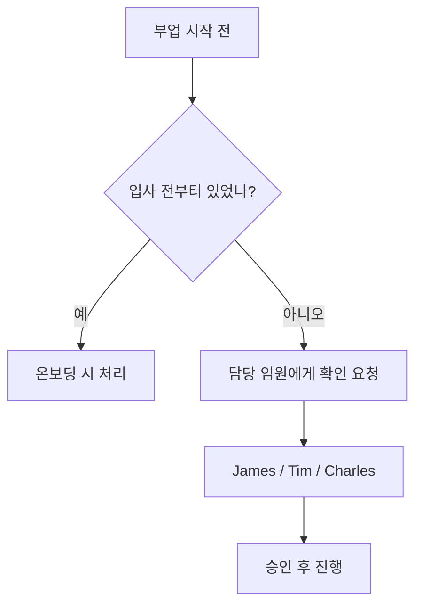

PostHog는 구성원이 부업을 갖는 것을 허용한다. 다만 PostHog가 메인 동기여야 하며, 부업이 업무에 영향을 주어서는 안 된다[^1].

## 허용 기준

PostHog는 규모가 작기 때문에 구성원 한 명 한 명의 집중도가 중요하다. 부업으로 돈을 버는 것은 괜찮지만, 부업이 주된 관심사가 되고 PostHog가 단순 월급 수단이 되는 것은 허용되지 않는다[^2]. 파트타임 근무 옵션도 현재 제공하지 않는다[^3].

| 항목 | 기준 |
|------|------|
| 유급 부업 | 월 수 시간 이내 허용 |
| 무급 부업 | 업무 영향 없으면 매주 일부 시간 가능 |
| 파트타임 근무 | 현재 미제공 |
| 부업을 장기 목표로 삼는 경우 | 사전 공유 후 계획 수립 가능 |

## 시간 관리

부업은 기본적으로 개인 시간에 해야 하며 PostHog 업무에 영향을 주어서는 안 된다[^4]. PostHog에서 초과 성과를 내면서도 자기 관리가 가능하다면 부업(유급·무급 무관)은 완전히 허용된다[^5].

부업을 언젠가 본업으로 삼고 싶다면 미리 공유해 달라 — PostHog는 구성원의 장기 목표와 회사 방향을 함께 정렬할 방법을 찾는다[^6].

## 지식재산(IP)

PostHog는 구성원이 개인 시간에 만든 지식재산을 소유 주장하지 않는다[^7]. 개인 시간과 자원으로 만든 사이드 프로젝트는 PostHog의 허가·검토·승인 없이 진행할 수 있다[^8].

단, PostHog의 비오픈소스 IP를 외부 프로젝트에 유입해서는 안 된다. MIT 라이선스로 명시된 PostHog 코드만 사용 가능하며, 그 외는 불가하다[^9].

| 프로젝트 유형 | IP 귀속 | 추가 개발 조건 |
|--------------|---------|---------------|
| 완전 개인 시간·자원으로 개발 | 본인 | 허가 불필요 |
| PostHog 업무 시간·리소스 사용 | PostHog | 명시적 허가 필요 |

### PostHog 내에서 시작된 프로젝트

업무 시간, PostHog 코드·데이터·인프라를 사용해 탄생한 프로젝트는 PostHog 소유이며 PostHog 레포에 있어야 한다[^10]. 이를 사이드 프로젝트로 더 발전시키려면 명시적 허가가 필요하다[^11].

PostHog 로드맵과 경쟁하는 프로젝트라면 Fraser와 먼저 상의한다[^12].

## 사전 승인(Signoff)

부업을 시작하기 전에 담당 임원(James, Tim, Charles 중 해당자)에게 확인을 받아야 한다[^13].

입사 전부터 존재한 부업은 온보딩 과정에서 통상 처리된다[^14].

[^1]: 02-side-gigs.md, Managing time 절 — "We are not ok with this being your main focus and PostHog being just a paycheck."
[^2]: 02-side-gigs.md, Managing time 절 — "we are ok with you earning money on the side. We are not ok with this being your main focus and PostHog being just a paycheck. Quite simply, we are too small for PostHog not to be your main motivation."
[^3]: 02-side-gigs.md, Managing time 절 — "we also currently don't offer part time work as an option at PostHog."
[^4]: 02-side-gigs.md, Managing time 절 — "side gigs should by default be something you work on in your personal time, and they should not impact the work you do at PostHog."
[^5]: 02-side-gigs.md, Managing time 절 — "if you are going above and beyond for PostHog and you're still able to look after yourself properly, side gigs (whether paid or unpaid) are totally fine."
[^6]: 02-side-gigs.md, Managing time 절 — "please just let us know, so we can create a plan. We know the key to motivated people is to help you achieve your long term goals, and to align this with what PostHog needs"
[^7]: 02-side-gigs.md, Intellectual property 절 — "PostHog won't try to claim ownership of any intellectual property (IP) you create in your personal time"
[^8]: 02-side-gigs.md, Intellectual property 절 — "Side projects built on your own time using your own resources do not require permission, review or approval from PostHog."
[^9]: 02-side-gigs.md, Intellectual property 절 — "anything from PostHog that is explicitly MIT-licensed is fine to use, anything else is not."
[^10]: 02-side-gigs.md, Projects that start at PostHog 절 — "If a project is born from work you have done inside PostHog – that is, using work time, PostHog code, PostHog data, or other PostHog tools and infrastructure – these projects belong to PostHog and should live in PostHog repos."
[^11]: 02-side-gigs.md, Projects that start at PostHog 절 — "If you want to develop these projects further on the side, you will need explicit permission."
[^12]: 02-side-gigs.md, Projects that start at PostHog 절 — "please talk to Fraser and he can help you figure out the best solution here, especially if what you are working on directly competes with something PostHog has built or is on our roadmap."
[^13]: 02-side-gigs.md, Getting signoff 절 — "We ask you to please just check in with the relevant Exec team member for your team (ie. James, Tim, or Charles) to get their confirmation before going ahead with any side gigs."
[^14]: 02-side-gigs.md, Getting signoff 절 — "If your side gig existed before you joined PostHog, this will usually be covered as part of the onboarding process."
