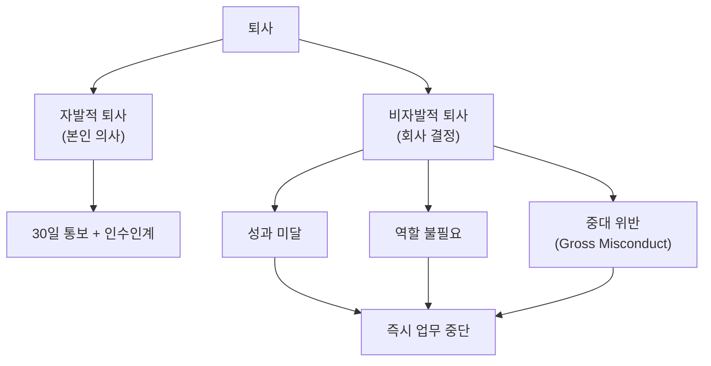

PostHog의 오프보딩 정책은 퇴사 과정의 투명성을 높이고 구성원과 회사 모두를 보호하기 위해 마련되었다[^1]. 이 정책은 **단기 계약 외주 인력에는 적용되지 않는다**[^2].

## 퇴사 유형

PostHog의 퇴사는 자발적 퇴사와 비자발적 퇴사 두 가지로 나뉜다.

### 자발적 퇴사

구성원이 스스로 PostHog를 떠나는 경우다.

기본적으로 **30일 사전 통보**를 요청하며, 해당 기간 동안 정상 근무를 기대한다[^3]. 현지 법령에 따라 다른 기간이 적용될 수 있다.

퇴사를 고민 중인 구성원은 먼저 매니저 또는 People 팀과 대화할 것을 권장한다. 불만의 원인이 PostHog 내부에서 해결 가능한 경우도 있기 때문이다. 퇴사 결심이 확고하다면 **people@posthog.com**으로 사직 의사를 이메일로 전달한다[^4].

### 비자발적 퇴사 — 성과 미달

회사가 구성원과의 고용을 종료하는 경우로, 성과 문제 또는 역할 불필요로 나뉜다.

성과 미달로 인한 퇴사 프로세스는 다음 단계를 따른다[^5].

| 단계 | 내용 |
|------|------|
| 1단계 | 매니저 또는 경영진이 성과 문제를 제기하고 개선 계획을 논의 |
| 2단계 | 매니저가 구성원에게 공식적으로 성과 기준 미달을 통보하는 미팅 진행 |
| 3단계 | 구체적인 개선 목표와 기간(신입은 수 주, 기존 구성원은 더 길 수 있음)을 합의하고 후속 미팅 일정 수립 |
| 4단계 | 후속 미팅에서 성과 개선 여부 확인 후 고용 지속 또는 종료 결정 |

구성원이 피드백을 수용하지 않거나 개선 가능성이 없다고 판단되면 3단계를 생략하고 더 일찍 종료할 수 있다[^6].

매니저직인 경우, 통보 전에 팀원들로부터 피드백을 수집하는 것이 일반적이다[^7].

**Tim과 James가 최종 퇴사 결정 권한을 가진다**[^8].

### 비자발적 퇴사 — 역할 불필요

회사 상황 변화로 역할 자체가 더 이상 필요하지 않은 경우, 경영진이 결정한 후 구성원에게 바로 통보한다[^9].

## 퇴사 고지

| 퇴사 유형 | 고지 방식 |
|----------|----------|
| 자발적 퇴사 | 구성원이 원하면 향후 계획 공유 가능. 공표 전 Blitzscale 팀과 합의 필요 |
| 비자발적 퇴사 | 개인 프라이버시를 존중하면서 가능한 한 투명하게 사유 공유 |

퇴사 소식을 공표하기 전에 반드시 **Blitzscale 팀의 승인**을 받아야 한다. 무단으로 먼저 발표하면 안 된다[^10].

PostHog는 퇴사 맥락을 항상 공유할 수 없는 경우가 있음을 양해 바란다[^11].

## 레퍼런스 및 재직 확인

PostHog는 **전·현직 구성원에 대한 개인 또는 직업적 레퍼런스를 제공하지 않는다**[^12]. 외부에서 재직 사실 문의 시 **고용 기간만** 공유한다.

현재 구성원이 레퍼런스 요청을 받는 경우[^13],

- 직접 응답하지 말고 **People & Ops 팀으로 전달**한다
- 해당 구성원의 성과나 퇴사 사유에 대한 의견을 공유하지 않는다
- PostHog를 대표하는 것처럼 발언하지 않는다

## 오프보딩 절차

비자발적 퇴사의 경우 People 팀이 별도 통화를 예약한다. 통화 중 Zluri(접근 관리 도구)를 통해 계정 해제(deprovisioning)가 진행된다. 수동 처리가 필요한 단계는 Slack 메시지로 안내된다[^14].

이후 아래 사항을 이메일로 안내한다[^15].

1. 최종 급여
2. 베스팅된 주식 옵션
3. 회사 자산 반납
4. 업무 경비 정산
5. 구성원의 회사 내 작별 인사 이메일 (선택)

### 팀 리드의 경우

팀 리드가 자발적으로 퇴사하는 경우, Blitzscale 팀이 팀 리드 업무를 인계받을 인물을 미리 선정하여 발표 시점에 맞춰 공개한다[^16].

## 최종 급여 정산

퇴사 구분에 따라 최종 급여 산정 기준이 다르다[^17].

| 퇴사 유형 | 급여 기준 |
|----------|----------|
| 자발적 퇴사 | 마지막 근무일까지 지급. 최근 12개월 사용 휴가 기준 25일 미만이면 미사용분 지급 |
| 비자발적 퇴사 (성과/역할) | 재직 3개월 이상 시 **4개월 치** 급여 (법정 통보 기간 포함). 미국은 종료 후 다음 달 말까지 건강보험 지속 |
| 비자발적 퇴사 (성과/역할) — 3개월 미만 | **1개월 치** 급여 (영업직은 6개월 이상 재직 필요) |
| 중대 위반 (Gross Misconduct) | 법정 최소한만 지급, 통보 기간 없을 수 있음 |

**독일 거주 구성원**은 6개월 이상 재직 시 현지 법률과 시장 관행에 따른 통보·퇴직금을 적용한다[^18].

> 마지막 근무일 이후 추가 지급을 받으려면 **퇴직 확인서(post-termination certificate), 합의서(separation agreement) 또는 면제 동의서(release)**에 서명해야 한다. 미서명 시 법정·계약상 요건에 따른 금액만 지급된다[^19].

현지 법령이 위 기준보다 유리하면 **법적으로 더 유리한 쪽을 적용**한다[^20].

> 퇴사를 원하지만 의도적으로 해고를 유도해 4개월 퇴직금을 받으려 하는 경우, 이는 고용 계약의 **중대 위반(gross misconduct)** 으로 처리될 수 있으며 법정 최소치 이상의 퇴직금을 받을 수 없다[^21].

## 주식 옵션 베스팅

주식 옵션을 부여받은 구성원에게는 베스팅 수량과 행사 절차를 안내한다[^22].

- **행사 기간:** 퇴사 후 **10년** (구성원 친화적 정책)[^23]
- **Good Leaver:** 중대 위반으로 인한 해고가 아닌 한 대부분의 퇴사자는 Good Leaver로 간주된다[^24]

## 오프보딩 체크리스트

체크리스트는 GitHub 비공개 저장소(`PostHog/company-internal`)의 Issue 템플릿으로 관리된다. People 팀이 퇴사자마다 새 오프보딩 Issue를 생성한다[^25].

[^1]: 05-offboarding.md, Communicating departures 절 — "we will aim to be as transparent as possible about the reasons behind the departure"
[^2]: 05-offboarding.md, Voluntary departure 절 — "This offboarding policy _does not_ apply to regular contractors who are doing short term work for us."
[^3]: 05-offboarding.md, Voluntary departure 절 — "We ask for 30 days of notice by default (unless locally a different maximum or minimum limit applies), and for team members to work during that notice period."
[^4]: 05-offboarding.md, Voluntary departure 절 — "please send an email communicating your intention to resign to people@posthog.com."
[^5]: 05-offboarding.md, Involuntary departure 절 — 성과 관리 4단계 프로세스
[^6]: 05-offboarding.md, Involuntary departure 절 — "If the person doesn't accept the feedback at the time and/or we don't feel like there is a realistic path to them improving, we may follow up to let them go sooner than this."
[^7]: 05-offboarding.md, Involuntary departure 절 — "If the person is a manager, we usually collect feedback from their team beforehand."
[^8]: 05-offboarding.md, Involuntary departure 절 — "Tim and James are responsible for making any final decision to let someone go."
[^9]: 05-offboarding.md, Involuntary departure 절 — "we usually make a decision as an exec team and then let the team member know straight away"
[^10]: 05-offboarding.md, Communicating departures 절 — "Please don't announce your resignation until the relevant member of the Blitzscale team has given the go ahead as they may need to prepare accordingly for the impact of your resignation."
[^11]: 05-offboarding.md, Communicating departures 절 — "PostHog cannot always provide context around why people are leaving when they do."
[^12]: 05-offboarding.md, References and employment verification 절 — "the only information we share is their dates of employment."
[^13]: 05-offboarding.md, References and employment verification 절 — "just forward it to the People & Ops team."
[^14]: 05-offboarding.md, The offboarding process 절 — "This is run through our access management tool Zluri."
[^15]: 05-offboarding.md, The offboarding process 절 — 퇴사 안내 이메일 5개 항목
[^16]: 05-offboarding.md, For team leads 절 — "let the team know just before the resignation is announced or as part of the announcement."
[^17]: 05-offboarding.md, Final pay 절 — 퇴사 유형별 급여 산정 기준
[^18]: 05-offboarding.md, Final pay 절 — "follow local laws and standard market practices for notice and severance."
[^19]: 05-offboarding.md, Final pay 절 — "We ask departing team members to sign a post-termination certificate, separation agreement or release in order to receive payments beyond their final day of work."
[^20]: 05-offboarding.md, Final pay 절 — "if there are local laws which are applicable, we will pay the greater of the above or the legally required minimum."
[^21]: 05-offboarding.md, Involuntary departure 절 — "team members are not eligible for any severance beyond the statutory minimum where they live."
[^22]: 05-offboarding.md, Share options vested 절 — "we will confirm how many have vested and the process by which they may wish to exercise them."
[^23]: 05-offboarding.md, Share options vested 절 — "post-departure exercise window of 10 years"
[^24]: 05-offboarding.md, Share options vested 절 — "most team members who leave will be deemed a 'good leaver' unless they have been terminated due to gross misconduct."
[^25]: 05-offboarding.md, Offboarding checklist 절 — "The People team will create a new offboarding Issue for each leaver."
