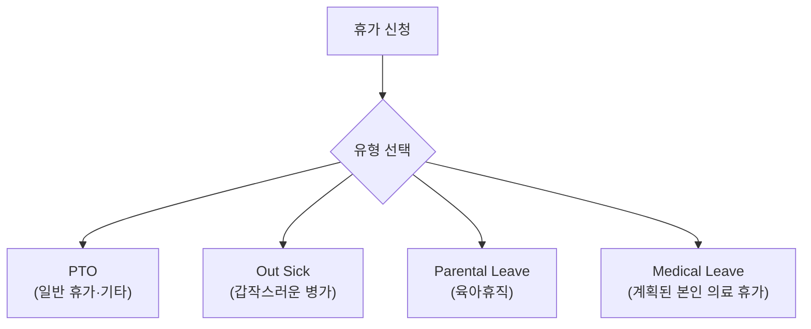

PostHog는 무제한·비허가형(permissionless) 휴가를 운영한다. 국경일 포함 연간 최소 25일 이상을 사용해야 하며[^1], People & Ops 팀이 주기적으로 휴가 사용 현황을 확인해 최소 일수를 채우지 못한 구성원에게 휴가를 권장한다[^2]. 25일은 최소치이지 권고 목표가 아니다[^3].

## 기본 원칙

PostHog는 근무 시간이 아니라 성과를 중시한다[^4]. 휴가 사용에 관리자 승인이 필요 없다. 대신 팀과 조율해 부재 중에도 업무가 원활히 진행되도록 한다[^5].

다음은 피해야 할 상황이다:

- 소규모 팀 전체가 동시에 자리를 비우는 것 — 고객 지원 공백이 생긴다[^6]
- 특정 업무를 수행할 수 있는 모든 인원이 동시에 자리를 비우는 것

## 예약 방법

| 항목 | 내용 |
|------|------|
| 예약 채널 | Slack의 **Time Off by Deel** 앱[^7] |
| deel.com 직접 예약 | 불가 — Slack 연동 안 됨[^8] |
| 자동 처리 | 팀 캘린더 반영, 관리자 개인 캘린더 추가, Slack 상태 자동 설정[^9] |
| 국경일 | 직접 추가 필요 — Bulk Add by Region 기능 활용[^10] |
| 취소 | #team-people-and-ops 채널에 메시지 (관리자만 삭제 가능)[^11] |

**사전 설정 필수:**
- Slack에서 Time Off by Deel 앱에 Google Calendar 연결 권한 부여[^12]
- 팀 휴가 캘린더 구독[^12]

> **개인 GCal 부재 표시 필수:** Time Off by Deel은 종일 일정만 등록한다. 자동 예약(인터뷰, 데모 등)이 잡히지 않도록 개인 GCal에 추가로 부재 표시를 해야 한다[^13].

### 휴가 유형

- **PTO**: 일반 휴가 및 위 분류에 해당하지 않는 모든 휴가[^14]
- **Out Sick**: 예고 없이 몸이 아파 쉬는 경우[^14]
- **Parental Leave**: 자세한 내용은 [육아휴직](pages/010cc9b2d9e5.md) 참고[^14]
- **Medical Leave**: 본인의 계획된 의료 휴가. 가족 간호로 인한 휴가는 PTO로 처리[^14]

## 유연 근무

PostHog는 근무 시간을 측정하지 않는다[^15]. 병원 방문, 학교 행사, 조기 퇴근 모두 별도 보고 없이 자유롭게 가능하다. 단, 지원 히어로·고객 대면 역할처럼 즉시 응답이 필요한 포지션이라면 대체 커버를 먼저 확보한다[^16].

## 병가

몸이 아프면 바로 쉰다. 유급 병가 상한은 계약서에 명시된 국가별 기준을 따른다[^17].

| 상황 | 조치 |
|------|------|
| 하루 이틀 | 관리자에게 알리고 Time Off by Deel에 당일치기로 등록[^18] |
| 5일 이상 또는 국가 한도 초과 | Fraser에게 연락, 계획 수립, 진단서 필요[^19] |
| 정기적 결근이 생기는 지병 | Fraser에게 사전 공유, 배려 방안 협의[^20] |

병가 일수를 미리 대량으로 예약하지 않는다 — 실제로 얼마나 쉬어야 할지 모르므로, 당일 등록 후 상태에 따라 추가한다[^21].

## 특별 휴가

### 사별·임신 및 출산 손실

관계의 친밀도를 정의하지 않으며 묻지도 않는다. 필요한 기간을 알려주면 된다[^22].

임신 손실과 출산 손실(사산 포함)에도 동일하게 적용되며, 부모 양쪽 모두 **최소 2주 유급 휴가**를 사용할 수 있다[^23].

신체적·정신적 회복이 더 필요하다면 연장 병가로 처리한다[^24].

### 배심원 의무·투표·보육 긴급상황 등 '생활 사건'

삶이 먼저다[^25]. 팀에 알리고 일정을 맞게 조율하면 된다.

배심원 소환을 받으면 즉시 Fraser에게 알린다 — 충분한 사전 통보가 있으면 면제 신청이 가능하다[^26].

> **참고:** 육아휴직 상세 내용은 [육아휴직](pages/010cc9b2d9e5.md) 참고.

[^1]: 07-time-off.md, Time off — "_at least 25 days off a year_, including national holidays"
[^2]: 07-time-off.md, Time off — "The People & Ops team will look into holiday usage occasionally to encourage people who haven't taken the minimum time off to do so."
[^3]: 07-time-off.md, Time off — "The 25 days is a minimum, not a guide."
[^4]: 07-time-off.md, Permissionless time off 절 — "We care about your results, not how long you work."
[^5]: 07-time-off.md, Permissionless time off 절 — "You do not need to get approval for time off from your manager. Instead, we expect everyone to coordinate with their team to make sure that we're still able to move forwards in your absence."
[^6]: 07-time-off.md, Permissionless time off 절 — "Having an entire Small Team off - this means we can't provide support to customers"
[^7]: 07-time-off.md, How to book time off in Time Off by Deel 절 — "Book it on the Time Off by Deel app in Slack."
[^8]: 07-time-off.md, How to book time off in Time Off by Deel 절 — "Do not book directly on deel.com as it does not sync with Slack, and the team will not know you are out."
[^9]: 07-time-off.md, How to book time off in Time Off by Deel 절 — "It will be automatically approved and added to the team time off calendar (with the exception of longer term leave.)"
[^10]: 07-time-off.md, How to book time off in Time Off by Deel 절 — "In the Time Off by Deel app, you can use the Bulk Add by Region feature to quickly identify and add the public holidays you want off."
[^11]: 07-time-off.md, How to cancel time off 절 — "drop a message in #team-people-and-ops and a member of the team will cancel the holiday for you, as only admins can delete holidays."
[^12]: 07-time-off.md, How to book time off in Time Off by Deel 절 — "You have authorized the Time Off by Deel app in Slack to connect to your Google Calendar"
[^13]: 07-time-off.md, How to book time off in Time Off by Deel 절 — "Block out your own personal GCal to show that you are out. This is because Time Off by Deel _only_ books in an all day event in your calendar to show that you are out."
[^14]: 07-time-off.md, How to book time off in Time Off by Deel 절 — "There are four types of time off you can select"
[^15]: 07-time-off.md, Flexible working 절 — "We operate on a trust basis and we don't count hours or days worked."
[^16]: 07-time-off.md, Flexible working 절 — "please just add it to your calendar and, if you are doing anything that could require you to be immediately available (ie support hero / or any customer-facing role), please make sure you have cover."
[^17]: 07-time-off.md, You are sick 절 — "the upper limit for paid sick leave for your country will be specified in your contract."
[^18]: 07-time-off.md, You are sick 절 — "Please let your manager know if you need to take off due to illness as soon as you are able to and add it to Time Off by Deel."
[^19]: 07-time-off.md, You are sick 절 — "please speak to Fraser so we can work out a plan. In most countries, we will need a doctor's note from you."
[^20]: 07-time-off.md, You are sick 절 — "If you have a medical condition you know will take you away from work regularly, please let Fraser know so we can work out accommodations with you and your manager."
[^21]: 07-time-off.md, You are sick 절 — "You shouldn't pre-emptively book a bunch of days off sick, as you can't know how long you will actually be sick for and you may trigger the need for a doctor's note"
[^22]: 07-time-off.md, Bereavements / Child loss 절 — "Please just let us know up front how much time you would like to take."
[^23]: 07-time-off.md, Bereavements / Child loss 절 — "Our bereavement policy also covers pregnancy and child loss for both parents, with no questions asked. Please take at least 2 weeks of paid leave."
[^24]: 07-time-off.md, Bereavements / Child loss 절 — "If you need extended time for physical or mental health reasons, we will treat it as extended sick leave"
[^25]: 07-time-off.md, Jury duty / voting / childcare disasters 절 — "There are lots of situations where life needs to come first. Please let it"
[^26]: 07-time-off.md, Jury duty / voting / childcare disasters 절 — "If you are summonsed for jury duty, please let Fraser know right away - we can often get an exception granted if we have enough notice."
