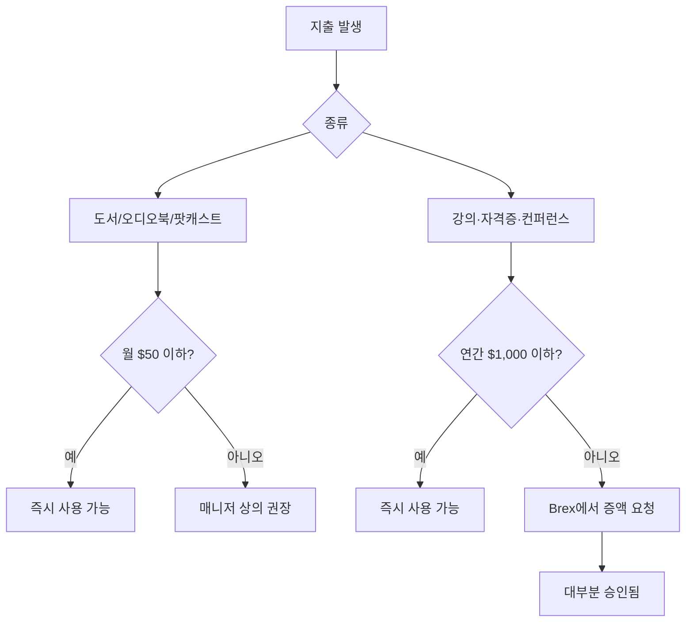

PostHog는 모든 구성원의 성장을 지원하기 위해 도서 구매 예산과 연간 교육 예산을 제공한다. 직급과 무관하게 동일한 혜택이 주어지며, 대부분의 지출에 사전 승인이 필요하지 않다[^1].

## 도서 구매

도서는 업무와 직접적인 연관이 없어도 된다 — 느슨하게 관련된 주제이면 충분하다[^2]. 오디오북과 팟캐스트도 도서 예산으로 구매할 수 있다[^3].

| 항목 | 내용 |
|------|------|
| 월 한도 | $50 |
| 사전 승인 | 불필요 |
| 허용 범위 | 도서, 오디오북, 팟캐스트 |
| 주제 범위 | 업무와 느슨하게 관련된 것이면 가능 |
| 북클럽 | 월 1회 BookHog 참여 시 해당 도서도 예산 사용 가능 |

**예시:** 매니저가 리더십 전기를 읽거나, 엔지니어가 디자인 관련 도서를 읽는 것 모두 허용된다[^4].

## 연간 교육 예산

교육 예산은 강의·훈련·공식 자격증·컨퍼런스 참석에 사용할 수 있다[^5]. 예산 초과가 필요할 경우 Brex에서 예산 증액을 요청하면 대부분 승인된다[^6].

| 항목 | 내용 |
|------|------|
| 연간 한도 | $1,000 (캘린더 기준) |
| 사전 승인 | 불필요 (지출 전 매니저와 상의 권장) |
| 초과 시 | Brex에서 예산 증액 요청 |
| 사용 가능 항목 | 강의, 훈련, 자격증, 컨퍼런스 |

비기술직 구성원은 Codecademy 등에서 기초 프로그래밍 과정을 수강하도록 권장된다 — PostHog의 '당신이 운전자다' 문화의 일환이다[^7].

학습 후 팀원들과 내용을 공유하면 더욱 좋다[^8].

## 컨퍼런스

컨퍼런스 발표, 사용자 그룹 활동, 타인 코칭에 교육 예산을 사용할 수 있다[^9].

| 항목 | 내용 |
|------|------|
| 기본 기대치 | 월 최대 반나절 |
| 예산 출처 | 교육 예산에 포함 |
| 초과 시 | 매니저와 먼저 상의 |

## 예산 사용 흐름

[^1]: 01-training.md, Training budget 절 — "We have an annual training budget for every team member, regardless of seniority."
[^2]: 01-training.md, Books 절 — "Books do not have to be tied directly to your area, and they only need be loosely relevant to your work."
[^3]: 01-training.md, Books 절 — "You can use your books budget towards audiobooks and podcasts as well, if you prefer."
[^4]: 01-training.md, Books 절 — "biographies of leaders can help a manager to learn, and can in fact be more valuable than a tactical book on management. Likewise, if you're an engineer, a book on design can also be particularly valuable for you to read."
[^5]: 01-training.md, Training budget 절 — "The budget can be used for relevant courses, training, formal qualifications, or attending conferences."
[^6]: 01-training.md, Training budget 절 — "if you want to spend in excess of this, request an increase to your budget in Brex and it should usually be granted."
[^7]: 01-training.md, Training budget 절 — "We strongly encourage all non-technical team members to take some kind of entry level programming course - it's part of our 'you're the driver' culture that everyone can at least understand very basic concepts around software development."
[^8]: 01-training.md, Training budget 절 — "If possible, please share your learnings with the team afterwards!"
[^9]: 01-training.md, Conferences 절 — "You can use your training budget for time spent talking at conferences and user groups, including coaching others."
