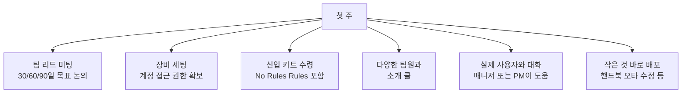

PostHog 신규 입사자의 온보딩 과정, 버디 제도, 대면 온보딩 방법, 수습 기간 체크인을 정리한다. 도구 목록과 Slack 채널은 [업무 도구 및 슬랙 채널](pages/3a4c57c6c964.md)에서 확인한다.

## 온보딩 개요

PostHog는 팀원이 전 세계에 분산되어 있다. 신규 입사자가 최고의 온보딩 경험을 할 수 있도록 입사 첫 주 내에 팀원과 직접 만나는 것을 목표로 한다[^1]. 온보딩 경험은 입사자의 위치와 합류 팀에 따라 다를 수 있다[^2].

People 팀에 신규 입사자를 소개하려면 **people@posthog.com**으로 연락하면 팀원이 온보딩을 진행한다[^3].

## 온보딩 체크리스트 및 이메일

온보딩 체크리스트는 GitHub `company-internal` 저장소의 이슈 템플릿으로 관리된다. People 팀이 각 신규 입사자마다 새 온보딩 이슈를 생성한다[^4].

입사 전에 People 팀이 **온보딩 이메일**을 발송한다. 이메일에는 필수 조치 링크들이 포함된다[^5].

> **주의:** 입사 후에는 이메일을 업무 소통 수단으로 사용하지 않는다. James나 Tim이 이메일로만 중요한 요청을 하는 일은 없으며, 모든 확인은 Slack으로 이루어진다. PostHog를 사칭한 직접 이메일에 각별히 주의한다[^6].

## 온보딩 버디

모든 신규 입사자에게 **온보딩 버디**가 배정된다. 가능하면 입사 첫 주에 버디와 직접 만난다. 버디는 보통 합류 팀의 팀원(이상적으로는 팀 리드)이며, 첫 몇 주간 질문 응답과 사교 활동을 도와준다[^7].

### 버디 가이드

| 항목 | 내용 |
|------|------|
| 버디 선정 | People & Ops 팀이 팀에 연락해 버디를 결정한다 |
| 일정 제약 | 입사 전 1주, 입사 후 2주간 휴가 없어야 한다 |
| 첫 소개 | 이메일로 버디와 신규 입사자를 소개; 대면 일정을 협의한다 |
| 최소 기간 | 함께 최소 3일 이상 보내며 첫 주 온보딩 목록을 수행한다 |
| 후속 관리 | 이후 약 1개월간 주 1회 이상 체크인한다 |

- 대면 온보딩에 이동이 필요하면 지출 정책을 확인 후 Brex/Revolut 카드로 예약한다[^8]
- 온보딩 일정을 In-person Onboarding Calendar에 등록하면 다른 팀원도 참여 가능하다[^9]
- 신규 입사자에게 핸드북을 일찍 소개하고, 핸드북이 PostHog의 맥락 공유 기본 수단임을 설명한다[^10]
- 버디 경험이 없다면 People & Ops 팀 또는 팀 리드에게 경험자 연결을 요청한다[^11]

## 대면 온보딩

특별한 사정이 없으면 신규 입사자는 팀원과 대면으로 온보딩 과정을 진행한다[^12]. 기본 대면 온보딩 장소는 샌프란시스코의 **Hogpatch** 또는 런던의 **Hedge House**다. 두 곳 모두 온보딩에 최적화되어 있고, 다른 PostHog 팀과 같은 공간을 사용한다[^13].

### 온보딩 예산 기준

소규모 팀 오프사이트 기준(1인당 $2,000)보다 저렴하게 유지하는 것을 목표로 한다[^14].

| 항목 | 기준 |
|------|------|
| 대륙 간 이동 | 최소화한다 |
| 사교 활동 | 저녁 식사, 음료 등 간단한 활동을 우선한다 |
| 예산 적용 범위 | 팀 리드 + 1명까지 온보딩 예산 사용 가능. 추가 참석자는 "함께 일하기" 예산 활용 |
| 입사자 여행 비용 | 입사자 본인의 온보딩 예산으로 처리. 팀 예산에 포함하지 않는다 |
| 예산 요청 | Brex에서 USD로 요청한다 |

> 대면 온보딩과 소규모 팀 오프사이트는 목적이 다르다. 기본적으로 병행하지 않는다. 온보딩은 신규 팀원의 성공에 집중하는 반면, 오프사이트는 해커톤·360 피드백 등을 다룬다[^15].

### 대면 온보딩 일정 아이디어

- PostHog 가치관 및 전략 소개
- 팀 역사, 분기 목표, 제품 데모 (제품 팀)
- 팀 리드와 인터뷰 피드백 세션
- 특정 기능 코드 심층 탐구 (제품 팀)
- Mock 데모 (영업 팀)
- "바보 같은 질문은 없다" 세션

## 첫 주

첫 주는 압도감을 느낄 수 있다. 핵심은 작은 것이라도 바로 배포하는 것이다[^16].

> **노트북 지연 시:** 개인 노트북으로 민감하지 않은 온보딩 작업(핸드북 읽기, 소개 콜 등)은 진행 가능하다. 단, 프로덕션 클라우드 환경(AWS, GCP 등) 접근 및 시크릿 저장·처리는 절대 금지다. 회사 노트북 도착 즉시 이동한다[^17].

## 엔지니어 온보딩 5가지 규칙

수년간의 학습을 통해 정리한 엔지니어 온보딩 핵심 규칙이다[^18].

| # | 규칙 | 세부 내용 |
|---|------|-----------|
| 1 | 첫날 함께 배포 | 아주 작은 것이라도 첫날 배포. 개발 환경을 즉시 갖춘다 |
| 2 | 매일 1:1 학습 세션 | 맥락을 전달하는 세션. 온보딩 종료 전 각 팀원이 최소 1회 진행 |
| 3 | 브레인스토밍 세션 | 팀 중요 주제로 최소 1회. 액션 아이템을 기록하고 신규 팀원을 의사결정에 참여 |
| 4 | 최대한 페어 작업 | 대면 상황에서 협업 가능한 작업을 선택 |
| 5 | 즐기기 | 관광, 저녁 식사, 재미있는 활동으로 함께 시간 보내기 |

## 지원 영웅(Support Hero) 교육

모든 신입은 입사 후 **3주 내에** 자신의 시간대와 가장 가까운 지원 엔지니어와 **30분 세션**을 예약해야 한다[^19].

세션에서 다루는 주요 내용:

- 지원 영웅 역할과 티켓 수신 방식
- 티켓 출처 및 유료/무료 사용자 구분 방법
- Slack 스레드에서 티켓 생성 방법, 팀 간 이관 방법
- 고객 소통 방법 및 티켓 우선순위 결정
- 티켓 상태 관리 ('On hold', 'Pending')
- SLA 및 티켓 중요도 기준
- 버그 리포트·기능 요청 처리, 머치 증정
- 중복 작업 방지를 위한 티켓 배정 방법
- 내부 노트 작성 및 Slack에서 내부 질문 올리기

## 30/60/90일 체크인

팀 리드는 신규 팀원의 **3개월 수습 기간**을 관리할 책임이 있다[^20]. 30일, 60일, 80일 시점에 자동으로 피드백 폼이 발송된다.

| 시점 | 내용 |
|------|------|
| 30일 | 팀 리드가 피드백 제공. 수습 통과를 위한 개선점을 명확히 전달한다 |
| 60일 | 긍정적 진행 상황 확인. Blitzscale 팀이 필요 시 추가 피드백 층을 제공한다 |
| 80일 | 수습 종료 전 최종 피드백. 미해결 우려 사항은 즉시 Blitzscale 팀에 전달한다 |
| 90일 | 별도 공식 "수습 통과" 통보 없음. 앞선 체크인을 통해 이미 명확히 알고 있어야 한다 |

팀 리드는 체크인 사이에도 문제가 발생하면 즉시 Blitzscale 팀에 알려야 한다. 늦게 알릴수록 행동할 시간이 줄어든다[^21].

팀 리드는 동료 피드백을 정기 1:1 미팅에서 자연스럽게 수집해 사각지대를 보완하는 것이 권장된다[^22].

> **참고:** 수습 기간 보상 및 급여 체계는 [보상 체계](pages/c9c63eec9f97.md) 참고.

## 답변 찾기

PostHog는 **자기주도 답변 탐색** 문화를 갖고 있다. 빠른 경로는 다음 순서를 따른다[^23].

1. **#ask-max** — 핸드북과 문서 전체를 학습한 AI. 24/7 이용 가능하며 관련 문서를 즉시 안내한다
2. **관련 Slack 채널에서 질문** — 막히거나 문서에 없는 맥락이 필요하면 채널에 질문한다. 채널 목록은 [업무 도구 및 슬랙 채널](pages/3a4c57c6c964.md) 참고

[^1]: 10-onboarding.md, Welcome to PostHog! 절 — "we aim for the new joiner to meet up with someone from their team in their first week"
[^2]: 10-onboarding.md, Welcome to PostHog! 절 — "the onboarding experience will look a little bit different, depending on where the new joiner is based and which team they will be joining"
[^3]: 10-onboarding.md, Welcome to PostHog! 절 — "Just introduce them to people@posthog.com and a member of the team will jump in and take it from there!"
[^4]: 10-onboarding.md, Onboarding checklist 절 — "The People team will create a new onboarding issue for each new joiner."
[^5]: 10-onboarding.md, Onboarding email 절 — "We send an introductory email to all new hires to welcome them to the team and ease them in the some of the essential actions we need them to take."
[^6]: 10-onboarding.md, Onboarding email 절 — "Be extremely cautious of direct emails from James, Tim, or other people of PostHog."
[^7]: 10-onboarding.md, Onboarding buddy 절 — "The onboarding buddy is usually a member of the team a new joiner is joining - ideally the team lead - and they can help with any questions that pop up and with socializing during the first couple of weeks"
[^8]: 10-onboarding.md, Guidance for onboarding buddies 절 — "book your travel accordingly."
[^9]: 10-onboarding.md, Guidance for onboarding buddies 절 — "so that other PostHog team members can join, if possible."
[^10]: 10-onboarding.md, Guidance for onboarding buddies 절 — "early and talk through why it matters – it's how we default to sharing context at PostHog, and knowing their way around it is one of the most useful things they can pick up in week one."
[^11]: 10-onboarding.md, Guidance for onboarding buddies 절 — "ask the People & Ops team or your team lead to pair you with someone who's done it before to support"
[^12]: 10-onboarding.md, In-person onboarding 절 — "Except under special circumstances, new joiners meet with members of their team in-person to go through the onboarding process."
[^13]: 10-onboarding.md, In-person onboarding 절 — "Both are set up for it, remove most of the planning friction, and you'll always be in the same space as other PostHog teams"
[^14]: 10-onboarding.md, In-person onboarding 절 — "they should be relatively less expensive than a small team offsite, which is $2,000 per person"
[^15]: 10-onboarding.md, In-person onboarding 절 — "You should by default avoid combining in-person onboarding with"
[^16]: 10-onboarding.md, Your first week 절 — "You should dive straight in, fix a typo in the handbook, ship a tiny bug fix, anything to get you going!"
[^17]: 10-onboarding.md, Your first week 절 — "Move anything sensitive to your company laptop as soon as it arrives."
[^18]: 10-onboarding.md, Engineering 절 — "Over the years, we've learned a lot about doing this efficiently and there's much to gain from sharing the knowledge between teams."
[^19]: 10-onboarding.md, Support hero training 절 — "within their first three weeks at PostHog."
[^20]: 10-onboarding.md, 30/60/90 day check-ins 절 — "There is a strong importance on 1) providing feedback to the new team member, and 2) communicating with Blitzscale about unresolved performance issues, so that there is enough time for action."
[^21]: 10-onboarding.md, 30/60/90 day check-ins 절 — "It is important for a team lead to ensure that they do not wait for one of these check-ins to communicate with a Blitzscale team member that there could be issues"
[^22]: 10-onboarding.md, 30/60/90 day check-ins 절 — "checking in with their peers can be helpful and can be done during your normal 1-1s"
[^23]: 10-onboarding.md, Finding answers at PostHog 절 — "Start with #ask-max, our AI that's read every handbook and documentation page. It'll point you to relevant docs instantly and is available 24/7."
