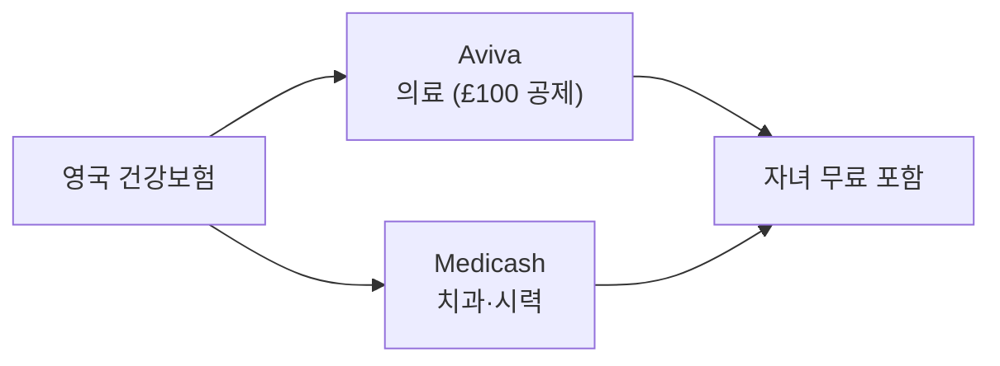

PostHog는 전 세계에 분산된 팀에게 최대한 동일한 혜택을 제공하려 하지만, 국가별 규정과 이용 가능한 서비스에 따라 세부 사항이 달라진다[^1]. 공통 복리후생은 [복리후생](pages/b4295a6b6a0d.md) 참고.

## 국가별 혜택 요약

| 국가 | 연금/퇴직 | 건강보험 | 기타 |
|------|-----------|----------|------|
| 미국 | 401k (회사 4% 매칭) | UnitedHealthcare + Guardian | FSA / HSA |
| 영국 | Royal London (회사 4%, 개인 5%) | Aviva + Medicash | 직장 보육 지원, Cyclescheme |
| 기타 (Deel EOR) | 현지 법규 기준 | 국가별 상이 | — |

## 미국

### 401k

미국의 퇴직연금 플랜은 [Vestwell](https://connect-b.vestwell.com/)이 운영하며, 회사가 최대 4%를 매칭한다[^2].

### 건강보험

건강보험은 [BambooHR](https://posthog.bamboohr.com/login.php)에서 등록하고, 아래 기관을 통해 관리한다[^3].

| 항목 | 보험사 | 회사 부담 |
|------|--------|-----------|
| 의료 (Medical) | UnitedHealthcare — Platinum 플랜 | 구성원 100%, 부양가족 75% |
| 치과·시력 (Dental & Vision) | Guardian | 구성원 100%, 부양가족 75% |

### FSA / HSA

| 계좌 | 조건 | 연간 한도 | 특징 |
|------|------|-----------|------|
| FSA (Flexible Savings Account) | 기본 플랜 | $3,400 | 연말 잔액 소멸 ("use it or lose it")[^4] |
| HSA (Health Savings Account) | HDHP(고공제 플랜) 선택 시 | 별도 | 연말 잔액 이월, 세금 혜택 추가[^5] |

## 영국

### 연금

영국 연금은 [Royal London](https://www.royallondon.com/)을 통해 운영된다[^6].

| 항목 | 내용 |
|------|------|
| 구성원 기여 | 5% |
| 회사 기여 | 4% |
| 탈퇴 | 언제든 가능 |
| 이전 | 원하는 주기로 개인 연금으로 이전 가능 |
| 기여 변경 | Parallel Employee benefits 앱에서 요청[^7] |

### 건강보험

- **Aviva** — 민간 의료보험, 정책 연간 £100 초과 부담[^8]
- **Medicash** — 치과·시력 현금 플랜. 자녀 무료 포함[^9]
- 두 혜택 모두 **과세 혜택**으로 처리되어 Personal Allowance에 영향을 준다[^10]
- 언제든 1개월 통보 후 탈퇴 가능[^11]

### 직장 보육 지원 (Nursery Scheme)

[직장 보육 지원 제도](https://www.workplace-nursery.net/)를 통해 세전 급여로 보육비를 납부할 수 있다. 최대 45%까지 절감 가능하다[^12].

**이용 절차:**
1. 이용 중인 보육시설이 해당 제도에 참여하는지 확인한다
2. Kendal에게 메시지를 보내 설정을 요청한다

### Cyclescheme

[Cyclescheme](https://www.cyclescheme.co.uk/)을 통해 자전거 관련 용품을 절약된 비용으로 구매할 수 있다[^13]. [Workplace Extras 등록 양식](https://app.workplaceextras.com/employee-register/9a1bc53)에서 계정을 활성화한다.

## 기타 국가

### 연금

Deel의 EOR(Employer of Record) 서비스로 고용된 국가에서는 현지 법적 요건에 맞게 연금 기여가 이루어진다[^14].

> **유의:** 현재 계약직(Contractor) 구성원에게는 법적 이유로 연금을 제공할 수 없다[^15].

### 건강보험

민간 건강보험은 현지 시장 기준에 해당하는 국가에서 제공된다[^16].

| 국가 | 제공 방식 |
|------|-----------|
| 아일랜드, 스페인, 네덜란드, 포르투갈, 캐나다 | Deel 플랫폼 통해 제공. 시장·제공 여건에 따라 변경 가능 |
| 기타 | Deel에 로그인하여 해당 국가 정책 확인 또는 Ops팀 문의 |

[^1]: 04-benefits.md, Country specific benefits 절 — "With everyone being distributed across the world, we do our best to provide the same benefits to everyone, but they vary slightly by country depending on the services that are available and local regulations."
[^2]: 04-benefits.md, 401k contribution 절 — "our 401k plan is managed by [Vestwell](https://connect-b.vestwell.com/) and we match up to 4%."
[^3]: 04-benefits.md, Health care 절 — "you'll enroll in benefits through [BambooHR](https://posthog.bamboohr.com/login.php) and manage your coverage through [UnitedHealthcare](https://member.uhc.com/) for medical and [Guardian](https://www.guardiananytime.com/) for dental and vision."
[^4]: 04-benefits.md, Health care 절 — "any dollars that are not spent by the end of the year return to the company."
[^5]: 04-benefits.md, Health care 절 — "There is also the option to choose a lower tier, high deductible health plan (HDHP), which will qualify you for a [Health Savings Account (HSA)](https://www.healthcare.gov/glossary/health-savings-account-hsa/) that has further tax benefits beyond what the FSA provides. At the end of the year, any unused money rolls over and the contribution limit resets."
[^6]: 04-benefits.md, Pension 절 — "In the UK, we use [Royal London](https://www.royallondon.com/)."
[^7]: 04-benefits.md, Pension 절 — "If you wish to increase your own pension contributions, you can download the Parallel Employee benefits app and submit the request."
[^8]: 04-benefits.md, Private health insurance 절 — "we use [Aviva](https://www.aviva.co.uk/business/health-protection-wellbeing/health-insurance/) for private healthcare (£100 excess per policy year)"
[^9]: 04-benefits.md, Private health insurance 절 — "[Medicash](https://www.medicash.org/) as our cash plan for dental and vision. Children are included for free."
[^10]: 04-benefits.md, Private health insurance 절 — "Both of these are taxable benefits which will affect your Personal Allowance each tax year"
[^11]: 04-benefits.md, Private health insurance 절 — "you can opt out at any time with 1 month notice."
[^12]: 04-benefits.md, Nursery 절 — "This enables you to pay for your children's nursery using your pre-tax salary, saving you up to 45% in nursery fees."
[^13]: 04-benefits.md, Cyclescheme 절 — "In the UK we offer [Cyclescheme](https://www.cyclescheme.co.uk/) to save money on new cycling gear."
[^14]: 04-benefits.md, Pensions 절 — "In countries where you are employed under Deel's EOR service, we make pension contributions in line with legal requirements."
[^15]: 04-benefits.md, Pensions 절 — "Unfortunately, we are currently legally unable to provide pensions to contractors."
[^16]: 04-benefits.md, Private health insurance 절 — "We offer private health insurance in countries where it is considered market to do so."
