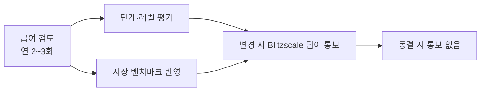
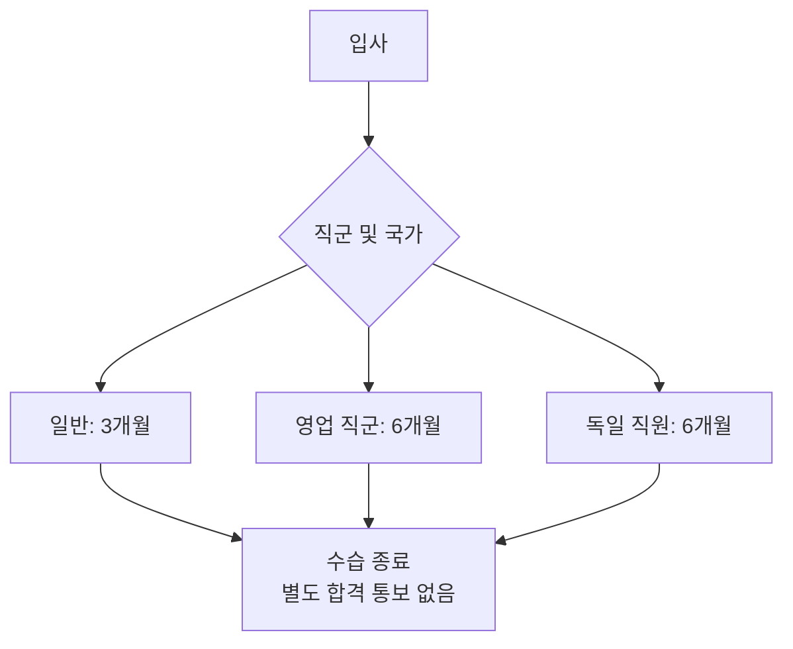

PostHog는 투명성의 일환으로 체계적인 보상 시스템을 운영한다[^1]. 급여는 역할·레벨·위치에 따라 결정되며, 연 2~3회 검토한다. 주식 옵션은 [주식 옵션](pages/7e993cf2523e.md) 페이지에서 별도로 다룬다.

## 레벨(Level)

레벨은 중요도가 아닌 PostHog 내에서의 **임팩트**를 나타낸다[^2]. 레벨은 직함이 아니며, 거대한 직급 계층을 두지 않는다.

| 레벨 | 설명 |
|------|------|
| Junior | 소규모 또는 기능별 프로젝트에 기여 (드물게 채용) |
| Intermediate | 소~중 임팩트 프로젝트 소유 |
| Senior | 고임팩트 프로젝트 또는 전체 제품을 주도·소유, 필요한 모든 조치를 직접 결정 |
| Staff | Senior와 동일하되, 제품·팀·기능을 넘어 전사에 영향을 미치는 대형 프로젝트를 지속 추진 |
| Director | 최고 수준 운영, 통상 Blitzscale 팀 멤버이자 매니저의 매니저 |
| Principal (Director 동급) | Staff와 동일하나 극히 희귀한 기술 또는 매우 높은 수준의 운영 |

레벨 결정은 체크리스트가 아니라 Blitzscale 팀이 다른 구성원과의 비교를 토대로 판단한다[^3]. 레벨 이동 방법은 [커리어 성장](pages/20b97f97f7e3.md) 참고.

## 단계(Step)

각 레벨 내에서 세부 단계를 두어 급여 유연성을 확보한다[^4].

| 단계 | 기준 |
|------|------|
| Learning | 기대치에 부합하기 시작 |
| Established | 기대치에 부합 |
| Thriving | 기대치 초과 |
| Expert | 기대치 지속 초과 |

경력 초기이거나 해당 유형의 역할이 처음인 경우를 제외하고, **기본적으로 Established 단계로 입사**한다[^5]. 급여 검토 시 비슷한 역할의 동료와 비교해 단계를 상향 조정한다.

## 벤치마크(Benchmark)

모든 역할의 벤치마크는 **샌프란시스코 시장 임금**을 기준으로 한다[^6]. 데이터 출처는 [Pave](https://www.pave.com/marketdata)다.

| 직군 | 목표 분위 |
|------|----------|
| 엔지니어링 | 90th percentile (최상위권) |
| 그 외 직군 | 50th percentile + 20% |

엔지니어링 시장의 경쟁이 치열하고 평균과 최상위 엔지니어의 10배 차이를 고려해 최상위에 가까운 임금을 지향한다[^7].

## 위치 계수(Location Factor)

위치 계수는 **생활비가 아닌 시장 채용 비용**을 기준으로 한다[^8]. 예를 들어 샌프란시스코보다 생활비가 높은 도시가 있어도 샌프란시스코의 계수가 최고다. GitLab의 위치 계수 데이터(ERI·Numbeo·Comptryx·Radford·Robert Half·Dice 복합)를 주로 활용한다[^9].

- 미국 내 최저 계수: **0.8**
- 그 외 지역 최저 계수: **0.6**[^10]

급여는 현지 환율로 계산되며 **원칙적으로 현지 통화**로 지급한다[^11]. 위치 계수에 환율이 이미 반영되어 있으므로 환율 변동 시 별도로 갱신하지 않는다.

## 임원 보상

임원 역할은 별도의 유료 벤치마크 데이터베이스를 사용하며 공개하지 않는다[^12]. 평균 이상이지만 최상위권은 아닌 수준으로 지급한다. 역할 하나에 한 명만 존재하므로 내부 비교 시스템을 별도로 두지 않는다[^13].

## 급여 검토(Pay Review)

PostHog는 **연 2~3회** 급여를 검토하며, 모든 구성원이 매번 검토 대상이다[^14]. 별도 신청 없이 자동 진행된다.

주요 원칙:

- **인플레이션 별도 반영 안 함** — 시장 데이터에 이미 포함[^15]
- **벤치마크 상향 시** 레벨·단계가 낮아지더라도 실제 급여는 오를 수 있다[^16]
- **급여 담당은 Blitzscale 팀** — 매니저가 보상을 결정하지 않는다[^17]
- **요청 횟수 무관** — 미표현 그룹의 형평성을 위해 요청 빈도를 반영하지 않는다[^18]
- **변경 있을 때만 연락** — 동결 시 별도 통보 없다[^19]

직무 변경 시 급여 조정은 **다음 급여 검토 때** 이루어진다[^20].

### 재배치(Relocation)

이사하면 새 위치의 위치 계수에 맞춰 급여가 조정(인상 또는 인하)된다[^21]. 급여 인상이 수반되면 **사전 승인이 필요**하다. 노마드인 경우 향후 6개월 중 가장 많은 시간을 보내는 국가의 계수를 적용한다[^22].

## 수습 기간(Probation Period)

| 조건 | 내용 |
|------|------|
| 직원 자진 퇴사 통보 | 1주일 |
| 회사가 계약 종료 | 4주치 기본급 지급, 통상 당일 업무 종료[^23] |
| 독일 직원 (쌍방) | 1개월 사전 통보[^24] |

수습 종료 시 별도 합격 통보는 없다. 30/60/90일 체크인을 통해 성과를 지속 확인한다[^25].

영업 직군의 6개월 수습은 3개월 내에 계약 성사 여부를 판단하기 어렵기 때문이다[^26]. 독일의 6개월 수습은 현지 고용 관행 및 운영 현실을 반영한다[^27].

## 고용 계약 및 급여 지급

### 고용 형태

PostHog는 세 국가에 법인을 보유한다[^28].

| 지역 | 고용 형태 |
|------|----------|
| 미국·영국·독일 | PostHog 또는 자회사 직접 고용 |
| 그 외 국가 | [Deel](https://app.letsdeel.com/)을 통한 EOR(고용대행) |
| 일부 독립 계약자 | Deel로 월 청구서 발행 |

Deel을 통해 고용된 경우에도 권리와 복리후생은 동일하다[^29]. 독립 계약자는 자신의 세금을 직접 납부해야 한다[^30].

### 급여 지급 주기

| 지역 | 주기 |
|------|------|
| 영국 + 국제 계약자 | 매월 말 영업일 이전[^31] |
| 미국 | 매월 15일 및 말일 (월 2회)[^32] |
| Deel | 매월 말 영업일[^33] |

> **퇴직금·해고 조건 전체:** [오프보딩 정책](pages/4fb1cff05ca1.md) 참고.
> **주식 옵션:** [주식 옵션](pages/7e993cf2523e.md) 참고.

[^1]: 08-compensation.md, How it works 절 — "We have a set system for compensation as part of being transparent."
[^2]: 08-compensation.md, Level 절 — "Level does not correlate with increased importance, but with impact within PostHog."
[^3]: 08-compensation.md, Level 절 — "also based on other people within PostHog."
[^4]: 08-compensation.md, Step 절 — "Within each level, we believe there's a place to have incremental steps to allow for more flexibility."
[^5]: 08-compensation.md, Step 절 — "we hire into the *Established* step by default."
[^6]: 08-compensation.md, Benchmark 절 — "the benchmark for each role we are hiring for is based on the market rate in San Francisco."
[^7]: 08-compensation.md, Benchmark 절 — "we pay near the top of market, which we define as being the 90th percentile, at the time of review. For other roles we still try to pay towards the top of market, which we define as 50th percentile + 20%."
[^8]: 08-compensation.md, Location factor 절 — "Location factors are based on _cost of market_, not cost of living."
[^9]: 08-compensation.md, Location factor 절 — "GitLab uses a combination of data from Economic Research Institute (ERI), Numbeo, Comptryx, Radford, Robert Half, and Dice to calculate what a fair market rate is for each location."
[^10]: 08-compensation.md, Location factor 절 — "We set a floor of 0.8 in the US, and 0.6 everywhere else, to avoid creating huge disparities in pay"
[^11]: 08-compensation.md, Location factor 절 — "You will always be paid in your local currency, unless there is a very good reason not to"
[^12]: 08-compensation.md, Executive compensation 절 — "we use a separate database of compensation benchmarks rather than this calculator. The terms of access to this (paid) database means that we're not able to share it publicly."
[^13]: 08-compensation.md, Executive compensation 절 — "executives are paid above average but not top of market."
[^14]: 08-compensation.md, Pay reviews 절 — "We review pay proactively 2-3 times a year, and everybody on the team is reviewed at every pay review."
[^15]: 08-compensation.md, Pay reviews 절 — "When we review pay we don't take inflation into account, as this is already accounted for by market data."
[^16]: 08-compensation.md, Pay reviews 절 — "when a benchmark is increased, it's not unusual for your level and step to come down. You will still get a pay increase"
[^17]: 08-compensation.md, How the review process works 절 — "Any increases will be communicated by the relevant Blitzscale team member"
[^18]: 08-compensation.md, How the review process works 절 — "we do not factor in how frequently someone requests one."
[^19]: 08-compensation.md, How the review process works 절 — "You will only hear from them if there has been a change in your pay, not if it is staying the same."
[^20]: 08-compensation.md, How the review process works 절 — "if you change role for example, any changes will usually happen at the next closest review."
[^21]: 08-compensation.md, Relocating 절 — "your salary may be adjusted (up or down) to your new location."
[^22]: 08-compensation.md, Relocating 절 — "we will set your location factor for the place that you are spending the most time in over the next 6 months."
[^23]: 08-compensation.md, Probation period 절 — "PostHog will pay you 4 weeks' base salary pay, but usually ask you to finish on the same day."
[^24]: 08-compensation.md, Probation period 절 — "During probation, either PostHog or the German employee may choose to end the employment contract with 1 month notice."
[^25]: 08-compensation.md, Probation period 절 — "the default is no communication."
[^26]: 08-compensation.md, Probation period 절 — "People in sales roles, such as Account Executives, have a 6 month probation period - this is to account for the fact that it can be difficult to establish whether or not someone is able to close contracts within their first 3 months"
[^27]: 08-compensation.md, Probation period 절 — "German employees also have a 6 month probation period - this is to align with market standard best practices and expectations for hiring in Germany"
[^28]: 08-compensation.md, Contracts 절 — "We currently operate our employment contracts in the three geographic regions where we have business entities:"
[^29]: 08-compensation.md, Contracts 절 — "This doesn't affect your rights or benefits."
[^30]: 08-compensation.md, Contracts 절 — "As a contractor, you will be responsible for your own taxes."
[^31]: 08-compensation.md, Payroll 절 — "In the UK and for international contractors, we run payroll monthly, on or before the last working day of the month."
[^32]: 08-compensation.md, Payroll 절 — "In the US, we run payroll twice a month, on the 15th and on the last day of the month."
[^33]: 08-compensation.md, Payroll 절 — "Deel runs payroll on the last working day of the month."
