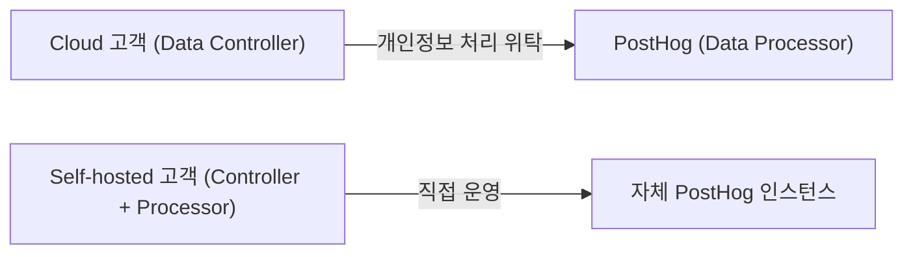
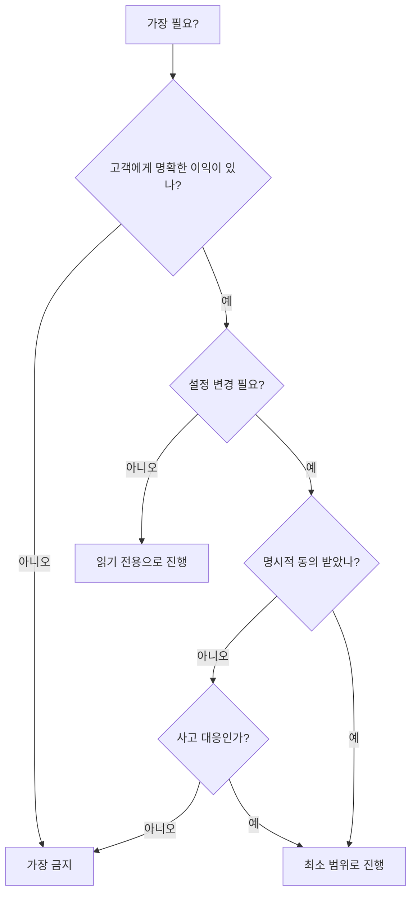

PostHog 팀 전원이 반드시 따라야 하는 보안 지침이다. 위반 시 회사 전체와 모든 사용자가 위험에 처할 수 있어 매우 엄격하게 적용한다[^1].

## 다중 인증 (MFA)

모든 팀원은 계정에 MFA를 활성화해야 한다[^2]. **패스키(Passkey)가 권장 방식**이다 — 피싱 저항성이 높고 사용이 간편하며 Google Workspace, GitHub, 1Password, macOS 등 주요 서비스에서 지원한다[^3].

| 방식 | 상태 | 비고 |
|------|------|------|
| 패스키 | **권장** | Google Workspace·GitHub 최소 설정 필요. 1Password에 저장 권장 |
| Yubikey | 비권장 (중단) | 기존에는 2개 구매·설정 필수였으나 패스키로 대체됨 |

신입은 첫 주 안에 패스키를 설정해야 계정 잠금을 방지할 수 있다[^4].

## 모바일 기기 관리 (MDM)

모든 노트북은 [Fleet](https://fleetdm.com/)으로 관리한다[^5]. Fleet가 적용하는 보안 정책:

- 최소 비밀번호 길이
- 화면 잠금
- 소프트웨어 업데이트 자동 설치
- 1Password 자동 프로비저닝
- 파일시스템의 정적 SSH 키 부재[^6]

공급망 공격 조사(악성 패키지·브라우저 확장 프로그램 노출 여부 확인)에도 Fleet를 활용한다[^7].

Fleet가 **수집하지 않는** 항목: 화면, 메시지·사진, 입력 내용, 방문 URL[^8].

모든 프로비저닝 정책은 git에 저장되며, 팀원 누구나 macOS 메뉴바의 Fleet 아이콘 → "My device"에서 보안팀과 동일한 데이터를 볼 수 있다[^9].

## SOC 2

PostHog Cloud는 SOC 2 컴플라이언스 요건을 충족하는 보안 프로그램을 운영한다. 이 정책은 GDPR에도 적용된다[^10].

## GDPR

PostHog Cloud 고객 관계에서 PostHog는 **데이터 처리자(Data Processor)**, 고객은 **데이터 관리자(Data Controller)**다. Self-hosted 고객은 처리자·관리자를 모두 겸한다[^11].

### 데이터 처리자로서의 의무

PostHog Cloud는 고객 최종 사용자와 직접 상호작용하지 않으며 개인정보를 자동 수집하지 않는다[^12].

| 조치 | 내용 |
|------|------|
| DPA 체결 | 요청 시 고객과 데이터 처리 계약 체결, 체결 목록 관리[^13] |
| 데이터 호스팅 위치 | EU(eu-central-1, 독일) 또는 US(us-east-1, 버지니아) 선택[^14] |
| 데이터 이전 | 영국·EU·EEA → 미국 이전 시 EU 표준 계약 조항(SCCs) 적용[^15] |
| ICO 등록 | 영국 정보위원회에 Hiberly Ltd. 명의 등록[^16] |

**데이터 보호 책임자(DPO):** Charles Cook (VP Operations). 문의: privacy@posthog.com[^17].

## CCPA

캘리포니아 소비자 개인정보 보호법(CCPA)에 따라 PostHog는 PostHog Cloud 고객의 서비스 제공자(Service Provider)로만 활동한다 — GDPR의 처리자 정의와 유사하다[^18].

- 고객 최종 사용자의 CCPA 요청(데이터 삭제 포함) 이행 도구를 제공한다[^19].
- 고객 최종 사용자 데이터는 제3자에게 판매하지 않는다[^20].

## 침투 테스트

연 1회 실시하며, 가장 최근 테스트는 2025년 5월에 완료했다. 보고서는 [Trust Center](https://trust.posthog.com)에서 확인할 수 있다[^21].

## 취약점 보고 (Responsible Disclosure)

| 채널 | 주소 |
|------|------|
| 취약점 공개 프로그램 | bugcrowd.com/engagements/posthog-vdp-pro |
| 이메일 | security-reports@posthog.com |

유효한 발견 사항은 PostHog 굿즈로 보상한다[^22].

## 피싱 신고

피싱 이메일·문자·WhatsApp 수신 시 스크린샷을 찍어 `#phishing-attempts` 채널에 게시한다. 이메일 원본 전달을 요청받을 수 있다: security-internal@posthog.com[^23].

## 소셜 엔지니어링 방지

소셜 엔지니어링 공격 대응 모범 사례는 Communication Methods 문서를 참고한다[^24].

## 고객 계정 가장 (Impersonation)

PostHog 직원은 서비스 제공을 위해 고객 데이터에 접근하거나 사용자로 로그인(가장)할 수 있다[^25]. 준수 원칙:

1. **명확한 이익이 있을 때만** — 사고 조사, 지원 문제 해결, 설정 검토 등[^26].
2. **동의 없이 설정 변경 금지** — 단, PostHog 서비스에 영향을 미치는 사고·잘못된 설정 대응은 예외[^27].
3. **사전 허가 요청 권장** — 지원 티켓 제출은 계정 조사 동의로 간주. 고객이 명시적으로 거부하지 않는 한 별도 허가 요청 불필요[^28].
4. **판단력 발휘** — 불확실하면 동의를 구하거나 내부 PostHog 인스턴스를 통해 정보 확인[^29].

### MCP 서버를 통한 가장

PostHog MCP 서버에 고객 계정으로 연결할 때도 동일한 규칙이 적용된다[^30].

- OAuth 연결과 모든 MCP 도구 호출을 가장 행위로 취급한다.
- 고객의 명시적 동의 없이는 읽기 전용 모드를 유지한다.
- 필요한 조직·프로젝트만 인가하고, 완료 후 로그아웃한다.

[^1]: 06-security.md, Overview — "It is critical that everyone in the PostHog team follows these guidelines. We take people not following these rules very seriously - it can put the entire company and all of our users at risk if you do not."
[^2]: 06-security.md, Multi-factor authentication — "All team members are required to enable multi-factor authentication (MFA) on their accounts."
[^3]: 06-security.md, Multi-factor authentication — "they are phishing-resistant, easy to use, and supported by most major services including Google Workspace, GitHub, 1Password, and macOS."
[^4]: 06-security.md, Multi-factor authentication — "If you are new, please do this within your first week so you don't get locked out."
[^5]: 06-security.md, Mobile device management (MDM) — "We use [Fleet](https://fleetdm.com/) to manage all of our laptops."
[^6]: 06-security.md, Mobile device management (MDM) — "It applies targeted policies that raise the security baseline of every device, including:"
[^7]: 06-security.md, Mobile device management (MDM) — "We also use Fleet to investigate supply chain attacks, for example to see whether any laptops have been exposed to a malicious package or browser extension."
[^8]: 06-security.md, Mobile device management (MDM) — "Fleet does not see:"
[^9]: 06-security.md, Mobile device management (MDM) — "all of the policies we provision are stored in git at"
[^10]: 06-security.md, SOC 2 — "These policies are also relevant for GDPR (see below)."
[^11]: 06-security.md, GDPR — "If a customer is using PostHog Cloud, then PostHog is acting as **Data Processor** and the customer is the **Data Controller**."
[^12]: 06-security.md, PostHog's obligations as a Data Processor — "nor does the platform automatically collect personal data."
[^13]: 06-security.md, PostHog's obligations as a Data Processor — "We enter into Data Processing Agreements ('DPAs') with PostHog Cloud customers when requested... We maintain a register of all DPAs we have entered into."
[^14]: 06-security.md, PostHog's obligations as a Data Processor — "Customers can choose whether to host data on our AWS servers in the EU (eu-central-1 in Germany) or the US (us-east-1 in Virginia)."
[^15]: 06-security.md, PostHog's obligations as a Data Processor — "we rely on [EU Standard Contractual Clauses](https://docs.google.com/document/d/1reTUk6VTsTLo1ErNYn-Tdmj_ETo8QYNH6tNCaebDwpE/edit?usp=sharing) (SCCs)."
[^16]: 06-security.md, PostHog's obligations as a Data Processor — "We are registered with the Information Commissioner's Office in the United Kingdom as Hiberly Ltd., which is the legal name for our UK entity."
[^17]: 06-security.md, GDPR — "Charles Cook (VP Operations) is our assigned Data Protection Officer and is responsible for overseeing compliance. Customers can email privacy@posthog.com for any questions relating to GDPR or privacy more generally."
[^18]: 06-security.md, CCPA — "Under the California Consumer Privacy Act (CCPA), PostHog as a Service Provider to PostHog Cloud customers only. This is similar to the Processor definition under GDPR."
[^19]: 06-security.md, CCPA — "We give all PostHog customers the tools to easily comply with their end users' requests under CCPA, including deletion of their data."
[^20]: 06-security.md, CCPA — "customer data is never sold to third parties."
[^21]: 06-security.md, Pen tests — "We conduct these annually, most recently in May 2025"
[^22]: 06-security.md, Responsible disclosure — "Valid findings will be rewarded with PostHog swag."
[^23]: 06-security.md, Reporting phishing — "You may be asked to forward the email to [security-internal@posthog.com](mailto:security-internal@posthog.com) for further inspection."
[^24]: 06-security.md, Secure communication (aka preventing social engineering) — "We follow several best practices to combat social engineering attacks."
[^25]: 06-security.md, Impersonating users — "PostHog employees may occasionally need to access customer data or log in as a user (i.e. *impersonate* them)."
[^26]: 06-security.md, Impersonating users — "to investigate an incident, resolve a support issue"
[^27]: 06-security.md, Impersonating users — "Exceptions to this are cases where we are reacting to incidents or bad configurations that are negatively impacting PostHog services"
[^28]: 06-security.md, Impersonating users — "Ask for permission whenever possible... When a customer raises a support ticket, we take this as consent to be able to impersonate their account and investigate based on the contents of the ticket. Customers will not be actively asked for permission by our support engineers when they are investigating a ticket, and the customer should inform us in the ticket if they explicitly do not wish for our support engineers to access their account."
[^29]: 06-security.md, Impersonating users — "**Use good judgment.**"
[^30]: 06-security.md, Impersonating users via MCP — "The same rules apply when you connect the PostHog MCP server while logged in as a customer. Treat the OAuth connection and every MCP tool call as actions taken while impersonating them. Use read-only mode unless the customer has explicitly agreed to changes, only authorize the organization and project you need, and log out when you're finished."
