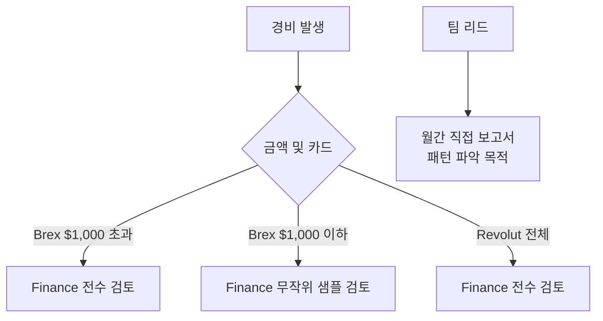
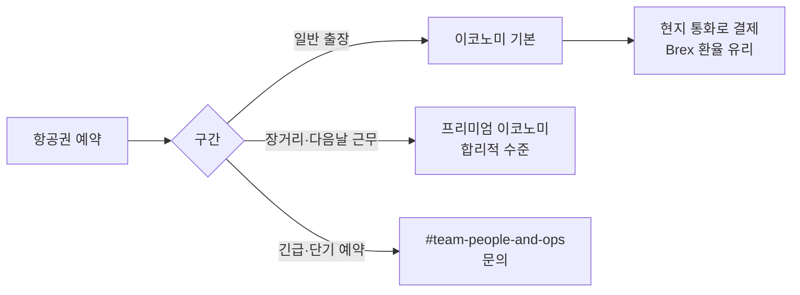

PostHog는 신뢰 기반의 자율 경비 정책을 운영한다. 불필요한 지출을 줄이되, 구성원의 생산성·건강·만족을 우선한다[^1]. 개인 신용카드 사용은 원칙적으로 금지되며, Brex(전 직원) 또는 Revolut(영국 직원)만 사용한다[^2].

> **참고:** 코워킹 공간·WeWork 이용·오프사이트 개요는 [복리후생](pages/b4295a6b6a0d.md) 참고.

## 지출 원칙

두 가지 질문에 모두 "예"이면 지출 가능하다[^3]

- 이 지출이 PostHog에 이익이 되는 이유를 명확히 설명할 수 있는가?
- 이 지출을 전체 팀에 공개적으로 설명해도 불편하지 않은가?

확신이 없으면 팀 리드에게 **허락이 아닌 맥락**을 구한다[^4]. 더 확신이 없으면 Janani에게 `#team-people-and-ops`에서 질문한다[^5].

## 경비 한도 및 카드 사용

| 항목 | 내용 |
|------|------|
| 1인당 월 한도 | $5,000 (Brex User Limit) |
| 사용 가능 항목 | 개인 구독, 코워킹, 장비(노트북·Mac Studio 모니터 제외), 교육 등 |
| 한도 증액 | Brex에서 직접 요청 |
| 모든 경비 가시성 | 회사 전체 공개 |
| 팀 리드 보고 | 월간 직접 보고서 수신 |

노트북과 Mac Studio 모니터는 `#team-people-and-ops`를 통해 별도 신청한다[^6].

### 영국 직원 Revolut 사용 조건

영국 직원은 **영국 VAT가 포함된 £75 초과** 지출에 Revolut을 사용한다. 해당 조건이 아니면 Brex를 쓴다[^7]. Revolut 사용 시 청구서 수신처를 **Hiberly Ltd**와 등록 주소로 지정해야 한다[^8].

### 해외 사용

해외에서 Brex 사용 시 현지 통화를 선택한다 — Brex 환율이 더 유리하기 때문이다[^9]. 해외 로밍 요금은 회사가 부담하지 않으며, 합리적인 수준의 eSIM은 경비 처리 가능하다[^10].

## 영수증 및 메모

$75 또는 £75 초과 지출에는 **14일 이내**에 세부 영수증과 메모를 첨부해야 한다[^11].

| 카드 | 영수증 제출 방법 |
|------|----------------|
| Brex | Brex 앱·문자·이메일·Slack |
| Revolut | ukinvoices@posthog.com으로 이메일 |

영수증은 **세부 항목이 포함된 원본**이어야 한다 — 금액만 찍힌 이미지나 카드 단말기 확인증은 인정되지 않는다[^12].

**메모 양식 예시**[^13]
- What: 구매한 항목/서비스
- Why: 비즈니스 이유 — PostHog 또는 업무에 어떻게 도움이 되는지
- Context: 관련 세부 사항 — 참석자, 프로젝트 등

영수증·메모 없이 반복적으로 정책을 무시하면 해당 금액이 급여에서 공제될 수 있다[^14].

## 경비 검토 프로세스

Finance 검토 기준[^15]
- Brex $1,000 초과 — 전수 검토
- Brex $1,000 이하 — 무작위 샘플링
- Revolut 전체 — 전수 검토

팀 리드는 Finance가 알지 못하는 맥락을 갖고 있으므로, 보고서를 받으면 미시적 관리보다 패턴 파악에 집중한다[^16].

## Brex 예산 구조

| 예산 항목 | 담당자 | 내용 |
|-----------|--------|------|
| 전사 오프사이트 | Kendal | 회사 전체 오프사이트 |
| 혼합 팀 오프사이트 | Kendal | 부서 간 오프사이트 |
| 소규모 팀 오프사이트 | Kendal | 소규모 팀 자체 오프사이트 |
| 온보딩 오프사이트 | Kendal | 신규 입사자 오프사이트 |
| 회사 소프트웨어 | Janani | 전사 공통 구독·도구 |
| 개인 한도 (User Limit) | 개인 | 월 $5,000 — 코워킹·교육·개인 구독 등 |

오프사이트 참여 시 **반드시 오프사이트 예산**을 사용한다. 개인 User Limit을 사용하면 안 된다[^17]. 구독·정기 결제는 User Limit 연결 가상카드를 사용하면 자동으로 올바른 예산으로 분류된다[^18].

## 부적절한 지출

다음은 부적절한 지출로 감사인에게 과세 혜택으로 처리될 수 있다[^19]

- 출장 중 개인 비용 (헬스장, 식료품 등)
- 개인용 엔터테인먼트 구독 (Spotify, Netflix, Amazon Prime 등)
- 업무보다 개인에게 혜택이 되는 지출
- 공개적으로 설명하기 불편한 지출

오해로 인한 경우 사내 clarification을 받는다. 의도적인 정책 위반은 중대한 위반 행위로 처리될 수 있다[^20].

## 장비 구입 가이드

### 노트북 및 모니터

노트북과 Apple Studio Display는 `#team-people-and-ops`를 통해 Tara에게 문의한다 — 고정자산 회계 처리를 위해 중앙에서 구매를 관리한다[^21].

**퇴직 시 노트북과 Apple Studio Display는 반납해야 한다[^22].**

Apple Studio Display 지급 대상[^23]
- 제품 엔지니어 (고밀도 화면 필요)
- 영업·CS·온보딩 팀 (내장 웹캠·마이크 필요)

다른 팀은 Clarity Pro 27" 또는 LG 모니터 같은 대안을 개인 한도로 구입할 수 있다[^24].

**노트북 권장 사양**[^25]

| 직군 | 모델 | 사양 |
|------|------|------|
| 엔지니어링 (제품·플랫폼·지원) | MacBook Pro 14" M5 Pro | 18코어 CPU, 20코어 GPU, 64GB RAM |
| 영업·CS | MacBook Pro 14" M5 | 10코어 GPU, 16코어, 32GB RAM |
| 기타 | MacBook Pro | 가용 모델로 지급 |

노트북 교체 신청 조건[^26]
- 4년 이상 사용
- (엔지니어링) RAM 48GB 미만
- 생산성에 현저한 영향

키보드 배열은 **영문(US·International·British)만 구입** — 다른 구성원에게 전달하기 위해서다[^27].

### 기타 장비 구입 한도

| 항목 | 권장 한도 |
|------|-----------|
| 데스크 | $500 |
| 의자 | $500 |
| 키보드 | $250 |

한도 초과분은 개인 부담으로 Brex에서 환급 신청 가능하다[^28]. 중고·리퍼 제품도 적극 권장한다[^29].

## 소프트웨어 가이드

협업형 소프트웨어 신규 도입은 커뮤니케이션 분산을 유발하므로 **강하게 지양**한다. 명확한 이점이 있을 때만 도입한다[^30].

개인 소프트웨어는 개인 선호에 따른다. 팀 전반으로 확산된 도구는 Tara에게 연락해 회사 계정으로 전환을 논의한다[^31].

도구 접근 권한 신청은 Slack에서 Zluri 앱 `/accessrequest` 명령어로 한다[^32].

**AI 코딩 도구** (Cursor, Claude Code 등) 사용은 장려하나, 사용량 기반 요금이 빠르게 오를 수 있다. 대부분 엔지니어의 기준은 월 $200 수준의 단일 최상위 구독이다. 이를 크게 초과하면 설정 문제나 비효율적인 워크플로우일 가능성이 높으므로 팀원들과 설정을 비교한다[^33]. 팀 Claude Code 계정은 Zluri로 추가 요청할 수 있다[^34].

## 출장 정책

### 기본 원칙

- 항공권은 **이코노미 기본**이며 비즈니스석은 지원하지 않는다[^35]
- 장거리 출장이 잦고 다음 날 근무가 있을 때 프리미엄 이코노미는 합리적 수준에서 허용된다[^36]
- 긴급 출장 등 특별한 경우 `#team-people-and-ops`에 문의한다[^37]
- Global Entry 등 입국 편의 프로그램은 Brex로 가입 가능하다[^38]
- PostHog 출장에는 국제 보험이 적용되므로 여행자 보험을 별도 구매하지 않는다[^39]
- 업무용 운전 시 주유비 별도 청구 없이 마일리지 환급을 Brex로 신청한다[^40]
- 마일리지·포인트로 좌석 업그레이드 시: 이코노미를 Brex로 결제하고 이후 개인 포인트로 업그레이드한다[^54]

### 고객 방문

고객 방문 시 식사나 활동으로 교류 기회를 만든다. 규모는 고객에 맞게 결정하며, 개인 User Limit에서 먼저 처리하고 필요하면 Brex에서 증액 요청한다[^41].

방문 규모가 오프사이트 수준(전 팀원·다수 일정)으로 커지면 `#team-people-and-ops`에서 Kendal에게 별도 예산 생성을 요청한다[^42].

### 허브 방문 — SF(Hogpatch)·런던(Hedgehouse)

SF와 런던에는 PostHog 직원이 많아 다른 팀과 직접 협업하기 좋다[^43]. 별도 허브 방문 예산은 없으며 개인 한도에서 사용한다[^44].

방문 시에는 컨퍼런스 참석, 이벤트 발표, 동료들과 특정 프로젝트 협업 등 **목적을 갖고** 방문한다[^45].

같은 장소에 있는 다른 구성원과 저녁 식사나 활동을 함께 하면 PostHog가 비용을 부담한다[^46].

## 자주 묻는 질문

| 질문 | 답변 |
|------|------|
| 개인 카드 사용 가능한가? | 불가. Brex 또는 Revolut만 사용[^2] |
| 실수로 개인 카드 결제했으면? | 90일 이내 Brex에서 환급 요청 (영수증·메모 필수)[^47] |
| 회사 카드로 개인 결제했으면? | Brex 로그인 > 해당 결제 > 'Repay' 선택[^49] |
| 올바른 한도로 재분류하려면? | Brex에서 해당 결제를 올바른 한도로 재할당[^50] |
| 새 팀 도구 구독 담당자는? | Janani를 청구 관리자로 추가[^51] |
| 결제용 이메일 주소는? | finance@posthog.com[^52] |
| 미결제 청구서가 있으면? | Brex 'Bill Pay'로 제출 — 수요일에 처리[^53] |
| WeWork 이용 방법은? | Kendal에게 `#team-people-and-ops`에서 요청[^55] |

[^1]: 09-spending-money.md, Guiding principles 절 — "PostHog is a lean organization - the less we spend, the more time we have to make sure the company takes off. However, it is more important you are productive, healthy, and happy."
[^2]: 09-spending-money.md, Frequently asked questions 절 — "No, you **must use** your Brex or Revolut for all work-related expenses."
[^3]: 09-spending-money.md, Guiding principles 절 — "Can you clearly explain why this expense is in PostHog's best interest?"
[^4]: 09-spending-money.md, Guiding principles 절 — "when in doubt, ask your team lead for context, not permission."
[^5]: 09-spending-money.md, Guiding principles 절 — "Still in doubt? Ask [Janani](https://posthog.com/community/profiles/34497) in [#team-people-and-ops](https://posthog.slack.com/archives/C017WDX3BFZ)."
[^6]: 09-spending-money.md, How it works 절 — "equipment (except laptops and Mac Studio Monitors - ping `#team-people-and-ops` for these)"
[^7]: 09-spending-money.md, UK employees 절 — "Use your Revolut if the expense is over £75 _and_ has UK VAT on it. If not, use your Brex."
[^8]: 09-spending-money.md, UK employees 절 — "Please make sure that the invoice is addressed to Hiberly Ltd and our registered address"
[^9]: 09-spending-money.md, Travel 절 — "When using your Brex internationally, use the local currency since Brex generally offers a better exchange rate."
[^10]: 09-spending-money.md, Travel 절 — "When traveling internationally, use your Brex to expense a reasonable eSIM. PostHog does not cover roaming charges for your phone."
[^11]: 09-spending-money.md, Receipts 절 — "All expenses over $75 or £75 must have itemized receipts attached and memo updated within 14 days of the charge"
[^12]: 09-spending-money.md, Receipts 절 — "Please do not upload cropped images that show just the amount or just the credit card machine confirmation slip - without context, the receipt is pointless"
[^13]: 09-spending-money.md, Receipts 절 — "Template for a thorough memo"
[^14]: 09-spending-money.md, Receipts 절 — "expenses with no receipts above $75 or £75 may be deducted from your pay if we can't verify the business purpose - this is mainly for repeat offenders"
[^15]: 09-spending-money.md, Reviewing expenses 절 — "Random sampling of expenses under $1000 (Brex)"
[^16]: 09-spending-money.md, Team Leads 절 — "You have context Finance doesn't, which will help justify spending decisions to the auditors. How much you dig into these is up to you - the goal is catching patterns, not micromanaging."
[^17]: 09-spending-money.md, Budget structure on Brex 절 — "Joining an offsite? _Only use the offsite budget_, not your User Limit - it helps the People & Ops track travel spend accurately against budgets."
[^18]: 09-spending-money.md, Budget structure on Brex 절 — "For subscriptions and other recurring monthly expenses, we recommend using the virtual card under your User Limit"
[^19]: 09-spending-money.md, How we handle inappropriate spending 절 — "Expenses that could be construed as personal will be flagged as non-business expenses by auditors, as they will be considered a taxable benefit"
[^20]: 09-spending-money.md, How we handle inappropriate spending 절 — "If you knowingly and deliberately spent money in ways that are not in PostHog's best interest, or tried to intentionally circumvent the guidelines, we will probably treat this as [serious misconduct](/handbook/people/grievances)."
[^21]: 09-spending-money.md, Laptop & monitor 절 — "Talk to [Tara](https://posthog.com/community/profiles/34526) who handles most Macbook and Apple Studio Display purchases - ping her on [#team-people-and-ops](https://posthog.slack.com/archives/C017WDX3BFZ)."
[^22]: 09-spending-money.md, Laptop & monitor 절 — "We expect you to ship the Macbook and Apple Studio Display back when you leave PostHog."
[^23]: 09-spending-money.md, Laptop & monitor 절 — "Apple Studio Displays are only for Product Engineers (high density screen) and Sales/CS/Onboarding teams (built-in high quality webcam and microphone)."
[^24]: 09-spending-money.md, Laptop & monitor 절 — "For all other teams that feel they could benefit from an enhanced monitor, there are some really great competitors to the Studio Display at a fraction of the price"
[^25]: 09-spending-money.md, Laptop guidelines 절 — "For engineering roles (product, platform, & support), we recommend a Macbook Pro 14-inch M5 Pro, with the 18-core CPU, 20-core GPU upgrade and 64GB of RAM."
[^26]: 09-spending-money.md, Laptop guidelines 절 — "You can request a new laptop in `#team-people-and-ops` if it is over 4 years old, (for engineering machines) has less than 48GB of RAM, or is significantly impacting your productivity."
[^27]: 09-spending-money.md, Laptop guidelines 절 — "We only purchase laptops with an English keyboard configuration (US, International or British is fine) - this enables us to easily pass your laptop on to someone else if you upgrade or leave."
[^28]: 09-spending-money.md, Other equipment 절 — "If you want something more expensive, you can pay personally and submit a reimbursement request on Brex for up to the amount above."
[^29]: 09-spending-money.md, Other equipment 절 — "Refurbished items usually work just fine."
[^30]: 09-spending-money.md, Software 절 — "We are _strongly opposed_ to introducing new software that is designed for collaboration by default. There needs to be a very significant upside to introducing a new piece of software to outweigh its cost."
[^31]: 09-spending-money.md, Software 절 — "There are some tools used by team members individually - if they become more widely adopted, it makes sense to have a company account."
[^32]: 09-spending-money.md, Software 절 — "You can ask for access to team/company tools by submitted a request in Slack. Find the Zluri app in Slack. type: /accessrequest and press enter."
[^33]: 09-spending-money.md, Software 절 — "AI coding tools (Cursor, Claude Code, etc.) are encouraged, but usage-based pricing can climb fast. Most engineers' monthly spend lands around a single max-tier subscription (~$200/month). If yours is running several times higher, that's usually a misconfiguration or inefficient workflow rather than a genuine need"
[^34]: 09-spending-money.md, Software 절 — "We have a team Claude Code account that you can request to be added to using Zluri in slack."
[^35]: 09-spending-money.md, Travel 절 — "We travel in economy by default and do not pay for business class"
[^36]: 09-spending-money.md, Travel 절 — "It may be worth occasionally upgrading to Premium Economy if you're travelling a lot for work and the cost is not unreasonably high, particularly if you're working the next day"
[^37]: 09-spending-money.md, Travel 절 — "If you find yourself needing to do extra travel outside of the regular things listed above, e.g. you've been asked to take a last minute trip to work on an emergency project, we may pay for a nicer seat here, especially if you are traveling at very short notice or long haul. Ask on [#team-people-and-ops](https://posthog.slack.com/archives/C017WDX3BFZ) if you think this may apply to you."
[^38]: 09-spending-money.md, Travel 절 — "Consider signing up for programs like Global Entry if you are regularly traveling to countries that offer it, using your Brex"
[^39]: 09-spending-money.md, Travel 절 — "PostHog has international insurance for our work trips, so do not buy travel insurance when traveling on behalf of PostHog."
[^40]: 09-spending-money.md, Frequently asked questions 절 — "You can claim a mileage reimbursement through Brex. **Do not** separately expense fuel."
[^41]: 09-spending-money.md, Travel 절 — "When visiting customers (or potential customers), we should look for opportunities to connect with them over a meal. These don't need to be extravagant, but they should be appropriate to the size and expectations of the customer."
[^42]: 09-spending-money.md, Travel 절 — "If the visit grows into something offsite-like (the whole team, multiple days, etc.), post in [#team-people-and-ops](https://posthog.slack.com/archives/C017WDX3BFZ) and tag Kendal so she can create a separate budget for it."
[^43]: 09-spending-money.md, Hub travel budget 절 — "These places generally have a high density of PostHog employees around, so you'll get to meet people from other teams, which makes cross-team work much easier and more successful."
[^44]: 09-spending-money.md, Hub travel budget 절 — "There is no specific travel budget, this can come out of your general employee budget."
[^45]: 09-spending-money.md, Hub travel budget 절 — "we ask that you make the trip worthwhile - attend a conference, speak at an event, gather a few colleagues to come with you at the same time and work on something specific together."
[^46]: 09-spending-money.md, Travel 절 — "If you're in the same place as other team members, even if you aren't directly working together, PostHog will cover the cost of a dinner or a fun activity"
[^47]: 09-spending-money.md, Frequently asked questions 절 — "Claim a reimbursement with an itemized receipt on Brex within 90 days of incurring the expense, with a memo (context on what was the expense for and why your Brex wasn't used)."
[^49]: 09-spending-money.md, Frequently asked questions 절 — "Login to Brex > find the charge > click on 'Repay'."
[^50]: 09-spending-money.md, Frequently asked questions 절 — "Go into your Brex account and [re-assign the charge to the correct limit](https://www.brex.com/support/spending-on-spend-limits#assigning-a-card-to-a-different-limit)."
[^51]: 09-spending-money.md, Frequently asked questions 절 — "Add [Janani](https://posthog.com/community/profiles/34497) as the Billing Admin to manage payments."
[^52]: 09-spending-money.md, Frequently asked questions 절 — "Use finance@posthog.com"
[^53]: 09-spending-money.md, Frequently asked questions 절 — "Finance processes all bill payments on Wednesdays."
[^54]: 09-spending-money.md, Frequently asked questions 절 — "Book an economy ticket using your Brex, then upgrade afterwards using your personal points/card."
[^55]: 09-spending-money.md, Frequently asked questions 절 — "We have a company All Access account - ask [Kendal](https://posthog.com/community/profiles/28628) in [#team-people-and-ops](https://posthog.slack.com/archives/C017WDX3BFZ)."
