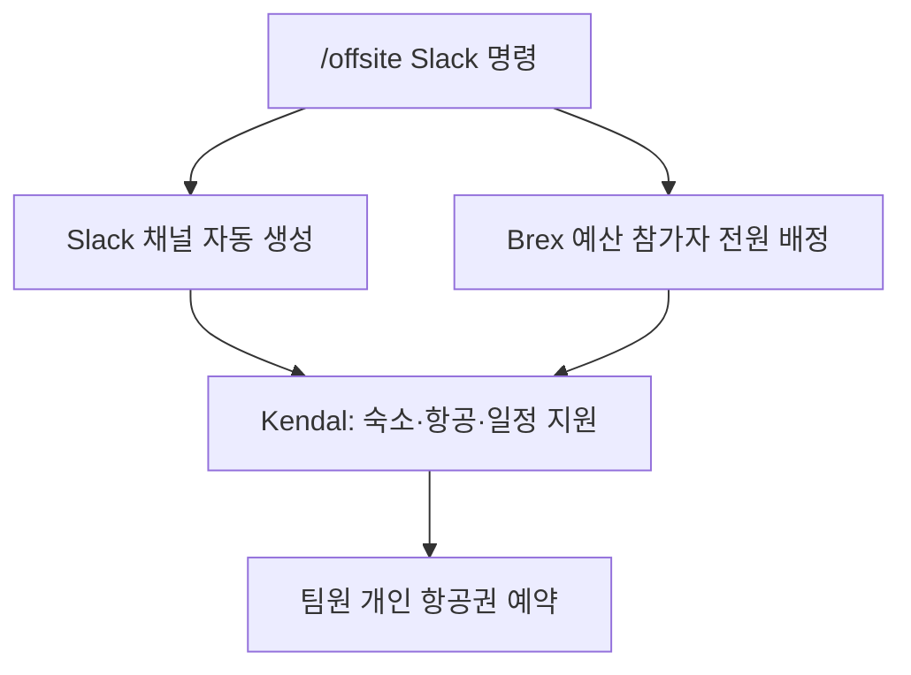

PostHog는 기본적으로 비동기(async) 방식으로 일하지만, 같은 공간에서 직접 함께 만들 때 가장 좋은 아이디어가 나온다는 것을 꾸준히 확인해 왔다[^1]. 개인 일정과 가족 상황을 고려해 균형 잡힌 방식으로 대면 모임을 운영한다.

## 오프사이트 종류와 예산

| 종류 | 주기 | 예산 | 주관 |
|------|------|------|------|
| 전사 오프사이트 | 연 1회 | 1인당 최대 $3,000[^2] | Ops & People 팀 |
| 소규모 팀 오프사이트 | 연 1회 | 1인당 최대 $2,000[^3] | 팀 리드 + Kendal |
| 대면 온보딩 | 신규 입사 시 | [온보딩 절차](pages/9102b30c7db6.md) 참고 | 버디 + People 팀 |
| 자율 대면 미팅 | 자유 | 별도 예산 | 개인 |

## 전사 오프사이트

연 1회 전 직원이 전 세계 한 곳에 모인다. 일요일에 출발해 개막 만찬을 갖고, 한 주 동안 업무·전략·문화·액티비티를 함께 진행한 뒤 금요일에 귀국한다. 가능한 한 모든 참가자에게 개인 침실을 제공한다[^4].

과거 전사 오프사이트 장소: 이탈리아, 포르투갈, 아이슬란드[^5].

### 전형적인 일정

- 구조화된 소셜 이벤트 2회[^6]
- 팀 저녁 식사[^6]
- 24시간 해커톤[^6]
- 전사 전략 세션·워크숍[^6]
- 전사 문화 활동[^6]
- 소량의 자유 시간 (현지 탐방)[^6]

## 소규모 팀 오프사이트

각 팀이 연 1회 자체 오프사이트를 진행한다. App 팀과 Platform 팀은 합동 오프사이트로 진행한다[^7]. 전사 오프사이트와 적절히 간격을 두어 배치하는 것이 권장된다[^8].

오프사이트는 사교 이벤트다. 가능한 한 많은 동료를 만날 수 있도록 최적화하고, 그러기 위해 비용을 더 쓰거나 더 멀리 이동하는 것도 권장한다[^9].

### 권장 거점

샌프란시스코 **Hogpatch** 또는 런던 **Hedge House**를 기본 장소로 삼는다[^10]. 이유:

- 이미 많은 PostHog 직원이 상주하므로 교차 교류(cross-pollination)가 자연스럽게 일어난다[^10]
- SF는 테크 생태계의 중심지이며 Hogpatch에 YC 창업자들이 함께 사용한다[^10]
- 신규 입사자에게 특히 거점 방문이 유익하다[^10]

두 거점 외 장소를 선택할 경우 Kendal에게 이유를 알린다[^11].

### 신청 방법

1. 팀 리드가 Slack에서 `/offsite` 명령으로 신청한다. 입력 항목: 팀 이름, 장소, 날짜, 참가자, 참가 인원[^12]
2. 자동으로 Slack 채널이 생성되고 참가자 전원에게 Brex 예산이 배정된다. 런던·SF 오프사이트는 해당 도시 채널에 공지된다[^12]
3. Kendal이 숙소 정보·지도·항공 트래커·일정 초안을 Canvas에 업데이트하고, 단체 저녁 식사 및 그룹 액티비티를 예약한다[^13]
4. 각 팀원은 항공권을 **직접** 예약한다[^14]

### 운영 가이드라인

| 항목 | 권장 사항 |
|------|-----------|
| 숙소 형태 | AirBnB 선호 — 팀원 교류 시간 증가에 유리 (필수 아님)[^15] |
| 최적 시기 | 분기 계획(Quarterly planning) 주간[^16] |
| 외부 초청 | 성공에 꼭 필요한 사람만 — "있으면 좋을" 정도면 불참[^17] |
| 규모 10명 초과 시 | Kendal 동행 적극 검토 (운영에만 집중하는 담당자 필요)[^18] |
| 시작·종료 시간 | 시간까지 명확히 지정 (효율적 일정 관리)[^19] |
| 해커톤 | 팀 구성·킥오프 담당자 사전 지정, 1인 팀 금지[^20] |
| 사전 준비 | 출발 전 의제와 달성 목표를 확정. 기대치 공유 세션 권장 (FigJam 비동기 가능)[^21] |

### 권장 세션 항목

- **필수:** 360도 피드백 세션 (대면에서 가장 효과적)[^22]
- 발표 README 세션 — "나는 누구 / 이렇게 일한다"[^23]
- 분기·연간 계획 세션[^23]
- 팀 페이지 검토 및 업데이트[^23]
- Dogfooding 세션 — PostHog를 처음부터 설치해 페인 포인트 발견[^23]
- 해커톤 — 최소 2일 확보, 세션이 해킹을 방해하지 않도록[^23]
- 진행 중인 도전적 프로젝트 작업 (지식 교환 최적기)[^23]

> 온보딩 오프사이트에서는 해커톤을 진행하지 않는다. 일반 오프사이트에서는 해커톤 참가를 강력히 권장한다[^20].

## PostHog 거점 시설

### Hogpatch (샌프란시스코)

소규모 팀 오프사이트와 대면 온보딩의 기본 장소 중 하나다. SF 테크 생태계와 YC 창업자 네트워크에 접근할 수 있다[^10]. 자세한 운영 안내는 별도 Hogpatch 핸드북을 참고한다.

### Hedge House (영국)

PostHog는 영국에 두 곳의 Hedge House를 운영한다 — 케임브리지(소규모)와 런던(대규모). 소규모 팀 오프사이트, 대면 온보딩, 내부 해커톤 등에 사용할 수 있으며, 모든 PostHog 구성원이 자유롭게 이용 가능하다[^24].

| 시설 | 위치 | 예약 방법 |
|------|------|-----------|
| Cambridge Hedge House | 케임브리지 (침실 있는 소규모) | Kendal에게 메시지로 가용일 확인 및 예약[^25] |
| London Hedge House | Farringdon–Barbican 사이 (대규모) | Slack 도구 `Hedge House London`으로 자기 서비스[^26] |

런던 Hedge House는 24/7 개방, PostHog 전용 공간이다. Slack 도구에서 전체 주소 확인, 방·데스크 예약, 해당 주 방문 예정자 조회가 가능하며 추가 문의는 Kendal에게 한다[^26].

## 런던 호텔 추천

Hedge House 이용이 어렵거나 추가 숙소가 필요한 경우 Slack `#London` 채널에서 추천된 호텔 목록을 참고한다[^27].

| 호텔 | 위치 |
|------|------|
| Marrable's Farringdon Hotel | Farringdon |
| The Zetter Clerkenwell | Clerkenwell |
| Hotel Indigo Clerkenwell | Clerkenwell |
| Yotel London City | City |
| Z Hotel City | City |
| citizenM Tower of London | Tower of London |
| Clayton Hotel City of London | City |
| Hampton by Hilton Old Street | Old Street |
| hub by Premier Inn Clerkenwell | Clerkenwell |
| Bob W Tower Hill Studios | Tower Hill |
| Ruby Stella Hotel | London |

> 1박 £200 초과 시 대안을 빠르게 검색한다. 평일 기준 £170 내외가 달성 가능한 수준이다[^27]. 날짜를 ±1일 조정해 항공+숙소 합계 비용을 최적화할 수 있다[^27].

## 국경 통과 (비자·입국심사)

일부 국가는 방문 비자(예: 미국 ESTA)가 필요하다[^28]. 미국 등 국경에서 업무 목적 여행에 대한 질문을 받을 때 유의 사항:

- "온보딩" 같은 PostHog 내부 용어 사용을 피한다[^28]
- "트레이닝(training)"이라는 표현도 피한다[^28]
- 처음엔 "동료들과 교류" 또는 "동료들과 비즈니스 미팅" 수준으로 간단히 답한다[^28]
- 추가 질문이 오면 "미국 테크 기업 소속으로 [국가]에서 원격 근무 중이며, 동료들과 며칠간 대면 미팅 후 [날짜]에 귀국 예정"이라고 설명한다[^28]
- 머무는 정확한 주소와 출국 항공편 정보를 미리 준비한다[^28]

## 여행 보험

해외 오프사이트 여행 시 [Embroker](https://www.embroker.com)를 통한 여행 보험 및 배상책임 보험이 적용된다[^29].

비상 상황 발생 시:

1. 관련 비용을 법인카드로 결제하고 영수증 보관[^29]
2. 최대한 빨리 Kendal에게 연락해 보험 청구 진행[^29]

정책 바인더는 [Google Drive 폴더](https://drive.google.com/drive/folders/1nMoHL_W9sW5IqAsILGzQ8Tuz0RgDRXOj?usp=share_link)에서 확인한다[^29].

### 항공 지연

항공사 귀책 사유로 연결편 놓침·숙박이 필요한 경우, 항공사에 숙박비(식사 포함) 부담을 정중하지만 끈기 있게 요청한다. 처음에는 거절하더라도 공손하게 거듭 요청하면 제공하는 경우가 많다[^30].

### 파트너·가족 동반

오프사이트 기간 중 파트너나 가족 동반은 허용되지 않는다. 오프사이트는 팀원과의 집중적인 시간을 극대화하는 것이 목적이기 때문이다[^31]. 오프사이트 전후에 개인 휴가를 붙여 가족과 함께하는 것은 가능하다[^31].

## 8주 기획 체크리스트

소규모 팀 오프사이트 기획 타임라인이다. [스프레드시트 템플릿](https://docs.google.com/spreadsheets/d/1aeRGN8DWqMQbQ9duSMCqCO2JJbPkQuSDt_Jz2jx10UI/edit?usp=sharing)도 참고한다[^32].

| 시점 | 주요 태스크 |
|------|-------------|
| **8주 전** | 날짜 확정, 장소 선정, 팀 공지, Slack 채널 개설[^33] |
| **7주 전** | 숙소 확보, 항공 예약 시작, 일정 초안 작성, 정보 수집 폼 발송[^34] |
| **6주 전** | 예산 초안 작성, 교통 예약, 팀 액티비티 확정, 항공 예약 마감[^35] |
| **5주 전** | 방 배정, 비자 확보, 굿즈 시안 확정, 일정·예산 확정, 세션 리드 배정[^36] |
| **4주 전** | 단체 식사 레스토랑 예약, 잔여 액티비티 예약, 굿즈 주문[^37] |
| **3주 전** | 세션 계획·발표자료 초안, 오프사이트 가이드 패키지 초안, 어워드 디자인[^38] |
| **2주 전** | 세션 계획 최종 검토, 캘린더 블로킹, 필수 용품 담당자 지정[^39] |
| **1주 전** | 최종 전체 점검, 팀에게 최종 가이드 공개[^40] |
| **1일 전** | 타임존 설정, 조직자 하루 먼저 도착, 소모품·식료품 구매, 일정 출력[^41] |
| **1주 후** | 팀에게 회고(post-mortem) 피드백 수집[^42] |
| **2주 후** | 피드백 취합·공유, (선택) 회고 미팅 개최[^42] |

### 날짜 선정 시 고려사항

- 공휴일 회피, 타 오프사이트와의 간격 유지 (여행 피로 최소화)[^33]
- 자녀 있는 팀원의 학교 방학 일정[^33]
- 선정 장소의 계절·날씨[^33]
- 비자 취득 용이성과 팀원 이동 거리[^43]
- 월요일 입국·금요일 출국 일정이 예산 절약에 유리[^44]

### 예산 기준값

| 항목 | 기준 |
|------|------|
| 숙소 | 인당 $200/박[^44] |
| 대륙 간 항공 | 인당 $1,000[^44] |
| 대륙 내 항공 | 인당 $500[^44] |
| 지상 교통 | 인당 $50/일[^44] |
| 식음료 | 인당 $50/일[^44] |
| 예비비 | 총 예산의 10%[^44] |

[^1]: 11-offsites.md, 도입부 — "we've consistently found that a lot of our best ideas come from actually building things together in real life"
[^2]: 11-offsites.md, All-company offsites 절 — "we budget up to $3,000 per person in total for these"
[^3]: 11-offsites.md, Small team offsites 절 — "The budget for these trips is up to $2,000 per person in total."
[^4]: 11-offsites.md, All-company offsites 절 — "Usually we'll all fly on Sunday, have an opening dinner, spend the week doing a mix of hard work, strategy, culture and fun activities and we then all fly back home on Friday. We try to ensure that everyone has their own bedroom."
[^5]: 11-offsites.md, All-company offsites 절 — "Our past offsites have been in Italy, Portugal and Iceland."
[^6]: 11-offsites.md, All-company offsites 절 — "A couple of structured social events / Team dinners / 24hr Hackathon / All-hands strategic sessions and workshops / All-hands culture exercises / A small amount of downtime so people can explore"
[^7]: 11-offsites.md, 도입부 — "Once a year: Small Team offsite (app and platform teams do this as a single combined offsite)"
[^8]: 11-offsites.md, Small team offsites 절 — "Ideally they are spaced appropriately through the year in relation to the all-company offsite."
[^9]: 11-offsites.md, Small team offsites 절 — "encourage you to optimize offsites for meeting as many colleagues as is reasonably possible, even if it means spending more money or travelling further"
[^10]: 11-offsites.md, Small team offsites 절 — "Hogpatch in San Francisco or the Hedge House in London should be the default choice, because: They're places where there are already a lot of PostHog people that you can hang out with. If most teams do their offsites there, you're much more likely to run into even more people"
[^11]: 11-offsites.md, Small team offsites 절 — "If you do decide to do a small team offsite somewhere outside of these two hubs, let Kendal know why."
[^12]: 11-offsites.md, Small team offsites 절 — "The team lead should request an offsite through slack using the '/offsite' command. They will need to input: Team name / Location / Dates / Attendees / Number of attendees / This will automatically create a Slack channel and Brex budget for all attendees."
[^13]: 11-offsites.md, Small team offsites 절 — "Kendal will then: Update the team's Canvas with: Accommodation details and a handy map / A flight tracker / A rough itinerary / Look up dining options for a couple of group dinners / Suggest and book a whole group activity for everyone to enjoy together."
[^14]: 11-offsites.md, Small team offsites 절 — "Each team member is still responsible for booking their own flights."
[^15]: 11-offsites.md, Small team offsites 절 — "We prefer AirBnBs over hotels, to give your team even more time to hang out, but this is not mandatory."
[^16]: 11-offsites.md, Small team offsites 절 — "Quarterly planning is a great focal point for team offsites – it's worth scheduling your meetup for the week of planning."
[^17]: 11-offsites.md, Small team offsites 절 — "Outside of your small team, you should only invite people who actually need to attend to make the offsite a success - if it would be 'nice to have' them attend, they shouldn't be going."
[^18]: 11-offsites.md, Small team offsites 절 — "If the number of attendees is >10 actively consider if Kendal should be attending so there is a person attending whose only focus is making sure it goes well"
[^19]: 11-offsites.md, Small team offsites 절 — "Specify offsite start and end times down to the hour, for clarity and efficient use of everyone's time."
[^20]: 11-offsites.md, Small team offsites 절 — "Don't run a hackathon during an onboarding offsite. Other offsites normally do have a hackathon. / Given the offsite is an opportunity to work together there should be no teams of one."
[^21]: 11-offsites.md, Small team offsites 절 — "make sure you make the most out of it by having an agenda and an idea of what you want to achieve _before_ the start of the trip. Also, it's a good idea to have an expectation-setting session (can be async in a Figjam) to ensure everyone is on the same page"
[^22]: 11-offsites.md, Small team offsites 절 — "You should do a 360 degree feedback session. It can feel uncomfortable doing these, but almost everyone who's done one at PostHog has come out feeling better and with a whole host of things they can improve. These are best in person."
[^23]: 11-offsites.md, Small team offsites 절 — "360 degree feedback session (mandatory!) / A spoken README session early in the week / Planning session / Look at the team page / Dogfooding session / Hackathon - try to leave 2 days for this / Even some regular work on ongoing challenging projects"
[^24]: 11-offsites.md, Hedge House 절 — "Anyone at PostHog is welcome to use them as much as they like — alongside Hogpatch in San Francisco, these are where you should default to doing team offsites and in-person onboarding."
[^25]: 11-offsites.md, Cambridge 절 — "Message Kendal Ijeh to check availability or make a booking at the Cambridge Hedge House."
[^26]: 11-offsites.md, London 절 — "It's entirely ours, open 24/7 and the perfect place to stay if you're visiting from abroad. Use the Hedge House London slack tool to see the full address, book a room and/or desk, plus see who else will be there during the week you visit."
[^27]: 11-offsites.md, London hotel recommendations 절 — "If hotel prices are above £200 per night, it is worth quickly looking for alternatives as ~£170 per night should be achievable midweek in London. If prices are high, you should optimise travel for total cost (flights & accom) so if you can get cheaper flights or hotel by moving dates +/- 1 day, then look into these options."
[^28]: 11-offsites.md, Border Control 절 — "it's best to avoid using PostHog terms like 'onboarding' as this can be confusing. / it is also usually advisable to only respond with a minimal amount, saying only what is necessary / generally, it is best to avoid using the phrase 'training'"
[^29]: 11-offsites.md, Travel insurance 절 — "we carry travel insurance through as well as general & auto liability policies through our partner Embroker / please cover any related expenses (ideally on your company card) and keep receipts, and then reach out to Kendal as soon as possible"
[^30]: 11-offsites.md, Flight delays 절 — "push the airline to cover the cost of your accommodations (including meals). It's not uncommon for them to initially tell you they no longer offer free hotel rooms for delays that were caused by the airline, but with a little bit of polite coaxing, they will likely give in."
[^31]: 11-offsites.md, Partners / family joining offsites 절 — "we don't allow partners or family to join you for the dates that the offsite / onboarding takes place. / you are able to tack holiday onto either side and for your partner/family to join you for those dates"
[^32]: 11-offsites.md, How to plan an offsite in 8 weeks 절 — "Here's a spreadsheet template you can use with your team to democratically vote for the meetup location"
[^33]: 11-offsites.md, 8 weeks out 절 — "Try to avoid public holidays and be mindful of proximity to other offsites to minimize travel fatigue / School holidays are more difficult for people with children / Be mindful of the season of your chosen location"
[^34]: 11-offsites.md, 7 weeks out 절 — "Secure accommodations / Start flight booking process / Draft rough schedule / Send info gathering form"
[^35]: 11-offsites.md, 6 weeks out 절 — "Draft budget / Secure transportation / Finalize team outings and book as needed / Flights booking deadline"
[^36]: 11-offsites.md, 5 weeks out 절 — "Assign rooms / Secure visas where necessary / Review and finalize merch proofs / Finalize itinerary / Finalize budget / Assign session leads & secretaries"
[^37]: 11-offsites.md, 4 weeks out 절 — "Reserve restaurants for communal meals / Book any remaining activities / Order merchandise"
[^38]: 11-offsites.md, 3 weeks out 절 — "Draft session plans/presentations due / Draft offsite guide package / Design and print superlatives/awards"
[^39]: 11-offsites.md, 2 Weeks Out 절 — "Review and finalize session plans/presentations / Block your calendar and send a reminder in Slack / Designate someone to bring or organise some of the essential supplies"
[^40]: 11-offsites.md, 1 Week Out 절 — "Final plan review / Unveil the final offsite guide to the team"
[^41]: 11-offsites.md, 1 day before 절 — "Add your new timezone as a secondary timezone in Google Calendar / We recommend that the offsite organizer consider arriving a day early / Shop for any miscellaneous supplies and groceries / Print and organize a few paper copies of the itinerary"
[^42]: 11-offsites.md, 1 week after 절 — "Collect post-mortem feedback from the team / Compile post-mortem feedback and share with team / Host post-mortem meeting to discuss any outstanding issues (optional)"
[^43]: 11-offsites.md, 8 weeks out 절 — "Consider choosing a location that is relatively easy for most people to attend without having to travel outrageous distances or deal with difficult visa processes."
[^44]: 11-offsites.md, 6 weeks out 절 — "Accommodations = $200/night/person / Intercontinental airfare = $1000/person; intracontinental airfare = $500/person / Ground transportation = $50/day/person / Food & drinks = $50/day/person / Contingency = 10% of total budget"
