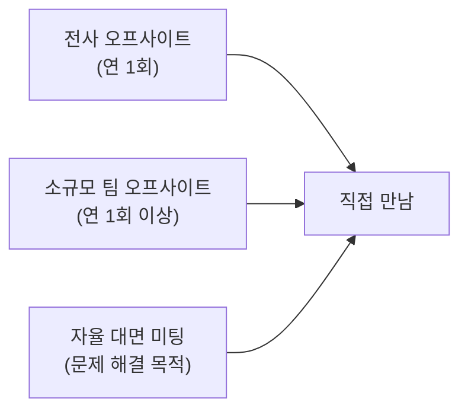

PostHog는 급여·주식 외에 여러 복리후생을 제공한다. 업무 효율을 높이는 데는 파격적으로 지원하고, 그 외에는 동급 스타트업 수준을 유지한다. 국가별 세부 사항은 [국가별 복리후생](pages/c56d1922498f.md)을 참고한다.

## 혜택 한눈에 보기

| 항목 | 내용 |
|------|------|
| 휴가 | [무제한·비허가형 휴가](pages/6bec85328e36.md) |
| 육아휴직 | [신규 부모 대상 지원](pages/010cc9b2d9e5.md) |
| 장비 | 홈오피스 인체공학 셋업 전액 지원, 법인카드 제공 |
| 코워킹 | WeWork All Access 이용 가능 |
| 팀 오프사이트 | 연 1회 이상 (소규모 팀 별도) |
| 굿즈 | PostHog 굿즈 제공 (절제 권장) |
| 오픈소스 후원 | 월별 예산으로 원하는 프로젝트 후원 |
| 교육 | 도서 월 $50, 연간 교육 예산 $1,000 |
| 창업 지원 | 재직 2년 후 창업 시 첫 투자자로 참여 |

## 휴가

모든 구성원은 무제한·비허가형(permissionless) 휴가를 사용할 수 있다[^2]. 별도 승인 없이 자율적으로 휴가를 계획하며, 국경일 포함 연간 최소 25일 이상 사용해야 한다.

> **상세 안내:** 예약 방법·병가·사별 휴가 등은 [휴가 정책](pages/6bec85328e36.md) 참고.

신규 부모를 위한 육아휴직도 제공한다[^3]. 자세한 내용은 [육아휴직](pages/010cc9b2d9e5.md) 참고.

## 장비 및 코워킹

완전 원격 회사이므로 홈오피스 인체공학 셋업에 필요한 모든 장비를 회사가 지원한다. 모든 구성원에게 법인카드가 발급된다[^4].

환경 전환이 필요할 때는 카페나 코워킹 스페이스를 사용할 수 있다. WeWork All Access도 이용 가능하다 — Kendal에게 메시지를 보내 회사 계정에 추가해 달라고 요청한다[^5].

> 코워킹·이동 경비는 [경비 지출 정책](https://posthog.com/handbook/people/spending-money)을 따른다. 회사는 구성원이 올바른 판단을 내린다고 신뢰한다[^6].

## 팀 미팅

**전사 오프사이트**는 정기적으로 진행된다. 최근에는 멕시코, 아루바, 아이슬란드, 포르투갈에서 개최했다[^7].

**소규모 팀 오프사이트**는 각 팀이 연 1회 이상 자체적으로 진행한다[^8].

오프사이트 외에도 대면으로 더 잘 해결되는 문제가 있으면 직접 만나는 것을 장려한다. 다만 이동이 집중력을 분산시킬 수 있으므로 판단을 잘 해야 한다[^9].

> **상세 안내:** 예산·신청 절차·Hedge House·여행보험·8주 기획 체크리스트는 [오프사이트](pages/1b73d911b4d3.md) 참고.

## 굿즈

PostHog 굿즈를 제공한다. 굿즈는 절제해서 사용해야 하며, 모든 옷을 굿즈로 해결하거나 지인 선물을 위해 남용해서는 안 된다[^10].

> **세금 유의:** 생일 키트, 입사 기념일 키트, 신규 입사 키트 외로 받은 굿즈는 대부분의 국가에서 **과세 혜택**으로 처리된다. 궁금한 점은 현지 세무사에게 확인한다[^11].

## 오픈소스 프로젝트 후원

매월 개인 오픈소스 후원 예산이 제공된다. 원하는 오픈소스 프로젝트를 자유롭게 선택해 후원할 수 있다[^12].

## 창업 지원

PostHog에서 2년 이상 근무한 후 새로운 회사를 창업하면 **PostHog가 첫 번째 투자자이자 최고의 지지자**가 된다[^13].

## 교육 및 도서

교육 예산(연간 $1,000)과 도서 구매 예산(월 $50)은 별도 페이지에서 자세히 다룬다.

> **참고:** [교육 및 도서 지원](pages/6d4dab0aadd7.md)

## 생일 및 기념일 선물

PostHog는 구성원의 생일과 입사 기념일을 선물로 기념한다. Kendal이 담당하며, Micromerch를 통해 발송된다[^14].

### 생일 선물

생일 약 1주일 전에 생일 박스가 발송된다. 내용물은 주기적으로 바뀌므로 같은 선물을 두 번 받지 않는다[^15].

### 입사 기념일 선물

| 기념일 | 선물 |
|--------|------|
| 1주년 | 커스텀 캡 + 핀 |
| 2주년 | 커스텀 티셔츠 + 핀 |
| 3주년 | 커스텀 스웨트셔츠 + 핀 |
| 4주년 | 아래 3가지 중 선택[^16] |

**4주년 선물 선택지:**
1. Sage Barista Touch 커피 머신 또는 Aiden Precision 커피 메이커
2. Apple 27인치 5K Retina Studio Display
3. Rimowa 여행가방 세트 (트렁크, 기내용, 패킹 큐브, 세면도구 파우치)

4주년 기념일이 다가오면 Kendal이 선물 선택지를 전달한다[^17].

기념일 선물을 직접 발송해야 하는 경우 Shopify에서 직접 주문할 수 있다[^18].

> **세금 유의:** 생일 키트, 기념일 키트, 신규 입사 키트 외로 받은 굿즈는 대부분의 국가에서 과세 혜택으로 처리된다[^11].

[^14]: 07-time-off.md, Birthday and anniversaries 절 — "We celebrate each team member as a reminder of how much we appreciate them. Kendal is currently responsible for organizing these."
[^15]: 07-time-off.md, Birthdays 절 — "They are sent out usually a week prior to the big day! We try to switch up what goes into the birthday boxes every so often so you won't receive the same thing twice."
[^16]: 07-time-off.md, 4th year anniversary 절 — "On your 4th anniversary at PostHog as a big thank you for sticking with us, we give you a choice of 3 gifts"
[^17]: 07-time-off.md, 4th year anniversary 절 — "On the run up to your anniversary, our Kendal will send you the gift options and order your 4 year anniversary gift once we receive your choice."
[^18]: 07-time-off.md, Anniversaries 절 — "if for whatever reason, you need to send one yourself, you can do this by creating an order in Shopify."
[^2]: 04-benefits.md, Time off 절 — "unlimited, permissionless time off"
[^3]: 04-benefits.md, Time off 절 — "for new parents."
[^4]: 04-benefits.md, Equipment and co-working 절 — "you need to have an ergonomic setup at home to be as productive as possible. We provide all team members with a company card for this purpose."
[^5]: 04-benefits.md, Equipment and co-working 절 — "Please message Kendal to get added to our company WeWork account."
[^6]: 04-benefits.md, Equipment and co-working 절 — "e.g. we trust you to do the right thing."
[^7]: 04-benefits.md, Meeting up 절 — "recent trips have included Mexico, Aruba, Iceland, and Portugal!"
[^8]: 04-benefits.md, Meeting up 절 — "Small Teams also have their own offsites at least once a year."
[^9]: 04-benefits.md, Meeting up 절 — "Travelling can be distracting so we expect you to exercise judgement when doing this."
[^10]: 04-benefits.md, Free merch 절 — "The merch store should not become your sole source of clothing for your wardrobe, nor where you go any time a friend has a birthday."
[^11]: 04-benefits.md, Free merch 절 — "any free merch received outside of your birthday kit, work anniversary kit, or new hire kit is considered a taxable benefit in most jurisdictions and may be subject to tax."
[^12]: 04-benefits.md, Support open-source projects 절 — "to spend as they see fit to support open source projects of their choice."
[^13]: 04-benefits.md, We'll be your first investor 절 — "We'll be your first investor and biggest cheerleader, if you spend two years at PostHog and leave to start a new company."
