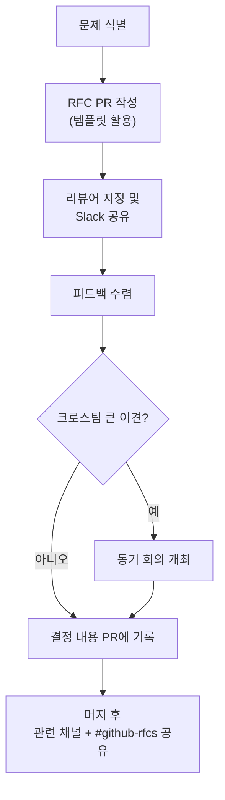

RFC(Request for Comment, 의견 요청)는 결정에 대해 소통하고 피드백을 모으는 방식이다. 투명성을 유지하고, 작성 과정에서 생각을 구조적으로 정리하게 한다[^1].

## RFC 작성 단계

1. 문제와 결정 사항을 식별한다[^2].
2. [RFC 템플릿](https://github.com/PostHog/requests-for-comments-internal/tree/main/_TEMPLATES)을 이용해 PR로 작성한다. 템플릿은 필수가 아니지만 처음 작성할 때 유용하다[^3].
3. RFC를 공유한다[^4]:
   - 영향받는 사람 또는 좋은 의견을 줄 수 있는 사람을 PR 리뷰어로 지정
   - 관련 Slack 채널에 게시 (대형 크로스팀 RFC는 `#tell-posthog-anything`)
   - 목표는 단 한 명의 승인이 아니라 **올바른 사람들의 참여와 의견** — 필요하면 태그, 전체 회의, 오프사이트를 활용해 입력을 독려한다
4. 크로스팀 RFC에서 큰 이견이 있으면 동기 회의를 열어 결정한다[^5].
5. 결정 후 PR에 결정 내용을 기록하고, 머지하고, 관련 채널과 `#github-rfcs`에 다시 공유한다[^6].

## RFC가 적합한 경우

다음 중 하나라도 해당하면 RFC 작성을 고려한다[^7].

| 조건 | 예시 |
|------|------|
| 자신 또는 단일 팀을 위한 명확화 | 내부 프로세스 개선 |
| 상대적으로 비논쟁적인 변경 | 도구 교체 (타 팀에 문제 없음) |
| 대규모 작업 (2~3주 이상) | 대형 기능 구현 |
| 새 기술 도입 | 새 프레임워크·인프라 |
| 주요 신기능 또는 제품·회사 변경 | 신제품 방향 전환 |
| 대규모 고객 영향 | API 호환성 변경 |

## RFC보다 회의가 나은 경우

자기 팀 외 팀에 크게 영향을 미치는 변경을 제안할 때는 RFC를 첫 단계로 쓰지 않는다[^8]. RFC를 먼저 열면 팀 간 긴장을 유발하고 10~25개 댓글과 긴 스레드가 생길 수 있다.

이 경우 먼저 통화를 한다. 단, 통화 후에는 반드시 메모를 남기고 투명성을 위해 RFC에 붙여 넣는다[^9].

## AI 활용 기준

RFC는 독창적 사고가 집중되는 곳이다. 이 사고를 AI에 위임하지 않는다[^10]. AI가 작성한 내용은 평균적이고 비독창적이며, 잘못된 부분에 강조를 두는 경향이 있다.

| 작업 | AI 사용 여부 |
|------|------------|
| 문제 정의·잠재적 해결책·Q&A 섹션 | 직접 작성 (AI 금지) |
| 조사·연구 | AI 활용 가능 |
| 최종 초안 다듬기 | AI 활용 가능 (전체 재작성 금지) |
| AI 분석·연구 결과 | 부록으로 포함 가능[^11] |

## 작성 팁

- RFC는 매우 짧아도 된다 — Slack 스레드로 결정하는 것보다 낫다[^12].
- 소규모 변경은 2일도 충분하다[^13].
- 만장일치가 필요하지 않다. 결정권자가 피드백을 검토하고 확신이 생기면 결정한다[^14].
- 모든 댓글에 응답하지 않아도 된다 — 결정에 필요하지 않은 질문은 정중히 거절할 수 있다[^15].
- 새 기술을 도입할 때는 인프라 팀 구성원을 태그한다[^16].
- 핵심 인물과 이미 협의했다면 설정한 날짜까지 기다릴 필요가 없다[^17].
- 바쁜 독자를 위해 작성한다 — 기술적 배경이 많으면 요약을 먼저 쓰고 아래에 상세 내용이나 부록을 넣는다[^18].
- 피드백이 느리면 Slack으로 가볍게 독려해도 된다[^19].

[^1]: 12-communication.md, Requests for comment (RFCs) — "We use RFCs to communicate and gather feedback on a decision. RFCs are useful because they help us stay transparent, and the process of writing them forces you to clearly articulate your thoughts in a structured way."
[^2]: 12-communication.md, Requests for comment (RFCs) — "Identify a problem and a decision to be made"
[^3]: 12-communication.md, Requests for comment (RFCs) — "Create an RFC as a pull request using one of the RFC templates. Using a template isn't a requirement, though it is a helpful and recommended starting place if you haven't written many RFCs here before."
[^4]: 12-communication.md, Requests for comment (RFCs) — "Assign people whom this RFC will impact, or who may have good opinions on the topic, as reviews to the pull request. Post in the relevant Slack channel... The aim is not to get one person to mark the RFC as approved, but to get the right people involved and commenting."
[^5]: 12-communication.md, Requests for comment (RFCs) — "If an RFC is cross-team and is causing a large amount of disagreement, it might be worth having a sync meeting to reach a decision"
[^6]: 12-communication.md, Requests for comment (RFCs) — "Once a decision is made, include the decision in the pull request, merge it in and share this in the relevant channel and #github-rfcs again."
[^7]: 12-communication.md, When does it work best to write an RFC? — "Writing an RFC may be helpful when any of the following is true:"
[^8]: 12-communication.md, When does a meeting / another approach work better than an RFC? — "when you want to ship or suggest a change to something that significantly affects teams outside your own. In this instance, we've seen that RFCS can lead to 10 to 25+ comments, which feels antagonistic"
[^9]: 12-communication.md, When does a meeting / another approach work better than an RFC? — "please write notes on such a call - to ensure everyone is on the same page. This could then be copy pasted into an RFC for transparency's sake / future reference."
[^10]: 12-communication.md, How should I use AI when writing RFCs? — "RFCs are the place where we do concentrated, original thinking. This thinking should not be outsourced to AI. Even when given context, AI writes content that is average and unoriginal, difficult to read (adjective-stuffing, anyone?), and places emphasis on the wrong things."
[^11]: 12-communication.md, How should I use AI when writing RFCs? — "Feel free to use AI for research and final draft polish (but please don't have it rewrite the whole thing for you). Analysis and research done by AI can be included in the RFC at the bottom as appendixes."
[^12]: 12-communication.md, Top tips for RFCs — "RFCs can be very short and are often better than making decisions by Slack threads."
[^13]: 12-communication.md, Top tips for RFCs — "You don't need to have a long decision-making time - 2 days is fine for smaller changes if you receive the relevant input and are confident in your decision."
[^14]: 12-communication.md, Top tips for RFCs — "You don't need to reach full agreement to decide, particularly if the decision is reversible. Instead, it should be when the decision maker has considered the feedback and is confident in their decision."
[^15]: 12-communication.md, Top tips for RFCs — "As the decision maker, you should use your judgment as to which comments you want to respond fully to. It's fine to politely decline a question if you think it's not required for the decision being made."
[^16]: 12-communication.md, Top tips for RFCs — "If you're introducing new technologies, you'll likely want to tag someone from Team Infrastructure."
[^17]: 12-communication.md, Top tips for RFCs — "You don't need to wait until the date you've said to make the decision if you've already consulted with the key people."
[^18]: 12-communication.md, Top tips for RFCs — "Write your RFC with the busy reader in mind. For example, if there is a lot of technical context to give, write a summary that people can read through quickly to get a high level overview of the proposed changes, then go deeper below, or in appendices."
[^19]: 12-communication.md, Top tips for RFCs — "It's fine to nudge people on slack if they are being slow to give feedback"
