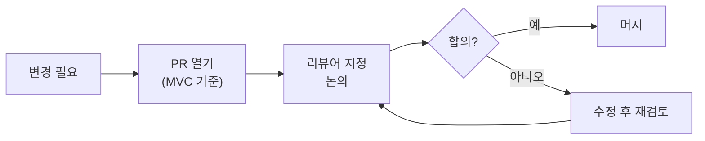

PostHog는 여러 나라에 팀원이 분산되어 있어 **비동기 소통을 기본**으로 하고, GitHub와 Slack을 통해 최대한 공개적으로 커뮤니케이션한다[^1].

## 소통 가치관

| 가치 | 내용 |
|------|------|
| 긍정적 의도 가정 | 항상 긍정적이고 관대한 자세로 소통한다[^2] |
| 의견 형성 | 각자의 생각·의견·감정을 공유한다[^3] |
| 피드백 필수 | 직접적이되 건설적인 방식으로 서로의 성장을 돕는다[^4] |

## 황금 규칙

1. **비동기 소통**을 우선 사용한다 — PR(선호) 또는 이슈. 공지는 적절한 Slack 채널에서 이루어진다[^5].
2. GitHub 이슈·PR의 논의가 다른 어떤 방법보다 우선한다. 긴급하면 Slack으로 링크를 공유하되, 즉각 답변을 기대하지 않는다[^6].
3. 계획된 근무 시간 외에 메시지에 응답할 의무가 없다[^7].
4. 질문은 얼마든지 공개 채널에서 해도 된다. 핸드북 링크를 받으면 "찾았어야 했다"는 뜻이 아니다[^8].
5. 요청을 받으면 마감 기한을 명시하거나 완료를 알린다. "할게요" 같은 답변은 도움이 안 된다[^9].
6. 원칙적으로 내부 논의를 위한 비공개 그룹을 만들지 않는다[^10].

## 공개 기본 정책

정보는 세 가지 버킷으로 구분한다[^11].

| 공개 범위 | 예시 |
|-----------|------|
| 공개 | 제품, 로드맵, 핸드북, 전략 |
| 내부 공유 | 재무 성과, 보안, 펀드레이징, 채용 |
| 비공개 | 개인 팀 정보(보상, 징계) |

### Company Internal 저장소

민감한 회사 전반 정보를 담는 비공개 GitHub 저장소다[^12].

**넣는 것:** 구인 공고 전 채용 계획, 복리후생·연금·스톡옵션·조직 구조 논의, 온보딩/오프보딩 체크리스트, 민감한 포지셔닝·고객 전략·펀드레이징·이사회 논의

**넣지 않는 것:** 공개 가능한 정보(public 저장소로), 버그 리포트·보안 이슈 등 엔지니어링 관련(Product Internal로), 결제·제품·성장 논의(Product Internal로)[^13]

### Product Internal 저장소

엔지니어링·제품·성장·디자인 관련 비공개 정보를 담는다[^14].

**넣는 것:** 취약점 리포트, 고객 PII가 포함된 버그 리포트, 대규모 장애 사후 분석, 내부 인프라 문서, A/B 테스트 결과, 공개 불가 인터뷰 문제[^15]

## GitHub 활용

### PR이 기본

코드 변경 또는 내용 제안 시 이슈 대신 PR로 시작한다[^16]. PR은 구체적인 변경사항을 중심으로 논의를 집중시키고 실행 가능한 결정을 이끌어낸다.

### 이슈 활용 기준

코드·문서 변경이 아닌 진행 추적, 프로젝트 관리 목적에 이슈를 활용한다[^17]. 이슈는 **단일 주제**로 열고, 해결 조건을 명확히 정의한다.

### GitHub 알림 관리

| 방법 | 권장도 |
|------|--------|
| GitHub Slack 알림 연동 | 강력 권장 |
| `#github-rfcs` 채널 참여 | 강력 권장 |
| GitHub 이메일 알림 + 팀 필터 | 선택 |
| GitHub Notifier 브라우저 확장 | 선택 |

### 통합 검색

[github.com/posthog](https://github.com/posthog)에서 조직 전체를 검색할 수 있다. Chrome 커스텀 검색 엔진으로 등록하면 `ph` + Tab으로 즉시 검색 가능하다[^18].

검색 URL: `https://github.com/search?q=org%3Aposthog+%s&type=issues`

## Slack 사용

### 에티켓

1. `#general`은 전사 공지 전용으로 유지한다[^19].
2. `@channel` / `@here`는 긴급하거나 즉각 모든 멤버의 주의가 필요한 경우에만 사용한다[^20].
3. 답글은 스레드로 단다 — 채널 전체 알림을 줄인다[^21].
4. 여러 생각은 한 메시지로 묶어 보낸다[^22].
5. 자리를 비워도 별도로 알릴 필요가 없다. 실시간 답변 기대 없음[^23].
6. Slack 프로필을 최신 상태로 유지한다 (이름·성 포함)[^24].

### 채널 명명 규칙

| 패턴 | 용도 |
|------|------|
| `#team-[팀명]` | 소규모 팀 채널 |
| `#project-[프로젝트명]` | 여러 팀을 아우르는 단발성 이니셔티브 |
| `#posthog-[고객명]` | 고객과의 공유 채널 (외부 파트너는 `#[파트너명]-posthog`) |
| `#alerts-[팀명]` | 팀 알림 전용 채널 |
| `#support-[제품명]` | 지원 요청 채널 |
| `#offsite-[팀]-[월]-[년도]-[장소]` | 오프사이트 채널 |
| `#onboarding-[이름]-[팀]-[월]-[년도]` | 신규 온보딩 채널 |
| `#hiring-[팀명]` | 채용 채널 |
| `#superday-[이름]-[직무]` | 후보자 인터뷰 채널 |

비공개 채널이 필요할 때는 `#private-xxxxx` 형식으로 앞에 붙인다[^25].

### 최신 출시 소식 채널

| 채널 | 목적 |
|------|------|
| `#changelog` | 방금 출시된 것. PR 머지 시 자동 업데이트 |
| `#coming-soon` | 곧 출시될 것. 마케팅 팀이 매일 다이제스트 게시 |

두 채널 모두 에이전트 워크플로가 머지된 PR과 피처 플래그 변경을 스캔해 자동 게시한다[^26].

## 문서 작성 기준

### Google Docs와 Slides

웹사이트·핸드북에 올라갈 비공개가 아닌 내용에는 Google Doc을 쓰지 않는다 — PR로 작업한다[^27].

Google Docs 주 용도: 회의 메모, 회사 업데이트·지표 공유. 내부 미팅용 프레젠테이션 대신 Google Docs 이슈 논의를 선호한다[^28].

발표용 슬라이드가 필요할 때는 [Pitch](https://pitch.com)를 사용한다[^29].

### 이메일

| 용도 | 허용 여부 |
|------|-----------|
| 법적 승인 취득 | 허용 |
| 공식 회사 문서 전달 (입사 제안, 급여 양식) | 허용 |
| 외부 파트너 소통 | 허용 |
| 일반 내부 소통 | 금지 — GitHub 또는 Slack 사용[^30] |

### 문서 작성 규범

| 규칙 | 내용 |
|------|------|
| 언어 | 대외 커뮤니케이션은 미국식 영어 표준[^31] |
| 약어 | 가능하면 피한다 — 낯선 사람을 대화에서 배제[^32] |
| 옥스퍼드 쉼표 | 사용한다[^33] |
| 링크 텍스트 | "여기"·"클릭" 금지 — 링크 목적지를 설명하는 앵커 텍스트 사용[^34] |
| 제목 | 문장 첫 글자만 대문자 (Sentence case)[^35] |
| 숫자 | 천 단위 이상은 10M·100B 형식, 또는 쉼표 포함 전체 숫자[^36] |

## 커뮤니케이션 보안

PostHog 직원은 스캠·피싱 공격 대상이 될 수 있다. **모든 공식 소통은 Slack에서 이루어진다.** 전화·SMS·WhatsApp은 요청·승인·민감 정보 전달에 절대 사용하지 않는다[^37].

Slack 외 채널로 연락이 오면 **신뢰하지 않는다** — Slack으로 상대에게 직접 확인한 뒤 대화를 이어간다[^38].

| 채널 | 신뢰 여부 |
|------|-----------|
| Slack (`@posthog.com` 계정) | 신뢰 |
| 이메일 (`posthog.com` 도메인, look-alike 도메인 주의) | 신뢰 |
| 전화·SMS·WhatsApp | 신뢰 금지 |

**임원 관련 주의:** James, Tim 등 임원은 이메일·SMS·WhatsApp·전화로 송금, 상품권, MFA 코드, 접근 변경을 요청하지 않는다. 그런 요청은 피싱으로 취급하고 `#phishing-attempts`에 신고한다[^39].

피싱 신고 절차는 [보안 및 개인정보 보호 정책](pages/f710d7783617.md) 참고.

## 관련 페이지

- [RFC 작성 및 의사결정](pages/b72f5460f6ec.md) — RFC 전체 프로세스와 팁
- [내부 회의 가이드](pages/e21cf3ee766b.md) — Google Meet 회의 규칙, 캘린더, Calendly
- [업무 도구 및 슬랙 채널](pages/3a4c57c6c964.md) — 도구 목록, Slack 채널 목록

[^1]: 12-communication.md, Introduction — "With team members across many countries, it's important for us to practice clear communication in ways that help us stay connected and work more efficiently. To accomplish this, we use asynchronous communication as a starting point and stay as open and transparent as we can"
[^2]: 12-communication.md, Our communication values — "Assume positive intent. Always coming from a position of positivity and grace."
[^3]: 12-communication.md, Our communication values — "Form an opinion. We live in different locations and often have very different perspectives. We want to know your thoughts, opinions, and feelings on things."
[^4]: 12-communication.md, Our communication values — "Feedback is essential. Help everyone up their game in a direct but constructive way."
[^5]: 12-communication.md, Golden rules — "Use asynchronous communication when possible: pull requests (preferred) or issues. Announcements happen on the appropriate Slack channels"
[^6]: 12-communication.md, Golden rules — "Discussion in GitHub issues or pull requests is preferred over everything else. If you need a response urgently, you can Slack someone with a link to your comment on an issue or pull request, asking them to respond there."
[^7]: 12-communication.md, Golden rules — "You are not expected to be available all the time. There is no expectation to respond to messages outside of your planned working hours."
[^8]: 12-communication.md, Golden rules — "It is 100% OK to ask as many questions as you have - please ask in public channels! If someone sends you a handbook link, that means they are proud that we have the answer documented - they don't mean that you should have found that yourself"
[^9]: 12-communication.md, Golden rules — "When someone asks for something, reply back with a deadline or by noting that you already did it. Answers like: 'will do', 'OK', or 'it is on my todo list' are not helpful."
[^10]: 12-communication.md, Golden rules — "By default, avoid creating private groups for internal discussions."
[^11]: 12-communication.md, Public by default — "The kinds of information we share falls into one of three buckets:"
[^12]: 12-communication.md, Company Internal — "Documents any company-wide information that can't be shared publicly within People, Ops, Legal, Finance or Strategy."
[^13]: 12-communication.md, Company Internal — "Examples of information that should NOT go here: Any information that should be public... Bug reports, security issues, or any other engineering-related discussions... Billing issues, product or growth discussions."
[^14]: 12-communication.md, Product Internal — "Contains internal information related to the PostHog product. Documents any non-public information that specifically relates to engineering, product, growth or design."
[^15]: 12-communication.md, Product Internal — "Examples of information that should go here: Vulnerabilities (security bugs) reports... Bug reports where most of the context of the report depends on customer's PII... Post-mortems on outages... Documentation of internal infrastructure... Experiment (A/B testing) results... Interview exercises or questions"
[^16]: 12-communication.md, Everything starts with a pull request — "It's best practice to start a discussion where possible with a Pull Request (PR) instead of an issue. A PR is associated with a specific change that is proposed and transparent for everyone to review and openly discuss."
[^17]: 12-communication.md, Issues — "GitHub Issues are useful when there isn't a specific code or document change that is being proposed or needed."
[^18]: 12-communication.md, Tip for easy searching through everything — "To search all code, PRs and issues ever written at PostHog you can search everything in the PostHog organization on Github."
[^19]: 12-communication.md, Slack etiquette — "Keep #general open for company-wide announcements."
[^20]: 12-communication.md, Slack etiquette — "@channel or @here mentions should be reserved for urgent or time-sensitive posts that require immediate attention by everyone in the channel."
[^21]: 12-communication.md, Slack etiquette — "Make use of threads when responding to a post. This allows informal discussion to take place without notifications being sent to everyone in the channel on every reply."
[^22]: 12-communication.md, Slack etiquette — "When possible, summarize multiple thoughts into a single message instead of sending multiple messages sequentially."
[^23]: 12-communication.md, Slack etiquette — "You don't need to tell people if you're away from your computer, especially on no-meeting days. There's no general expectation people are available to reply to messages in real time, including in Slack."
[^24]: 12-communication.md, Slack etiquette — "Keep your Slack profile up to date with the right information, including the appropriate name eg with surname or surname initial if you share a name with a colleauge."
[^25]: 12-communication.md, Slack — "On the very rare occasions you need to create a private channel for some reason - most commonly hiring-related - then it's probably worth sticking #private-xxxxx in front so people don't accidentally add external parties who shouldn't be in there."
[^26]: 12-communication.md, Keeping up with what we ship — "Both channels are powered by agentic workflows that scan merged PRs and feature flag changes and summarize them into the relevant channel."
[^27]: 12-communication.md, Google Docs and Slides — "Never use a Google Doc / Slides for something non-confidential that has to end up on the website or this handbook. Work on these edits via commits to a pull request."
[^28]: 12-communication.md, Google Docs and Slides — "We mainly use Google Docs to capture internal information like meeting notes or to share company updates and metrics. We always make the doc accessible so you can comment and ask questions. Please avoid using presentations for internal use."
[^29]: 12-communication.md, Google Docs and Slides — "When giving a talk which requires a presentation, use Pitch to build your slides."
[^30]: 12-communication.md, Email — "Internal email should be avoided in nearly all cases. Use GitHub for feature / product discussion, use Slack if you cannot use GitHub, and use Google Docs for anything else."
[^31]: 12-communication.md, Writing style — "We use American English as the standard written language in our public-facing comms, including this handbook."
[^32]: 12-communication.md, Writing style — "Do not use acronyms when you can avoid them. Acronyms have the effect of excluding people from the conversation if they are not familiar with a particular term."
[^33]: 12-communication.md, Writing style — "We use the Oxford comma."
[^34]: 12-communication.md, Writing style — "Do not create links like 'here' or 'click here'. All links should have relevant anchor text that describes what they link to."
[^35]: 12-communication.md, Writing style — "We use sentence case for titles."
[^36]: 12-communication.md, Writing style — "When writing numbers in the thousands to the billions, it's acceptable to abbreviate them (like 10M or 100B - capital letter, no space). If you write out the full number, use commas (like 15,000,000)."
[^37]: 12-communication.md, Communication Methods — "Expect all communication to occur over Slack. Phone calls, SMS, and WhatsApp are never used for initiating requests, approvals, or asking for sensitive info."
[^38]: 12-communication.md, Communication Methods — "If someone contacts you outside of Slack, treat it as untrusted until verified. Message them on Slack to confirm, and only continue the conversation over Slack."
[^39]: 12-communication.md, Best practices — "James, Tim, and other execs will never ask for wire transfers, gift cards, MFA codes, or access changes over email/SMS/WhatsApp/phone. Treat such requests as phishing and report them to #phishing-attempts."
