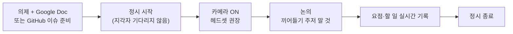

PostHog는 [Google Meet](https://meet.google.com/)으로 화상 통화를 진행한다[^1]. 원격 환경에서 고품질 협업 대화를 위한 회의 운영 규칙이다.

## 회의 흐름

## 회의 규칙

| # | 규칙 |
|---|------|
| 1 | 대부분의 예약 회의에는 Google Doc(의제·준비 자료) 또는 관련 GitHub 이슈를 연결한다[^2] |
| 2 | 캘린더 이벤트에 **'게스트가 수정 가능'** 옵션을 활성화한다 — 다른 채널로 연락할 필요가 없게[^3] |
| 3 | 가능하면 항상 카메라를 켠다. 반려동물·가족·친구가 보여도 괜찮고 오히려 환영한다[^4] |
| 4 | 헤드셋+마이크 사용을 강력 권장한다 — 법인카드로 구매 가능[^5] |
| 5 | 불필요한 배경 소음이 있으면 참가자에게 음소거를 요청한다[^6] |
| 6 | 회의 중 요점과 할 일 목록을 기록한다 — 실시간 결론 구조화가 대면보다 효과적[^7] |
| 7 | 예정 시각에 **정시 시작**한다. 지각자를 기다리거나 따라잡아주지 않는다[^8] |
| 8 | 화상 통화에서 끼어들기를 주저하지 않는다 — 지연 때문에 더 오래 겹치더라도 질문과 맥락이 귀중하다[^9] |
| 9 | 예정 시각에 **정시 종료**한다 — 모든 참가자가 다음 일정에 늦지 않게[^10] |
| 10 | 영상 통화 중 흡연·전자담배는 다른 참가자에 대한 예의 차원에서 삼간다[^11] |

## 가용성 표시

1. 휴가·여행·기타 자리 비움 시간은 **본인 캘린더에 직접 기록**한다[^12].
2. Google Calendar **설정 → 근무 시간**에 근무 시간대를 입력한다 — 시간대가 달라 일정 잡기가 어려운 팀원을 돕는다[^13].

## Google Calendar 권한 설정

캘린더 접근 권한을 **'PostHog 공개 — 모든 이벤트 세부정보 볼 수 있음'**으로 설정하길 권장한다[^14].

다음 일정은 **비공개(Private)**로 표시한다.

| 유형 | 이유 |
|------|------|
| 개인 약속 | 개인 프라이버시 |
| 외부 제3자와의 민감 회의 | 기밀 유지 |
| 1:1 성과·평가 미팅 | 개인 정보 보호 |
| 조직 변경 관련 미팅 | 민감 정보 |

## Calendly

외부 미팅(데모, 제품 피드백 통화 등) 예약에 Calendly를 사용한다[^15]. 계정이 필요하면 `#sales`에서 Simon에게 PostHog 팀 계정 초대를 요청한다.

[^1]: 12-communication.md, Internal meetings — "PostHog uses Google Meet for video communications."
[^2]: 12-communication.md, Internal meetings — "Most scheduled meetings should have a Google Doc linked or a relevant GitHub issue. This contains an agenda, including any preparation materials."
[^3]: 12-communication.md, Internal meetings — "Please click 'Guests can modify event' so people can update the time in the calendar instead of having to reach out via other channels."
[^4]: 12-communication.md, Internal meetings — "Try to have your video on at all times because it's much more engaging for participants. Having pets, children, significant others, friends, and family visible during video chats is encouraged - please introduce them!"
[^5]: 12-communication.md, Internal meetings — "Use of a headset with a microphone, is strongly recommended - use your company card if you need."
[^6]: 12-communication.md, Internal meetings — "Always advise participants to mute their mics if there is unnecessary background noise to ensure the speaker is able to be heard by all attendees."
[^7]: 12-communication.md, Internal meetings — "You should take notes of the points and to-dos during the meeting. Being able to structure conclusions and follow-up actions in real time makes a video call more effective than an in-person meeting."
[^8]: 12-communication.md, Internal meetings — "We start on time and do not wait for people. People are expected to join no later than the scheduled minute of the meeting, and we don't spend time bringing latecomers up to speed."
[^9]: 12-communication.md, Internal meetings — "You should not be discouraged by this, as the questions and context provided by interruptions are valuable."
[^10]: 12-communication.md, Internal meetings — "We end on the scheduled time. Again, it might feel rude to end a meeting, but you're actually allowing all attendees to be on time for their next meeting."
[^11]: 12-communication.md, Internal meetings — "It is unusual to smoke or vape in an open office, and the same goes for video calls - please don't do this out of respect for others on the call."
[^12]: 12-communication.md, Indicating availability — "Put your planned away time including holidays, vacation, travel time, and other leave in your own calendar."
[^13]: 12-communication.md, Indicating availability — "Set your working hours in your Google Calendar - you can do this under Settings > Working Hours. This is helpful as we work across different timezones."
[^14]: 12-communication.md, Google Calendar — "We recommend you set your Google Calendar access permissions to 'Make available for PostHog - See all event details'."
[^15]: 12-communication.md, Calendly — "We use Calendly for scheduling external meetings, such as demos or product feedback calls. If you need an account, ask Simon in #sales to invite you to the PostHog team account."
