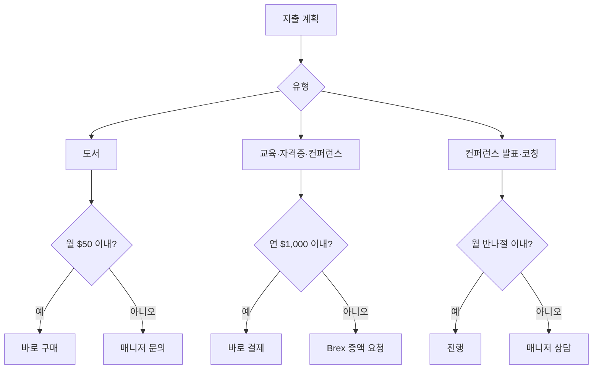

PostHog는 모든 구성원의 자기계발을 지원한다. 도서 구매, 교육 과정, 자격증 취득, 컨퍼런스 참가 등에 쓸 수 있는 예산을 제공하며, 대부분의 경우 사전 승인이 필요 없다[^1].

## 예산 한눈에 보기

| 항목 | 한도 | 승인 필요 |
|------|------|-----------|
| 도서 | $50 / 월 | 불필요 |
| 훈련 예산 | $1,000 / 연 (소프트 한도) | 불필요 (초과 시 Brex 증액 요청) |
| 컨퍼런스 발표·지도 | 월 최대 반나절 (소프트 한도) | 불필요 (초과 시 매니저 상담) |

## 도서

모든 구성원은 업무에 도움이 되는 책을 별도 승인 없이 구매할 수 있다[^2]. 월 $50 이내라면 자유롭게 구매한다[^3].

- **대상 매체:** 종이책·전자책·오디오북·팟캐스트 모두 허용[^4]
- **주제 범위:** 직무와 직접 연결되지 않아도 된다. 예를 들어 리더십 전기는 관리자에게, 디자인 서적은 엔지니어에게도 유용하다[^5]
- **BookHog:** 매월 진행되는 사내 독서 모임. 해당 도서 구매에도 도서 예산을 쓸 수 있다[^6]

## 훈련 예산

연간 훈련 예산은 직급에 관계없이 모든 구성원에게 동일하게 주어진다[^7].

사용 가능 항목:
- 관련 강의·교육 과정
- 공식 자격증 취득
- 컨퍼런스 참가

승인 없이 쓸 수 있지만, 지출 전 매니저와 미리 이야기하면 더 나은 방향을 제안받을 수 있다[^8].

연간 기본 한도는 **$1,000**이며, 이는 소프트 한도다. 초과가 필요하면 Brex에서 예산 증액을 요청하면 대부분 승인된다[^9].

비기술직 구성원은 기초 프로그래밍 강의 수강을 적극 권장한다. [Codecademy](https://www.codecademy.com/)에서 Python, React 등 PostHog 기술 스택을 배울 수 있다[^10].

학습 후에는 팀과 내용을 공유하면 좋다[^11].

## 컨퍼런스 발표 및 외부 교육 활동

컨퍼런스 발표, 사용자 그룹 참가, 타인 코칭 등 외부 교육 활동에도 훈련 예산을 활용할 수 있다[^12].

월 기준으로 최대 반나절을 이 활동에 쓰는 것이 기대치이나, 이 역시 소프트 한도다. 더 많은 시간이 필요하면 매니저와 먼저 상의한다[^13].

[^1]: 01-training.md, Training — "You do not need approval to spend your budget"
[^2]: 01-training.md, Books — "*Everyone* at PostHog is eligible to buy books to help you in your job."
[^3]: 01-training.md, Books — "spending up to $50/month on books is fine and requires no extra permission"
[^4]: 01-training.md, Books — "You can use your books budget towards audiobooks and podcasts as well, if you prefer."
[^5]: 01-training.md, Books — "Books do not have to be tied directly to your area, and they only need be loosely relevant to your work."
[^6]: 01-training.md, Books — "we host a monthly book club called BookHog, and the budget can be used for those books as well."
[^7]: 01-training.md, Training budget — "We have an annual training budget for every team member, regardless of seniority."
[^8]: 01-training.md, Training budget — "you might want to speak to your manager first, in case they have some useful feedback or pointers to a better idea."
[^9]: 01-training.md, Training budget — "The training budget is $1000 per calendar year, but this _isn't_ a hard limit - if you want to spend in excess of this, request an increase to your budget in Brex and it should usually be granted."
[^10]: 01-training.md, Training budget — "We strongly encourage all non-technical team members to take some kind of entry level programming course - it's part of our 'you're the driver' culture that everyone can at least understand very basic concepts around software development."
[^11]: 01-training.md, Training budget — "If possible, please share your learnings with the team afterwards!"
[^12]: 01-training.md, Conferences — "You can use your training budget for time spent talking at conferences and user groups, including coaching others."
[^13]: 01-training.md, Conferences — "It is expected that you would spend up to half a day a month on these activities. Like the training budget, this isn't a hard limit. If you think you need more than that talk to your manager in the first instance."
