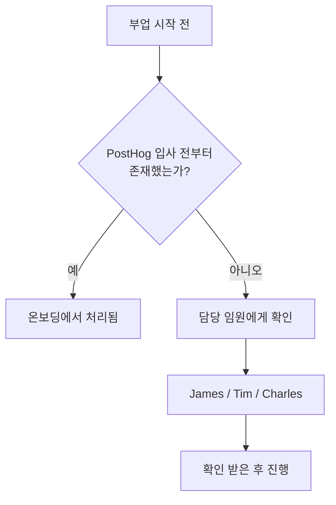

PostHog는 열정적인 사람을 채용한다. 사이드 프로젝트나 부업은 그 열정의 증거다. 단, PostHog 업무가 주된 동기여야 하며, 부업이 업무에 영향을 미치지 않는 선에서만 허용된다[^1].

## 부업 허용 기준

| 기준 | 허용 여부 |
|------|----------|
| 월 몇 시간 수준의 유료 부업 | 허용 |
| 개인 시간에 진행, 업무 영향 없음 | 허용 |
| 부업이 주된 집중 대상, PostHog는 월급용 | 불허 |
| 파트타임 근무 | 현재 불가 |

부업의 핵심 판단 기준은 **업무 영향도와 투입 시간**이다[^2]. 기본적으로 개인 시간에 진행해야 한다[^3].

언젠가 부업을 주업으로 전환하고 싶다면 미리 알려달라. PostHog는 구성원의 장기 목표를 돕는 방향을 찾는다[^4].

## 지식재산(IP)

PostHog는 개인 시간에 개인 자원으로 만든 결과물의 소유권을 주장하지 않는다[^5]. **사전 승인·검토 없이 개인 프로젝트를 진행할 수 있다[^6].**

단, **PostHog의 비공개 IP를 외부 프로젝트에 유입시키는 것은 엄격히 금지**한다[^7].

| IP 유형 | 사용 가능 여부 |
|---------|-------------|
| PostHog의 MIT 라이선스 코드 | 가능 |
| PostHog의 기타 비공개 코드·데이터 | 불가 |

### PostHog에서 시작된 프로젝트

업무 시간, PostHog 코드·데이터·인프라를 활용해 탄생한 프로젝트는 PostHog 소유다[^8]. 이를 사이드 프로젝트로 계속 발전시키려면 **명시적 허가**가 필요하다[^9].

관련 문의나 PostHog 로드맵과 겹치는 경우 Fraser에게 연락한다[^10].

## 승인 절차

부업 시작 전 **담당 임원(James, Tim, Charles 중 해당자)에게 확인**받는다[^11]. 입사 전부터 있던 부업은 온보딩 과정에서 처리된다[^12].

[^1]: 02-side-gigs.md, Side gigs — "we are too small for PostHog not to be your main motivation"
[^2]: 02-side-gigs.md, Managing time — "The key distinction to something being a side gig, and thus it being appropriate, is its impact on your work and the amount of time involved."
[^3]: 02-side-gigs.md, Managing time — "side gigs should by default be something you work on in your personal time, and they should not impact the work you do at PostHog."
[^4]: 02-side-gigs.md, Managing time — "we know the key to motivated people is to help you achieve your long term goals, and to align this with what PostHog needs"
[^5]: 02-side-gigs.md, Intellectual property — "PostHog won't try to claim ownership of any intellectual property (IP) you create in your personal time"
[^6]: 02-side-gigs.md, Intellectual property — "Side projects built on your own time using your own resources do not require permission, review or approval from PostHog."
[^7]: 02-side-gigs.md, Intellectual property — "you need to be _really_ careful that you do not introduce any of PostHog's non-open source IP into any project that you work on - this can cause serious legal headaches."
[^8]: 02-side-gigs.md, Projects that start at PostHog — "If a project is born from work you have done inside PostHog – that is, using work time, PostHog code, PostHog data, or other PostHog tools and infrastructure – these projects belong to PostHog"
[^9]: 02-side-gigs.md, Projects that start at PostHog — "If you want to develop these projects further on the side, you will need explicit permission."
[^10]: 02-side-gigs.md, Projects that start at PostHog — "please talk to Fraser and he can help you figure out the best solution here, especially if what you are working on directly competes with something PostHog has built or is on our roadmap."
[^11]: 02-side-gigs.md, Getting signoff — "We ask you to please just check in with the relevant Exec team member for your team (ie. James, Tim, or Charles) to get their confirmation before going ahead with any side gigs."
[^12]: 02-side-gigs.md, Getting signoff — "If your side gig existed before you joined PostHog, this will usually be covered as part of the onboarding process."
