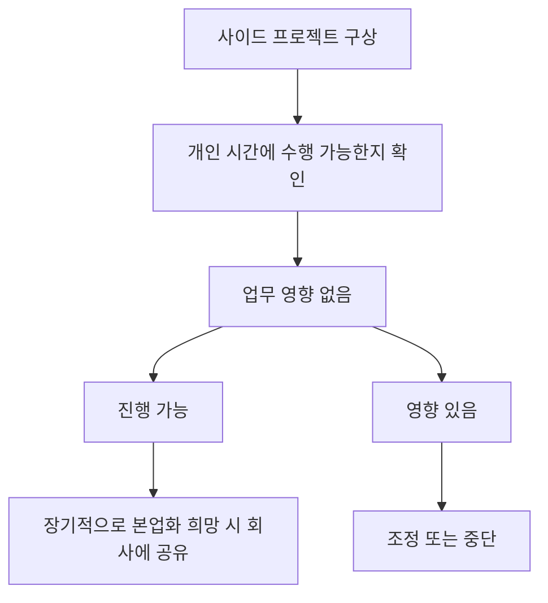

개인 시간에 하는 사이드 프로젝트와 외부 수익 활동은 허용되지만, PostHog에서의 업무가 주된 집중 대상이어야 하며 업무 시간과 성과에 영향을 주지 않아야 한다[^1][^2]. 또한 개인 시간에 만든 결과물의 지식재산권은 원칙적으로 개인에게 남지만, 회사 내부 자원에서 출발한 프로젝트는 회사 소유로 본다[^3][^4].

## 허용 기준

사이드 프로젝트는 개인적인 열정이나 취미의 연장선에서 수행하는 활동을 뜻하며, 수익이 발생해도 허용될 수 있다[^5]. 다만 회사는 이런 활동이 본업을 대체하는 수준의 주된 관심사가 되는 것은 허용하지 않으며, 현재는 파트타임 근무도 제공하지 않는다[^6].

| 항목 | 기준 | 의미 |
| --- | --- | --- |
| 활동 시간 | 월 몇 시간 수준은 허용 | 개인 시간 위주로 수행해야 함[^2] |
| 업무 영향 | 업무 수행에 영향 없어야 함 | 회사 업무 품질과 집중 유지[^2] |
| 본업 우선순위 | 회사가 주된 동기여야 함 | 부업이 주업이 되어서는 안 됨[^6] |
| 근무 형태 | 파트타임 불가 | 회사가 부수적 급여원이 되는 형태는 허용하지 않음[^6] |

## 시간 관리와 장기 계획

유급이든 무급이든 사이드 프로젝트는 기본적으로 개인 시간에 진행해야 하며, 회사 업무에 영향을 주지 않아야 한다[^2]. 장기적으로 해당 프로젝트를 풀타임 일로 키우고 싶다면, 회사에 미리 알려 함께 계획을 세우는 것이 권장된다[^7].

## 지식재산권과 회사 자원 사용

개인 시간과 개인 자원으로 만든 프로젝트는 회사의 허가·검토·승인이 필요하지 않으며, 회사는 그 지식재산권을 주장하지 않는다[^3]. 예를 들어 취미로 다른 오픈소스 프로젝트에 기여하는 것은 가능하다[^8].

하지만 비공개 회사 지식재산을 외부 프로젝트에 섞지 않도록 각별히 주의해야 한다[^9]. 명시적으로 MIT 라이선스인 회사 자산은 사용할 수 있지만, 그 외 자산은 사용할 수 없다[^10].

회사의 업무 시간, 코드, 데이터, 도구, 인프라를 사용해 시작된 프로젝트는 회사 소유이며 회사 저장소에 있어야 한다[^4]. 이런 프로젝트를 개인적으로 계속 개발하려면 명시적 허가가 필요하다[^11].

## 사전 확인과 상담

사이드 프로젝트를 시작하기 전에는 소속 팀의 관련 Exec 팀 구성원에게 먼저 확인을 받아야 한다[^12]. 입사 전에 이미 존재하던 사이드 프로젝트는 일반적으로 온보딩 과정에서 함께 다뤄진다[^13].

회사가 이미 만든 것 또는 로드맵에 있는 것과 직접 경쟁할 가능성이 있는 작업이라면 Fraser와 상의해 최선의 처리 방식을 정하는 것이 권장된다[^14].

> **참고:** 업무 시간 내 학습·발표·코칭처럼 회사가 공식 지원하는 활동은 [교육 및 도서 지원](pages/112ac6733781.md) 참고.[^15]

[^1]: document-102, Managing time — "The key distinction to something being a side gig, and thus it being appropriate, is its impact on your work and the amount of time involved."
[^2]: document-102, Managing time — "A few hours a month on a paid side gig is acceptable. In any case, side gigs should by default be something you work on in your personal time, and they should not impact the work you do at PostHog."
[^3]: document-102, Intellectual property — "Side projects built on your own time using your own resources do not require permission, review or approval from PostHog."
[^4]: document-102, Projects that start at PostHog — "If a project is born from work you have done inside PostHog – that is, using work time, PostHog code, PostHog data, or other PostHog tools and infrastructure – these projects belong to PostHog and should live in PostHog repos."
[^5]: document-102, title — "These side gigs may sometimes earn you money."
[^6]: document-102, title — "We are not ok with this being your main focus and PostHog being just a paycheck." / "For this reason, we also currently don't offer part time work as an option at PostHog."
[^7]: document-102, Managing time — "In a few cases, you may want your side gig to become your full time work one day. That is ok - please just let us know, so we can create a plan."
[^8]: document-102, Intellectual property — "Just to reassure you, PostHog won't try to claim ownership of any intellectual property (IP) you create in your personal time, e.g. if you are contributing to another open source project as a hobby."
[^9]: document-102, Intellectual property — "However, you need to be _really_ careful that you do not introduce any of PostHog's non-open source IP into any project that you work on - this can cause serious legal headaches."
[^10]: document-102, Intellectual property — "As a rule, anything from PostHog that is explicitly MIT-licensed is fine to use, anything else is not."
[^11]: document-102, Projects that start at PostHog — "If you want to develop these projects further on the side, you will need explicit permission."
[^12]: document-102, Getting signoff — "We ask you to please just check in with the relevant Exec team member for your team (ie. James, Tim, or Charles) to get their confirmation before going ahead with any side gigs."
[^13]: document-102, Getting signoff — "If your side gig existed before you joined PostHog, this will usually be covered as part of the onboarding process."
[^14]: document-102, Projects that start at PostHog — "If you are ever worried about this, please talk to Fraser and he can help you figure out the best solution here, especially if what you are working on directly competes with something PostHog has built or is on our roadmap."
[^15]: document-102, Managing time — "side gigs (whether paid or unpaid) are totally fine. We don't think that's possible beyond a certain level of time/energy commitment to them, but we are very happy for you to spend a little time on them each week."
