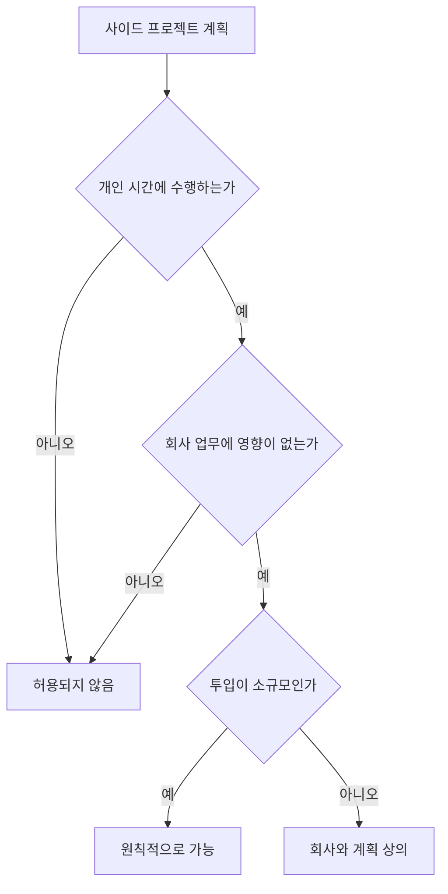

이 페이지는 개인 시간에 하는 사이드 프로젝트와 유상 부업의 허용 범위, 회사 업무와의 경계, 지식재산 처리 원칙, 시작 전 확인 절차를 정리한다.[^1][^2]

## 운영 원칙

회사는 구성원이 열정을 바탕으로 사이드 프로젝트를 하는 것을 긍정적으로 본다.[^1] 다만 사이드 프로젝트가 있어도 회사 일이 주된 동기와 초점이어야 하며, 회사를 단순한 급여 수단처럼 두는 형태는 허용되지 않는다.[^2] 이런 이유로 현재는 파트타임 근무 옵션도 제공하지 않는다.[^2]

| 구분 | 허용 여부 | 조건 |
| --- | --- | --- |
| 취미성 사이드 프로젝트 | 허용 | 회사 일이 주된 초점이어야 함[^1][^2] |
| 소규모 유상 부업 | 허용 | 개인 시간 중심, 업무 영향 없음[^3] |
| 장래 독립을 목표로 한 프로젝트 | 허용 | 회사에 알려 계획을 함께 수립[^4] |
| 파트타임 형태의 근무 대체 | 불가 | 현재 제공하지 않음[^2] |

## 시간 관리 기준

사이드 프로젝트가 적절한지의 핵심 기준은 업무에 미치는 영향과 투입 시간이다.[^3] 유상 부업이라도 한 달에 몇 시간 정도의 소규모 활동은 허용 가능하다.[^3] 기본적으로 이런 활동은 개인 시간에 해야 하며, 회사에서 수행하는 업무에 영향을 주지 않아야 한다.[^3]

또한 회사에서 기대 이상의 기여를 하고 있고 스스로를 무리 없이 돌볼 수 있다면, 매주 약간의 시간을 쓰는 수준의 유·무상 사이드 프로젝트는 허용된다.[^5] 다만 일정 수준을 넘는 시간·에너지 투입은 양립 가능성이 낮다고 본다.[^5]

## 장래 독립 계획이 있는 경우

사이드 프로젝트를 언젠가 본업으로 키우고 싶어도 그 자체는 허용된다.[^4] 이 경우 회사에 미리 알려 함께 계획을 만들 것을 요구한다.[^4] 장기 목표를 지원하고 회사의 필요와도 정렬하는 것이 중요하다고 본다.[^4]

## 지식재산 원칙

개인 시간에 만든 지식재산은 원칙적으로 회사가 소유권을 주장하지 않는다.[^6] 예를 들어 개인 취미로 다른 오픈소스 프로젝트에 기여하는 활동은 이 원칙에 포함된다.[^6] 자신의 시간과 자원으로 만드는 사이드 프로젝트는 회사의 허가, 검토, 승인 없이 진행할 수 있다.[^7]

다만 회사의 비공개 지식재산을 다른 프로젝트에 섞어 넣어서는 안 된다.[^8] 이는 법적 문제를 일으킬 수 있으며, 명시적으로 MIT 라이선스인 자산만 사용 가능하고 그 외는 사용하면 안 된다.[^8]

| 자산 유형 | 사용 가능 여부 | 비고 |
| --- | --- | --- |
| 개인 시간·개인 자원으로 만든 결과물 | 가능 | 별도 허가 불필요[^7] |
| 회사의 MIT 라이선스 자산 | 가능 | 명시적으로 MIT인 경우만[^8] |
| 회사의 비공개 지식재산 | 불가 | 다른 프로젝트에 포함 금지[^8] |
| 회사 업무 중 시작된 프로젝트의 산출물 | 회사 소유 | 별도 승인 없이 개인 프로젝트화 불가[^9] |

## 회사에서 시작된 프로젝트

업무 시간, 회사 코드, 회사 데이터, 회사 도구·인프라를 사용해 시작된 프로젝트는 회사에 속하며 회사 저장소에 있어야 한다.[^9] 이런 프로젝트를 개인 시간에 더 발전시키고 싶다면 명시적 허가가 필요하다.[^9]

진행 중인 일이 회사가 이미 만든 것이나 로드맵과 직접 경쟁할 수 있어 우려가 있다면, 담당 리더와 상의해 최선의 처리 방안을 정해야 한다.[^10]

## 사전 확인 절차

사이드 프로젝트를 진행하기 전에는 소속 팀의 관련 임원에게 확인을 받아야 한다.[^11] 입사 전에 이미 하던 프로젝트가 있다면, 이는 보통 온보딩 과정에서 함께 다뤄진다.[^12]

> **참고:** 입사 초기 확인이 필요한 활동이라는 점에서 [교육 및 도서 지원](pages/bf17154b84c1.md)의 학습 제도와 함께 온보딩 맥락에서 읽을 수 있다.[^12]

[^1]: 02-side-gigs.md, title — "PostHog looks for passion in the people it hires. This often correlates with people who have side projects as a hobby."
[^2]: 02-side-gigs.md, title — "We are not ok with this being your main focus and PostHog being just a paycheck. Quite simply, we are too small for PostHog not to be your main motivation. For this reason, we also currently don't offer part time work as an option at PostHog."
[^3]: 02-side-gigs.md, Managing time — "A few hours a month on a paid side gig is acceptable. In any case, side gigs should by default be something you work on in your personal time, and they should not impact the work you do at PostHog."
[^4]: 02-side-gigs.md, Managing time — "In a few cases, you may want your side gig to become your full time work one day. That is ok - please just let us know, so we can create a plan."
[^5]: 02-side-gigs.md, Managing time — "Above everything else, if you are going above and beyond for PostHog and you're still able to look after yourself properly, side gigs (whether paid or unpaid) are totally fine."
[^6]: 02-side-gigs.md, Intellectual property — "PostHog won't try to claim ownership of any intellectual property (IP) you create in your personal time"
[^7]: 02-side-gigs.md, Intellectual property — "Side projects built on your own time using your own resources do not require permission, review or approval from PostHog."
[^8]: 02-side-gigs.md, Intellectual property — "As a rule, anything from PostHog that is explicitly MIT-licensed is fine to use, anything else is not."
[^9]: 02-side-gigs.md, Projects that start at PostHog — "If a project is born from work you have done inside PostHog – that is, using work time, PostHog code, PostHog data, or other PostHog tools and infrastructure – these projects belong to PostHog and should live in PostHog repos. If you want to develop these projects further on the side, you will need explicit permission."
[^10]: 02-side-gigs.md, Projects that start at PostHog — "If you are ever worried about this, please talk to Fraser and he can help you figure out the best solution here, especially if what you are working on directly competes with something PostHog has built or is on our roadmap."
[^11]: 02-side-gigs.md, Getting signoff — "We ask you to please just check in with the relevant Exec team member for your team (ie. James, Tim, or Charles) to get their confirmation before going ahead with any side gigs."
[^12]: 02-side-gigs.md, Getting signoff — "If your side gig existed before you joined PostHog, this will usually be covered as part of the onboarding process."
