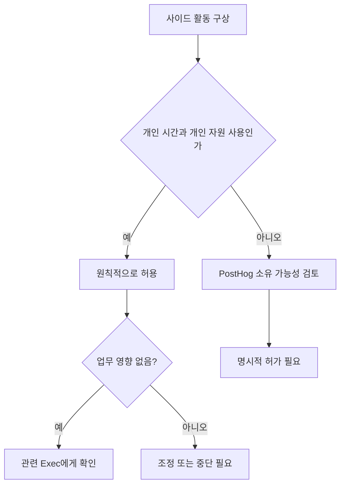

이 페이지는 PostHog 재직 중 개인 시간에 하는 사이드 프로젝트와 유료 외부 활동의 허용 범위, 회사 업무와의 우선순위, 지식재산 귀속, 사전 확인 절차를 정리한다.[^1][^2][^3][^4]

## 핵심 원칙

PostHog는 열정을 가진 구성원이 개인 프로젝트를 병행하는 것을 전반적으로 허용한다.[^1] 유료 활동이라도 사이드 활동으로서의 성격을 유지하면 가능하다.[^2] 다만 PostHog가 단지 급여를 받는 곳이 되어서는 안 되며, 회사 업무가 주된 동기와 초점이어야 한다.[^2] 이 원칙 때문에 현재는 파트타임 근무 옵션도 제공하지 않는다.[^2]

| 구분 | 허용 기준 | 제한 사항 |
| --- | --- | --- |
| 개인 시간의 사이드 프로젝트 | 원칙적으로 가능 | PostHog 업무에 영향이 없어야 함[^3] |
| 유료 외부 활동 | 소규모면 가능 | 주된 집중 대상이 되어서는 안 됨[^2] |
| PostHog 내부에서 시작된 프로젝트 | 별도 허가 없이는 개인 프로젝트로 전환 불가 | PostHog 소유로 간주[^6] |
| 기존 보유 사이드 프로젝트 | 대체로 가능 | 온보딩 과정에서 확인 필요[^8] |

## 시간 사용과 업무 우선순위

사이드 활동이 적절한지의 핵심 기준은 업무에 미치는 영향과 투입 시간이다.[^3] 유료 사이드 활동에 월 몇 시간 정도를 쓰는 것은 허용 가능하다.[^3] 기본 원칙은 이런 활동을 개인 시간에 해야 하며, PostHog에서의 업무 수행에 영향을 주지 않아야 한다는 점이다.[^3]

일부 구성원은 장기적으로 자신의 사이드 프로젝트를 본업으로 키우고 싶어 할 수 있으며, 그런 목표 자체는 허용된다.[^4] 이 경우에는 회사에 알려 함께 계획을 세우는 것이 요구된다.[^4] 또한 PostHog에서 기대 이상으로 기여하고 스스로의 건강도 잘 관리할 수 있다면, 유·무급을 막론하고 매주 약간의 시간을 사이드 활동에 쓰는 것은 괜찮다고 본다.[^5]

## 지식재산과 소유권

개인 시간에 자신의 자원으로 만든 지식재산은 PostHog가 소유권을 주장하지 않는다.[^6] 예를 들어 취미로 다른 오픈소스 프로젝트에 기여하는 일은 허용된다.[^6] 자신의 시간과 자원을 사용해 만든 사이드 프로젝트는 회사의 사전 허가, 검토, 승인이 필요하지 않다.[^6]

다만 PostHog의 비공개 지식재산을 외부 프로젝트에 섞지 않도록 특히 주의해야 한다.[^6] 회사에서 명시적으로 MIT 라이선스로 공개한 것은 사용 가능하지만, 그 외는 사용하면 안 된다.[^6]

> **참고:** 개인 역량 개발을 위한 회사 지원 제도는 [교육 및 도서 지원](pages/68910d8b81f9.md) 참고.[^9]

## PostHog에서 시작된 프로젝트

업무 시간, PostHog 코드, PostHog 데이터, 또는 회사의 도구·인프라를 사용해 시작된 프로젝트는 PostHog 소유다.[^7] 이런 프로젝트는 PostHog 저장소에 있어야 한다.[^7] 이를 개인 시간에 계속 발전시키고 싶다면 명시적인 허가가 필요하다.[^7]

직접적인 경쟁 우려가 있거나 제품 로드맵과 겹칠 수 있는 경우에는 Fraser와 상의해 최선의 해결책을 찾도록 안내한다.[^7]

## 사전 확인과 온보딩

새로운 사이드 활동을 시작하기 전에는 소속 팀의 관련 Exec 구성원에게 먼저 확인을 받아야 한다.[^8] 문서에는 예시로 James, Tim, Charles가 제시되어 있다.[^8] 입사 전에 이미 하던 사이드 활동이 있다면, 이는 보통 온보딩 과정에서 함께 다룬다.[^8]

[^1]: 02-side-gigs.md, title: Side gigs — "PostHog looks for passion in the people it hires. This often correlates with people who have side projects as a hobby."
[^2]: 02-side-gigs.md, title: Side gigs — "We are not ok with this being your main focus and PostHog being just a paycheck."
[^3]: 02-side-gigs.md, Managing time — "A few hours a month on a paid side gig is acceptable. In any case, side gigs should by default be something you work on in your personal time, and they should not impact the work you do at PostHog."
[^4]: 02-side-gigs.md, Managing time — "In a few cases, you may want your side gig to become your full time work one day. That is ok - please just let us know, so we can create a plan."
[^5]: 02-side-gigs.md, Managing time — "Above everything else, if you are going above and beyond for PostHog and you're still able to look after yourself properly, side gigs (whether paid or unpaid) are totally fine."
[^6]: 02-side-gigs.md, Intellectual property — "PostHog won't try to claim ownership of any intellectual property (IP) you create in your personal time" 
[^7]: 02-side-gigs.md, Projects that start at PostHog — "If a project is born from work you have done inside PostHog – that is, using work time, PostHog code, PostHog data, or other PostHog tools and infrastructure – these projects belong to PostHog and should live in PostHog repos."
[^8]: 02-side-gigs.md, Getting signoff — "We ask you to please just check in with the relevant Exec team member for your team (ie. James, Tim, or Charles) to get their confirmation before going ahead with any side gigs."
[^9]: 01-training.md, Training budget — "We have an annual training budget for every team member, regardless of seniority."
