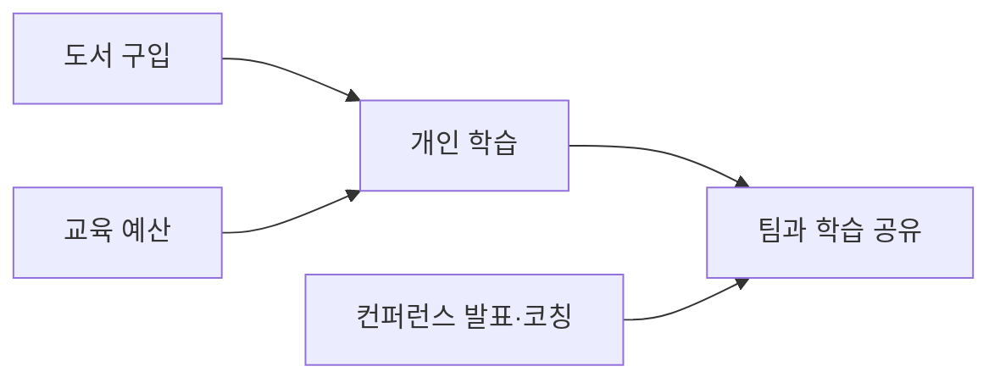

업무 역량 향상을 위한 도서 구입, 교육 예산, 컨퍼런스 관련 활동 기준을 정리한다.[^1][^2][^3]

## 지원 항목

| 항목 | 기준 | 비고 |
| --- | --- | --- |
| 도서 구입 | 월 최대 50달러 수준은 별도 승인 없이 가능 | 오디오북·팟캐스트에도 사용 가능[^2] |
| 교육 예산 | 연간 1,000달러 | 달력 연도 기준이며 하드 리밋은 아님[^3] |
| 컨퍼런스 활동 시간 | 월 최대 반일 수준 예상 | 초과 필요 시 매니저와 상의[^4] |

## 도서 구입

모든 구성원은 업무에 도움이 되는 책을 살 수 있다.[^1] 매월 두어 권 정도는 별도 허가 없이 구매할 수 있고, 일반적인 기준으로 월 50달러까지는 추가 승인 없이 괜찮다.[^2] 이 예산은 오디오북과 팟캐스트에도 사용할 수 있다.[^2]

도서는 현재 담당 업무와 직접 연결되지 않아도 되며, 업무와 느슨하게 관련되면 된다.[^5] 예를 들어 관리자는 리더의 전기를 통해 배울 수 있고, 엔지니어는 디자인 관련 책에서도 가치를 얻을 수 있다.[^5] 월간 북클럽인 BookHog에서 읽는 책에도 이 예산을 사용할 수 있다.[^5]

## 교육 예산

모든 팀원은 연차나 직급과 무관하게 연간 교육 예산을 받는다.[^3] 이 예산은 관련 강의, 교육, 공식 자격, 컨퍼런스 참석에 사용할 수 있다.[^3] 예산 사용에 사전 승인은 필요하지 않지만, 더 나은 선택에 대한 조언을 얻기 위해 매니저와 먼저 이야기할 수 있다.[^3]

비기술 직군 구성원은 입문 수준의 프로그래밍 과정을 수강하는 것이 강하게 권장된다.[^6] 이 권장은 모든 사람이 소프트웨어 개발의 아주 기본 개념은 이해하는 문화를 지향하기 때문이다.[^6] 시작점으로는 Codecademy가 제시되어 있으며 Python과 React 같은 사용 기술도 다룬다.[^6]

연간 교육 예산은 달력 연도 기준 1,000달러지만 엄격한 상한은 아니다.[^7] 이를 초과해 사용하려면 Brex에서 예산 증액을 요청하면 대체로 승인된다.[^7]

## 컨퍼런스와 학습 공유

교육 예산은 컨퍼런스나 유저 그룹에서 발표하거나 다른 사람을 코칭하는 데 드는 시간에도 사용할 수 있다.[^4] 이런 활동에는 월 반일 정도를 쓰는 것이 예상되지만, 이 역시 엄격한 상한은 아니다.[^4]

학습 후에는 가능하면 팀과 배운 내용을 공유하는 것이 요청된다.[^8]

[^1]: 01-training.md, Books — "*Everyone* at PostHog is eligible to buy books to help you in your job."
[^2]: 01-training.md, Books — "As a general rule, spending up to $50/month on books is fine and requires no extra permission. You can use your books budget towards audiobooks and podcasts as well, if you prefer."
[^3]: 01-training.md, Training budget — "We have an annual training budget for every team member, regardless of seniority. The budget can be used for relevant courses, training, formal qualifications, or attending conferences. You do not need approval to spend your budget"
[^4]: 01-training.md, Conferences — "You can use your training budget for time spent talking at conferences and user groups, including coaching others. It is expected that you would spend up to half a day a month on these activities."
[^5]: 01-training.md, Books — "Books do not have to be tied directly to your area, and they only need be loosely relevant to your work."
[^6]: 01-training.md, Training budget — "We strongly encourage all non-technical team members to take some kind of entry level programming course - it's part of our 'you're the driver' culture that everyone can at least understand very basic concepts around software development. [Codecademy](https://www.codecademy.com/) is a good place to start and they cover many of the technologies we use, such as Python and React."
[^7]: 01-training.md, Training budget — "The training budget is $1000 per calendar year, but this _isn't_ a hard limit - if you want to spend in excess of this, request an increase to your budget in Brex and it should usually be granted."
[^8]: 01-training.md, Training budget — "If possible, please share your learnings with the team afterwards!"
