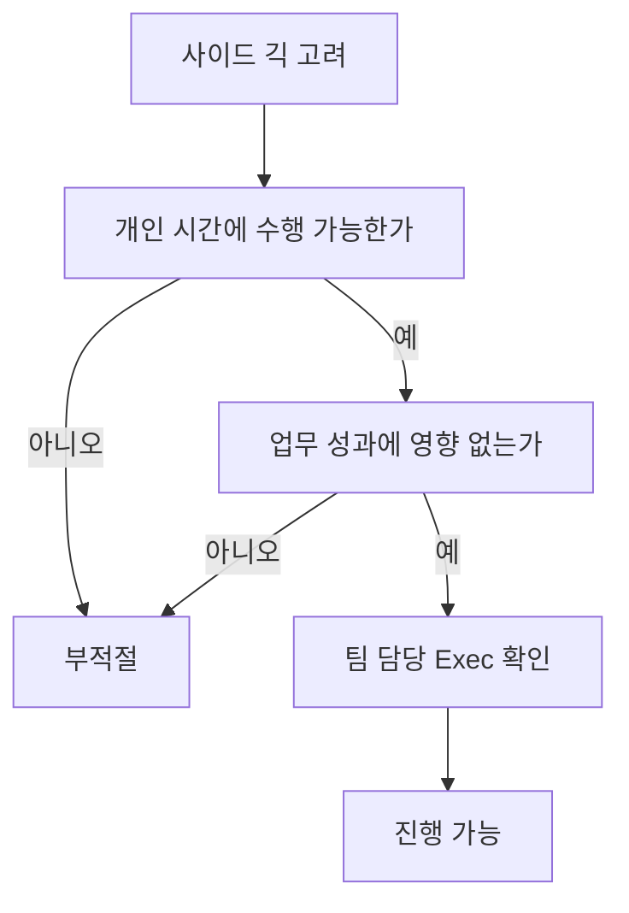

회사는 구성원이 개인 시간에 사이드 프로젝트나 오픈소스 활동을 하는 것을 원칙적으로 허용하지만, PostHog가 주된 동기와 업무 집중의 중심이어야 한다고 본다[^1][^2]. 사이드 긱은 개인 시간에 해야 하며 본업 성과에 영향을 주어서는 안 되고, 시작 전에는 팀 담당 Exec의 확인을 받아야 한다[^3][^4].

## 허용 기준

| 항목 | 기준 | 의미 |
| --- | --- | --- |
| 회사와의 관계 | PostHog가 주된 동기여야 함 | 회사를 단순 급여원으로 두는 형태는 허용하지 않음[^2] |
| 시간 사용 | 기본적으로 개인 시간에 수행 | 업무 시간과 성과에 영향이 없어야 함[^3] |
| 수익 발생 | 가능 | 유급 사이드 긱 자체는 금지하지 않음[^1] |
| 근무 형태 | 파트타임 불가 | 회사는 현재 파트타임 옵션을 제공하지 않음[^2] |
| 사전 확인 | 팀 담당 Exec 확인 필요 | 진행 전 James, Tim, Charles 중 해당 담당자와 체크인[^4] |

## 시간과 업무 영향

문서는 사이드 긱의 핵심 구분점으로 업무 영향과 투입 시간을 든다[^3]. 유급 사이드 긱에 한 달 몇 시간 정도를 쓰는 것은 허용 가능하지만, 기본 전제는 개인 시간에 수행하고 PostHog에서의 업무에 영향을 주지 않는 것이다[^3].

장기적으로 사이드 긱을 본업으로 키우고 싶어도 그것 자체는 허용된다[^5]. 이 경우 회사에 미리 알려 계획을 함께 만들면 장기 목표와 회사의 필요를 정렬할 수 있다고 설명한다[^5].

## 지식재산 원칙

개인 시간에 자신의 자원으로 만든 사이드 프로젝트나 취미 오픈소스 기여에 대해 회사는 소유권을 주장하지 않는다[^6]. 이런 프로젝트는 회사의 허가, 검토, 승인을 요구하지 않는다[^7]. 다만 PostHog의 비공개 지식재산을 외부 프로젝트에 섞어 넣지 않도록 매우 주의해야 하며, 명시적으로 MIT 라이선스인 것만 사용 가능하다고 안내한다[^8].

### 회사 업무에서 시작된 프로젝트

업무 시간, 회사 코드, 회사 데이터, 혹은 회사 도구·인프라를 사용해 시작된 프로젝트는 회사에 속하며 회사 저장소에 있어야 한다[^9]. 이런 프로젝트를 개인 시간에 더 개발하고 싶다면 명시적 허가가 필요하다[^9]. 또한 현재 제품이나 로드맵과 직접 경쟁하는 내용이면 Fraser와 상의하라고 적혀 있다[^10].

## 확인 절차

사이드 긱을 진행하기 전에는 팀의 관련 Exec 구성원에게 확인을 받아야 한다[^4]. 문서는 예시로 James, Tim, Charles를 든다[^4]. 입사 전에 이미 하던 사이드 긱이 있다면, 보통 온보딩 과정에서 함께 다뤄진다고 설명한다[^11].

> **참고:** 업무 관련 학습·발표 활동에 회사 예산과 시간을 쓰는 기준은 [교육 및 도서 지원](pages/9781736d2e3f.md) 참고[^12].

[^1]: 02-side-gigs.md, "These side gigs may sometimes earn you money." — "These side gigs may sometimes earn you money."
[^2]: 02-side-gigs.md, "earning money on the side" — "as we are ok with you earning money on the side."
[^3]: 02-side-gigs.md, Managing time — "A few hours a month on a paid side gig is acceptable. In any case, side gigs should by default be something you work on in your personal time, and they should not impact the work you do at PostHog."
[^4]: 02-side-gigs.md, Getting signoff — "We ask you to please just check in with the relevant Exec team member for your team (ie. James, Tim, or Charles) to get their confirmation before going ahead with any side gigs."
[^5]: 02-side-gigs.md, Managing time — "In a few cases, you may want your side gig to become your full time work one day. That is ok - please just let us know, so we can create a plan. We know the key to motivated people is to help you achieve your long term goals, and to align this with what PostHog needs, whether or not you eventually achieve them with us."
[^6]: 02-side-gigs.md, Intellectual property — "PostHog won't try to claim ownership of any intellectual property (IP) you create in your personal time"
[^7]: 02-side-gigs.md, Intellectual property — "Side projects built on your own time using your own resources do not require permission, review or approval from PostHog."
[^8]: 02-side-gigs.md, Intellectual property — "As a rule, anything from PostHog that is explicitly MIT-licensed is fine to use, anything else is not."
[^9]: 02-side-gigs.md, Projects that start at PostHog — "If a project is born from work you have done inside PostHog – that is, using work time, PostHog code, PostHog data, or other PostHog tools and infrastructure – these projects belong to PostHog and should live in PostHog repos. If you want to develop these projects further on the side, you will need explicit permission."
[^10]: 02-side-gigs.md, Projects that start at PostHog — "If you are ever worried about this, please talk to Fraser and he can help you figure out the best solution here, especially if what you are working on directly competes with something PostHog has built or is on our roadmap."
[^11]: 02-side-gigs.md, Getting signoff — "If your side gig existed before you joined PostHog, this will usually be covered as part of the onboarding process."
[^12]: 01-training.md, Conferences — "You can use your training budget for time spent talking at conferences and user groups, including coaching others."
