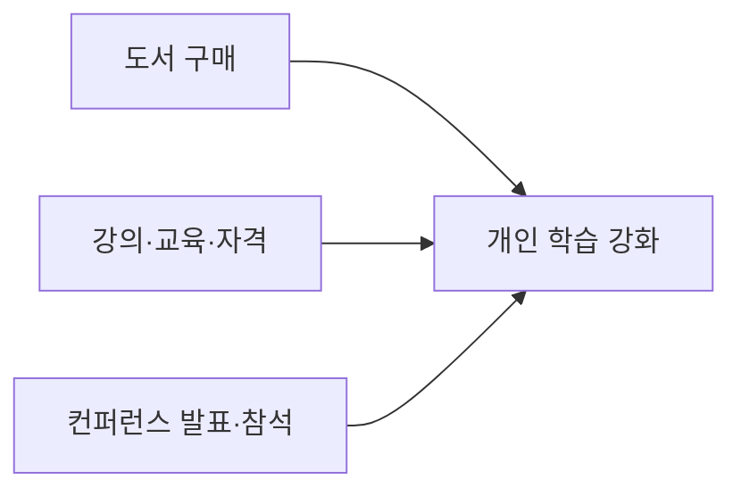

회사는 구성원의 업무 역량 강화를 위해 도서 구매와 교육 예산을 지원한다[^1][^2]. 도서는 월별 소액 구매를 기본으로 하며, 교육 예산은 연간 기준으로 운영되지만 필요 시 증액 요청도 가능하다[^3]. 컨퍼런스 발표와 사용자 그룹 활동에도 교육 예산과 근무 시간을 사용할 수 있다[^4].

## 지원 항목 요약

| 항목 | 기본 기준 | 승인 필요 여부 | 비고 |
| --- | --- | --- | --- |
| 도서 구매 | 월 최대 50달러 수준, 월 2권 정도 | 기본적으로 불필요 | 오디오북·팟캐스트 포함 가능[^1] |
| 교육 예산 | 연간 1000달러 | 기본적으로 불필요 | 초과 시 Brex에서 증액 요청 가능[^3] |
| 컨퍼런스 발표·코칭 | 월 최대 반나절 정도 권장 | 추가 시간이 필요하면 관리자와 협의 | 사용자 그룹 활동 포함[^4] |

## 도서 구매

모든 구성원은 업무에 도움이 되는 책을 구매할 수 있다[^1]. 책은 직접 담당하는 업무 분야에만 한정되지 않고, 업무와 느슨하게 관련된 주제까지 허용된다[^5]. 예를 들어 관리자에게는 리더 전기가, 엔지니어에게는 디자인 관련 서적이 도움이 될 수 있다고 안내한다[^5]. 월간 북클럽인 BookHog에서 읽는 책도 이 예산으로 구매할 수 있다[^6].

## 교육 예산

모든 팀원은 연차나 직급과 무관하게 연간 교육 예산을 사용할 수 있다[^2]. 이 예산은 관련 강의, 교육, 정식 자격, 컨퍼런스 참석에 사용할 수 있다[^2]. 예산 사용 전 별도 승인은 필요 없지만, 더 나은 선택지를 위해 관리자와 먼저 상의할 수 있다[^7].

비기술 직군 구성원은 입문 수준의 프로그래밍 과정을 수강하도록 강하게 권장된다[^8]. 문서는 이 권장을 회사의 'you're the driver' 문화와 연결하며, 모두가 소프트웨어 개발의 매우 기초적인 개념은 이해해야 한다고 설명한다[^8]. 시작점으로는 Codecademy를 예시로 제시하며 Python과 React 등 회사가 사용하는 기술을 다룬다고 적고 있다[^9].

## 예산 초과와 학습 공유

연간 교육 예산은 1000달러이지만 엄격한 상한은 아니다[^3]. 이 금액을 초과해 사용하려면 Brex에서 예산 증액을 요청하면 되며, 보통 승인된다고 문서에 적혀 있다[^3]. 또한 교육 예산을 사용한 뒤 가능하면 배운 내용을 팀과 공유해 달라고 안내한다[^10].

## 컨퍼런스와 사용자 그룹 활동

교육 예산은 컨퍼런스와 사용자 그룹에서 발표하는 시간에도 사용할 수 있고, 다른 사람을 코칭하는 활동도 포함된다[^4]. 이런 활동에는 한 달에 최대 반나절 정도를 쓰는 것이 기대치로 제시되지만, 이것도 엄격한 한도는 아니다[^11]. 더 많은 시간이 필요하다고 판단되면 우선 관리자와 상의해야 한다[^11].

[^1]: 01-training.md, Books — "You may buy a couple of books a month without asking for permission. As a general rule, spending up to $50/month on books is fine and requires no extra permission. You can use your books budget towards audiobooks and podcasts as well, if you prefer."
[^2]: 01-training.md, Training budget — "We have an annual training budget for every team member, regardless of seniority. The budget can be used for relevant courses, training, formal qualifications, or attending conferences."
[^3]: 01-training.md, Training budget — "The training budget is $1000 per calendar year, but this _isn't_ a hard limit - if you want to spend in excess of this, request an increase to your budget in Brex and it should usually be granted."
[^4]: 01-training.md, Conferences — "You can use your training budget for time spent talking at conferences and user groups, including coaching others."
[^5]: 01-training.md, Books — "Books do not have to be tied directly to your area, and they only need be loosely relevant to your work. For example, biographies of leaders can help a manager to learn, and can in fact be more valuable than a tactical book on management. Likewise, if you're an engineer, a book on design can also be particularly valuable for you to read."
[^6]: 01-training.md, Books — "Additionally, we host a monthly book club called BookHog, and the budget can be used for those books as well."
[^7]: 01-training.md, Training budget — "You do not need approval to spend your budget, but you might want to speak to your manager first, in case they have some useful feedback or pointers to a better idea."
[^8]: 01-training.md, Training budget — "We strongly encourage all non-technical team members to take some kind of entry level programming course - it's part of our 'you're the driver' culture that everyone can at least understand very basic concepts around software development."
[^9]: 01-training.md, Training budget — "[Codecademy](https://www.codecademy.com/) is a good place to start and they cover many of the technologies we use, such as Python and React."
[^10]: 01-training.md, Training budget — "If possible, please share your learnings with the team afterwards!"
[^11]: 01-training.md, Conferences — "It is expected that you would spend up to half a day a month on these activities. Like the training budget, this isn't a hard limit. If you think you need more than that talk to your manager in the first instance."
