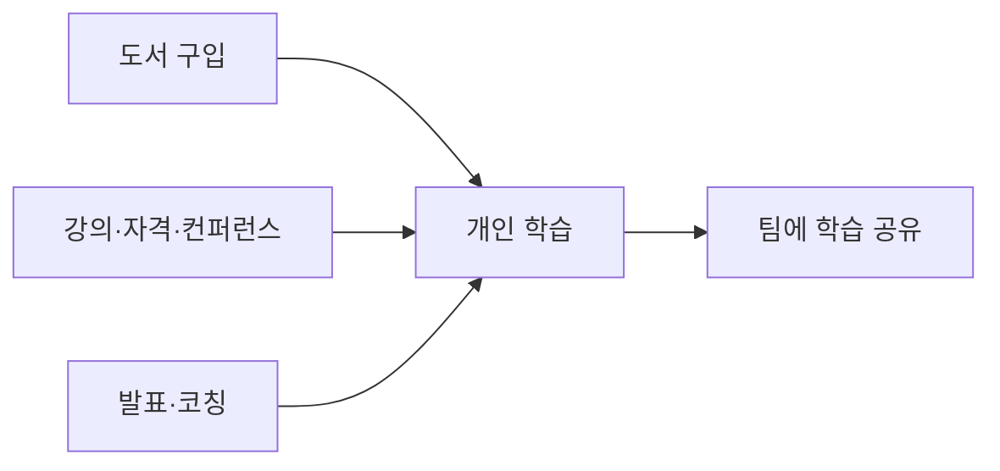

업무 역량 향상을 위한 도서 구입과 교육 예산 사용 기준, 그리고 컨퍼런스 관련 시간·비용 사용 원칙을 정리한다.[^1][^2][^3]

## 지원 항목 요약

| 항목 | 기본 기준 | 승인 필요 여부 | 비고 |
| --- | --- | --- | --- |
| 도서 | 월 50달러까지를 일반 기준으로 삼아 한 달에 두 권 정도 구매 가능 | 추가 승인 없이 가능 | 오디오북, 팟캐스트, BookHog 도서 포함[^2] |
| 교육 예산 | 연간 1000달러 | 별도 승인 없이 사용 가능 | 초과 사용은 Brex에서 증액 요청 가능[^3] |
| 컨퍼런스 발표·코칭 시간 | 월 최대 반나절 정도 사용 기대 | 고정 한도 아님 | 더 필요하면 매니저와 먼저 상의[^4] |

## 도서 구입

모든 구성원은 업무에 도움이 되는 책을 구매할 수 있다.[^1] 일반적으로 월 50달러까지의 지출은 무리 없는 범위로 보며, 별도 허가 없이 한 달에 두 권 정도 구매할 수 있다.[^2] 예산은 오디오북과 팟캐스트에도 사용할 수 있고, 월간 북클럽인 BookHog에서 읽는 책에도 사용할 수 있다.[^2]

도서는 현재 맡은 직무와 직접 연결되지 않아도 된다.[^2] 예를 들어 관리자는 리더 전기를 통해 배울 수 있고, 엔지니어는 디자인 관련 책에서 가치를 얻을 수 있다.[^2]

## 교육 예산

모든 팀원에게 연차나 직급과 무관하게 연간 교육 예산이 제공된다.[^3] 예산은 관련 강의, 교육, 정식 자격, 컨퍼런스 참석에 사용할 수 있다.[^3] 예산 사용 전 별도 승인은 필요 없지만, 더 나은 선택지나 피드백을 위해 매니저와 먼저 상의할 수 있다.[^3]

비기술 직군 구성원은 입문 수준의 프로그래밍 과정을 수강하는 것이 강하게 권장된다.[^5] 이는 모든 구성원이 매우 기초적인 소프트웨어 개발 개념을 이해하는 문화를 지향하기 때문이다.[^5] 시작점으로는 Codecademy가 제시되어 있으며, Python과 React 등 조직에서 사용하는 기술도 다룬다.[^5]

## 컨퍼런스와 학습 공유

교육 예산은 컨퍼런스나 유저 그룹에서 발표하는 데 드는 시간에도 사용할 수 있으며, 다른 사람을 코칭하는 활동도 포함된다.[^4] 이런 활동에는 월 최대 반나절 정도를 쓰는 것이 기대되지만, 엄격한 상한은 아니다.[^4] 더 많은 시간이 필요하면 우선 매니저와 논의한다.[^4]

가능하다면 교육이나 행사 후에는 배운 내용을 팀에 공유하는 것이 권장된다.[^6]

[^1]: 01-training.md, Books — "*Everyone* at PostHog is eligible to buy books to help you in your job."
[^2]: 01-training.md, Books — "As a general rule, spending up to $50/month on books is fine and requires no extra permission. You can use your books budget towards audiobooks and podcasts as well, if you prefer."
[^3]: 01-training.md, Training budget — "The training budget is $1000 per calendar year, but this _isn't_ a hard limit - if you want to spend in excess of this, request an increase to your budget in Brex and it should usually be granted."
[^4]: 01-training.md, Conferences — "You can use your training budget for time spent talking at conferences and user groups, including coaching others. It is expected that you would spend up to half a day a month on these activities. Like the training budget, this isn't a hard limit. If you think you need more than that talk to your manager in the first instance."
[^5]: 01-training.md, Training budget — "We strongly encourage all non-technical team members to take some kind of entry level programming course - it's part of our 'you're the driver' culture that everyone can at least understand very basic concepts around software development. [Codecademy](https://www.codecademy.com/) is a good place to start and they cover many of the technologies we use, such as Python and React."
[^6]: 01-training.md, Training budget — "If possible, please share your learnings with the team afterwards!"
