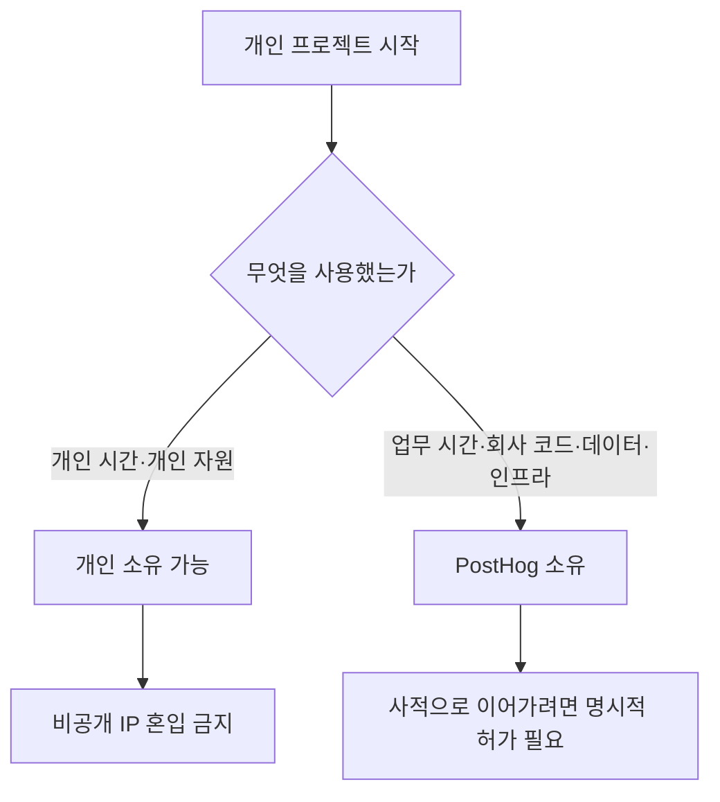

개인 시간에 진행하는 사이드 긱과 개인 프로젝트는 허용되지만, PostHog가 주된 업무 동기여야 하며 회사 업무·자산과 충돌하지 않아야 한다.[^1][^2][^3]

## 허용 범위와 시간 원칙

사이드 긱은 돈을 벌 수 있는 활동이어도 괜찮지만, PostHog가 단순한 급여원이 되어서는 안 된다.[^1] 그래서 현재는 파트타임 근무를 선택지로 제공하지 않는다.[^1]

사이드 긱으로 인정되는 핵심 기준은 업무에 미치는 영향과 투입 시간이다.[^2] 유급 사이드 긱에 한 달 몇 시간 정도를 쓰는 것은 허용되며, 기본적으로 개인 시간에 해야 하고 PostHog에서의 업무 성과에 영향을 주지 않아야 한다.[^2] 장기적으로는 사이드 긱을 전업으로 키우고 싶을 수도 있는데, 이 경우에도 미리 알리면 계획을 함께 만들 수 있다.[^3]

| 구분 | 허용 기준 | 제한 사항 | 추가 조치 |
| --- | --- | --- | --- |
| 소규모 유급 사이드 긱 | 한 달 몇 시간 수준은 허용 | 개인 시간에 해야 하며 업무 영향 금지 | 필요 시 임원 확인[^2][^4] |
| 장기적으로 키우려는 개인 프로젝트 | 가능 | PostHog가 주된 동기여야 함 | 미리 알려 계획 수립[^3] |
| 파트타임 형태의 근무 병행 | 허용되지 않음 | PostHog를 부업처럼 두는 형태 불가 | 해당 없음[^1] |

## 지식재산과 회사 자산 사용

개인 시간에 자신의 자원으로 만든 프로젝트나 취미 오픈소스 기여에 대해서는 PostHog가 소유권을 주장하지 않는다.[^5] 이런 개인 프로젝트는 원칙적으로 사전 허가나 검토, 승인이 필요하지 않다.[^5] 다만 PostHog의 비공개 지식재산을 외부 프로젝트에 섞지 않도록 매우 주의해야 하며, 명시적으로 MIT 라이선스인 자산만 사용 가능하다.[^5]

반대로 PostHog의 업무 시간, 코드, 데이터, 도구, 인프라를 사용해 시작된 프로젝트는 PostHog 소유이며 회사 저장소에 있어야 한다.[^6] 이런 프로젝트를 개인 시간에 더 발전시키려면 명시적 허가가 필요하다.[^6]

## 확인과 온보딩

사이드 긱을 시작하기 전에는 소속 팀 담당 Exec 구성원에게 확인을 받아야 한다.[^4] 입사 전에 이미 존재하던 사이드 긱은 일반적으로 온보딩 과정에서 함께 다룬다.[^7]

직접 경쟁 가능성이 있거나 로드맵과 겹칠 수 있는 경우에는 Fraser와 상의해 가장 적절한 방식을 정한다.[^6]

> **참고:** 입사 초기 교육과 복지 관련 기준은 [교육 및 도서 지원](pages/24d1857baaa9.md) 참고.[^7]

[^1]: 02-side-gigs.md, Managing time — "We have deliberately called them "side gigs", as we are ok with you earning money on the side. We are not ok with this being your main focus and PostHog being just a paycheck."
[^2]: 02-side-gigs.md, Managing time — "A few hours a month on a paid side gig is acceptable. In any case, side gigs should by default be something you work on in your personal time, and they should not impact the work you do at PostHog."
[^3]: 02-side-gigs.md, Managing time — "In a few cases, you may want your side gig to become your full time work one day. That is ok - please just let us know, so we can create a plan."
[^4]: 02-side-gigs.md, Getting signoff — "We ask you to please just check in with the relevant Exec team member for your team (ie. James, Tim, or Charles) to get their confirmation before going ahead with any side gigs."
[^5]: 02-side-gigs.md, Intellectual property — "Just to reassure you, PostHog won't try to claim ownership of any intellectual property (IP) you create in your personal time" 
[^6]: 02-side-gigs.md, Projects that start at PostHog — "If a project is born from work you have done inside PostHog – that is, using work time, PostHog code, PostHog data, or other PostHog tools and infrastructure – these projects belong to PostHog and should live in PostHog repos."
[^7]: 02-side-gigs.md, Getting signoff — "If your side gig existed before you joined PostHog, this will usually be covered as part of the onboarding process."
