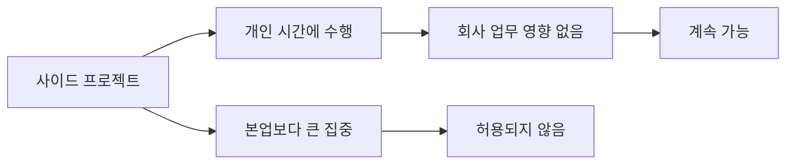

이 페이지는 개인 시간의 사이드 프로젝트와 유급 부업에 대해 회사가 허용하는 범위, 본업과의 우선순위, 지식재산 취급, 사전 확인 절차를 정리한다.[^1][^2][^3][^4]

## 핵심 원칙

사이드는 열정과 취미의 연장선에서 허용되며, 수익이 발생해도 곧바로 문제가 되지는 않는다.[^1] 다만 회사는 사이드 프로젝트가 본업보다 우선되는 상태나, 회사를 단순한 급여 수단으로 삼는 상황은 허용하지 않는다.[^2] 이런 이유로 현재는 파트타임 근무 옵션도 제공하지 않는다.[^2]

| 주제 | 허용 기준 | 금지·주의 사항 |
| --- | --- | --- |
| 수익 발생 | 개인 프로젝트로 돈을 버는 것은 가능 | 본업보다 주된 관심사가 되어서는 안 됨[^1][^2] |
| 시간 사용 | 기본적으로 개인 시간에 수행 | 회사 업무에 영향 주면 안 됨[^3] |
| 장기 계획 | 언젠가 본업으로 전환하고 싶어도 가능 | 미리 공유해 함께 계획 수립 필요[^4] |
| 근무 형태 | 회사 업무에 충분히 헌신하는 전제 | 파트타임 근무는 현재 옵션 아님[^2] |

## 시간 사용 기준

사이드 프로젝트가 적절한지 판단하는 핵심 기준은 업무 영향과 투입 시간이다.[^3] 유급 사이드 작업에 월 몇 시간 정도를 쓰는 것은 허용 가능하지만, 기본적으로 개인 시간에 해야 하며 회사에서의 업무 성과를 떨어뜨려서는 안 된다.[^3]

사람이 회사에서 기대 이상으로 기여하고 스스로도 무리 없이 관리할 수 있다면, 유급이든 무급이든 매주 약간의 시간을 사이드 프로젝트에 쓰는 것은 괜찮다.[^5] 다만 회사는 일정 수준을 넘는 시간·에너지 투입은 현실적으로 어렵다고 본다.[^5]

## 지식재산 원칙

개인 시간에 개인 자원으로 만든 프로젝트의 지식재산은 회사가 주장하지 않는다.[^6] 예를 들어 취미로 다른 오픈소스 프로젝트에 기여하는 것은 허용된다.[^6] 이런 프로젝트는 회사의 허가, 검토, 승인을 요구하지 않는다.[^7]

반면 회사의 비오픈소스 지식재산을 외부 프로젝트에 섞어 넣지 않도록 매우 주의해야 한다.[^8] 원칙적으로 회사 자산 중 명시적으로 MIT 라이선스인 것은 사용 가능하지만, 그 외는 사용하면 안 된다.[^8]

## 회사에서 시작된 프로젝트

업무 시간, 회사 코드, 회사 데이터, 회사 도구·인프라를 사용해 시작된 프로젝트는 회사 소유이며 회사 저장소에 있어야 한다.[^9] 이런 프로젝트를 개인 시간에 추가로 발전시키려면 명시적 허가가 필요하다.[^10]

직접 경쟁하는 제품이나 로드맵과 맞닿는 프로젝트라면 담당 리더와 상의해 최선의 처리 방식을 정해야 한다.[^11]

## 사전 확인과 온보딩

사이드 프로젝트를 진행하기 전에는 소속 팀의 관련 Exec 팀 멤버에게 확인을 받아야 한다.[^12] 입사 전에 이미 존재하던 사이드 프로젝트는 보통 온보딩 과정에서 함께 다룬다.[^13]

> **참고:** 업무 시간 중 학습·발표 활동에 회사 지원을 쓰는 경우는 [교육 및 도서 지원](pages/438737e27e94.md) 참고.[^14]

[^1]: 02-side-gigs.md, title — "These side gigs may sometimes earn you money."
[^2]: 02-side-gigs.md, title — "We are not ok with this being your main focus and PostHog being just a paycheck." / "For this reason, we also currently don't offer part time work as an option at PostHog."
[^3]: 02-side-gigs.md, Managing time — "A few hours a month on a paid side gig is acceptable. In any case, side gigs should by default be something you work on in your personal time, and they should not impact the work you do at PostHog."
[^4]: 02-side-gigs.md, Managing time — "In a few cases, you may want your side gig to become your full time work one day. That is ok - please just let us know, so we can create a plan."
[^5]: 02-side-gigs.md, Managing time — "Above everything else, if you are going above and beyond for PostHog and you're still able to look after yourself properly, side gigs (whether paid or unpaid) are totally fine." / "we are very happy for you to spend a little time on them each week."
[^6]: 02-side-gigs.md, Intellectual property — "PostHog won't try to claim ownership of any intellectual property (IP) you create in your personal time"
[^7]: 02-side-gigs.md, Intellectual property — "Side projects built on your own time using your own resources do not require permission, review or approval from PostHog."
[^8]: 02-side-gigs.md, Intellectual property — "As a rule, anything from PostHog that is explicitly MIT-licensed is fine to use, anything else is not."
[^9]: 02-side-gigs.md, Projects that start at PostHog — "If a project is born from work you have done inside PostHog – that is, using work time, PostHog code, PostHog data, or other PostHog tools and infrastructure – these projects belong to PostHog and should live in PostHog repos."
[^10]: 02-side-gigs.md, Projects that start at PostHog — "If you want to develop these projects further on the side, you will need explicit permission."
[^11]: 02-side-gigs.md, Projects that start at PostHog — "If you are ever worried about this, please talk to Fraser and he can help you figure out the best solution here, especially if what you are working on directly competes with something PostHog has built or is on our roadmap."
[^12]: 02-side-gigs.md, Getting signoff — "We ask you to please just check in with the relevant Exec team member for your team (ie. James, Tim, or Charles) to get their confirmation before going ahead with any side gigs."
[^13]: 02-side-gigs.md, Getting signoff — "If your side gig existed before you joined PostHog, this will usually be covered as part of the onboarding process."
[^14]: 01-training.md, Conferences — "You can use your training budget for time spent talking at conferences and user groups, including coaching others. It is expected that you would spend up to half a day a month on these activities. Like the training budget, this isn't a hard limit. If you think you need more than that talk to your manager in the first instance."
