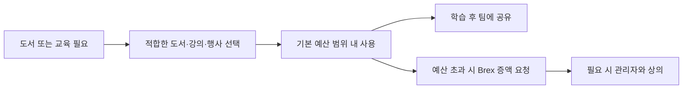

구성원은 업무 관련 학습을 위해 도서와 교육 예산을 활용할 수 있으며, 컨퍼런스 발표·코칭에도 시간을 사용할 수 있다.[^1][^2][^3]

## 지원 항목

| 항목 | 기본 기준 | 비고 |
| --- | --- | --- |
| 도서 | 월 50달러까지는 추가 승인 없이 구입 가능 | 오디오북·팟캐스트와 BookHog 대상 도서 포함[^1] |
| 교육 예산 | 연간 1000달러 | 팀원 누구나 사용 가능하며 초과도 요청 가능[^2] |
| 컨퍼런스 활동 | 월 최대 반나절 수준 권장 | 발표·유저그룹 발표·타인 코칭 포함, 필요 시 관리자와 상의[^3] |

## 도서 구입

모든 구성원은 업무에 도움이 되는 책을 구입할 수 있다.[^1] 월 50달러까지의 도서 구입은 일반적으로 별도 허가가 필요 없다.[^1] 이 예산은 오디오북과 팟캐스트에도 사용할 수 있고, 업무와 느슨하게 관련된 분야의 책이나 BookHog 도서에도 사용할 수 있다.[^1]

## 교육 예산

모든 팀원은 직급과 무관하게 연간 교육 예산을 사용할 수 있다.[^2] 예산은 관련 강의, 교육, 정규 자격, 컨퍼런스 참석에 사용할 수 있다.[^2] 예산 사용 전 승인은 필요하지 않지만, 더 나은 선택지에 대한 의견을 듣기 위해 관리자와 상의할 수 있다.[^2] 기본 한도는 달력 연도 기준 1000달러이며, 더 많은 금액이 필요하면 Brex에서 증액 요청을 올릴 수 있다.[^2]

## 권장 학습 방식

비기술 직군 구성원은 입문 수준의 프로그래밍 과정을 수강하는 것이 강하게 권장된다.[^2] 문서는 Codecademy를 시작점으로 제시하며, Python과 React 같은 사용 기술을 다룬다고 안내한다.[^2] 교육 후에는 배운 내용을 팀과 공유하는 것이 바람직하다.[^2]

## 컨퍼런스 활동

교육 예산은 컨퍼런스나 유저그룹에서 발표하는 시간에도 사용할 수 있고, 다른 사람을 코칭하는 활동도 포함된다.[^3] 이런 활동에는 한 달에 최대 반나절 정도를 쓰는 것이 기대되지만, 이것은 엄격한 상한은 아니다.[^3] 더 많은 시간이 필요하면 우선 관리자와 논의한다.[^3]

[^1]: 01-training.md, Books — "You may buy a couple of books a month without asking for permission. As a general rule, spending up to $50/month on books is fine and requires no extra permission. You can use your books budget towards audiobooks and podcasts as well, if you prefer."
[^2]: 01-training.md, Training budget — "We have an annual training budget for every team member, regardless of seniority."
[^3]: 01-training.md, Conferences — "It is expected that you would spend up to half a day a month on these activities. Like the training budget, this isn't a hard limit. If you think you need more than that talk to your manager in the first instance."
