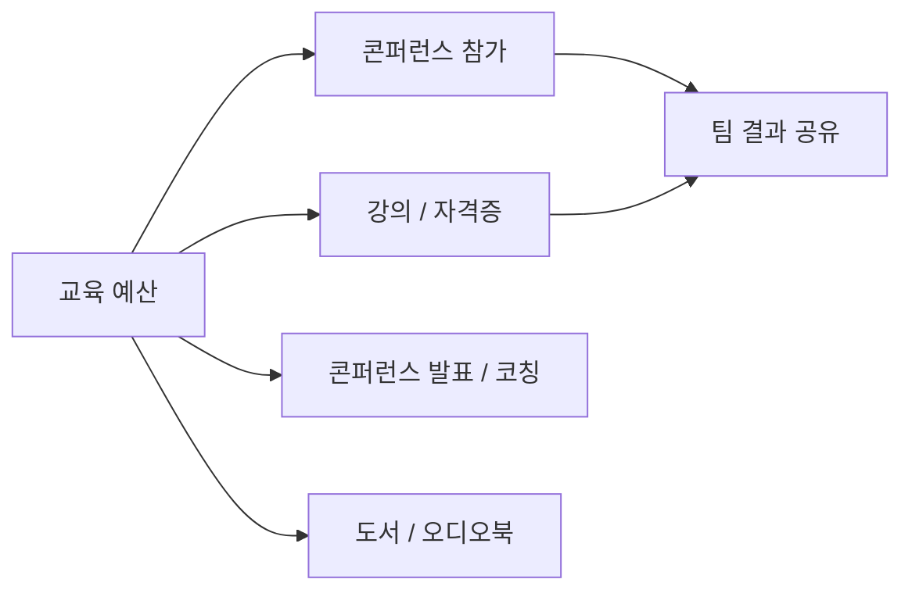

모든 구성원이 직무 역량과 관심 분야를 넓힐 수 있도록 도서 구매 지원과 연간 교육 예산을 제공한다. 지원 항목에는 책, 오디오북, 강의, 자격증, 콘퍼런스 참가가 포함된다.[^1]

## 도서 구매 지원

PostHog의 모든 구성원은 직무에 도움이 되는 도서를 자유롭게 구매할 수 있다.[^2]

- 월 **$50** 이하는 별도 승인 없이 구매 가능하다.[^3]
- 도서 예산으로 **오디오북**과 **팟캐스트**도 이용할 수 있다.[^4]
- 도서는 자신의 직무와 직접 관련이 없어도 된다 — 업무에 간접적으로라도 관련되면 충분하다.[^5]
  - 예: 관리자가 리더십 위인전을 읽는 것, 엔지니어가 디자인 서적을 읽는 것
- 매월 열리는 북클럽 **BookHog**의 도서도 예산으로 구매할 수 있다.[^6]

## 연간 교육 예산

직급에 상관없이 모든 구성원에게 연간 교육 예산이 주어진다.[^7]

| 항목 | 내용 |
|---|---|
| 기본 예산 | $1,000 / 연도(역년) |
| 초과 사용 | Brex에서 예산 증액 요청 — 통상 승인됨 |
| 사전 승인 | 불필요 (단, 사전에 매니저와 논의 권장) |
| 사용 대상 | 강의, 교육 프로그램, 공식 자격증, 콘퍼런스 참가 |

> **팁:** 교육 내용을 마친 뒤 팀에 공유하면 조직 전체의 학습에 기여할 수 있다.[^8]

### 비기술직 구성원 대상 프로그래밍 기초 권장

비기술직 구성원도 기초 프로그래밍 과정을 수강하도록 권장한다.[^9] 이는 「당신이 운전자」 문화의 일환으로, 소프트웨어 개발의 기본 개념을 이해하는 것이 목표다. [Codecademy](https://www.codecademy.com/)는 Python, React 등 PostHog가 사용하는 기술을 포함하므로 좋은 시작점이 된다.[^10]

## 콘퍼런스 및 외부 발표

교육 예산은 콘퍼런스 발표, 사용자 그룹 발표, 코칭 활동에도 사용할 수 있다.[^11]

- 콘퍼런스 발표 등 외부 활동은 **월 반일(half day)** 이내가 기본 기준이다.[^12]
- 기준을 넘어야 할 경우 우선 매니저와 협의한다.[^13]

[^1]: 01-training.md, Training — "The better you are at your job, the better PostHog is overall!"
[^2]: 01-training.md, Books — "*Everyone* at PostHog is eligible to buy books to help you in your job."
[^3]: 01-training.md, Books — "spending up to $50/month on books is fine and requires no extra permission."
[^4]: 01-training.md, Books — "You can use your books budget towards audiobooks and podcasts as well, if you prefer."
[^5]: 01-training.md, Books — "Books do not have to be tied directly to your area, and they only need be loosely relevant to your work."
[^6]: 01-training.md, Books — "we host a monthly book club called BookHog, and the budget can be used for those books as well."
[^7]: 01-training.md, Training budget — "We have an annual training budget for every team member, regardless of seniority."
[^8]: 01-training.md, Training budget — "If possible, please share your learnings with the team afterwards!"
[^9]: 01-training.md, Training budget — "We strongly encourage all non-technical team members to take some kind of entry level programming course"
[^10]: 01-training.md, Training budget — "[Codecademy](https://www.codecademy.com/) is a good place to start and they cover many of the technologies we use, such as Python and React."
[^11]: 01-training.md, Conferences — "You can use your training budget for time spent talking at conferences and user groups, including coaching others."
[^12]: 01-training.md, Conferences — "It is expected that you would spend up to half a day a month on these activities."
[^13]: 01-training.md, Conferences — "If you think you need more than that talk to your manager in the first instance."
