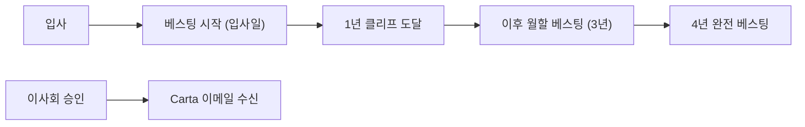

PostHog는 모든 구성원이 회사의 성장에 함께 투자할 수 있도록 주식 옵션(Share Options)을 지급한다.[^1] 역할·직급·위치를 기반으로 부여하며, 평균 수준의 지분이지만 직원 친화적인 조건을 업계 최고 수준으로 설계했다.[^2]

## 기본 옵션 조건

| 항목 | 내용 |
|---|---|
| 베스팅 기간 | 4년 (1년 클리프) |
| 퇴사 후 행사 기간 | **10년** |
| 이중 트리거 가속 | 인수로 인해 해고·강제 퇴직 시 전체 옵션 즉시 부여 |
| 베스팅 시작일 | 입사일 (수습기간 종료 후 아님) |
| UK 구성원 | EMI 또는 CSOP 세제 혜택 적용 |

- 이중 트리거 가속(double trigger acceleration)이란, 회사가 인수되어 해고되거나 강제 퇴직 당하는 경우 즉시 모든 옵션을 수령하는 조건이다.[^3]
- 영국 거주 구성원의 경우 [EMI 주식 옵션 제도](https://www.gov.uk/tax-employee-share-schemes/enterprise-management-incentives-emis) 또는 [CSOP 제도](https://www.gov.uk/tax-employee-share-schemes/company-share-option-plan)를 통해 세제 혜택을 받을 수 있다.[^4]

## 옵션 승인 및 행사가 안내

옵션 승인에는 이사회 회의와 기업 평가가 필요하므로 시간이 걸릴 수 있다.[^5]

- 베스팅은 옵션 계약서 수령일이 아닌 **입사일**부터 시작한다.[^6]
- 특정 수량은 약속할 수 있으나, 행사가(strike price)는 제3자가 수행하는 기업 평가에 따라 달라지므로 사전 확정이 불가하다.[^7]
- 옵션 승인은 이사회에서 분기별로 이루어지며, 펀딩 라운드가 진행 중일 경우 승인이 지연될 수 있다.[^8]

## 연간 주식 옵션 리프레시

매년 근속하는 모든 구성원은 주식 옵션 리프레시를 받을 수 있다.[^9]

| 항목 | 내용 |
|---|---|
| 리프레시 규모 | 현재 역할 신규 부여 기준의 **18%~25%** |
| 비율 결정 요소 | 개인 성과 (연도별 변동) |
| 결정 시점 | 급여 검토 사이클 |
| 통보 방법 | 관련 #team-blitzscale 멤버 통보 |
| 클리프 | 12개월 클리프 (원 부여와 동일 조건) |
| 베스팅 기준일 | 실제 기념일(anniversary date)로 소급 |

- 리프레시 옵션은 기업 가치 변동으로 인해 원 부여와 다른 행사가가 적용될 수 있다.[^10]
- 펀딩 라운드 중에는 신규 옵션 발행이 제한되어 승인이 지연될 수 있다.[^11]

## 자주 묻는 질문

주식 옵션에 관한 상세 FAQ는 [share options FAQ](https://posthog.com/handbook/people/share-options#frequently-asked-questions)에서 확인할 수 있다.[^12]

> **관련 페이지:** 급여 구조 및 직급·단계 정의는 [보상 체계](pages/6544a7daa7ca.md) 참고.

[^1]: 08-compensation.md, Equity — "It's important to us that all PostHog employees can feel invested in the company's success. Every one of us plays a critical role in the business and deserves a share in the company's success as we grow."
[^2]: 08-compensation.md, Equity — "Our general philosophy here is average equity, with extremely employee-friendly terms and options for liquidity through secondary."
[^3]: 08-compensation.md, Equity — "Double trigger acceleration, which means if you are let go or forced to leave due to the company being acquired, you receive all of your options at that time"
[^4]: 08-compensation.md, Equity — "For UK-based team members, eligible options are part of the EMI share options scheme or the CSOP scheme, which are tax-advantaged"
[^5]: 08-compensation.md, Equity — "It can take time to approve options, as it requires a board meeting and company valuation."
[^6]: 08-compensation.md, Equity — "Vesting will always start from when you joined PostHog, not from when you receive your option agreement."
[^7]: 08-compensation.md, Equity — "While we can commit to a particular number, we cannot commit to a particular strike price when offering share options, as the valuations are done by a third party"
[^8]: 08-compensation.md, Equity refreshes — "Grants are approved quarterly by the board, though vesting is back-dated begins on the actual anniversary date... Funding rounds disrupt when we are able to issue new grants, so approvals may be delayed if we are actively fundraising."
[^9]: 08-compensation.md, Equity refreshes — "Every employee will be eligible for equity refreshes each year you are working at PostHog."
[^10]: 08-compensation.md, Equity refreshes — "These refresher grants will be on the same terms as your original grant with a 12 month cliff, they will likely be subject to a different strike price due to changes in valuations."
[^11]: 08-compensation.md, Equity refreshes — "Funding rounds disrupt when we are able to issue new grants, so approvals may be delayed if we are actively fundraising."
[^12]: 08-compensation.md, Equity — "Check out our share options FAQs to learn more."
