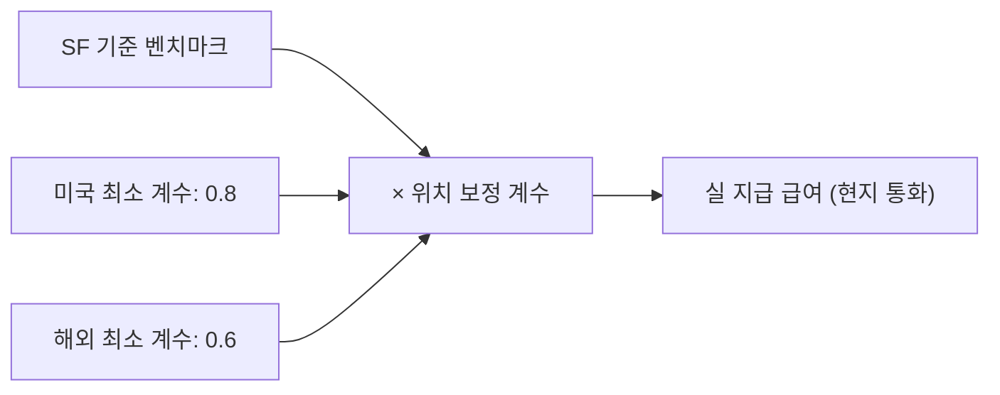
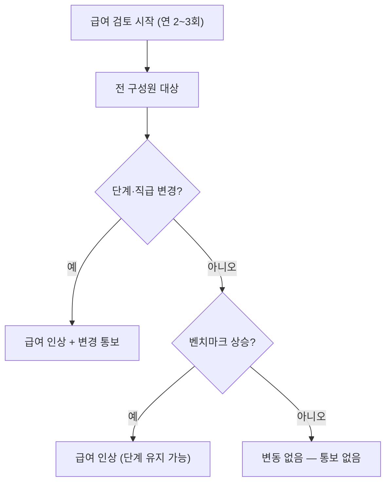

PostHog는 투명하고 체계적인 보상 시스템을 운영한다. 직급(Level)·단계(Step)·벤치마크·위치 보정 계수를 조합해 급여를 산정하며, 연간 2~3회 정기 검토를 통해 구성원이 별도 요청 없이도 적정 수준을 유지하도록 한다.[^1]

## 직급 (Level)

직급은 직책이 아니라 PostHog 내 **영향 범위**를 나타낸다.[^2] 직급이 높다고 중요도가 높아지는 것은 아니며, 모든 구성원이 회사의 주인처럼 느끼도록 방대한 계층 구조를 두지 않는다.

| 직급 | 설명 |
|---|---|
| Junior | 소규모 또는 특정 직무 범위의 프로젝트에 기여 (채용 빈도 낮음) |
| Intermediate | 중소 규모 영향의 프로젝트를 소유 |
| Senior | 고영향 프로젝트 또는 제품 전체를 소유·주도하며, 필요한 모든 것을 직접 실행 |
| Staff | Senior와 동일하되, 팀·제품·직군을 넘어 회사 전체에 영향을 주는 대형 프로젝트를 **일관되게** 소유·주도 |
| Director | 최고 수준에서 운영하며, 통상 Blitzscale 팀의 일원이자 매니저 오브 매니저 |
| Principal | Director와 동급 — Staff와 동일하나 극히 드문 스킬을 보유하거나 매우 높은 수준에서 운영 |

직급은 체크리스트가 아니며, 기술적(indicative) 설명일 뿐이다. Blitzscale 팀이 PostHog 내 다른 구성원들과 비교해 판단한다.[^3]

## 단계 (Step)

각 직급 안에서 세분화된 단계를 두어 유연성을 높인다.[^4]

| 단계 | 기준 |
|---|---|
| Learning | 기대 수준을 맞춰가는 중 |
| Established | 기대 수준에 부합 |
| Thriving | 기대 수준 초과 |
| Expert | 기대 수준을 **일관되게** 초과 |

입사 초년생이나 해당 직무 첫 경험자를 제외하면 기본적으로 **Established** 단계로 채용한다.[^5] 이를 통해 성공적인 출발을 보장하고, 직급 상향 없이도 급여 인상 여지를 남긴다.

급여 검토 시 동일 직무의 동료와 비교해 단계 상향 여부를 결정한다. 단계나 직급 이동 방법은 [경력 개발 핸드북](https://posthog.com/handbook/people/career-progression)에서 확인할 수 있다.[^6]

## 벤치마크

모든 역할의 급여 기준은 **샌프란시스코 시장 기준**이다.[^7]

- 주요 데이터 출처: [Pave](https://www.pave.com/marketdata)[^8]
- 엔지니어링 직군: 시장 상위 **90th percentile** 지급[^9]
- 기타 직군: **50th percentile + 20%** 기준[^10]

임원 직군은 별도 데이터베이스를 사용하며 평균 이상이나 시장 최상위는 아니다. 임원은 역할별 단 한 명만 존재하므로, 내부 등가성을 위한 복잡한 시스템을 구축하는 것은 비합리적이기 때문이다.[^11]

## 위치 보정 계수 (Location Factor)

대부분의 위치 보정 계수는 GitLab의 계수를 기반으로 한다. **생활비가 아닌 해당 위치의 시장 채용 비용**을 기준으로 산정한다. 따라서 샌프란시스코의 계수가 가장 높다.[^12]

- 미국 내 최소 계수 **0.8**, 해외 최소 계수 **0.6** — 생활비가 매우 낮은 국가·지역에서 발생하는 극단적 격차를 방지한다.[^13]
- 위치 계수는 현지 환율을 반영하므로, 환율 변동 시마다 별도 업데이트가 필요 없다.[^14]
- 급여는 **항상 현지 통화**로 지급된다. 현지에서 USD 거래가 일반적인 경우는 예외다.[^15]
- GitLab은 ERI, Numbeo, Comptryx, Radford, Robert Half, Dice의 데이터를 조합해 위치 계수를 산출한다.[^16]

### 이동(Relocation) 시 처리

- 이동 시 급여가 인상 또는 인하될 수 있으며, **다음 급여 검토 시 조정**된다.[^17]
- 인상이 되는 경우라면 **사전 승인이 필요**하다 — 예산 상 항상 가능하지는 않다.[^18]
- 유목민(Nomad) 생활을 하는 경우, 향후 6개월 중 가장 오래 머무는 곳을 기준으로 계수를 설정한다.[^19]

## 정기 급여 검토

PostHog는 연간 **2~3회** 급여를 검토하며, 매 검토 시 모든 구성원을 대상으로 한다.[^20] 구성원이 별도로 요청할 필요가 없다.

- 급여 검토 요청 빈도는 인상 여부에 영향을 주지 않는다 — 소외 집단의 협상 격차를 줄이기 위한 장치다.[^21]
- 인플레이션은 벤치마크 데이터에 이미 반영되어 있으므로, 별도 인플레이션 인상은 없다.[^22]
- 변경이 있을 때만 관련 Blitzscale 팀원이 통보한다.[^23]
- 입사 수락 후 벤치마크가 바뀌면, 다음 급여 검토 시 재평가한다.[^24]
- 역할이 바뀌어도 급여 변경은 **다음 가장 가까운 검토** 시점에 처리된다.[^25]
- 보상 관련 문의는 매니저가 아닌 **관련 임원**에게 한다.[^26]

> **관련 페이지:** 주식 옵션에 대한 세부 사항은 [주식 옵션](pages/1500fc2731c7.md) 참고. 수습기간·퇴직금·계약 형태는 [계약·급여 지급·수습·퇴직금](pages/a9e11baa2bd0.md) 참고.

[^1]: 08-compensation.md, How it works — "We have a set system for compensation as part of being transparent."
[^2]: 08-compensation.md, Level — "Level does not correlate with increased importance, but with impact within PostHog."
[^3]: 08-compensation.md, Level — "It's important to note that this is not a checklist. These descriptions are indicative, and there will always be a degree of judgement by the Blitzscale team to decide which level you're at, also based on other people within PostHog."
[^4]: 08-compensation.md, Step — "Within each level, we believe there's a place to have incremental steps to allow for more flexibility."
[^5]: 08-compensation.md, Step — "we hire into the *Established* step by default. This will give everyone the opportunity to be set up for success and leave enough room for salary increases, without the need to move up in seniority."
[^6]: 08-compensation.md, Step — "Here's how to move from one step or level to another"
[^7]: 08-compensation.md, Benchmark — "the benchmark for each role we are hiring for is based on the market rate in San Francisco."
[^8]: 08-compensation.md, Benchmark — "We use Pave as our main source for our salary benchmark"
[^9]: 08-compensation.md, Benchmark — "we pay near the top of market, which we define as being the 90th percentile, at the time of review."
[^10]: 08-compensation.md, Benchmark — "For other roles we still try to pay towards the top of market, which we define as 50th percentile + 20%."
[^11]: 08-compensation.md, Executive compensation — "As a rule, executives are paid above average but not top of market. The reason for less sophistication here is that we have very few executives, and only one for each role by definition."
[^12]: 08-compensation.md, Location factor — "Location factors are based on *cost of market*, not cost of living. This means that we look at how much it typically costs to hire a person in that role in that location, not how much it costs to live there. This is why, for example, our location factor for San Francisco is the highest"
[^13]: 08-compensation.md, Location factor — "We set a floor of 0.8 in the US, and 0.6 everywhere else, to avoid creating huge disparities in pay if someone happens to live in an exceptionally low cost of living country/state."
[^14]: 08-compensation.md, Location factor — "The location factor takes your local exchange rate into account, so we don't have to keep updating exchange rates when they fluctuate."
[^15]: 08-compensation.md, Location factor — "You will always be paid in your local currency, unless there is a very good reason not to (e.g. it is normal in your country to transact in USD)."
[^16]: 08-compensation.md, Location factor — "GitLab uses a combination of data from Economic Research Institute (ERI), Numbeo, Comptryx, Radford, Robert Half, and Dice to calculate what a fair market rate is for each location."
[^17]: 08-compensation.md, Relocating — "If you're planning on relocating, your salary may be adjusted (up or down) to your new location. This will be done at the next compensation review."
[^18]: 08-compensation.md, Relocating — "If this represents an increase in pay, *we need to approve this change in advance* - we cannot guarantee it is always possible, as our budgets may not allow it."
[^19]: 08-compensation.md, Relocating — "If you are nomading, we will set your location factor for the place that you are spending the most time in over the next 6 months."
[^20]: 08-compensation.md, Pay reviews — "We review pay proactively 2-3 times a year, and everybody on the team is reviewed at every pay review."
[^21]: 08-compensation.md, How the review process works — "To make sure everyone has an equal chance at getting a pay rise, we do not factor in how frequently someone requests one... as underrepresented groups are statistically less likely to request a pay rise."
[^22]: 08-compensation.md, Pay reviews — "When we review pay we don't take inflation into account, as this is already accounted for by market data."
[^23]: 08-compensation.md, How the review process works — "You will only hear from them if there has been a change in your pay, not if it is staying the same."
[^24]: 08-compensation.md, How the review process works — "If you recently accepted an offer at PostHog and the benchmark changes between you accepting and joining PostHog, your pay will be re-assessed during the next pay review."
[^25]: 08-compensation.md, How the review process works — "if you change role for example, any changes will usually happen at the next closest review."
[^26]: 08-compensation.md, How the review process works — "If you need to talk to someone about your compensation or how the calculator works, you should ask the relevant member of the exec team in the first instance."
